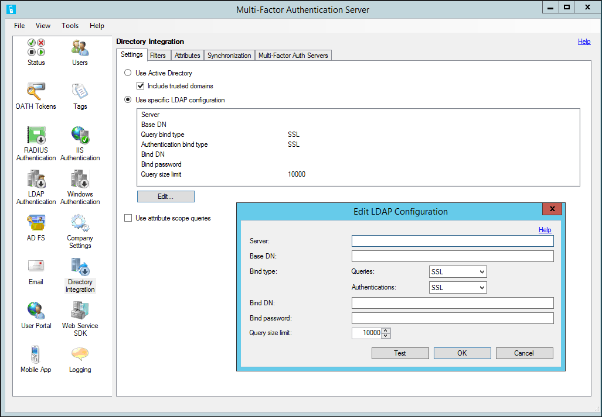
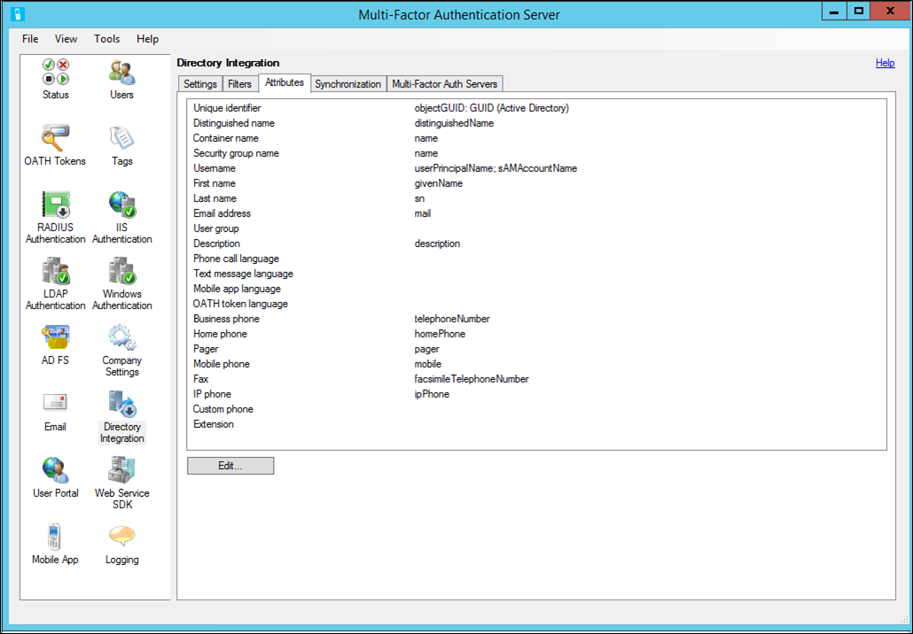
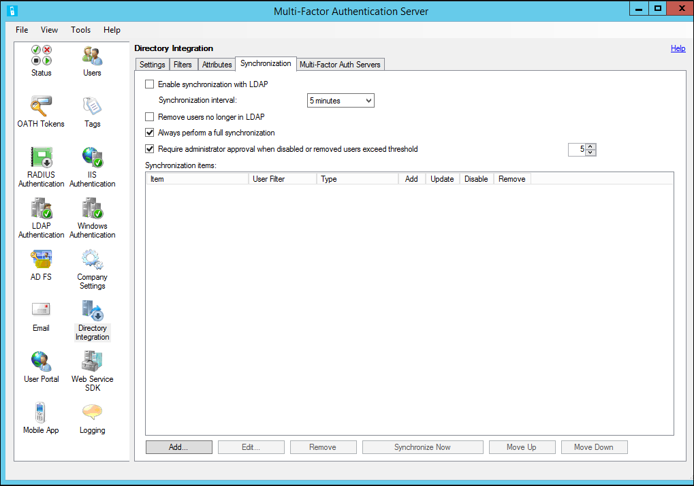
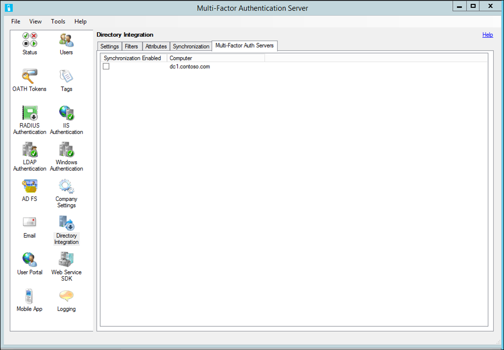

# Azure MFA 服务器与 Active Directory 之间的目录集成

使用 Azure MFA 服务器的“目录集成”部分可与 Active Directory 或其他 LDAP 目录集成。 可以配置属性来匹配目录架构，并设置用户自动同步。

## 设置
默认情况下，Azure 多重身份验证 (MFA) 服务器配置为从 Active Directory 导入或同步用户。  使用“目录集成”选项卡可覆盖默认行为，以及绑定到其他 LDAP 目录、ADAM 目录或特定的 Active Directory 域控制器。  它还允许将 LDAP 身份验证用于代理 LDAP 或将 LDAP 绑定用作 RADIUS 目标、将预身份验证用于 IIS 身份验证，或者将主要身份验证用于用户门户。  下表描述了各项设置。

| 功能 | 说明 |
| --- | --- |
| 使用 Active Directory |选择“使用 Active Directory”选项可使用 Active Directory 进行导入和同步。  此设置为默认设置。  注意：要正常完成 Active Directory 集成，请将计算机加入域并使用域帐户登录。 |
| 包括受信任域 |选中“包括受信任域”可让代理尝试连接到当前域、林中其他域或林信任涉及的域所信任的域。  当不从任何受信任域导入或同步用户时，请取消选中该复选框以提高性能。  默认处于选中状态。 |
| 使用特定 LDAP 配置 |选择“使用 LDAP”选项可使用指定的 LDAP 设置进行导入和同步。 注意：选择“使用 LDAP”时，用户界面会将引用从 Active Directory 更改为 LDAP。 |
| 编辑按钮 |使用“编辑”按钮可以修改当前 LDAP 配置设置。 |
| 使用属性范围查询 |指示是否应使用属性范围查询。  属性范围查询允许根据其他记录的属性中的条目，实现对符合条件的记录的高效目录搜索。  Azure 多重身份验证服务器使用属性范围查询有效地查询属于安全组的用户。    注意：在某些情况下，系统支持属性范围查询，但不应使用。  例如，如果安全组包含来自多个域的成员，Active Directory 可能在使用属性范围查询时出现问题。 在这种情况下，请取消选中该复选框。 |

下表描述了 LDAP 配置设置。

| 功能 | 说明 |
| --- | --- |
| 服务器 |输入运行 LDAP 目录的服务器的主机名或 IP 地址。  还可以以分号分隔形式指定备份服务器。  注意：当绑定类型是 SSL 时，需要输入完全限定的主机名。 |
| 基 DN |输入要从中启动所有目录查询的基目录对象的可分辨名称。  例如，dc=abc,dc=com。 |
| 绑定类型 - 查询 |选择在绑定搜索 LDAP 目录时要使用的相应绑定类型。  这会用于导入、同步和用户名解析。     匿名 - 执行匿名绑定。  不使用绑定 DN 和绑定密码。  仅当 LDAP 目录允许匿名绑定，并且权限允许查询相应的记录和属性时，此项才适用。     简单 - 用于绑定到 LDAP 目录的绑定 DN 和绑定密码以纯文本的形式传递。  此选项用于测试目的，验证是否能够访问服务器，以及绑定帐户是否具有适当的访问权限。 安装适当的证书后，请改用 SSL。     SSL - 用于绑定到 LDAP 目录的绑定 DN 和绑定密码将使用 SSL 加密。  在本地安装 LDAP 目录信任的证书。     Windows - 使用绑定用户名和绑定密码安全连接到 Active Directory 域控制器或 ADAM 目录。  如果将“绑定用户名”留空，已登录用户的帐户用于绑定。 |
| 绑定类型 - 身份验证 |选择在执行 LDAP 绑定身份验证时要使用的相应绑定类型。  请参阅“绑定类型 - 查询”下的绑定类型说明。  例如，这样一来，在使用 SSL 绑定来确保 LDAP 绑定身份验证安全的同时，就可以对查询使用匿名绑定。 |
| 绑定 DN 或绑定用户名 |输入绑定到 LDAP 目录时要使用的帐户的用户记录的可分辨名称。  仅当绑定类型为“简单”或“SSL”时使用绑定的可分辨名称。    输入在绑定类型为 Windows 时，绑定到 LDAP 目录时要使用的 Windows 帐户的用户名。  如果留空，已登录用户的帐户用于绑定。 |
| 绑定密码 |为用于绑定到 LDAP 目录的绑定 DN 或用户名输入绑定密码。  若要为多重身份验证服务器 AdSync 服务配置密码，请启用同步并确保该服务在本地计算机上运行。  该密码保存在用于运行多重身份验证服务器 AdSync 服务的帐户下的“Windows 存储的用户名和密码”中。  该密码还会保存在用于运行多重身份验证服务器用户界面的帐户下，以及用于运行多重身份验证服务器服务的帐户下。    由于该密码只存储在本地服务器的“Windows 存储的用户名和密码”中，因此请针对每个需要访问该密码的多重身份验证服务器重复此步骤。 |
| 查询大小限制 |指定目录搜索要返回的用户数上限的大小限制。  此限制应与 LDAP 目录配置相匹配。  对于不支持分页的大型搜索，导入和同步将尝试分批检索用户。  如果此处指定的大小限制大于 LDAP 目录上配置的限制，则可能会缺失一些用户。 |
| “测试”按钮 |单击“测试”可测试 LDAP 服务器的绑定。    无需选择“使用 LDAP”选项来测试绑定。 使用此选项可在使用 LDAP 配置之前测试绑定。 |

## 筛选器
使用筛选器可在执行目录搜索时，设置条件来限定记录。  通过设置筛选器，可将范围限制为想要同步的对象。  

Azure 多重身份验证提供以下三个筛选选项：

* **容器筛选器** - 指定用于在执行目录搜索时限定容器记录的筛选条件。  对于 Active Directory 和 ADAM，通常使用 (|(objectClass=organizationalUnit)(objectClass=container))。  对于其他 LDAP 目录，请根据目录架构使用限定每种类型的容器对象的筛选条件。   注意：如果留空，将默认使用 ((objectClass=organizationalUnit)(objectClass=container))。
* **安全组筛选器** - 指定用于在执行目录搜索时限定安全组记录的筛选条件。  对于 Active Directory 和 ADAM，通常使用 (&(objectCategory=group)(groupType:1.2.840.113556.1.4.804:=-2147483648))。  对于其他 LDAP 目录，请根据目录架构使用限定每种类型的安全组对象的筛选条件。   注意：如果留空，将默认使用 (&(objectCategory=group)(groupType:1.2.840.113556.1.4.804:=-2147483648))。
* **用户筛选器** - 指定用于在执行目录搜索时限定用户记录的筛选条件。  对于 Active Directory 和 ADAM，通常使用 (&(objectClass=user)(objectCategory=person))。  对于其他 LDAP 目录，请根据目录架构使用 (objectClass=inetOrgPerson) 或类似语句。  注意：如果留空，将默认使用 (&(objectCategory=person)(objectClass=user))。

## 属性
可以根据需要自定义特定目录的属性。  这样，便可以添加自定义属性，优化为只同步所需的属性。 对于每个属性字段的值，请使用目录架构中定义的属性的名称。 下表提供了有关每项功能的更多信息。

可以手动输入属性，它们不需要与属性列表中的某个属性匹配。

| 功能 | 说明 |
| --- | --- |
| 唯一标识符 |输入用作容器、安全组和用户记录的唯一标识符的属性的属性名称。  在 Active Directory 中，它通常是 objectGUID。 其他 LDAP 实现可能使用 entryUUID 或类似值。  默认值为 objectGUID。 |
| 唯一标识符类型 |选择唯一标识符属性的类型。  在 Active Directory 中，objectGUID 属性的类型是 GUID。 其他 LDAP 实现可能使用 ASCII 字节数组或字符串类型。  默认值为 GUID。   必须正确设置此类型，因为系统会根据同步项的唯一标识符对其进行引用。 唯一标识符类型用于直接查找目录中的对象。  如果目录实际上将值存储为 ASCII 字符的字节数组，将此类型设置为字符串会使同步无法正常运行。 |
| 可分辨名称 |输入包含每条记录的可分辨名称的属性的属性名称。  在 Active Directory 中，它通常是 distinguishedName。 其他 LDAP 实现可能使用 entryDN 或类似值。  默认值为 distinguishedName。   如果只包含可分辨名称的属性不存在，则可以使用 adspath 属性。  将自动剥除路径的“LDAP://\<server\>/”部分，仅留下对象的可分辨名称。 |
| 容器名称 |输入容器记录中包含名称的属性的属性名称。  从 Active Directory 导入或添加同步项时，此属性的值会显示在容器层次结构中。  默认值为 name。   如果不同的容器将不同的属性用作其名称，请使用分号分隔多个容器名称属性。  在容器对象中找到的第一个容器名称属性用于显示其名称。 |
| 安全组名称 |输入安全组记录中包含名称的属性的属性名称。  从 Active Directory 导入或添加同步项时，此属性的值会显示在“安全组”列表中。  默认值为 name。 |
| 用户名 |输入用户记录中包含用户名的属性的属性名称。  此属性的值用作多重身份验证服务器的用户名。  可以指定第二个属性作为第一个属性的备份。  仅当第一个属性不包含用户的值时，才使用第二个属性。  默认值为 userPrincipalName 和 sAMAccountName。 |
| 名字 |输入用户记录中包含名字的属性的属性名称。  默认值为 givenName。 |
| 姓氏 |输入用户记录中包含姓氏的属性的属性名称。  默认值为 sn。 |
| 电子邮件地址 |输入用户记录中包含电子邮件地址的属性的属性名称。  电子邮件地址用于向用户发送欢迎和更新电子邮件。  默认值为 mail。 |
| 用户组 |输入用户记录中包含用户组的属性的属性名称。  用户组可用于在 Multi-Factor Auth 服务器管理门户的代理和报告中筛选用户。 |
| 说明 |输入用户记录中包含说明的属性的属性名称。  说明只用于搜索。  默认值为 description。 |
| 通话语言 |输入包含某一语言的短名称的属性的属性名称，该语言用于用户的语音呼叫。 |
| 短信语言 |输入包含某一语言的短名称的属性的属性名称，该语言用于用户的短信。 |
| 移动应用语言 |输入包含某一语言的短名称的属性的属性名称，该语言用于用户的手机应用短信。 |
| OATH 令牌语言 |输入包含某一语言的短名称的属性的属性名称，该语言用于用户的 OATH 令牌短信。 |
| 工作电话 |输入用户记录中包含业务电话号码的属性的属性名称。  默认值为 telephoneNumber。 |
| 家庭电话 |输入用户记录中包含住宅电话号码的属性的属性名称。  默认值为 homePhone。 |
| 寻呼机 |输入用户记录中包含呼机号码的属性的属性名称。  默认值为 pager。 |
| 移动电话 |输入用户记录中包含移动电话号码的属性的属性名称。  默认值为 mobile。 |
| 传真 |输入用户记录中包含传真号码的属性的属性名称。  默认值为 facsimileTelephoneNumber。 |
| IP 电话 |输入用户记录中包含 IP 电话号码的属性的属性名称。  默认值为 ipPhone。 |
| “自定义” |输入用户记录中包含自定义电话号码的属性的属性名称。  默认为空。 |
| 分机 |输入用户记录中包含电话号码分机的属性的属性名称。  分机字段的值只用作主电话号码的分机。  默认为空。   如果未指定“分机”属性，则分机可以包含在“电话”属性中。 在这种情况下，请在分机前面加上“x”，以便正常分析该号码。  例如，如果输入 555-123-4567 x890，系统会将 555-123-4567 视为电话号码，将 890 视为分机号码。 |
| “还原默认值”按钮 |单击“还原默认值”可将所有属性还原为默认值。  默认值会在标准 Active Directory 或 ADAM 架构中正常工作。 |

若要编辑属性，请在“属性”选项卡上单击“编辑”。此时会打开一个窗口，可在其中编辑属性。 选择任一属性旁边的“...”会打开一个窗口，可在其中选择要显示的属性。

## 同步
同步能使 Azure MFA 用户数据库与 Active Directory 或其他轻型目录访问协议 (LDAP) 目录中的用户保持同步。 该进程类似于从 Active Directory 手动导入用户，但会定期轮询 Active Directory 用户和安全组对进程所做的更改。  它还能禁用或删除已从容器、安全组或 Active Directory 中删除的用户。

Multi-Factor Auth AdSync 服务是一种 Windows 服务，它定期轮询 Active Directory。  请勿与 Azure AD Sync 或 Azure AD Connect 相混淆。  Multi-Factor Auth ADSync 尽管构建在类似的代码基础之上，但专用于 Azure 多重身份验证服务器。  它在停止状态进行安装，并在配置好可以运行时由 Multi-Factor Auth 服务器服务启动。  如果具有多服务器 Multi-Factor Auth 服务器配置，则 Multi-Factor Auth AdSync 只能运行在单个服务器上。

Multi-Factor Auth AdSync 服务使用 Microsoft 提供的 DirSync LDAP 服务器扩展来高效地轮询所做的更改。  此 DirSync 控件调用方必须具有“目录获取更改”权限和 DS-Replication-Get-Changes 扩展的控制访问权限。  默认情况下，将为域控制器上的 Administrator 和 LocalSystem 帐户分配这些权限。  默认情况下，Multi-Factor Authentication AdSync 服务配置为以 LocalSystem 身份运行。  因此，最简单的方法是在域控制器上运行该服务。  如果将该服务配置为始终执行完全同步，则它可以使用具有更低权限的帐户运行。  这会降低效率，但所需的帐户特权更低。

如果 LDAP 目录支持 DirSync 并进行了相应的配置，则轮询用户和安全组更改的工作方式与通过 Active Directory 进行轮询相同。  如果 LDAP 目录不支持 DirSync 控件，则会在每个周期执行完全同步一次。

下表包含有关“同步”选项卡中每项设置的更多信息。

| 功能 | 说明 |
| --- | --- |
| 启用与 Active Directory 的同步 |如果选中此项，多重身份验证服务器服务将定期轮询 Active Directory 的更改。   注意：必须至少先添加一个同步项并且必须执行“立即同步”，然后 Multi-Factor Auth 服务器服务才会开始处理更改。 |
| 同步间隔 |指定 Multi-Factor Auth 服务器服务在轮询和处理更改之间需要等待的时间间隔。    注意：指定的时间间隔是每个周期开始之间的时间。  如果处理更改的时间超过了此时间间隔，该服务将立即重新轮询。 |
| 删除不再在 Active Directory 中的用户 |选中此项时，Multi-Factor Auth 服务器服务将处理 Active Directory 已删除用户的逻辑删除并删除相关的 Multi-Factor Auth 服务器用户。 |
| 始终执行完全同步 |选中此项时，Multi-Factor Auth服务器服务将始终执行完全同步。  未选中此项时，Multi-Factor Auth 服务器服务将通过只查询已更改的用户来执行增量同步。  默认情况下处于未选中状态。   如果未选中此项，仅当目录支持 DirSync 控件并且用于绑定到目录的帐户有权执行 DirSync 增量查询时，Azure MFA 服务器才执行增量同步。  如果该帐户没有相应的权限或者同步操作涉及多个域，Azure MFA 服务器将执行完全同步。 |
| 将禁用或删除 X 个以上的用户时，需要管理员批准 |可以配置同步项以禁用或删除不再属于该项的容器或安全组的用户。  为安全起见，可以规定当要禁用或删除的用户的数量超过阈值时，必须获得管理员的批准。  如果选中此项，需要审批指定的阈值。  默认值为 5，范围为 1 到 999。    可以先向管理员发送电子邮件通知以加快批准速度。 电子邮件通知为审阅和批准用户禁用和删除操作提供说明。  启动 Multi-Factor Auth 服务器用户界面时，会提示需要进行审批。 |

使用“立即同步”按钮可以对指定的同步项运行完全同步  。  每当添加、修改、删除或重排同步项时，需要执行完全同步。  另外，在多重身份验证 AdSync 服务运行前也需要完全同步，因为完全同步将设置该服务轮询增量更改的起始点。  如果对同步项做了更改但尚未执行完全同步，系统会提示是否“立即同步”。

管理员使用“删除”按钮可以从 Multi-Factor Auth 服务器同步项列表中删除一个或多个同步项  。

> [!WARNING]
> 同步项记录一经删除，便无法恢复。 如果误删了同步项记录，需要重新添加该记录。

一个或多个同步项已从 Multi-Factor Auth 服务器中删除。  Multi-Factor Auth 服务器服务不再处理这些同步项。

管理员可以使用“上移”和“下移”按钮更改同步项的顺序。  顺序很重要，因为同一用户可能是多个同步项（例如容器和安全组）的成员。  在同步过程中应用于用户的设置将来自该用户所关联到的列表中的第一个同步项。  因此，同步项应按优先级顺序放置。

> [!TIP]
> 删除同步项之后，应执行完全同步。  在对同步项进行排序后，应执行完全同步。  单击“立即同步”可执行完全同步。

## Multi-Factor Auth 服务器
可以设置额外的 Multi-Factor Auth 服务器作为备份 RADIUS 代理、LDAP 代理，或将其用于 IIS 身份验证。 同步配置在所有代理之间共享。 但是，只有其中一个代理可以让 Multi-Factor Auth 服务器服务运行。 此选项卡允许选择可用于同步的 Multi-Factor Auth 服务器。

