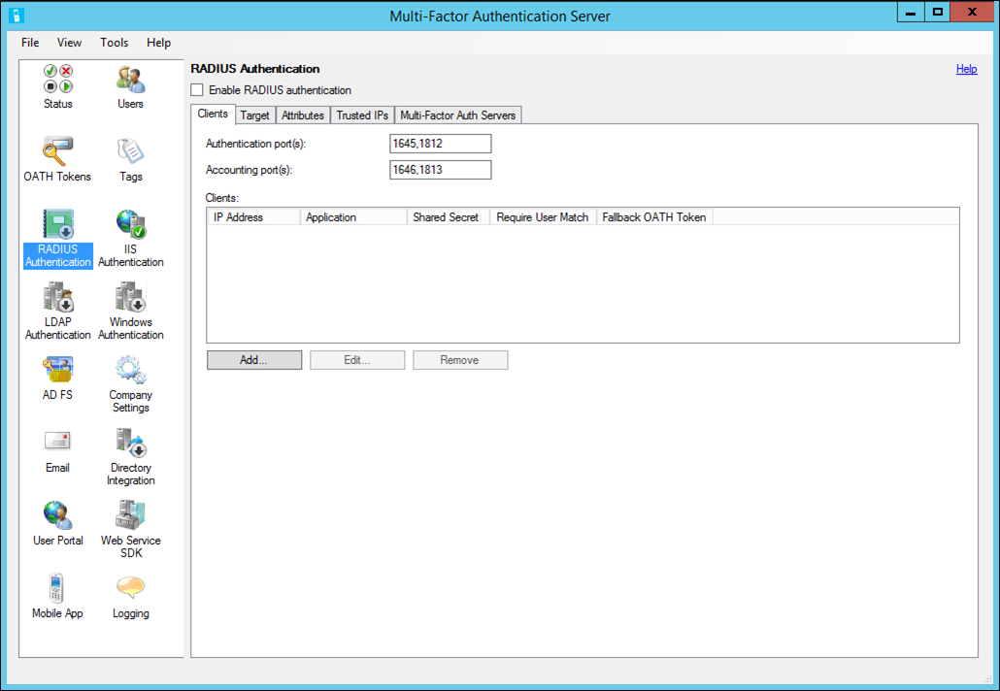

# 使用 RADIUS 的远程桌面网关和 Azure 多重身份验证服务器

通常，远程桌面 （RD） 网关使用本地[网络策略服务 （NPS）](https://docs.microsoft.com/windows-server/networking/core-network-guide/core-network-guide#BKMK_optionalfeatures)对用户进行身份验证。 本文介绍如何将来自远程桌面网关（通过本地 NPS）的 RADIUS 请求路由到多重身份验证服务器。 将 Azure MFA 与 RD 网关结合使用意味着，用户可以从任何地方访问其工作环境，同时进行强身份验证。

由于 Server 2012 R2 不支持对终端服务使用 Windows 身份验证，请通过 RD 网关和 RADIUS 与 MFA 服务器集成。

在独立的服务器上安装 Azure 多重身份验证服务器，它随后会将 RADIUS 请求通过代理路由回远程桌面网关服务器上的 NPS。 NPS 在验证用户名和密码以后，会返回对多重身份验证服务器的响应。 然后，MFA 服务器执行双重身份验证并将结果返回到网关。

> [!IMPORTANT]
> 自 2019 年 7 月 1 日起，Microsoft 将不再为新部署提供 MFA 服务器。 希望用户进行多重身份验证的新客户应使用基于云的 Azure 多重身份验证。 在 7 月 1 日之前激活 MFA 服务器的现有客户将能够像往常一样下载最新版本、将来的更新并生成激活凭据。

## 先决条件

- 已加入域的 Azure MFA 服务器。 如果尚未安装该服务器，请执行 [Azure 多重身份验证服务器入门](howto-mfaserver-deploy.md)中的步骤。
- 现有已配置的 NPS 服务器。
- 一个远程桌面网关，用于通过网络策略服务进行身份验证。

> [!NOTE]
> 本文仅适用于 MFA 服务器部署，不适用 Azure MFA（基于云）。

## 配置远程桌面网关

将 RD 网关配置为将 RADIUS 身份验证发送到 Azure 多重身份验证服务器。

1. 在 RD 网关管理器中，右键单击服务器名称，并选择“属性”****。
2. 转到“RD CAP 存储”**** 选项卡并选择“运行 NPS 的中央服务器”****。
3. 添加一个或多个 Azure 多重身份验证服务器作为 RADIUS 服务器，方法是：输入每个服务器的名称或 IP 地址。
4. 为每个服务器创建共享机密。

## 配置 NPS

RD 网关使用 NPS 将 RADIUS 请求发送到 Azure 多重身份验证。 若要配置 NPS，请首先更改超时设置，防止 RD 网关在完成双重验证之前超时。 然后对 NPS 进行更新，以便从 MFA 服务器接收 RADIUS 身份验证。 使用以下过程可配置 NPS：

### 修改超时策略

1. 在 NPS 中，打开左侧列中的“RADIUS 客户端和服务器”菜单，并选择“远程 RADIUS 服务器组”。********
2. 选择“TS 网关服务器组”****。
3. 转到“负载均衡”选项卡。****
4. 将“在这些秒数后没有反应，就认为请求被放弃”和“当服务器被识别为不可用时，请求之间的间隔秒数”更改为 30 到 60 秒。******** （如果发现服务器仍在身份验证过程中超时，则可回到此处提高秒数。）
5. 转到“身份验证/帐户”选项卡，检查指定的 RADIUS 端口与多重身份验证服务器将侦听的端口是否匹配。****

### 准备 NPS，以便接收来自 MFA 服务器的身份验证

1. 右键单击左侧栏中“RADIUS 客户端和服务器”下的“RADIUS 客户端”，并选择“新建”。********
2. 将 Azure 多重身份验证服务器添加为 RADIUS 客户端。 选择友好名称，并指定共享机密。
3. 打开左侧栏中的“策略”菜单，并选择“连接请求策略”。******** 此是会看到一个名为“TS 网关授权策略”的策略，该策略是在配置 RD 网关时创建的。 此策略将 RADIUS 请求转发到多重身份验证服务器。
4. 右键单击“TS 网关授权策略”，并选择“重复策略”。********
5. 打开新的策略，转到“条件”**** 选项卡。
6. 添加一个条件，使客户端友好名称与步骤 2 中为 Azure 多重身份验证服务器 RADIUS 客户端设置的友好名称匹配。
7. 转到“设置”**** 选项卡并选择“身份验证”****。
8. 将身份验证提供程序更改为“在此服务器上对请求进行身份验证”****。 此策略可确保当 NPS 从 Azure MFA 服务器接收 RADIUS 请求时，身份验证在本地进行，而不是将 RADIUS 请求发送回 Azure 多重身份验证服务器，后者会导致循环情况。
9. 若要防止循环情况，请确保新策略的排序级别高于“连接请求策略”窗格中的原始策略。****

## 配置 Azure 多重身份验证

将 Azure 多重身份验证服务器配置为 RD 网关与 NPS 之间的 RADIUS 代理。  应将 Azure Multi-Factor Authentication 服务器安装在不同于 RD 网关服务器的已加入域的服务器上。 使用以下过程可配置 Azure 多重身份验证服务器。

1. 打开 Azure 多重身份验证服务器，并选择“RADIUS 身份验证”图标。
2. 选中“启用 RADIUS 身份验证”**** 复选框。
3. 在“客户端”选项卡上，确保端口与 NPS 中配置的内容匹配，并选择“添加”****。
4. 添加 RD 网关服务器 IP 地址、应用程序名称（可选）和共享机密。 Azure 多重身份验证服务器和 RD 网关上的共享机密必须相同。
3. 转到“目标”选项卡，并选择“RADIUS 服务器”单选按钮。********
4. 选择“添加”，并输入 NPS 服务器的 IP 地址、共享机密和端口。**** 除非使用中央 NPS，否则 RADIUS 客户端和 RADIUS 目标是相同的。 共享机密必须与 NPS 服务器的“RADIUS 客户端”部分中设置的共享机密相匹配。

## 后续步骤

- 集成 Azure MFA 和 [IIS Web 应用](howto-mfaserver-iis.md)

- 在 [Azure 多重身份验证常见问题](multi-factor-authentication-faq.md)中获取答案
