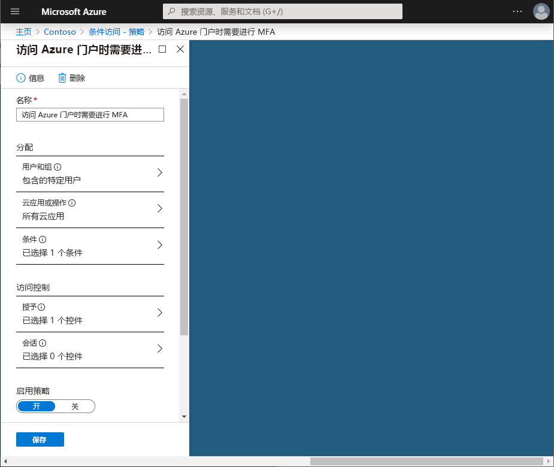
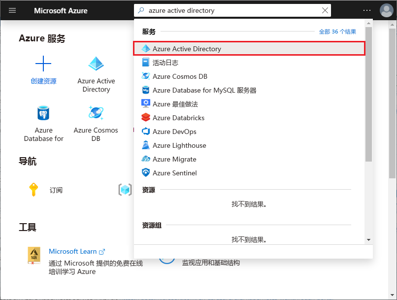

# 快速入门：使用 Azure Active Directory 条件访问要求针对特定应用进行 MFA

为了简化用户的登录体验，你可能希望允许他们使用用户名和密码登录你的云应用。 但是，在许多环境中，总有几个应用更适合实施更强大的帐户验证形式（如多重身份验证 (MFA)）。 此策略可能适用于访问组织的电子邮件系统或人力资源应用。 在 Azure Active Directory (Azure AD) 中，可以使用条件访问策略来实现此目标。

本快速入门介绍如何配置 [Azure AD 条件访问策略](../active-directory-conditional-access-azure-portal.md)，以要求针对环境中的所选云应用进行多重身份验证。

如果没有 Azure 订阅，请在开始之前创建一个[免费帐户](https://azure.microsoft.com/free/?WT.mc_id=A261C142F)。

## 先决条件

若要完成本快速入门中的方案，你需要：

- **对 Azure AD Premium 版本的访问权限**：Azure AD 条件访问是一项 Azure AD Premium 功能。
- **名为 Isabella Simonsen 的测试帐户**：如果不知道如何创建测试帐户，请参阅[添加基于云的用户](../fundamentals/add-users-azure-active-directory.md#add-a-new-user)。

本快速入门中的方案要求测试帐户未启用每用户 MFA。 有关详细信息，请参阅[如何要求对用户进行双重验证](../authentication/howto-mfa-userstates.md)。

## 测试体验

此步骤的目标是在没有条件访问策略的情况下获得体验的印象。

**若要初始化环境，请执行以下操作：**

1. 以 Isabella Simonsen 身份登录到 Azure 门户。
1. 注销。

## 创建条件访问策略

此部分介绍如何创建所需的条件访问策略。 本快速入门中的方案使用：

- Azure 门户作为需要 MFA 的云应用的占位符。 
- 示例用户来测试条件访问策略。  

在策略中，设置：

| 设置 | 值 |
| --- | --- |
| 用户和组 | Isabella Simonsen |
| 云应用 | Microsoft Azure 管理 |
| 授予访问权限 | 需要多重身份验证 |

**若要配置条件访问策略，请执行以下操作：**

1. 以全局管理员、安全管理员或条件访问管理员的身份登录到 [Azure 门户](https://portal.azure.com)。
1. 在 Azure 门户中，搜索并选择“Azure Active Directory”。 

   

1. 在“Azure Active Directory”  页的“安全性”  部分中，单击“条件访问”  。

   

1. 在“条件访问”页顶部的工具栏中，单击“新建策略”   。

   

1. 在“新建”页面的“名称”文本框中，键入“需要 MFA 才能访问 Azure 门户”    。

   

1. 在“分配”部分中，单击“用户和组”。  

   

1. 在“用户和组”页，执行以下步骤  ：

   

   1. 单击“选择用户和组”，然后选择“用户和组”   。
   1. 单击“选择”  。
   1. 在“选择”页上，选择“Isabella Simonsen”，然后单击“选择”    。
   1. 在“用户和组”页，单击“完成”   。

1. 单击“云应用”  。

   

1. 在“云应用”页上执行以下步骤： 

   

   1. 单击“选择应用”。 
   1. 单击“选择”  。
   1. 在“选择”页上，选择“Microsoft Azure 管理”，然后单击“选择”    。
   1. 在“云应用”页上，单击“完成”。  

1. 在“访问控制”部分中，单击“授予”。  

   

1. 在“授权”页，执行以下步骤  ：

   

   1. 选择“授予访问权限”  。
   1. 选择“需要多重身份验证”。 
   1. 单击“选择”  。

1. 在“启用策略”部分中，单击“开”   。

   

1. 单击“创建”。 

## 评估模拟登录

你已经配置了条件访问策略，现在可能想知道它是否按预期工作。 第一步，使用条件访问 what if 策略工具模拟测试用户登录。 该模拟会估计此登录对策略的影响并生成模拟报告。  

若要初始化 **What If** 策略评估工具，请设置：

- **Isabella Simonsen** 作为用户
- **Microsoft Azure 管理**作为云应用

单击“What If”会创建一个模拟报告，该报告  ：

- 在“将应用的策略”下显示“需要 MFA 才能访问 Azure 门户”  
- 显示“需要多重身份验证”作为“授权控件”   。

**若要评估条件访问策略，请执行以下操作：**

1. 在[条件访问 - 策略](https://portal.azure.com/#blade/Microsoft_AAD_IAM/ConditionalAccessBlade/Policies)页上，单击顶部菜单中的“What If”。   

   

1. 单击“用户”，选择“Isabella Simonsen”，然后单击“选择”    。

   

1. 若要选择云应用，请执行以下步骤：

   

   1. 单击“云应用”  。
   1. 在“云应用”页上，单击“选择应用”   。
   1. 单击“选择”  。
   1. 在“选择”页上，选择“Microsoft Azure 管理”，然后单击“选择”    。
   1. 在“云应用”页上，单击“完成”  。

1. 单击“What If”  。

## 测试条件访问策略

在上一部分中，你已经了解如何评估模拟登录。 除了模拟之外，还应该测试条件访问策略，以确保其按预期工作。

若要测试策略，请尝试使用 **Isabella Simonsen** 测试帐户登录 [Azure 门户](https://portal.azure.com)。 你应该会看到一个对话框，要求你为帐户设置额外的安全性验证。

## 清理资源

不再需要测试用户和条件访问策略时，请将其删除：

- 如果不知道如何删除 Azure AD 用户，请参阅[从 Azure AD 中删除用户](../fundamentals/add-users-azure-active-directory.md#delete-a-user)。
- 若要删除策略，请选择该策略，然后在快速访问工具栏中单击“删除”  。

    

## 后续步骤

> [!div class="nextstepaction"]
> [需要接受使用条款](require-tou.md)
> [检测到会话风险时阻止访问](app-sign-in-risk.md)
