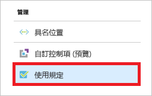
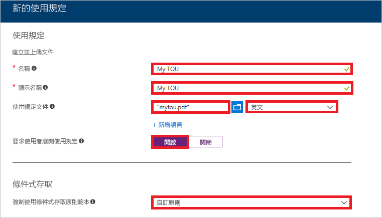
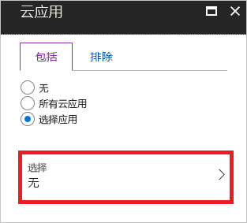

# 快速入门：在访问云应用之前要求接受使用条款

在访问前环境中的特定云应用中，你可能希望以接受使用条款 (ToU) 的形式获取用户的同意。 Azure Active Directory (Azure AD) 条件访问提供：

- 一种简单方法用于配置 ToU
- 要求通过条件访问策略接受使用条款的选项  

本快速入门介绍如何配置一个 [Azure AD 条件访问策略](../active-directory-conditional-access-azure-portal.md)，要求用户在访问环境中的选定云应用之前接受 ToU。

如果没有 Azure 订阅，请在开始之前创建一个[免费帐户](https://azure.microsoft.com/free/?WT.mc_id=A261C142F)。

## 先决条件

若要完成本快速入门中的方案，你需要：

- **对 Azure AD Premium 版本的访问权限**：Azure AD 条件访问是一项 Azure AD Premium 功能。
- **名为 Isabella Simonsen 的测试帐户**：如果不知道如何创建测试帐户，请参阅[添加基于云的用户](../fundamentals/add-users-azure-active-directory.md#add-a-new-user)。

## 测试登录

此步骤的目标是在没有条件访问策略的情况下获得登录体验的印象。

**测试登录：**

1. 以 Isabella Simonsen 身份登录到 [Azure 门户](https://portal.azure.com/)。
1. 注销。

## 创建使用条款

本部分提供创建示例 ToU 的步骤。 创建 ToU 时，请选择“强制实施条件访问策略模板”的值。 创建 ToU 之后，选择“自定义策略”会随即打开一个对话框，可在其中创建新的条件访问策略。

**创建使用条款：**

1. 在 Microsoft Word 中创建一个新文档。

1. 键入“我的使用条款”，然后在计算机上将此文档保存为 **mytou.pdf**。

1. 以全局管理员、安全管理员或条件访问管理员的身份登录到 [Azure 门户](https://portal.azure.com)。

1. 在 Azure 门户的左侧导航栏中，单击“Azure Active Directory”。

   

1. 在“Azure Active Directory”页的“安全性”部分中，单击“条件性访问”。

   

1. 在“管理”部分，单击“使用条款”。

   

1. 在顶部菜单中，单击“新建项”。

   

1. 在“新建使用条款”页上：

   

   1. 在“名称”文本框中，键入“我的 TOU”。

   1. 在“显示名称”文本框中，键入“我的 TOU”。

   1. 上传使用条款 PDF 文件。

   1. 对于“语言”，请选择“英语”。

   1. 对于“要求用户展开使用条款”，请选择“打开”。

   1. 对于“强制实施条件访问策略模板”，请选择“自定义策略”。

   1. 单击“创建”。

## 创建条件访问策略

此部分介绍如何创建所需的条件访问策略。 本快速入门中的方案使用：

- Azure 门户作为需要接受 ToU 的云应用的占位符。 
- 示例用户来测试条件访问策略。  

在策略中，设置：

| 设置 | 值 |
| --- | --- |
| 用户和组 | Isabella Simonsen |
| 云应用 | Microsoft Azure 管理 |
| 授予访问权限 | 我的 TOU |

**若要配置条件访问策略，请执行以下操作：**

1. 在“新建”页上的“名称”文本框中，键入“要求 Isabella 接受 TOU”。

   

1. 在“分配”部分中，单击“用户和组”。

   

1. 在“用户和组”页上：

   

   1. 单击“选择用户和组”，然后选择“用户和组”。

   1. 单击“选择”。

   1. 在“选择”页上，选择“Isabella Simonsen”，然后单击“选择”。

   1. 在“用户和组”页，单击“完成”。

1. 单击“云应用”。

   

1. 在“云应用”页上：

   

   1. 单击“选择应用”。

   1. 单击“选择”。

   1. 在“选择”页上，选择“Microsoft Azure 管理”，然后单击“选择”。

   1. 在“云应用”页上，单击“完成”。

1. 在“访问控制”部分中，单击“授予”。

   

1. 在“授予”页上：

   

   1. 选择“授予访问权限”。

   1. 选择“我的 TOU”。

   1. 单击“选择”。

1. 在“启用策略”部分中，单击“开”。

   

1. 单击“创建”。

## 评估模拟登录

你已经配置了条件访问策略，现在可能想知道它是否按预期工作。 第一步，使用条件访问 what if 策略工具模拟测试用户登录。 该模拟会估计此登录对策略的影响并生成模拟报表。  

若要初始化 what if 策略评估工具，请设置：

- **Isabella Simonsen** 作为用户
- **Microsoft Azure 管理**作为云应用

单击“What If”会创建一个模拟报告，该报告：

- “要应用的策略”下面的“要求 Isabella 接受 TOU”
- 用作“授权控制措施”的“我的 TOU”。

**若要评估条件访问策略，请执行以下操作：**

1. 在[条件访问 - 策略](https://portal.azure.com/#blade/Microsoft_AAD_IAM/ConditionalAccessBlade/Policies)页上，单击顶部菜单中的“What If”。  

   

1. 单击“用户”，选择“Isabella Simonsen”，然后单击“选择”。

   

1. 选择云应用：

   

   1. 单击“云应用”。

   1. 在“云应用”页上，单击“选择应用”。

   1. 单击“选择”。

   1. 在“选择”页上，选择“Microsoft Azure 管理”，然后单击“选择”。

   1. 在“云应用”页上，单击“完成”。

1. 单击“What If”。

## 测试条件访问策略

在上一部分中，你已经了解如何评估模拟登录。 除了模拟之外，你还应该测试条件访问策略，确保其按预期工作。

若要测试策略，请尝试使用 **Isabella Simonsen** 测试帐户登录 [Azure 门户](https://portal.azure.com)。 此时应会出现一个要求接受使用条款的对话框。

## 清理资源

当不再需要时，删除测试用户和条件访问策略：

- 如果不知道如何删除 Azure AD 用户，请参阅[从 Azure AD 中删除用户](../fundamentals/add-users-azure-active-directory.md#delete-a-user)。

- 若要删除策略，请选择该策略，然后在快速访问工具栏中单击“删除”。

    

- 若要删除使用条款，请将其选中，然后单击顶部工具栏中的“删除条款”。

    

## 后续步骤

> [!div class="nextstepaction"]
> [要求针对特定的应用执行 MFA](app-based-mfa.md)
> [检测到会话风险时阻止访问](app-sign-in-risk.md)
