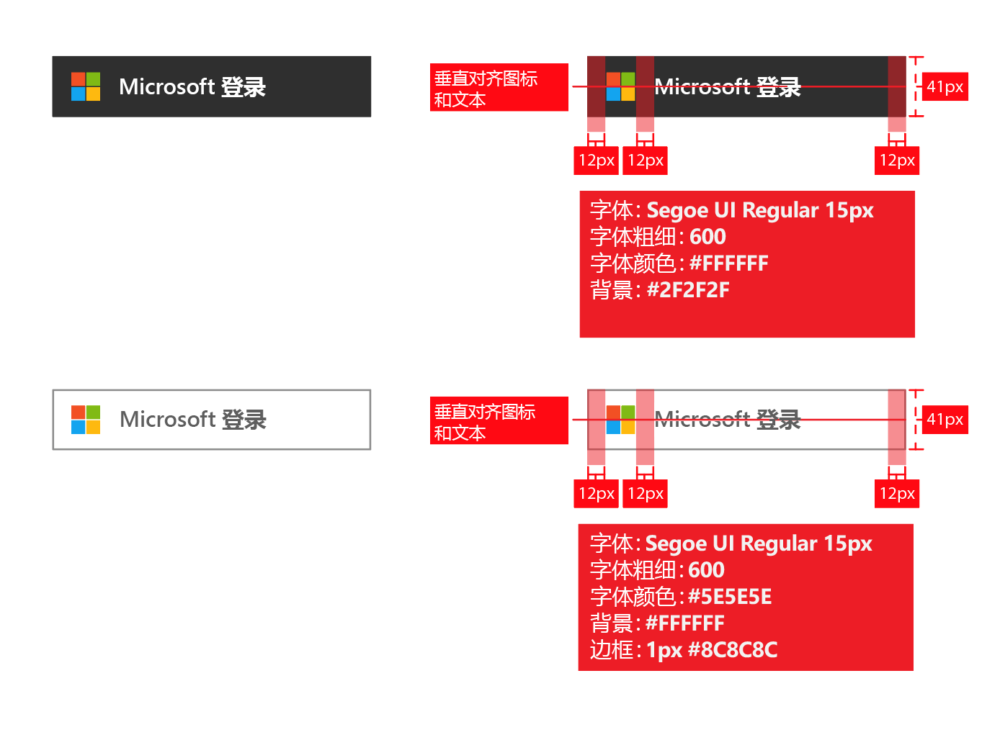

# 适用于应用程序的品牌准则

使用 Azure Active Directory (Azure AD) 开发应用程序时，如果客户想要使用工作或学校帐户（在 Azure AD 中托管）或其个人帐户进行注册和登录到应用程序，你需要指导客户进行相关操作。

在本文中，你将：

- 了解 Microsoft 管理的两种用户帐户以及如何在应用程序中引用 Azure AD 帐户
- 了解添加要在应用中使用的 Microsoft 徽标所需执行的操作
- 下载官方的**登录**或**使用 Microsoft 登录**图像以在应用中使用
- 了解品牌和导航的注意事项

## 个人帐户与 Microsoft 中的工作或学校帐户

Microsoft 管理两种类型的用户帐户：

- **个人帐户**（以前称为 Windows Live ID）。 这些帐户表示个人** 用户与 Microsoft 之间的关系，用于访问使用者的设备和 Microsoft 的服务。 这些帐户专供个人使用。
- **工作或学校帐户。** 这些帐户由 Microsoft 代表使用 Azure Active Directory 的组织进行管理。 这些帐户用于登录 Office 365 和 Microsoft 的其他业务服务。

Microsoft 工作或学校帐户帐户通常由组织（公司、学校、政府机构）分配给最终用户（员工、学生、联邦雇员）。 这些帐户可以直接在云中（在 Azure AD 平台中）直接控制，也可以从本地目录（如 Windows Server Active Directory）同步到 Azure AD。 Microsoft 是工作或学校帐户的监管员**，但这些帐户由组织所有和控制。

## 在应用程序中引用 Azure AD 帐户

Microsoft 不会向最终用户显示 Azure 或 Active Directory 品牌名称，你也应该如此。

- 在用户登录后，应尽量使用组织的名称和徽标。 这比使用“你的组织”等通用词语要好。
- 如果用户未登录，将他们的帐户称为“工作或学校帐户”，并使用 Microsoft 徽标来表明这些帐户由 Microsoft 管理。 请勿使用“企业帐户”、“业务帐户”或“公司帐户”等词语，这会给用户造成混淆。

## 用户帐户象形图

在先前版本的准则中，我们建议使用“蓝色徽章”象形图。 根据用户和开发人员的反馈，我们现在建议改用 Microsoft 徽标。 Microsoft 徽标帮助用户了解，他们可以重用其用于 Office 365 或其他 Microsoft 业务服务的帐户来登录应用。

## 使用 Azure AD 注册和登录

应用程序可以为注册和登录提供不同的路径，以下部分提供了这两种应用场景的可视指南。

**如果应用支持最终用户注册（例如免费试用或免费增值模式）**：可以显示“登录”**** 按钮，让用户使用其工作帐户或个人帐户访问应用。 当用户首次访问应用程序时，Azure AD 会显示许可提示。

**** 如果应用需要只有管理员才能授予的权限，或者需要组织许可：请将管理员请求与用户登录区别开来。 “获取此应用”按钮**** 会将管理员重定向到登录页，然后要求他们代表其组织中的用户授权同意，这还有一个额外的好处，那就是在你的应用中抑制最终用户许可提示。

## 有关获取应用程序的可视指南

“获取应用程序”链接必须将用户重定向到 Azure AD 的访问权限授予（授权）页，以方便组织的管理员对应用程序进行授权，使其有权访问 Microsoft 托管的组织数据。 有关如何请求访问权限的详细信息，请参阅[将应用程序与 Azure Active Directory 集成](quickstart-v1-integrate-apps-with-azure-ad.md)一文。

在管理员同意你的应用程序后，他们可以选择将其添加到其用户的 Office 365 应用程序启动器体验（可从 waffle 和进行访问 [https://portal.office.com/myapps](https://portal.office.com/myapps) ）。 如果想要广告此功能，可以使用类似于“将此应用程序添加到组织”词语，并显示类似于以下示例的按钮：

但是，我们建议编写说明性的文本而不要依赖于按钮。 例如：

> *如果已使用 Office 365 或 Microsoft 的其他业务服务，则可以授予 <your_app_name> 对组织数据的访问权限。这样，用户便可以使用其现有工作帐户访问 <your_app_name>。*

若要下载官方 Microsoft 徽标以在应用中使用，请右键单击要使用的徽标，然后将其保存到计算机。

| 资产                                | PNG 格式 | SVG 格式 |
| ------------------------------------ | ---------- | ---------- |
| Microsoft 徽标  |  |  |

## 有关登录的可视指南

应用应显示登录按钮，用于将用户重定向到与用来与 Azure AD 集成的协议对应的登录终结点。 以下部分详细描述了该按钮的外观。

### 图标和“通过 Microsoft 登录”

Microsoft 徽标和“通过 Microsoft 登录”词语的关联可唯一地将 Azure AD 与应用支持的其他标识提供者区别开来。 如果没有足够的空间来容纳“通过 Microsoft 登录”，则可以将其缩短为“登录”。 可以对该按钮使用浅色或深色方案。

下图显示在使用应用资产时，Microsoft 建议的红线。 红线适用于“Microsoft 登录”或更短的“登录”版本。

若要下载官方图像以在应用中使用，请右键单击要使用的图像，然后将其保存到计算机。

| 资产                                | PNG 格式 | SVG 格式 |
| ------------------------------------ | ---------- | ---------- |
| Microsoft 登录（深色主题）  |  |  |
| Microsoft 登录（浅色主题） |  |  |
| 登录（深色主题）                 |  |  |
| 登录（浅色主题）                |  |  |

## 品牌注意事项

**务必**将“工作或学校帐户”与“通过 Microsoft 登录”按钮结合使用来提供附加说明，以便帮助最终用户识别他们是否可以使用该应用。 **请勿**使用“企业帐户”、“业务帐户”或“公司帐户”等其他词语。

**请勿**使用 "OFFICE 365 id" 或 "Azure ID"。 Office 365 也是 Microsoft 的消费型产品名称，它不使用 Azure AD 进行身份验证。

**请勿**更改 Microsoft 徽标。

**请勿**向最终用户显示 Azure 或 Active Directory 品牌。 但是，可以对开发人员、IT 专业人员和管理员使用这些词语。

## 导航注意事项

**要**提供让用户注销以及切换到其他用户帐户的方法。 虽然大多数人员只有一个由 Microsoft/Facebook/Google/Twitter 提供的个人帐户，但这些人员通常与多个组织相关联。 即将推出支持多个登录用户的功能。
