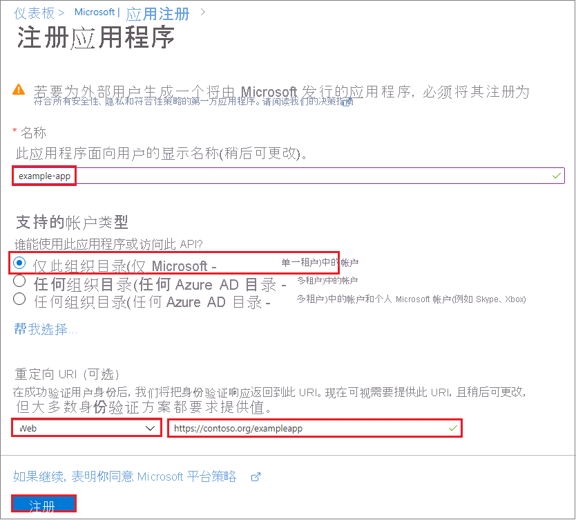

# <a name="how-to-use-the-portal-to-create-an-azure-ad-application-and-service-principal-that-can-access-resources"></a>如何：使用门户创建可访问资源的 Azure AD 应用程序和服务主体

本文介绍如何创建新的 Azure Active Directory （Azure AD）应用程序和服务主体，该服务主体可用于基于角色的访问控制。 如果有需要访问或修改资源的代码，则可以为应用创建标识。 此标识称为服务主体。 可以将所需权限分配给服务主体。 本文介绍如何使用门户创建服务主体。 重点介绍单租户应用程序，其中应用程序只应在一个组织内运行。 通常会将单租户应用程序作为在组织中运行的业务线应用程序使用。

> [!IMPORTANT]
> 请考虑使用 Azure 资源的托管标识作为应用程序标识，而不是创建服务主体。 如果你的代码在支持托管标识的服务上运行，并访问支持 Azure AD 身份验证的资源，则托管标识是更好的选择。 若要详细了解 Azure 资源的托管标识（包括当前支持它的服务），请参阅[什么是 Azure 资源的托管标识？](../managed-identities-azure-resources/overview.md)。

## <a name="create-an-azure-active-directory-application"></a>创建 Azure Active Directory 应用程序

我们直接介绍如何创建标识。 如果遇到问题，请查看[所需权限](#required-permissions)，确保帐户可以创建标识。

1. 通过 [Azure 门户](https://portal.azure.com)登录到 Azure 帐户。
1. 选择“Azure Active Directory”。
1. 选择“应用注册”。
1. 选择“新注册”。
1. 为应用程序命名。 选择一个受支持的帐户类型，该类型确定可以使用该应用程序的用户。 在 "**重定向 URI**" 下，选择要创建的应用程序类型的 " **Web** "。 输入将访问令牌发送到的 URI。 不能为[本机应用程序](../manage-apps/application-proxy-configure-native-client-application.md)创建凭据。 该类型不能用于自动化应用程序。 设置值后，选择 "**注册**"。

   

现已创建了 Azure AD 应用程序和服务主体。

## <a name="assign-the-application-to-a-role"></a>将应用程序分配给角色

要访问订阅中的资源，必须将应用程序分配到角色。 判定哪个角色能为应用程序提供适当的权限。 若要了解有关可用角色的信息，请参阅 [RBAC：内置角色](../../role-based-access-control/built-in-roles.md)。

可将作用域设置为订阅、资源组或资源级别。 较低级别的作用域将继承权限。 例如，将某个应用程序添加到资源组的“读取者”角色意味着该应用程序可以读取该资源组及其包含的所有资源。

1. 在 "Azure 门户中，选择要将应用程序分配到的作用域级别。 例如，若要在订阅范围内分配角色，请在**主页**上搜索并选择 "**订阅**"，或选择 "**订阅**"。

   

1. 选择要将应用程序分配到的特定订阅。

   

   如果未看到所需订阅，请选择“全局订阅筛选器”。 请确保已为该门户选择所需的订阅。

1. 选择“访问控制 (IAM)”。
1. 选择“添加角色分配”。
1. 选择要分配到应用程序的角色。 例如，若要允许应用程序执行**重启**、**启动**和**停止**实例等操作，请选择 "**参与者**" 角色。  有关[可用角色](../../role-based-access-control/built-in-roles.md)的详细信息，请参阅默认情况下，Azure AD 应用程序不会显示在可用选项中。 若要查找应用程序，请搜索其名称并选中它。

   

1. 选择“保存”完成角色分配。 该应用程序会显示在分配到该范围角色的用户列表中。

服务主体已设置完毕。 可以开始使用它运行脚本或应用。 下一部分演示如何获取以编程方式登录时所需的值。

## <a name="get-values-for-signing-in"></a>获取用于登录的值

以编程方式登录时，需要随身份验证请求传递租户 ID。 还需要应用程序 ID 和身份验证密钥。 若要获取这些值，请使用以下步骤：

1. 选择“Azure Active Directory”。
1. 从 Azure AD 中的“应用注册”，选择应用程序。
1. 复制目录（租户） ID 并将其存储在应用程序代码中。

    

1. 复制“应用程序 ID”并将其存储在应用程序代码中。

   

## <a name="certificates-and-secrets"></a>证书和机密
守护程序应用程序可以使用两种形式的凭据对 Azure AD：证书和应用程序机密进行身份验证。  建议使用证书，但也可以创建新的应用程序密钥。

### <a name="upload-a-certificate"></a>上传证书

如果有证书，可以使用现有证书。  还可以根据需要创建自签名证书以用于测试目的。 打开 PowerShell 并使用以下参数运行[new-selfsignedcertificate](/powershell/module/pkiclient/new-selfsignedcertificate) ，在计算机上的用户证书存储中创建自签名证书： 

```powershell
$cert=New-SelfSignedCertificate -Subject "CN=DaemonConsoleCert" -CertStoreLocation "Cert:\CurrentUser\My"  -KeyExportPolicy Exportable -KeySpec Signature
```

使用 Windows 控制面板中的 "[管理用户证书](/dotnet/framework/wcf/feature-details/how-to-view-certificates-with-the-mmc-snap-in)" mmc 管理单元将此证书导出到文件。

上载证书：

1. 选择“证书和机密”。
1. 选择 "**上传证书**"，并选择证书（现有证书或已导出的自签名证书）。

    

1. 选择 **添加** 。

在应用程序注册门户中将证书注册到你的应用程序后，你需要启用客户端应用程序代码以使用该证书。

### <a name="create-a-new-application-secret"></a>创建新的应用程序密钥

如果选择不使用证书，则可以创建新的应用程序密钥。

1. 选择“证书和机密”。
1. 选择“客户端机密”->“新建客户端机密”。
1. 提供机密的说明和持续时间。 完成后，选择“添加”。

   保存客户端机密后，将显示客户端机密的值。 复制此值，因为稍后不能检索密钥。 提供密钥值及应用程序 ID，以该应用程序的身份登录。 将密钥值存储在应用程序可检索的位置。

   

## <a name="configure-access-policies-on-resources"></a>在资源上配置访问策略
请记住，你可能需要配置应用程序需要访问的资源的附加权限。 例如，你还必须[更新密钥保管库的访问策略](/azure/key-vault/key-vault-secure-your-key-vault#data-plane-and-access-policies)，以便让应用程序访问密钥、机密或证书。  

1. 在[Azure 门户](https://portal.azure.com)中，导航到密钥保管库，然后选择 "**访问策略**"。  
1. 选择 "**添加访问策略**"，然后选择要授予应用程序的密钥、机密和证书权限。  选择之前创建的服务主体。
1. 选择 "**添加**" 以添加访问策略，然后选择 "**保存**" 以提交更改。
    

## <a name="required-permissions"></a>所需的权限

必须具有足够的权限向 Azure AD 租户注册应用程序，并将应用程序分配到 Azure 订阅中的角色。

### <a name="check-azure-ad-permissions"></a>检查 Azure AD 权限

1. 选择“Azure Active Directory”。
1. 记下你的角色。 如果角色为“用户”，则必须确保非管理员可以注册应用程序。

   

1. 在左窗格中，选择 "**用户设置**"。
1. 检查“应用注册”设置。 只有管理员可设置此值。 如果设置为“是”，则 Active AD 租户中的任何用户都可以注册应用。

如果应用注册设置设定为“否”，则只有具有管理员角色的用户才能注册这些类型的应用程序。 请参阅[可用角色](../users-groups-roles/directory-assign-admin-roles.md#available-roles)和[角色权限](../users-groups-roles/directory-assign-admin-roles.md#role-permissions)来了解 Azure AD 中的可用管理员角色以及授予每个角色的具体权限。 如果将帐户分配到“用户”角色，但应用注册设置仅限于管理员用户，请要求管理员为你分配可以创建和管理应用注册的所有方面的管理员角色之一，或者让用户能够注册应用。

### <a name="check-azure-subscription-permissions"></a>检查 Azure 订阅权限

在 Azure 订阅中，帐户必须具有 `Microsoft.Authorization/*/Write` 访问权限才能向角色分配 AD 应用。 通过[所有者](../../role-based-access-control/built-in-roles.md#owner)角色或[用户访问管理员](../../role-based-access-control/built-in-roles.md#user-access-administrator)角色授权此操作。 如果将帐户分配到“参与者”角色，则没有足够权限。 尝试将服务主体分配到角色时，将收到错误。

检查订阅权限的方法如下：

1. 在右上角选择你的帐户，然后选择 " **..." > 我的权限**。

   

1. 从下拉列表中，选择要在其中创建服务主体的订阅。 然后，选择“单击此处查看此订阅的完整访问详细信息”。

   

1. 选择 "**角色分配**" 以查看分配的角色，并确定是否有足够的权限向角色分配 AD 应用。 如果没有，请要求订阅管理员你将添加到用户访问管理员角色。 在下图中，用户分配到了“所有者”角色，这意味着该用户具有足够的权限。

   

## <a name="next-steps"></a>后续步骤

* 若要了解如何指定安全策略，请参阅 [Azure 基于角色的访问控制](../../role-based-access-control/role-assignments-portal.md)。  
* 有关可对用户授予或拒绝的可用操作的列表，请参阅 [Azure 资源管理器资源提供程序操作](../../role-based-access-control/resource-provider-operations.md)。
