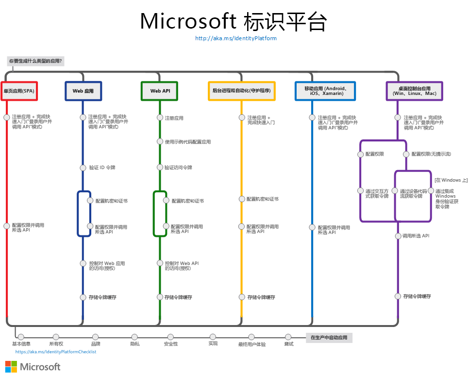

# Microsoft 标识平台概述

Microsoft 标识平台有助于你构建这样的应用程序，你的用户和客户登录它们来使用其 Microsoft 标识或社交帐户，并提供对你的 API 或 Microsoft API（例如 Microsoft Graph）的授权访问。

Microsoft 标识平台由多个组件组成：

- 符合 OAuth 2.0 和 OpenID Connect 标准的身份验证服务，使开发人员能够对多个标识类型进行身份验证并，包括：
  - 通过 Azure AD 预配的工作或学校帐户
  - 个人 Microsoft 帐户（例如 Skype、Xbox 和 Outlook.com）
  - 社交或本地帐户（通过 Azure AD B2C）
- **开放源代码库**：Microsoft 身份验证库 (MSAL)，并支持其他符合标准的库
- **应用程序管理门户**：Azure 门户中注册和配置体验，以及其他 Azure 管理功能。
- **应用程序配置 API 和 PowerShell**：允许通过 Microsoft Graph API 和 PowerShell 以编程方式配置应用程序，以便自动执行 DevOps 任务。
- **开发人员内容**：技术文档，包括快速入门、教程、操作指南和代码示例。

对于开发人员而言，Microsoft 标识平台可集成到标识和安全领域的新式创新中，例如无密码身份验证、升级身份验证和条件访问。 你不需要自己实现这样的功能：集成了 Microsoft 标识平台的应用程序原本就可以利用这样的创新。

使用 Microsoft 标识平台，你可以编写一次代码并影响任何用户。 你可以构建一次应用并使其在许多平台上运行，也可以构建充当客户端以及资源应用程序 (API) 的应用。

## 入门

选择要构建的[应用程序方案](authentication-flows-app-scenarios.md)。 这些方案路径中的每一条都以概述和指向快速启动的链接开始，以帮助你启动并运行：

- [单页应用 (SPA)](scenario-spa-overview.md)
- [用于登录用户的 Web 应用](scenario-web-app-sign-user-overview.md)
- [用于调用 Web API 的 Web 应用](scenario-web-app-call-api-overview.md)
- [受保护的 Web API](scenario-protected-web-api-overview.md)
- [用于调用 Web API 的 Web API](scenario-web-api-call-api-overview.md)
- [桌面应用](scenario-desktop-overview.md)
- [守护程序应用](scenario-daemon-overview.md)
- [移动应用](scenario-mobile-overview.md)

使用 Microsoft 标识平台在应用程序中集成身份验证和授权时，可以参考此图像，其中概述了最常见的应用方案及其标识组件。 点击图像可查看其完整大小。

## 了解身份验证概念

通过以下推荐文章，了解核心身份验证和 Azure AD 概念如何应用于 Microsoft 标识平台：

- [身份验证基础知识](authentication-scenarios.md)
- [应用程序和服务主体](app-objects-and-service-principals.md)
- [受众](v2-supported-account-types.md)
- [权限和许可](v2-permissions-and-consent.md)
- [ID 令牌](id-tokens.md)
- [访问令牌](access-tokens.md)
- [身份验证流和应用程序方案](authentication-flows-app-scenarios.md)

## 更多标识和访问管理选项

[Azure AD B2C](../../active-directory-b2c/overview.md) - 构建面向客户的应用程序，使你的用户可以使用 Facebook 或 Google 等社交帐户登录，也可以使用电子邮件地址和密码登录。

[Azure AD B2B](../b2b/what-is-b2b.md) - 邀请外部用户加入你的 Azure AD 租户，作为可向其分配权限（用于授权）的“来宾”用户，同时他们可以使用其现有凭据进行身份验证。

> [!TIP]
> 是否正在寻找 Azure Active Directory 开发人员平台 (v1.0) 文档？ 请参阅[适用于开发人员的 Azure Active Directory (v1.0) 概述](../azuread-dev/v1-overview.md)。

## 后续步骤

如果你有一个 Azure 帐户，且有权访问 Azure Active Directory 租户，但大多数 Microsoft 标识平台开发人员在开发应用程序时都需要其自己的 Azure AD 租户，即“开发租户”。

了解如何在构建应用程序时创建自己的租户：

[快速入门：设置 Azure AD 租户](quickstart-create-new-tenant.md)
