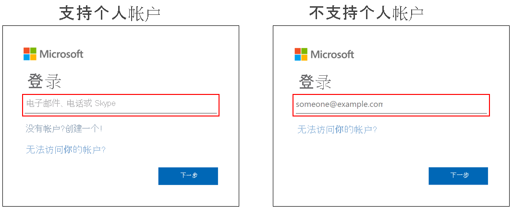

# Azure Active Directory 中 Microsoft 帐户的登录选项

Azure Active Directory (Azure AD) 的 Microsoft 365 登录页面支持工作或学校帐户以及 Microsoft 帐户，但根据用户的具体情况，它可能支持其中一种帐户，也可能两种帐户都支持。 例如，Azure AD 登录页面支持：

* 接受两种类型帐户登录的应用
* 接受来宾的组织

## 识别
可以查看用户名字段中的提示文本，判断组织使用的登录页面是否支持 Microsoft 帐户。 如果提示文本显示“电子邮件、电话或 Skype”，则登录页支持 Microsoft 帐户。

[其他登录选项仅适用于个人 Microsoft 帐户](https://azure.microsoft.com/updates/microsoft-account-signin-options/ )，不能使用这些选项登录到工作或学校帐户资源。

## 后续步骤

[自定义登录品牌](../fundamentals/add-custom-domain.md)