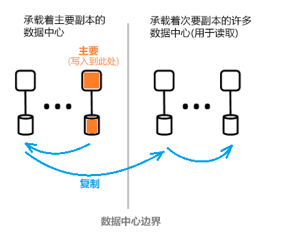

# 什么是 Azure Active Directory 体系结构？

使用 Azure Active Directory (Azure AD) 可以安全地管理用户对 Azure 服务和资源的访问。 Azure AD 随附了整套标识管理功能。 有关 Azure AD 功能的信息，请参阅[什么是 Azure Active Directory？](active-directory-whatis.md)

在 Azure AD 中可以创建及管理用户和组，并使用权限来允许和拒绝对企业资源的访问。 有关标识管理的信息，请参阅 [Azure 标识管理基础知识](active-directory-whatis.md)。

## Azure AD 体系结构

Azure AD 的地理分布式体系结构整合了全面监视、自动重新路由、故障转移和恢复功能，使我们能够为客户提供公司级的可用性与性能。

本文介绍以下体系结构元素：

*   服务体系结构设计
*   可伸缩性
*   连续可用性
*   数据中心

### 服务体系结构设计

构建可访问、可用且数据丰富的系统的最常见方法是通过独立的构建块或缩放单元。 对于 Azure AD 数据层，缩放单元称为“分区”。

数据层包含多个可提供读写功能的前端服务。 下图显示了单目录分区的组件在地理位置分散的数据中心内的传送方式。

  

Azure AD 体系结构的组件包括主要副本和次要副本。

#### 主副本

主要副本接收它所属的分区的所有写入操作。 在向调用方返回成功消息之前，任何写入操作将立即复制到不同数据中心内的次要副本，从而确保写入操作具有异地冗余的持久性。

#### 辅助副本

所有目录*读取*都是从位于物理位置位于不同地理位置的数据中心的*辅助副本*提供服务。 由于数据是以异步方式复制的，因此存在许多次要副本。 目录读取（例如身份验证请求）通过接近客户的数据中心提供服务。 次要副本负责提供读取可伸缩性。

### 可伸缩性

可伸缩性是指服务根据不断提高的性能需求进行扩展的能力。 将数据分区可实现写入伸缩性。 要实现读取伸缩性，可将数据从一个分区复制到分发在世界各地的多个次要副本。

来自目录应用程序的请求将路由到它们在物理上最靠近的数据中心。 写入操作以透明方式重定向到主要副本，以提供读写一致性。 由于在大多数情况下目录通常为读取操作提供服务，因此次要副本可以大幅扩展分区的规模。

目录应用程序连接到最靠近的数据中心。 此连接可以改善性能，因此可实现扩展。 由于一个目录分区可以包含许多次要副本，因此，可将次要副本放置在比较靠近目录客户端的位置。 只有写入密集型的内部目录服务组件才直接以活动的主要副本为目标。

### 连续可用性

可用性（或运行时间）是指系统无中断运行的能力。 Azure AD 高可用性的关键在于，服务可以快速将流量转移到多个地理位置分散的数据中心。 每个数据中心都是独立的，这将启用取消关联失败模式。 通过这种高可用性设计，Azure AD 维护活动无需停机。

与企业 AD 设计相比，Azure AD 的分区设计得以简化，使用单主设计，其中包括精心编排的确定性主要副本故障转移过程。

#### 容错

如果系统能够承受硬件、网络和软件故障，则可用性更高。 目录的每个分区中有一个高度可用的主控副本：主要副本。 此副本中只执行针对分区的写入。 此副本持续受到密切的监视，一旦检测到故障，可立即将写入操作转移到其他副本（该副本将变成新的主要副本）。 故障转移期间，通常会出现 1-2 分钟的写入可用性损失。 读取可用性在此期间不受影响。

读取操作（比写入操作要多出许多个量级）只会转到次要副本。 由于次要副本是幂等的，因此，通过将读取操作定向到其他副本（通常在同一数据中心内），即可轻松补偿给定分区中发生的任一副本丢失。

#### 数据持续性

在确认写入之前，持久至少将写入两个数据中心。 首先将写入操作提交到主副本，然后立即将写入操作复制到至少一个数据中心。 此写入操作可确保托管主副本的数据中心发生灾难性损失时不会导致数据丢失。

Azure AD维护零[恢复时间目标 (RTO)](https://en.wikipedia.org/wiki/Recovery_time_objective)，以便不会丢失故障转移数据。 这包括：

* 令牌颁发和目录读取操作
* 目录写入仅允许大约 5 分钟的 RTO

### 数据中心

Azure AD 的副本存储在分布于世界各地的数据中心内。 有关详细信息，请参阅[Azure 全球基础结构](https://azure.microsoft.com/global-infrastructure/)。

Azure AD 跨数据中心运行，具有以下特征：

* 身份验证、Graph 其他 AD 服务驻留在网关服务的后面。 网关管理这些服务的负载均衡。 如果使用事务运行状况探测检测到任何不正常的服务器，网关会自动故障转移。 根据这些运行状况探测，网关将流量动态路由到正常的数据中心。
* 对于*读取*，目录具有辅助副本以及在多个数据中心内运行的主动-主动配置中的相应前端服务。 当整个数据中心发生故障时，流量会自动路由到另一个数据中心。
 \* 对于*写入操作*，目录将通过计划（新的主副本同步到旧的主副本）或紧急故障转移过程跨数据中心故障转移主（主）副本。 通过将任何提交复制到至少两个数据中心来实现数据持久性。

#### 数据一致性

目录模型具备最终一致性。 分布式异步复制系统的一个典型问题是，从“特定”副本返回的数据可能不是最新的。 

Azure AD 为面向次要副本的应用程序提供读写一致性，为此，它会将写入操作路由到主要副本，然后以异步方式将这些写入操作拉回到次要副本。

使用 Azure AD 图形 API 的应用程序写入操作经过抽象化，可与目录副本保持相关性，实现读写一致性。 Azure AD Graph 服务维护一个逻辑会话，该会话与用于读取的辅助副本关联;在 "副本令牌" 中捕获关系，关系图服务在辅助副本数据中心使用分布式缓存进行缓存。 然后，此令牌可用于同一个逻辑会话中的后续操作。 若要继续使用同一个逻辑会话，必须将后续请求路由到同一个 Azure AD datacenter。 如果目录客户端请求路由到多个 Azure AD 数据中心，则无法继续逻辑会话;如果发生这种情况，则客户端具有多个具有独立读写一致性的逻辑会话。

 >[!NOTE]
 >写入操作立即复制到逻辑会话读取操作所颁发到的次要副本。

#### 备份保护

目录为用户和租户实施软删除而不是硬删除，让客户在意外删除数据后轻松恢复。 如果租户管理员意外删除了用户，他们可以轻松撤消操作并还原已删除的用户。

Azure AD 实施所有数据的每日备份，因此，在发生任何逻辑删除或损坏时，能够可靠地恢复数据。 数据层采用纠错代码，可以检查错误并自动更正特定类型的磁盘错误。

#### 指标和监视器

运行高可用性服务需要一流的指标和监视功能。 Azure AD 会持续分析和报告其每个服务的关键服务运行状况指标与成功条件。 此外还将不断开发并优化指标，针对每个 Azure AD 服务和所有服务中的每个情景进行监视并发出警报。

如果有任何 Azure AD 服务不按预期工作，将立即采取措施，尽快还原功能。 Azure AD 跟踪的最重要指标是如何快速检测并减轻客户的实时站点问题。 我们在监视和警报功能方面投入了大量资金，力求将检测时间缩到最短（TTD 目标：小于 5 分钟）；在操作就绪性方面也同样如此，力求将缓解时间缩到最短（TTM 目标：小于 30 分钟）。

#### 安全操作

针对任一操作采用多重身份验证 (MFA) 等操作控制，并针对所有操作实施审核。 此外使用适时提升系统，授予必要的临时访问权限让客户完成任何日常的按需操作任务。 有关详细信息，请参阅 [受信任的云](https://azure.microsoft.com/support/trust-center)。

## 后续步骤

[Azure Active Directory 开发人员指南](https://docs.microsoft.com/azure/active-directory/develop)