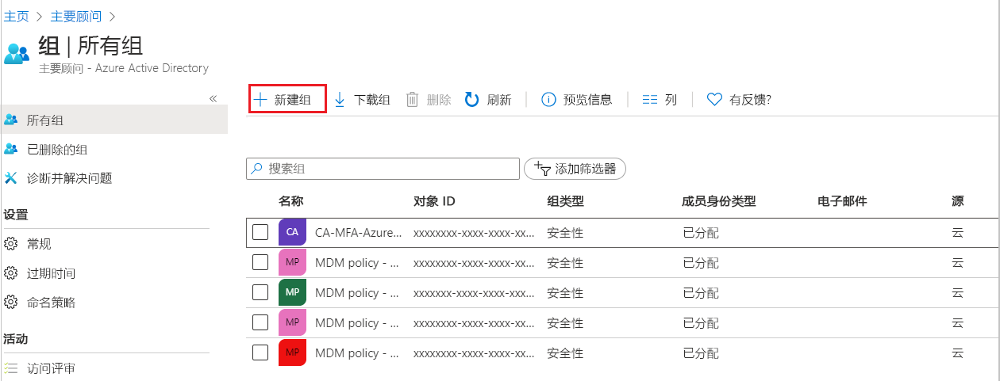
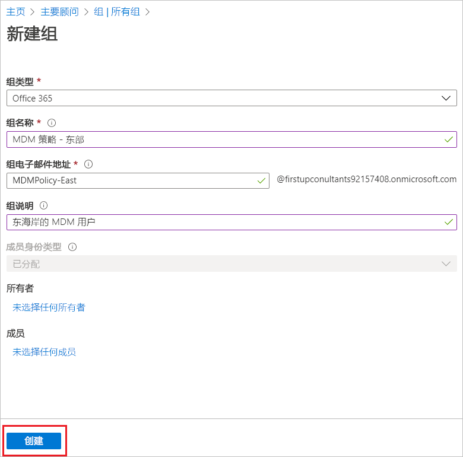
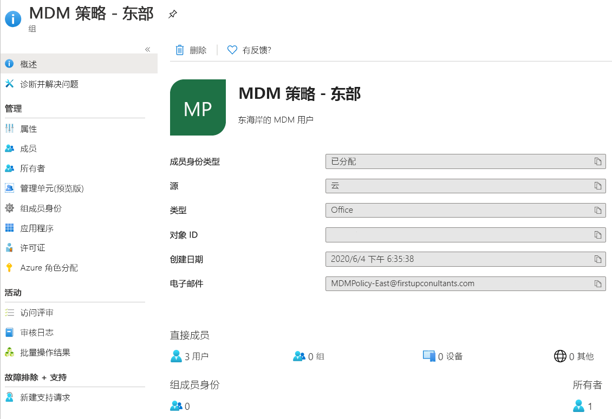

# 使用 Azure Active Directory 创建基本组并添成员
可以使用 Azure Active Directory (Azure AD) 门户创建基本组。 对于本文而言，将由资源所有者（管理员）向单个资源中添加一个基本组，该组中将包括需要访问该资源的特定成员（员工）。 有关更复杂的方案（包括动态成员身份和规则创建），请参阅 [Azure Active Directory 用户管理文档](../enterprise-users/index.yml)。

## 组和成员身份类型
有多个组和成员身份类型。 以下信息说明了每个组和成员身份类型及其使用原因，以帮助你确定创建组时要使用的选项。

### 组类型：
- **安全性**。 用来为一组用户管理成员和计算机对共享资源的访问权限。 例如，你可以创建一个安全组来实施特定的安全策略。 这样，你可以一次向所有成员授予一组权限，而不需要分别为每个成员添加权限。 安全组可以将用户、设备、组和服务主体作为其成员，而将用户和服务主体作为其所有者。 有关管理对资源的访问权限的详细信息，请参阅[使用 Azure Active Directory 组管理对资源的访问权限](active-directory-manage-groups.md)。
- **Microsoft 365**。 通过向成员授予对共享邮箱、日历、文件、SharePoint 站点和其他内容的访问权限，提供了协作机会。 此选项还允许向组织外部的人授予对该组的访问权限。 Microsoft 365 组只能将用户用作其成员。 用户和服务主体都可以是 Microsoft 365 组的所有者。 有关 Microsoft 365 组的详细信息，请参阅[了解 Microsoft 365 组](https://support.office.com/article/learn-about-office-365-groups-b565caa1-5c40-40ef-9915-60fdb2d97fa2)。

### 成员身份类型：
- **已分配。** 允许将特定用户添加为该组的成员并获得独特权限。 对于本文，我们将使用此选项。
- **动态用户。** 允许使用动态成员身份规则自动添加和删除成员。 如果成员的属性改变，系统会查看该目录的动态组规则，了解该成员是满足规则要求（添加），还是不再满足规则要求（删除）。
- **动态设备。** 允许使用动态组规则自动添加和删除设备。 如果设备的属性改变，系统会查看该目录的动态组规则，了解该设备是满足规则要求（添加），还是不再满足规则要求（删除）。

    > [!IMPORTANT]
    > 可以分别创建设备或用户的动态组，不能同时创建。 也不能根据设备所有者的属性创建设备组。 设备成员资格只能引用设备属性。 有关为用户和设备创建动态组的详细信息，请参阅[创建动态组并检查状态](../enterprise-users/groups-create-rule.md)

## 创建基本组并添加成员
可以同时创建基本组并添加成员。 若要创建基本组并添加成员，请使用以下过程：

1. 使用目录的全局管理员帐户登录到 [Azure 门户](https://portal.azure.com)。

1. 搜索并选择“Azure Active Directory”。

1. 在“Active Directory”页面上，选择“组”，然后选择“新建组”  。

    

1. 将显示“新建组”窗格，必须填写必填信息。

    

1. 选择预定义的“组类型”。 有关组类型的详细信息，请参阅[组和成员身份类型](#group-types)。

1. 创建并添加一个**组名**。 选择一个容易记住并对该组来说有意义的名称。 将执行检查以确定另一个组是否已在使用该名称。 如果该名称已在使用中，为避免重复命名，系统将要求你更改组的名称。

1. 添加该组的**组电子邮件地址**，或保留自动填写的电子邮件地址。

1. **组说明。** 向组添加说明（可选）。

1. 选择预定义的**成员身份类型（必填）** 。 有关成员身份类型的详细信息，请参阅[组和成员身份类型](#membership-types)。

1. 选择“创建”。 随即将创建组，该组将准备就绪，可供添加成员。

1. 从“组”页面选择“成员”区域，然后从“选择成员”页面中开始搜索要添加到组的成员  。

    

1. 完成添加成员后，选择“选择”。

    “组概述”页面将更新，以显示当前添加到组的成员数。

    

## 打开或关闭组欢迎电子邮件

如果创建了任何新的 Microsoft 365 组（无论使用动态成员身份还是静态成员资格），欢迎通知将发送到添加到该组的所有用户。 当用户或设备的任何属性发生更改时，将处理组织中的所有动态组规则以进行潜在的成员身份更改。 添加的用户也会收到欢迎通知。 可以在 [Exchange PowerShell](/powershell/module/exchange/users-and-groups/Set-UnifiedGroup?view=exchange-ps) 中关闭此行为。 

## 后续步骤

- [使用组管理对 SaaS 应用程序的访问权限](../enterprise-users/groups-saasapps.md)
- [使用 PowerShell 命令管理组](../enterprise-users/groups-settings-v2-cmdlets.md)