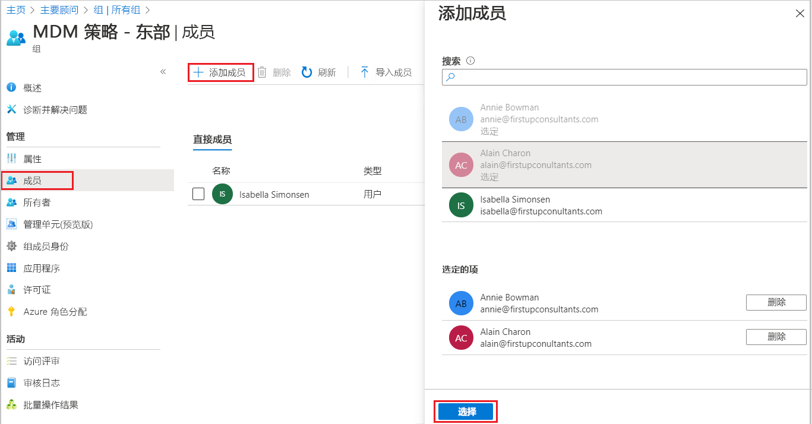

# 如何使用 Azure Active Directory 创建基本组并添成员

使用 Azure Active Directory (Azure AD) 门户可以创建基本组。 为了更好地阐述本文，资源所有者（管理员）将基本组添加到单个资源，基本组中包含了需要访问该资源的特定成员（员工）。 有关更复杂的方案（包括动态成员身份和规则创建），请参阅 [Azure Active Directory 用户管理文档](../users-groups-roles/index.yml)。

## 创建基本组并添加成员
创建基本组和添加成员可以同时进行。

### 创建基本组并添加成员
1. 使用目录的全局管理员帐户登录到 [Azure 门户](https://portal.azure.com)。

2. 依次选择“Azure Active Directory”、“组”、“新建组”。

    

3. 在“组”页面中，填写必填信息。

    

    - **组类型（必填）。** 选择预定义的组类型。 这包括：
        
        - **安全性**。 用于管理成员和一组用户对共享资源的计算机访问权限。 例如，可以为某一特定安全策略创建一个安全组。 以此方式可以一次性为所有成员赋予一组权限，而不必单独地向每个成员添加权限。 有关管理对资源的访问权限的详细信息，请参阅[使用 Azure Active Directory 组管理对资源的访问权限](active-directory-manage-groups.md)。
        
        - **Office 365**。 通过向成员赋予对共享邮箱、日历、文件、SharePoint 站点等的访问权限，提供协作机会。 你也可以通过此选项向组织外部的人员赋予对组的访问权限。 有关 Office 365 组的详细信息，请参阅[了解 Office 365 组](https://support.office.com/article/learn-about-office-365-groups-b565caa1-5c40-40ef-9915-60fdb2d97fa2)。

    - **组名称（必填）。** 添加组名称，可以使用容易记住以及具有某种意义的名称作为组名称。

    - **组描述。** 向组添加说明（可选操作）。

    - **成员身份类型（必填）。** 选择预定义的成员身份类型。 这包括：

        - **已分配。** 允许添加特定用户成为该组成员并获得独特权限。 为了更好地阐述本文，我们使用此选项。

        - **动态用户。** 允许使用动态组规则自动添加和删除成员。 如果成员的属性改变，系统会查看该目录的动态组规则，了解该成员是满足规则要求（添加），还是不再满足规则要求（删除）。

        - **动态设备。** 允许使用动态组规则自动添加和删除设备。 如果设备的属性改变，系统会查看该目录的动态组规则，了解该设备是满足规则要求（添加），还是不再满足规则要求（删除）。

        >[!Important]
        >可以分别创建设备或用户的动态组，不能同时创建。 也不能根据设备所有者的属性创建设备组。 设备成员资格只能引用设备属性。 有关为用户和设备创建动态组的详细信息，请参阅[创建动态组并检查状态](../users-groups-roles/groups-create-rule.md)。

4. 选择**创建**。

    随即将创建组，该组已准备就绪，可供添加成员。

5. 从“组”页面选择“成员”区域，然后从“选择成员”页面中开始搜索要添加到组的成员。

    

6. 完成添加成员后，选择“选择”。

    “组概述”页已更新，可显示当前添加到组的成员数。

    

## 后续步骤
现在已添加一个组和至少一个用户，你可以：

- [查看组和成员](active-directory-groups-view-azure-portal.md)

- [管理组成员身份](active-directory-groups-membership-azure-portal.md)

- [管理组中用户的动态规则](../users-groups-roles/groups-create-rule.md)

- [编辑组设置](active-directory-groups-settings-azure-portal.md)

- [使用组管理对资源的访问权限](active-directory-manage-groups.md)

- [使用组管理对 SaaS 应用程序的访问权限](../users-groups-roles/groups-saasapps.md)

- [使用 PowerShell 命令管理组](../users-groups-roles/groups-settings-v2-cmdlets.md)

- [将 Azure 订阅关联或添加到 Azure Active Directory](active-directory-how-subscriptions-associated-directory.md)