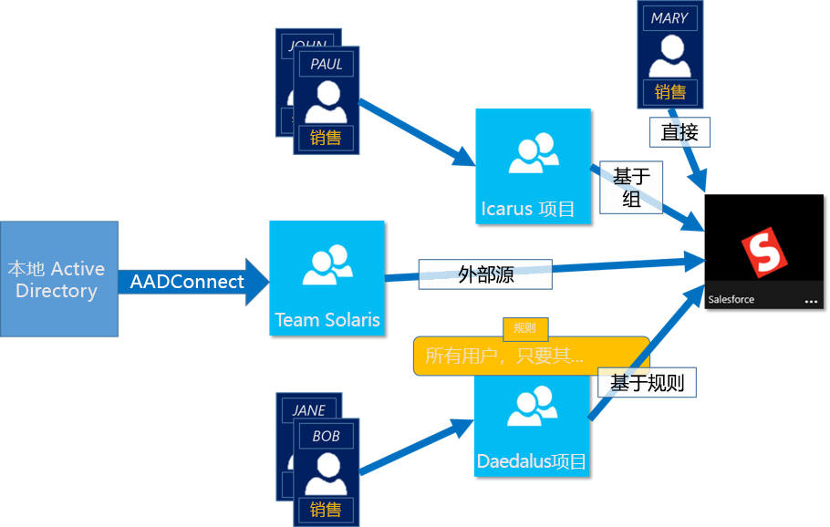

# 使用 Azure Active Directory 组管理对资源的访问权限
Azure Active Directory (Azure AD) 是综合性的标识和访问管理解决方案，它提供一套稳健的功能来管理对本地和云应用程序及资源（包括诸如 Office 365 的 Microsoft 联机服务和众多非 Microsoft SaaS 应用程序）的安全访问。 本文提供了概述，但如果要立即开始使用 Azure AD 组，请遵循[在 Azure AD 中管理安全组](active-directory-groups-create-azure-portal.md)中的说明。 若要了解如何使用 PowerShell 来管理 Azure Active directory 中的组，则可以在[用于管理组的 Azure Active Directory cmdlet](../users-groups-roles/groups-settings-v2-cmdlets.md) 中阅读更多信息。

> [!NOTE]
> 要使用 Azure Active Directory，需要一个 Azure 帐户。 如果没有帐户，可以[注册免费的 Azure 帐户](https://azure.microsoft.com/pricing/free-trial/)。
>
>

Azure AD 的主要功能之一是管理对资源的访问。 这些资源可以是目录的一部分（例如用于通过目录中的角色管理对象的权限）、目录外部的资源（例如 SaaS 应用程序、Azure 服务以及 SharePoint 站点）或者本地资源。 可通过四种方式向用户分配资源访问权限：

1. 直接分配

    资源的所有者可以直接向用户分配对该资源的访问权限。
2. 组成员身份

    资源所有者可以向组分配资源访问权限，这会向该组的成员授予资源访问权限。 然后，组的所有者可以管理该组的成员身份。 实际上，资源所有者是将其资源的用户访问权限委派给了组的所有者。
3. 基于规则

    资源所有者可以使用规则来表明应向哪些用户分配资源访问权限。 规则的结果取决于规则中使用的属性，以及针对特定用户的值。通过这种方式，资源所有者实际上是根据规则中所用的属性，将其资源的管理访问权限委派给了权威来源。 资源所有者仍可管理规则本身，并确定哪些属性与值提供其资源的访问权限。
4. 外部机构

    对资源的访问权限派生自外部来源，例如，从权威来源（如本地目录或 WorkDay 等 SaaS 应用）同步的组。 资源所有者分配组以提供资源访问权限，外部来源管理组的成员。

   

## 观看演示访问管理的视频
观看一段详细演示访问管理的简短视频：

**Azure AD：组的动态成员资格简介**

> [!VIDEO https://channel9.msdn.com/Series/Azure-Active-Directory-Videos-Demos/Azure-AD--Introduction-to-Dynamic-Memberships-for-Groups/player]
>
>

## 访问管理在 Azure Active Directory 中如何工作？
Azure AD 访问管理解决方案的核心是安全组。 使用安全组管理资源访问权限是众所周知的模式，这样就能以弹性且易于理解的方式针对目标用户组提供资源访问权限。 资源所有者（或目录管理员）可以分配组，以提供对其拥有的资源的特定访问权限。 组成员将获取访问权限，而资源所有者可将组成员列表管理权限委派给其他人，例如部门经理或支持人员管理员。

组的所有者也可以让该组发出自助请求。 这样，最终用户就可以搜索和查找组并发出加入请求，有效地寻求权限以访问通过组所管理的资源。 组的所有者可以设置组，以便自动批准加入请求，或者要求组的所有者批准。 当用户发出加入组的请求时，加入请求转发到组的所有者。 如果某个所有者批准了该请求，则发出请求的用户将收到通知并加入该组。 如果某个所有者拒绝了该请求，则发出请求的用户将收到通知，但不会加入该组。

## 访问管理入门
已准备就绪？ 可以尝试一些可以使用 Azure AD 组完成的基本任务。 使用这些功能可向不同的人员组提供对组织中不同资源的特定访问权限。 下面是基本的首要步骤列表。

* [创建简单规则以配置组的动态成员身份](active-directory-groups-create-azure-portal.md)
* [使用组管理对 SaaS 应用程序的访问](../users-groups-roles/groups-saasapps.md)
* [为最终用户启用自助组管理功能](../users-groups-roles/groups-self-service-management.md)
* [使用 Azure AD Connect 将本地组同步到 Azure](../connect/active-directory-aadconnect.md)
* [管理组的所有者](active-directory-accessmanagement-managing-group-owners.md)

## 后续步骤
了解访问管理的基本概念后，请继续学习 Azure Active Directory 中用于管理应用程序和资源访问权限的其他高级功能。

* [使用属性创建高级规则](../users-groups-roles/groups-dynamic-membership.md)
* [在 Azure AD 中管理安全组](active-directory-groups-create-azure-portal.md)
* [适用于组的图形 API 参考](https://msdn.microsoft.com/Library/Azure/Ad/Graph/api/groups-operations#GroupFunctions)
* [用于配置组设置的 Azure Active Directory cmdlet](../users-groups-roles/groups-settings-cmdlets.md)
