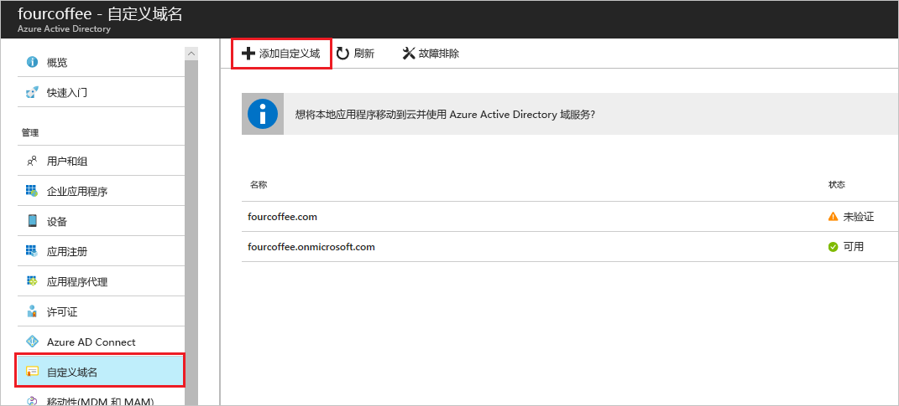

# 使用 Azure Active Directory 门户添加自定义域名

每个新的 Azure AD 租户都附带了一个名为 *\<domainname >* 的初始域名。 你无法更改或删除初始域名，但你可以添加你的组织的名称。 添加自定义域名可帮助你创建用户熟悉的用户名，例如*alain\@contoso.com*。

## 开始之前

在添加自定义域名之前，请使用域注册机构创建域名。 有关认证的域注册机构，请参阅 [ICANN 认证的注册机构](https://www.icann.org/registrar-reports/accredited-list.html)。

## 在 Azure AD 中创建目录

获取域名后，可以创建第一个 Azure AD 目录。 使用具有订阅**所有者**角色的帐户登录到目录的 Azure 门户。

遵循[为组织创建新租户](active-directory-access-create-new-tenant.md#create-a-new-tenant-for-your-organization)中的步骤创建新目录。

>[!IMPORTANT]
>租户的创建者将自动成为该租户的全局管理员。 全局管理员可将其他管理员添加到租户中。

有关订阅角色的详细信息，请参阅[AZURE RBAC 角色](../../role-based-access-control/rbac-and-directory-admin-roles.md#azure-rbac-roles)。

>[!TIP]
> 如果计划将本地 Windows Server AD 与 Azure AD 联合，则需要选择 "**我计划将此域配置为通过本地 Active Directory 进行单一登录**"，同时运行 Azure AD Connect 工具来同步目录。
>
> 还需要在向导的“Azure AD 域”步骤中注册选择用于与本地目录进行联合的域名。 若要查看该安装程序的外观，请参阅[验证选择用于联合的 Azure AD 域](../hybrid/how-to-connect-install-custom.md#verify-the-azure-ad-domain-selected-for-federation)。 如果没有 Azure AD Connect 工具，可以在[此处下载](https://go.microsoft.com/fwlink/?LinkId=615771)。

## 将自定义域名添加到 Azure AD

创建目录后，可以添加自定义域名。

1. 使用目录的全局管理员帐户登录到 [Azure 门户](https://portal.azure.com/)。

1. 搜索并从任意页面中选择*Azure Active Directory* 。 然后选择 "**自定义域名** > **添加自**定义域"。

    

1. 在 "**自定义域名**" 中，输入组织的新名称，在本例中为*contoso.com*。 选择“添加域”。

    

    >[!IMPORTANT]
    >要使其正常工作，必须包含 *.com*、 *.net*或任何其他顶级扩展。

    添加未验证的域。 此时将显示 " **contoso.com** " 页，其中显示了你的 DNS 信息。 请保存此信息。 稍后需要使用它来创建 TXT 记录以配置 DNS。

    

## 将 DNS 信息添加到域注册机构

将自定义域名添加到 Azure AD 之后，必须返回到域注册机构，并添加已复制的 TXT 文件中的 Azure AD DNS 信息。 为域创建此 TXT 记录将验证域名的所有权。

返回到域注册机构，并基于复制的 DNS 信息为域创建新的 TXT 记录。 将生存时间（TTL）设置为3600秒（60分钟），然后保存记录。

>[!IMPORTANT]
>可以注册任意数目的域名。 但是，每个域将从 Azure AD 获取其自身的 TXT 记录。 在域注册机构输入 TXT 文件信息时请小心。 如果错误地输入了错误或重复的信息，则必须等待 TTL 超时（60分钟），然后才能重试。

## 验证自定义域名

注册自定义域名后，请确保它在 Azure AD 中有效。 从你的域注册机构到 Azure AD 的传播可以是即时的，也可能需要几天时间，具体取决于你的域注册机构。

若要验证自定义域名，请执行以下步骤：

1. 使用目录的全局管理员帐户登录到 [Azure 门户](https://portal.azure.com/)。

1. 搜索并从任意页面中选择*Azure Active Directory* ，然后选择 "**自定义域名**"。

1. 在 "**自定义域名**" 中，选择自定义域名。 在此示例中，选择 " **contoso.com**"。

    

1. 在 " **contoso.com** " 页上，选择 "**验证**"，确保自定义域已正确注册并对 Azure AD 有效。

    

验证自定义域名后，可以删除验证 TXT 或 MX 文件。

## 常见验证问题

如果 Azure AD 无法验证自定义域名，请尝试以下建议的方法：

- **至少等待一小时，然后重试**。 必须先传播 DNS 记录，Azure AD 才能验证域。 此过程可能需要一小时以上。

- **确保 DNS 记录正确。** 返回到域名注册机构站点。 请确保该条目已存在，并且它与 Azure AD 提供的 DNS 条目信息相匹配。

  如果无法更新注册机构站点上的记录，请与有权添加条目的人员共享条目，并验证其是否正确。

- **确保域名尚未在另一目录中使用。** 域名只能在一个目录中进行验证。 如果你的域名当前在另一个目录中验证，则不能在新目录中验证。 若要解决此重复问题，必须从旧目录中删除该域名。 有关删除域名的详细信息，请参阅[管理自定义域名](../users-groups-roles/domains-manage.md)。

- **确保你没有任何未托管的 Power BI 租户。** 如果你的用户通过自助注册激活了 Power BI 并为你的组织创建了一个非托管租户，那么你必须使用 PowerShell 以内部或外部管理员的身份接管管理。 有关详细信息，请参阅[在 Azure Active Directory 中以管理员身份接管非托管目录](../users-groups-roles/domains-admin-takeover.md)。

## 后续步骤

- 将另一个全局管理员添加到目录。 有关详细信息，请参阅[如何分配角色和管理员](active-directory-users-assign-role-azure-portal.md)。

- 将用户添加到你的域。 有关详细信息，请参阅[如何添加或删除用户](add-users-azure-active-directory.md)。

- 在 Azure AD 中管理域名信息。 有关详细信息，请参阅[管理自定义域名](../users-groups-roles/domains-manage.md)。

- 若要结合 Azure Active Directory 使用 Windows Server 的本地版本，请参阅[将本地目录与 Azure Active Directory 集成](../connect/active-directory-aadconnect.md)。
