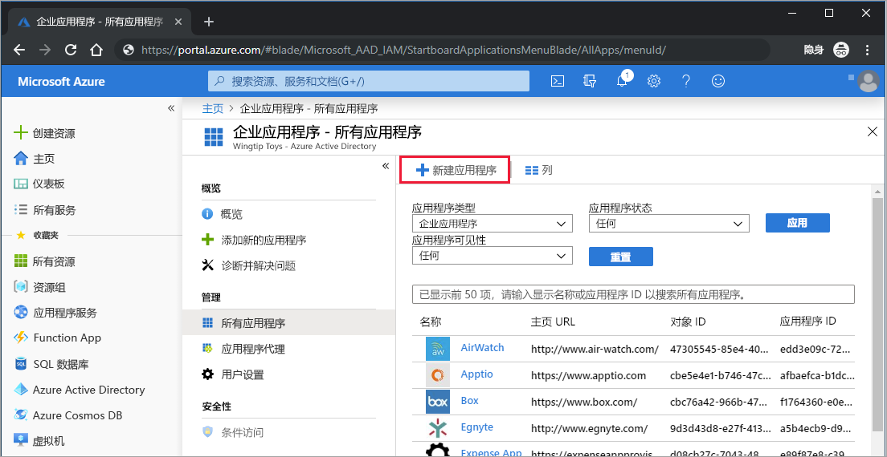
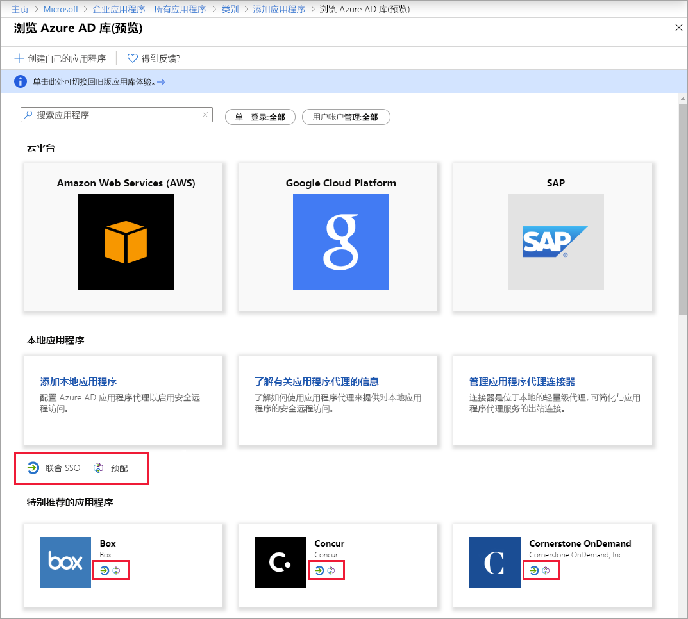
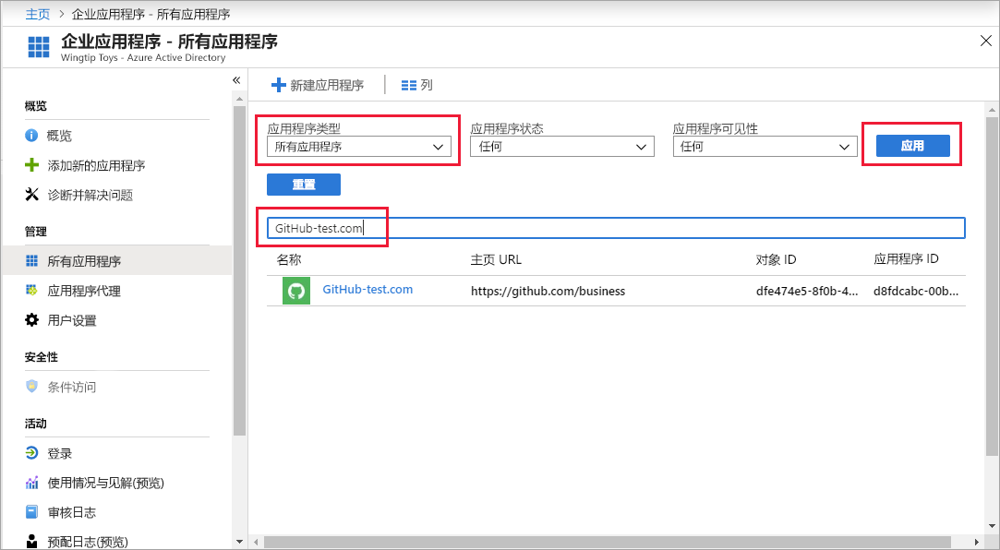
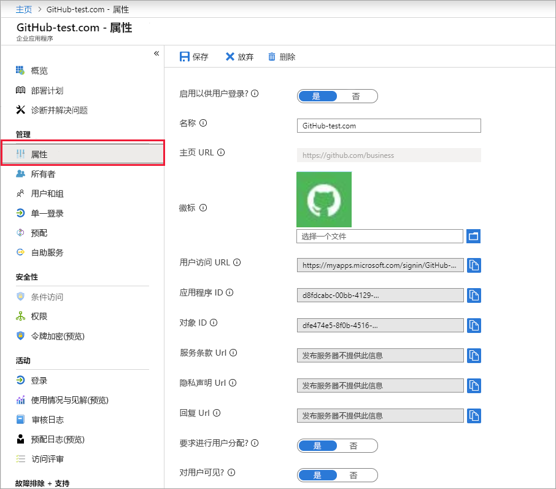

# 快速入门：向 Azure Active Directory 租户添加应用程序

Azure Active Directory (Azure AD) 有一个库，其中包含数千预集成的应用程序。 组织所用的某些应用程序可能在该库中。 本快速入门使用 Azure 门户向 your Azure Active Directory (Azure AD) 租户添加库应用程序。

将某个应用程序添加到 Azure AD 租户以后，即可：

- 使用条件访问策略管理用户对应用程序的访问。
- 将用户配置为使用其 Azure AD 帐户通过单一登录方式登录到应用程序。

## 开始之前

若要向租户添加应用程序，需具备：

- Azure AD 订阅
- 适合应用程序且启用了单一登录的订阅

以 Azure AD 租户全局管理员、云应用程序管理员或应用程序管理员的身份登录到 [Azure 门户](https://portal.azure.com)。

若要测试本教程中的步骤，建议使用非生产环境。 如果没有 Azure AD 非生产环境，可以[获取一个月的试用版](https://azure.microsoft.com/pricing/free-trial/)。

## 向 Azure AD 租户添加应用程序

若要向 Azure AD 租户添加库应用程序，请执行以下操作：

1. 在 [Azure 门户](https://portal.azure.com)的左侧导航面板中，选择“Azure Active Directory”  。

2. 在“Azure Active Directory”窗格中，选择“企业应用程序”。   此时会打开“所有应用程序”窗格，其中显示了 Azure AD 租户中应用程序的随机示例  。

3. 若要将库应用添加到租户，请选择“新建应用程序”  。 

    

 4. 切换到新的库预览体验：在“添加应用程序”页顶部的横幅中，选择显示“单击此处以试用新的和改进的应用库”的链接   。

5. “浏览 Azure AD 库(预览版)”窗格会打开并显示云平台、本地应用程序和特别推荐应用程序的磁贴  。 请注意，“特别推荐应用程序”部分中列出的应用程序带有指示其是否支持联合单一登录 (SSO) 和预配的图标  。

    

6. 你可以在库中浏览要添加的应用程序，或通过在搜索框中输入其名称来搜索该应用程序。 然后，从结果中选择应用程序。 在表单中，可以根据组织的需要来编辑应用程序的名称。 在此示例中，我们已将该名称更改为 GitHub-test  。

    

7. 选择“创建”  。 此时会显示一个入门页面，其中包含为组织配置应用程序所需的选项。

现已添加完应用程序。 后续部分介绍如何更改徽标和编辑应用程序的其他属性。

## 查找 Azure AD 租户应用程序

假设你此前因故必须离开，现在回来继续配置应用程序。 首先找到应用程序。

1. 在 **[Azure 门户](https://portal.azure.com)** 的左侧导航面板中，选择“Azure Active Directory”。 
1. 在“Azure Active Directory”窗格中，选择“企业应用程序”。  
1. 在“应用程序类型”下拉菜单中，选择“所有应用程序”，然后选择“应用”    。 若要详细了解查看选项，请参阅[查看租户应用程序](view-applications-portal.md)。
1. 此时可以看到一个列表，其中包含 Azure AD 租户中的所有应用程序。 此列表为随机示例。 若要查看更多应用程序，请选择“显示更多内容”一次或多次。 
1. 若要快速查找租户中的应用程序，请在搜索框中输入应用程序名称，然后选择“应用”。  此示例查找前面添加的 GitHub-test 应用程序。

    

## 配置用户登录属性

找到应用程序后，可将其打开并配置其属性。

编辑应用程序属性：

1. 选择应用程序将其打开。
2. 选择“属性”，以打开属性页进行编辑。 

    

3. 花点时间了解登录选项。 这些选项确定在应用程序中分配或取消分配的用户如何登录到应用程序。 这些选项还确定用户能否在访问面板中看到该应用程序。

    - “是否启用以供用户登录?”决定分配到应用程序的用户能否登录  。
    - “是否需要进行用户分配?”决定了未分配到应用程序的用户能否登录  。
    - “是否对用户可见?”决定分配到应用的用户能否在访问面板和 O365 启动器中看到该应用  。

4. 参考下表选择最符合需求的选项。

   - **已分配**用户的行为：

       | 应用程序属性设置 | | | 已分配用户的体验 | |
       |---|---|---|---|---|
       | 启用以供用户登录? | 需要进行用户分配? | 对用户可见? | 已分配用户能否登录? | 已分配用户能否看到应用程序?* |
       | 是 | 是 | 是 | 是 | 是  |
       | 是 | 是 | 否  | 是 | 否   |
       | 是 | 否  | 是 | 是 | 是  |
       | 是 | 否  | 否  | 是 | 否   |
       | 否  | 是 | 是 | 否  | 否   |
       | 否  | 是 | 否  | 否  | 否   |
       | 否  | 否  | 是 | 否  | 否   |
       | 否  | 否  | 否  | 否  | 否   |

   - **未分配**用户的行为：

       | 应用程序属性设置 | | | 未分配用户的体验 | |
       |---|---|---|---|---|
       | 启用以供用户登录? | 需要进行用户分配? | 对用户可见? | 未分配用户能否登录? | 未分配用户能否看到应用程序?* |
       | 是 | 是 | 是 | 否  | 否   |
       | 是 | 是 | 否  | 否  | 否   |
       | 是 | 否  | 是 | 是 | 否   |
       | 是 | 否  | 否  | 是 | 否   |
       | 否  | 是 | 是 | 否  | 否   |
       | 否  | 是 | 否  | 否  | 否   |
       | 否  | 否  | 是 | 否  | 否   |
       | 否  | 否  | 否  | 否  | 否   |

     *用户能否在访问面板和 Office 365 应用启动器中看到应用程序?

## 使用自定义徽标

若要使用自定义徽标，请执行以下操作：

1. 创建一个 215 x 215 像素的徽标，将其保存为 PNG 格式。
1. 既然已找到该应用程序，请将其选中。
1. 在左窗格中选择“属性”。 
1. 上传该徽标。
1. 完成后，选择“保存”  。 

    

   > [!NOTE]
   > 此“属性”窗格中显示的缩略图不会立即更新  。 可以关闭并重新打开属性以查看更新的图标。

## 后续步骤

现在你已将应用程序添加到 Azure AD 组织，请[选择要使用的单一登录方法](what-is-single-sign-on.md#choosing-a-single-sign-on-method)，并参考下面的相应文章：

- [配置基于 SAML 的单一登录](configure-single-sign-on-non-gallery-applications.md)
- [配置密码单一登录](configure-password-single-sign-on-non-gallery-applications.md)
- [配置链接登录](configure-linked-sign-on.md)
