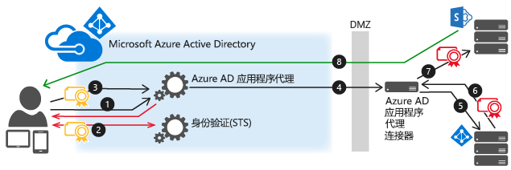

# <a name="kerberos-constrained-delegation-for-single-sign-on-to-your-apps-with-application-proxy"></a>使用应用程序代理通过 Kerberos 约束委派单一登录到应用程序

可以为通过应用程序代理发布的使用集成的 Windows 身份验证保护的本地应用程序提供单一登录。 这些应用程序需要使用 Kerberos 票证进行访问。 应用程序代理使用 Kerberos 约束委派 (KCD) 来支持这些应用程序。 

可以在 Active Directory 中提供应用程序代理连接器权限来模拟用户，以使用集成 Windows 身份验证 (IWA) 实现应用程序的单一登录。 连接器使用此权限来代表用户发送和接收令牌。

## <a name="how-single-sign-on-with-kcd-works"></a>使用 KCD 的单一登录的工作原理
此图说明了当用户尝试访问使用 IWA 的本地应用程序时的流程。



1. 用户输入 URL，通过应用程序代理访问本地应用程序。
2. 应用程序代理将请求重定向到 Azure AD 身份验证服务，以进行预身份验证。 此时，Azure AD 将应用所有适用的身份验证和授权策略，例如多重身份验证。 如果用户通过验证，Azure AD 将创建令牌并将其发送给用户。
3. 用户将令牌传递给应用程序代理。
4. 应用程序代理会验证令牌，并 (UPN) 中检索用户主体名称，然后连接器通过双重的经过身份验证的安全通道提取 UPN 和服务主体名称 () SPN。
5. 连接器执行 Kerberos 约束委派 (KCD 与本地 AD) 协商，模拟用户获取应用程序的 Kerberos 令牌。
6. Active Directory 将应用程序的 Kerberos 令牌发送到连接器。
7. 连接器使用从 AD 收到的 Kerberos 令牌，将原始请求发送到应用程序服务器。
8. 应用程序将响应发送到连接器，该响应随后返回到应用程序代理服务，最后返回到用户。

## <a name="prerequisites"></a>必备条件
开始为 IWA 应用程序使用 SSO 之前，请确保已在环境中完成以下设置和配置：

* 应用（例如 SharePoint Web 应用）已设置为使用 Windows 集成身份验证。 有关详细信息，请参阅 [启用对 Kerberos 身份验证的支持](https://technet.microsoft.com/library/dd759186.aspx)或 for sharepoint，请参阅 [在 SharePoint 2013 中计划 Kerberos 身份验证](https://technet.microsoft.com/library/ee806870.aspx)。
* 所有应用都有[服务主体名称](https://social.technet.microsoft.com/wiki/contents/articles/717.service-principal-names-spns-setspn-syntax-setspn-exe.aspx)。
* 运行连接器的服务器以及运行应用的服务器都已加入域且属于同一个域或信任域。 有关加入域的详细信息，请参阅 [Join a Computer to a Domain](https://technet.microsoft.com/library/dd807102.aspx)（将计算机加入域）。
* 运行连接器的服务器有权读取用户的 TokenGroupsGlobalAndUniversal 属性。 这是默认设置，可能受环境强化安全性影响。

### <a name="configure-active-directory"></a>配置 Active Directory
根据应用程序代理连接器和应用程序服务器是否位于同一域中，Active Directory 配置有所不同。

#### <a name="connector-and-application-server-in-the-same-domain"></a>连接器和应用程序服务器位于同一域中
1. 在 Active Directory 中，请参阅 "**工具**" "  >  **用户和计算机**"。
2. 选择运行连接器的服务器。
3. 右键单击并选择 "**属性**" "  >  **委派**"。
4. 选中“仅信任此计算机来委派指定的服务”。 
5. 选中“使用任意身份验证协议”。
6. 在“可以由此帐户提供委托凭据的服务”下面，添加应用程序服务器的 SPN 标识值。**** 这样，应用程序代理连接器便可以针对列表中定义的应用程序在 AD 中模拟用户。

   

#### <a name="connector-and-application-server-in-different-domains"></a>连接器和应用程序服务器位于不同的域中
1. 有关跨域使用 KCD 的先决条件列表，请参阅 [Kerberos Constrained Delegation across domains](https://technet.microsoft.com/library/hh831477.aspx)（跨域 Kerberos 约束委托）。
2. 使用 `principalsallowedtodelegateto` 服务帐户的属性 ("计算机" 或 "专用域用户帐户") web 应用程序，以启用应用程序代理 (连接器) 中的 Kerberos 身份验证委派。 应用程序服务器在的上下文中运行 `webserviceaccount` ，并且委托服务器为 `connectorcomputeraccount` 。 在域控制器上运行以下命令， (运行 Windows Server 2012 R2 或更高版本的域中) `webserviceaccount` 。 对于这两个帐户， (非 UPN) 使用平面名称。

   如果 `webserviceaccount` 是计算机帐户，请使用以下命令：

   ```powershell
   $connector= Get-ADComputer -Identity connectorcomputeraccount -server dc.connectordomain.com

   Set-ADComputer -Identity webserviceaccount -PrincipalsAllowedToDelegateToAccount $connector

   Get-ADComputer webserviceaccount -Properties PrincipalsAllowedToDelegateToAccount
   ```

   如果 `webserviceaccount` 是用户帐户，请使用以下命令：

   ```powershell
   $connector= Get-ADComputer -Identity connectorcomputeraccount -server dc.connectordomain.com

   Set-ADUser -Identity webserviceaccount -PrincipalsAllowedToDelegateToAccount $connector

   Get-ADUser webserviceaccount -Properties PrincipalsAllowedToDelegateToAccount
   ```

## <a name="configure-single-sign-on"></a>配置单一登录 
1. 根据[使用应用程序代理发布应用程序](application-proxy-add-on-premises-application.md)中的说明发布应用程序。 请务必选择“Azure Active Directory”**** 作为“预身份验证方法”****。
2. 应用程序显示在企业应用程序列表中之后，选择该应用程序并单击“单一登录”****。
3. 将单一登录模式设置为“集成 Windows 身份验证”****。  
4. 输入应用程序服务器的“内部应用程序 SPN”****。 在本示例中，已发布应用程序的 SPN 为 http/www.contoso.com。 此 SPN 需要位于连接器可以向其提供委派的凭据的服务列表中。 
5. 针对你要代表你的用户使用的连接器选择“委派的登录标识”。 有关详细信息，请参阅 [使用不同的本地标识和云标识](#working-with-different-on-premises-and-cloud-identities)

     

## <a name="sso-for-non-windows-apps"></a>非 Windows 应用的 SSO

Azure AD 应用程序代理的 Kerberos 委托流程从 Azure AD 在云中验证用户身份开始。 请求到达本地后，Azure AD 应用程序代理连接器将通过与本地 Active Directory 交互，代表用户颁发 Kerberos 票证。 此过程称为 Kerberos 约束委托 (KCD)。 

在下一个阶段，请求将发送到具有此 Kerberos 票证的后端应用程序。 

可以通过多种机制来定义如何在此类请求中发送 Kerberos 票证。 大多数非 Windows 服务器都应以 SPNEGO 令牌的形式接收它。 此机制在 Azure AD 应用程序代理上受支持，但在默认情况下处于禁用状态。 连接器可以配置为 SPNEGO 或标准 Kerberos 令牌，但不能同时配置两者。

如果为连接器计算机配置 SPNEGO，请确保与 SPNEGO 一起还配置了相应连接器组中的其他所有连接器。 应通过未配置 SPNEGO 的其他连接器来路由需要标准 Kerberos 令牌的应用程序。 某些 web 应用程序接受这两种格式，而无需对配置进行任何更改。 
 

若要启用 SPNEGO，请执行以下操作：

1. 以管理员身份打开命令提示符。
2. 在命令提示符处，对需要 SPNEGO 的连接器服务器运行以下命令。

    ```
    REG ADD "HKLM\SOFTWARE\Microsoft\Microsoft AAD App Proxy Connector" /v UseSpnegoAuthentication /t REG_DWORD /d 1
    net stop WAPCSvc & net start WAPCSvc
    ```

非 Windows 应用通常使用用户名或 SAM 帐户名而非域电子邮件地址。 如果你的应用程序是这种情况，则需要配置委托的登录标识字段来将云标识连接到应用程序标识。 

## <a name="working-with-different-on-premises-and-cloud-identities"></a>使用不同的本地标识和云标识
应用程序代理假设用户在云中与本地具有完全相同的标识。 但在某些环境中，由于公司策略或应用程序依赖关系，组织可能必须使用备用 Id 登录。 在这种情况下，你仍可以使用 KCD 进行单一登录。 可以为每个应用程序配置委托的登录标识**** 来指定在执行单一登录时要使用的标识。  

此功能可让许多具有不同本地标识与云标识的组织从云单一登录到本地应用程序，而不需要用户输入不同的用户名与密码。 这包括如下所述的组织：

* 在内部有多个域（joe@us.contoso.com、joe@eu.contoso.com），在云中有单个域 (joe@contoso.com)。
* 在内部有不可路由的域名 (joe@contoso.usa)，在云中有合法域名。
* 不使用内部域名 (joe)
* 在本地和云中使用不同的别名。 例如：joe-johns@contoso.com 与 joej@contoso.com  

使用应用程序代理可以选择要用于获取 Kerberos 票证的标识。 此设置特定于应用程序。 其中一些选项适用于不接受电子邮件地址格式的系统，另一些选项适用于替代登录。


如果使用委托的登录标识，则此值在组织中所有域或林中可能不唯一。 可以通过使用两个不同的连接器组两次发布这些应用程序来避免此问题。 由于每个应用程序有不同的用户对象，因此可将其连接器加入不同的域。

如果使用 **本地 SAM 帐户名** 作为登录标识，则必须将承载连接器的计算机添加到用户帐户所在的域中。

### <a name="configure-sso-for-different-identities"></a>为不同的标识配置 SSO
1. 配置 Azure AD Connect 设置，使主标识采用电子邮件地址（邮件）。 可以在自定义过程中通过更改同步设置中的“用户主体名称”字段来实现此目的。**** 这些设置同时确定了用户如何登录到 Office 365、Windows 10 设备以及其他使用 Azure AD 作为标识存储的应用程序。  
     
2. 在要修改的应用程序的“应用程序配置”设置中，选择要使用的**委托的登录识别**：

   * 用户主体名称（例如 joe@contoso.com）
   * 备用用户主体名称（例如 joed@contoso.local）
   * 用户主体名称的用户名部分（例如 joe）
   * 备用用户主体名称的用户名部分（例如 joed）
   * 本地 SAM 帐户名（取决于域控制器配置）

### <a name="troubleshooting-sso-for-different-identities"></a>排查不同标识的 SSO 问题
如果在 SSO 过程中发生错误，连接器计算机事件日志中会显示该错误，如[故障排除](application-proxy-back-end-kerberos-constrained-delegation-how-to.md)中所述。
但在某些情况下，请求将成功发送到后端应用程序，同时此应用程序以其他各种 HTTP 响应做出回复。 排查这些问题时，应该先检查连接器计算机上应用程序代理会话事件日志中的事件编号 24029。 用于委托的用户标识出现在事件详细信息的“user”字段中。 若要打开会话记录，请在事件查看器视图菜单中选择“显示分析和调试日志”。****

## <a name="next-steps"></a>后续步骤

* [如何配置应用程序代理应用程序以使用 Kerberos 约束委派](application-proxy-back-end-kerberos-constrained-delegation-how-to.md)
* [解决使用应用程序代理时遇到的问题](application-proxy-troubleshoot.md)

