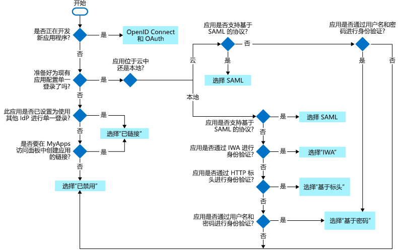

# 单一登录到 Azure Active Directory 中的应用程序

当用户在 Azure Active Directory (Azure AD) 中登录到应用程序时，单一登录 (SSO) 可以增加安全性和便利性。 本文介绍单一登录方法，并帮助你选择在配置应用程序时最适合的 SSO 方法。

- 使用单一登录，用户可以使用一个帐户登录一次，即可访问加入域的设备、公司资源、软件即服务 (SaaS) 应用程序和 Web 应用程序。 登录后，用户可以从 Office 365 门户或 Azure AD MyApps 访问面板启动应用程序。 管理员可以集中管理用户帐户，并根据组成员身份自动添加或删除用户对应用程序的访问权限。

- 不使用单一登录，用户必须记住特定于应用程序的密码并登录每个应用程序。 IT 人员需要为每个应用程序（如 Office 365、Box 和 Salesforce）创建和更新用户帐户。 用户需要记住他们的密码，并且花时间登录每个应用程序。

## 选择单一登录方法

有几种方法可以配置应用程序以实现单一登录。 选择哪种单一登录方法取决于为应用程序配置的身份验证方式。

- 云应用程序可以使用 OpenID Connect、OAuth、SAML、基于密码、链接或禁用的方法进行单一登录。 
- 本地应用程序可以使用基于密码、集成身份验证、基于标头、链接或已禁用的方法进行单一登录。 当应用程序配置为应用程序代理时，本地选项适用。

此流程图有助于确定哪种单一登录方法最适合你的情况。

下表总结了单一登录方法，并提供了更多详细信息的链接。

| 单一登录方法 | 应用程序类型 | 使用时机 |
| :------ | :------- | :----- |
| [OpenID Connect 和 OAuth](#openid-connect-and-oauth) | 仅限云 | 在开发新应用程序时使用 OpenID Connect 和 OAuth。 此协议简化应用程序配置，有易用的 SDK，并且允许应用程序使用 MS Graph。
| [SAML](#saml-sso) | 云和本地 | 尽可能为不使用 OpenID Connect 或 OAuth 的现有应用程序选择 SAML。 SAML 适用于使用某个 SAML 协议进行身份验证的应用程序。|
| [基于密码](#password-based-sso) | 云和本地 | 在应用程序使用用户名和密码进行身份验证时选择“基于密码”。 基于密码的单一登录允许使用 Web 浏览器扩展插件或移动应用安全存储和重放应用程序的密码。 此方法使用应用程序提供的现有登录过程，但允许管理员管理密码。 |
| [链接](#linked-sign-on) | 云和本地 | 当应用程序配置为在其他标识提供程序服务中的单一登录，请选择链接登录。 此选项不会向应用程序添加单一登录。 不过，应用程序可能已经使用其他服务（如 Active Directory 联合身份验证服务）实现了单一登录。|
| [已禁用](#disabled-sso) | 云和本地 | 当应用尚未准备好配置为单一登录时，请使用已禁用的单一登录。 用户每次启动此应用程序时都需要输入其用户名和密码。|
| [集成身份验证 (IWA)](#integrated-windows-authentication-iwa-sso) | 仅限本地 | 对于使用[集成身份验证 (IWA)](/aspnet/web-api/overview/security/integrated-windows-authentication) 的应用程序或声明感知型应用程序，请选择 IWA 单一登录。 对于 IWA，应用程序代理连接器使用 Kerberos 约束委派 (KCD) 对应用程序的用户进行身份验证。 | 
| [基于标头](#header-based-sso) | 仅限本地 | 当应用程序使用标头进行身份验证时，请使用基于标头的单一登录。 基于标头的单一登录需要适用于 Azure AD 的 PingAccess。 应用程序代理使用 Azure AD 对用户进行身份验证，然后通过连接器服务传递流量。  | 

## OpenID Connect 和 OAuth
开发新应用程序时，使用 OpenID Connect 和 OAuth 等新式协议，使应用在多个设备平台间实现最佳的单一登录体验。 OAuth 允许用户或管理员为受保护的资源[授予许可证](configure-user-consent.md)（例如，[MS Graph](/graph/overview)）。 我们为应用提供易于采用的 [SDK](../develop/reference-v2-libraries.md)，此外，应用将可使用 [MS Graph](/graph/overview)。

有关详细信息，请参阅：

- [OAuth 2.0](../develop/v2-oauth2-auth-code-flow.md)
- [OpenID Connect 1.0](../develop/v2-protocols-oidc.md)
- [Azure Active Directory 开发人员指南](https://docs.microsoft.com/azure/active-directory/develop/active-directory-developers-guide)。

## SAML SSO
使用“SAML 单一登录”，Azure AD 通过用户的 Azure AD 帐户向应用程序进行身份验证。 Azure AD 通过连接协议将登录信息传递给应用程序。 使用基于 SAML 的单一登录，可以根据在 SAML 声明中定义的规则将用户映射到特定的应用程序角色。

选择基于 SAML 的单一登录（如果应用程序支持）。

使用以下任何协议的应用程序支持基于 SAML 的单一登录：

- SAML 2.0
- WS 联合身份验证

若要配置基于 SAML 的单一登录的 SaaS 应用程序，请参阅[配置基于 SAML 的单一登录的登录](configure-single-sign-on-portal.md)。 此外，许多软件即服务 (SaaS) 应用程序都有[特定于应用程序的教程](../saas-apps/tutorial-list.md)，可以让用户详细了解基于 SAML 的单一登录的配置。

若要配置 WS 联合身份验证应用程序，按照相同的指南来配置应用程序的基于 SAML 的单一登录，请参阅[配置基于 SAML 的单一登录的登录](configure-single-sign-on-portal.md)。 在要配置要使用 Azure AD 的应用程序的步骤，你将需要 WS 联合身份验证终结点的 Azure AD 登录 URL 替换为`https://login.microsoftonline.com/<tenant-ID>/wsfed`。

若要配置的本地应用程序的基于 SAML 的单一登录，请参阅[SAML 单一登录的本地应用程序使用应用程序代理](application-proxy-configure-single-sign-on-on-premises-apps.md)。

有关 SAML 协议的详细信息，请参阅[单一登录 SAML 协议](../develop/single-sign-on-saml-protocol.md)。

## 基于密码的 SSO
使用基于密码的登录时，用户在首次访问应用程序时使用用户名和密码登录。 首次登录后，Azure AD 会为应用程序提供用户名和密码。 

基于密码的单一登录使用应用程序提供的现有身份验证过程。 为应用程序启用密码单一登录时，Azure AD 会收集并安全地存储应用程序的用户名和密码。 用户凭据以加密状态存储在目录中。 

在以下情况下选择基于密码的单一登录：

- 应用程序不支持 SAML 单一登录协议。
- 应用程序使用用户名和密码而非访问令牌和标头进行身份验证。

对于提供了基于 HTML 的登录页面的任何基于云的应用程序都支持基于密码的单一登录。 用户可以使用以下任一浏览器：

- Windows 7 或更高版本上的 Internet Explorer 11
- Windows 10 周年纪念版或更高版本上的 Microsoft Edge
- Windows 7 或更高版本以及 MacOS X 或更高版本上的 Chrome
- Windows XP SP2 或更高版本以及 Mac OS X 10.6 或更高版本上的 Firefox 26.0 或更高版本

要将云应用程序配置为基于密码的单一登录，请参阅[将应用程序配置为密码单一登录](application-sign-in-problem-password-sso-gallery.md#configure-the-application-for-password-single-sign-on)。

要使用应用程序代理将本地应用程序配置为单一登录，请参阅[使用应用程序代理通过密码存储进行单一登录](application-proxy-configure-single-sign-on-password-vaulting.md)

### 如何针对基于密码的 SSO 进行身份验证

若要对应用程序用户进行身份验证，Azure AD 将从目录中检索用户的凭据，并将其输入到应用程序的登录页面。  Azure AD 通过 Web 浏览器扩展或移动应用安全地传递用户凭据。 此过程使管理员能够管理用户凭据，并且用户无需记住其密码。

> [!IMPORTANT]
> 在自动登录过程中，会对用户的凭据进行模糊处理。 但是，可使用 Web 调试工具来发现凭据。 用户和管理员需要遵循与用户直接输入的凭据相同的安全策略。

### 管理基于密码的 SSO 凭据

每个应用程序的密码可以由 Azure AD 管理员或用户管理。

Azure AD 管理员管理凭据时：  

- 用户无需重置或记住用户名和密码。 用户可在其访问面板中单击应用程序或通过提供的链接访问应用程序。
- 管理员可对凭据执行管理任务。 例如，管理员可根据用户组成员身份和员工的状态来更新应用程序的访问权限。
- 管理员可使用管理凭据来提供对多个用户共享的应用程序的访问权限。 例如，管理员可以允许所有可访问应用程序的人访问社交媒体或文档共享应用程序。

最终用户管理凭据时：

- 用户可以根据需要更新或删除密码来管理其密码。 
- 管理员仍可以为应用程序设置新凭据。

## 联合登录
链接登录使 Azure AD 能够为已配置为其他服务中的单一登录的应用程序提供单一登录。 链接的应用程序可以在 Office 365 门户或 Azure AD MyApps 门户中向最终用户显示。 例如，用户可以从 Office 365 门户启动配置为 Active Directory 联合身份验证服务 2.0 (AD FS) 中的单一登录的应用程序。 对于从 Office 365 门户或 Azure AD MyApps 门户启动的链接的应用程序，还可以使用其他报告。 

### 链接登录应用程序迁移

链接登录可以提供一致的用户体验，而一段时间内迁移应用程序。 如果要迁移到 Azure Active Directory 的应用程序，您可以使用链接登录快速发布到你想要迁移的所有应用程序的链接。  用户可以在 [MyApps 门户](../user-help/active-directory-saas-access-panel-introduction.md)或 [Office 365 应用程序启动器](https://support.office.com/article/meet-the-office-365-app-launcher-79f12104-6fed-442f-96a0-eb089a3f476a)中查找所有的链接。 用户不会知道他们正在访问链接的应用程序或迁移的应用程序。  

用户通过链接的应用程序进行身份验证后，需要先创建帐户记录，然后才能为最终用户提供单一登录访问权限。 预配此帐户记录可以自动完成，也可以由管理员手动完成。

## 已禁用的 SSO

已禁用模式意味着应用程序未使用单一登录。 已禁用单一登录时，用户可能需要进行两次身份验证。 首先，用户向 Azure AD 进行身份验证，然后他们再登录到应用程序。 

使用已禁用的单一登录模式：

- 如果尚未准备好将此应用程序与 Azure AD 单一登录集成，或
- 如果要测试应用程序的其他方面，或
- 作为不需要用户进行身份验证的本地应用程序的安全层。 禁用后，用户需要进行身份验证。 

## 集成身份验证 (IWA) SSO

[应用程序代理](application-proxy.md)针对使用[集成身份验证 (IWA)](/aspnet/web-api/overview/security/integrated-windows-authentication) 的应用程序或声明感知应用程序提供单一登录 (SSO)。 如果应用程序使用 IWA，则应用程序代理将使用 Kerberos 约束委派 (KCD) 对应用程序进行身份验证。 如果有信任 Azure Active Directory 的声明感知应用程序，则单一登录可用，因为用户已经通过使用 Azure AD 进行了身份验证。

选择集成身份验证单一登录模式：

- 为使用 IWA 进行身份验证的本地应用提供单一登录。 

要为 IWA 配置本地应用，请参阅[针对具有应用程序代理的应用程序通过 Kerberos 约束委派进行单一登录](application-proxy-configure-single-sign-on-with-kcd.md)。 

### 使用 KCD 的单一登录的工作原理
此示意图解释了用户访问使用 IWA 的本地应用程序时的流程。

1. 用户输入用于通过应用程序代理访问本地应用程序的 URL。
2. 应用程序代理将请求重定向到 Azure AD 身份验证服务，以进行预身份验证。 此时，Azure AD 将应用所有适用的身份验证和授权策略，例如多重身份验证。 如果用户通过验证，Azure AD 将创建令牌并将其发送给用户。
3. 用户将令牌传递给应用程序代理。
4. 应用程序代理对令牌进行验证并从令牌中检索用户主体名称 (UPN)。 然后，它通过双重身份验证的安全通道将请求、UPN 和服务主体名称 (SPN) 发送到连接器。
5. 连接器与本地 AD，模拟用户以获取应用程序的 Kerberos 令牌将使用 Kerberos 约束委派 (KCD) 协商。
6. Active Directory 域服务将应用程序的 Kerberos 令牌发送到连接器。
7. 连接器使用从 AD 收到的 Kerberos 令牌，将原始请求发送到应用程序服务器。
8. 应用程序将响应发送到连接器，该响应随后返回到应用程序代理服务，最后返回到用户。

## 基于标头的 SSO

基于标头的单一登录适用于使用 HTTP 标头进行身份验证的应用程序。 此登录方法使用名为 PingAccess 的第三方身份验证服务。 用户只需向 Azure AD 进行身份验证。 

出现以下情况时，请选择基于标头的单一登录：

- 应用程序配置了应用程序代理和 PingAccess

要配置基于标头的身份验证，请参阅[使用应用程序代理通过基于标头的身份验证进行单一登录](application-proxy-configure-single-sign-on-with-ping-access.md)。 

### 什么是适用于 Azure AD 的 PingAccess?

使用 PingAccess for Azure AD，用户可以访问使用标头进行身份验证的应用程序并进行单一登录。 应用程序代理将这些应用程序视为与其他任何应用程序一样，它使用 Azure AD 对访问进行身份验证，然后通过连接器服务传递流量。 进行身份验证后，PingAccess 服务将 Azure AD 访问令牌转换为发送给应用程序的标头格式。

用户登录后使用企业应用程序时，感觉不到任何差异。 他们仍可在任何位置的任何设备上工作。 应用程序代理连接器会将远程流量定向到所有应用程序，并且会继续自动进行负载均衡。

### 如何获取 PingAccess 许可证？

由于本方案是通过 Azure AD 与 PingAccess 之间的合作提供的，因此需要获取这两个服务的许可证。 但是，Azure AD Premium 订阅包含一个 PingAccess 基本许可证，可涵盖多达 20 个应用程序。 如果需要发布超过 20 个基于标头的应用程序，则可以再从 PingAccess 获取一个许可证。 

有关详细信息，请参阅 [Azure Active Directory 版本](../fundamentals/active-directory-whatis.md)。

## 相关文章
* [用于将 SaaS 应用程序与 Azure Active Directory 集成的教程](../saas-apps/tutorial-list.md)
* [用于配置单一登录的教程](configure-single-sign-on-portal.md)
* [管理对应用程序的访问简介](what-is-access-management.md)
* 下载链接：[单一登录部署计划](https://aka.ms/SSODeploymentPlan)。

