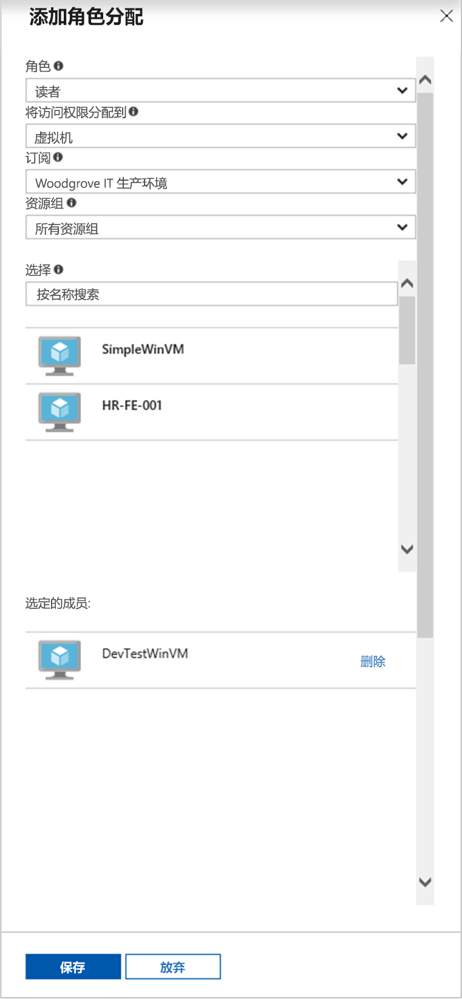

# <a name="use-a-windows-vm-system-assigned-managed-identity-to-access-resource-manager"></a>使用 Windows VM 系统分配的托管标识访问资源管理器

[!INCLUDE [preview-notice](../../../includes/active-directory-msi-preview-notice.md)]

本快速入门介绍了如何使用启用了系统分配的托管标识的 Windows 虚拟机来访问 Azure 资源管理器 API。 Azure 资源的托管标识由 Azure 自动管理，可用于向支持 Azure AD 身份验证的服务进行身份验证，这样就无需在代码中插入凭据了。 学习如何：

> [!div class="checklist"] 
> * 授予 VM 对 Azure 资源管理器中资源组的访问权限 
> * 使用 VM 标识获取访问令牌，并使用它调用 Azure 资源管理器

## <a name="prerequisites"></a>先决条件

[!INCLUDE [msi-tut-prereqs](../../../includes/active-directory-msi-tut-prereqs.md)]

## <a name="grant-your-vm-access-to-a-resource-group-in-resource-manager"></a>授予 VM 对资源管理器中资源组的访问权限
使用 Azure 资源的托管标识，代码可以获取访问令牌，对支持 Azure AD 身份验证的资源进行身份验证。  Azure 资源管理器支持 Azure AD 身份验证。  首先，需要向此 VM 的系统分配的托管标识授予对资源管理器中资源（在本例中为包含 VM 的资源组）的访问权限。  

1.  转到“资源组”选项卡。 
2.  选择为 Windows VM 创建的特定“资源组”。 
3.  转到左侧面板中的“访问控制(IAM)”。 
4.  然后为 Windows VM 添加一个新的角色分配。  选择“角色”作为“读取器”。 
5.  在下一个下拉列表中，为资源虚拟机分配访问权限。 
6.  接下来，请确保“订阅”下拉列表中列出的订阅正确无误。 对于“资源组”，请选择“所有资源组”。 
7.  最后，在“选择”中，选择下拉列表中的 Windows VM 并单击“保存”。

    

## <a name="get-an-access-token-using-the-vms-system-assigned-managed-identity-and-use-it-to-call-azure-resource-manager"></a>使用 VM 的系统分配的托管标识获取访问令牌并使用它来调用 Azure 资源管理器 

在此部分中将需要使用 PowerShell。  如果尚未安装 **PowerShell**，请从[此处](https://docs.microsoft.com/powershell/azure/overview?view=azurermps-4.3.1)下载。 

1.  在门户中，导航到“虚拟机”并转到 Windows 虚拟机，然后在“概述”中，单击“连接”。 
2.  输入创建 Windows VM 时添加的用户名和密码。 
3.  现在，已经创建了与虚拟机的远程桌面连接，请在远程会话中打开 PowerShell。 
4.  使用 Powershell 的 Invoke-WebRequest，向 Azure 资源终结点的本地托管标识发出请求以获取 Azure 资源管理器的访问令牌。

    ```powershell
       $response = Invoke-WebRequest -Uri 'http://169.254.169.254/metadata/identity/oauth2/token?api-version=2018-02-01&resource=https%3A%2F%2Fmanagement.azure.com%2F' -Method GET -Headers @{Metadata="true"}
    ```
    
    > [!NOTE]
    > “资源”参数的值必须完全匹配 Azure AD 预期的值。 如果使用 Azure 资源管理器资源 ID，必须在 URI 的结尾添加斜线。
    
    接下来，提取完整响应，响应以 JavaScript 对象表示法 (JSON) 格式字符串的形式存储在 $response 对象中。 
    
    ```powershell
    $content = $response.Content | ConvertFrom-Json
    ```
    接下来，从响应中提取访问令牌。
    
    ```powershell
    $ArmToken = $content.access_token
    ```
    
    最后，使用访问令牌调用 Azure 资源管理器。 在此示例中，我们还使用 PowerShell 的 Invoke-WebRequest 调用 Azure 资源管理器，并将访问令牌包含在授权标头中。
    
    ```powershell
    (Invoke-WebRequest -Uri https://management.azure.com/subscriptions/<SUBSCRIPTION ID>/resourceGroups/<RESOURCE GROUP>?api-version=2016-06-01 -Method GET -ContentType "application/json" -Headers @{ Authorization ="Bearer $ArmToken"}).content
    ```
    > [!NOTE] 
    > URL 区分大小写。因此，请确保大小写与之前在命名资源组时使用的大小写完全相同，并确保“resourceGroup”使用的是大写“G”。
        
    以下命令将返回资源组的详细信息：

    ```powershell
    {"id":"/subscriptions/98f51385-2edc-4b79-bed9-7718de4cb861/resourceGroups/DevTest","name":"DevTest","location":"westus","properties":{"provisioningState":"Succeeded"}}
    ```

## <a name="next-steps"></a>后续步骤

在本快速入门中，你已学习了如何使用系统分配的标识来访问 Azure 资源管理器 API。  若要详细了解 Azure 资源管理器，请参阅：

> [!div class="nextstepaction"]
>[Azure 资源管理器](/azure/azure-resource-manager/resource-group-overview)

