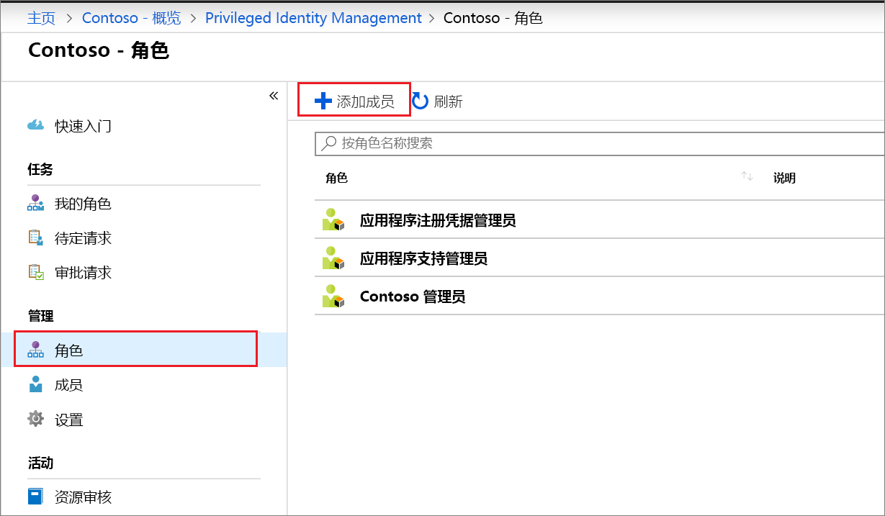
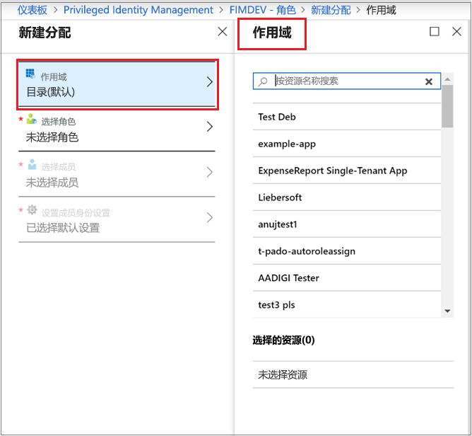
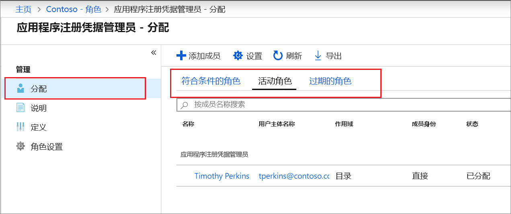

# 在 Privileged Identity Management 中分配 Azure AD 自定义角色

本文介绍如何使用 Privileged Identity Management （PIM）来创建对在 Azure Active Directory （Azure AD）管理体验中管理应用程序而创建的自定义角色的实时和时间绑定分配。

- 有关创建自定义角色以在 Azure AD 中委派应用程序管理的详细信息，请参阅[Azure Active Directory 中的自定义管理员角色（预览版）](../users-groups-roles/roles-custom-overview.md)。
- 如果尚未使用 Privileged Identity Management，请在[开始使用 Privileged Identity Management](pim-getting-started.md)获取详细信息。
- 有关如何授予其他管理员访问权限以管理 Privileged Identity Management 的信息，请参阅向[其他管理员授予访问管理 Privileged Identity Management 的权限](pim-how-to-give-access-to-pim.md)。

> [!NOTE]
> 预览期间，Azure AD 自定义角色不与内置目录角色集成。 功能正式发布后，会在内置角色中进行角色管理。

## 分配角色

Privileged Identity Management 可以管理可在 Azure Active Directory （Azure AD）应用程序管理中创建的自定义角色。  以下步骤将向自定义目录角色发出符合条件的分配。

1. 使用分配给特权角色管理员角色的用户帐户登录到 Azure 门户中的[Privileged Identity Management](https://portal.azure.com/?Microsoft_AAD_IAM_enableCustomRoleManagement=true&Microsoft_AAD_IAM_enableCustomRoleAssignment=true&feature.rbacv2roles=true&feature.rbacv2=true&Microsoft_AAD_RegisteredApps=demo#blade/Microsoft_Azure_PIMCommon/CommonMenuBlade/quickStart) 。
1. 选择 " **Azure AD 自定义角色（预览版）** "。

    

1. 选择 "**角色**" 以查看 Azure AD 应用程序的自定义角色列表。

    

1. 选择 "**添加成员**"，打开 "分配" 页。
1. 若要将角色分配的范围限制为单个应用程序，请选择 "**作用域**" 以指定应用程序范围。

    

1. 选择 "**选择角色**"，打开 "**选择角色**" 列表。

    

1. 选择要分配的角色，然后单击 "**选择**"。 此时将打开 "**选择成员**" 列表。

    

1. 选择要分配给该角色的用户，然后单击 "**选择**"。 "**成员身份设置**" 列表随即打开。

    

1. 在 "**成员资格设置**" 页上，选择 "**符合条件**" 或 "**活动**"：

    - **符合条件**的分配要求分配给角色的用户执行操作，然后才能使用该角色。 操作可能包括传递多重身份验证检查、提供业务理由或请求指定审批者的批准。
    - **活动**分配无需指定的用户执行任何操作即可使用该角色。 活动用户始终具有分配给角色的权限。

1. 如果 "**永久**" 复选框存在并且可用（取决于角色设置），则可以指定是否永久分配。 选中此复选框可使分配永久获得资格或永久分配。 清除该复选框可以指定分配的持续时间。
1. 若要创建新的角色分配，请单击 "**保存**"，然后单击 "**添加**"。 将显示分配过程状态的通知。

若要验证角色分配，请在打开的角色中，选择 "**分配**" > **分配**，并验证是否已将角色分配正确地标识为 "符合条件" 或 "活动"。

 

## 后续步骤

- [激活 Azure AD 自定义角色](azure-ad-custom-roles-assign.md)
- [删除或更新 Azure AD 自定义角色分配](azure-ad-custom-roles-update-remove.md)
- [配置 Azure AD 自定义角色分配](azure-ad-custom-roles-configure.md)
- [Azure AD 中的角色定义](../users-groups-roles/directory-assign-admin-roles.md)
