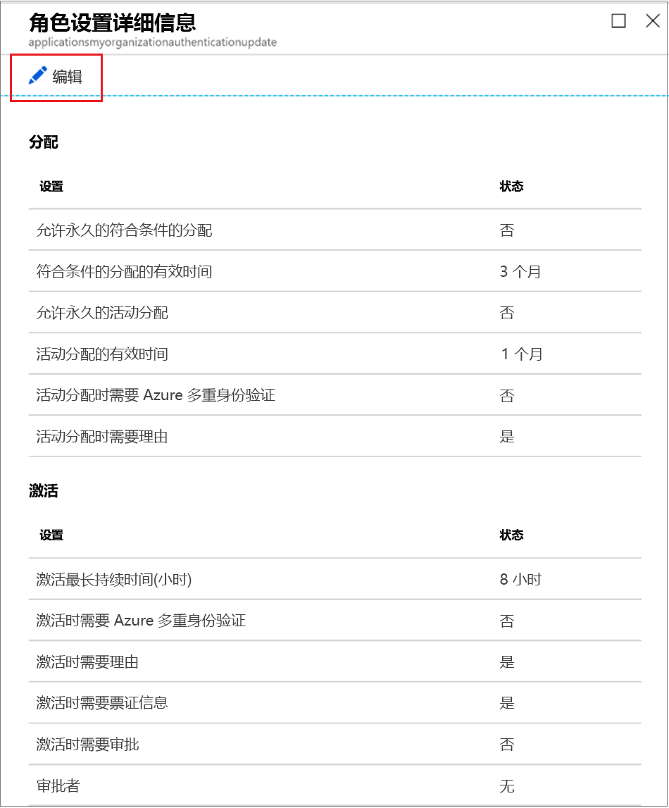
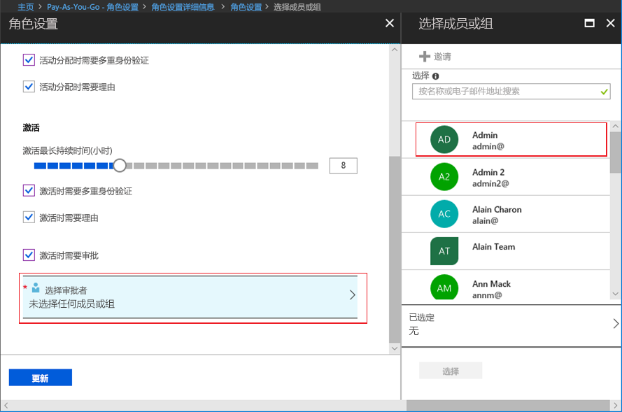

# 在 Privileged Identity Management 中配置 Azure AD 自定义角色

特权角色管理员可以更改应用于用户的角色设置，当用户激活其对自定义角色的分配时，以及其他分配自定义角色的应用程序管理员。

## 打开角色设置

按照以下步骤打开 Azure AD 角色的设置。

1. 使用分配给特权角色管理员角色的用户帐户登录到 Azure 门户中的[Privileged Identity Management](https://portal.azure.com/?Microsoft_AAD_IAM_enableCustomRoleManagement=true&Microsoft_AAD_IAM_enableCustomRoleAssignment=true&feature.rbacv2roles=true&feature.rbacv2=true&Microsoft_AAD_RegisteredApps=demo#blade/Microsoft_Azure_PIMCommon/CommonMenuBlade/quickStart) 。
1. 选择 " **Azure AD 自定义角色（预览版）** "。

    

1. 选择 "**设置**" 以打开 "**设置**" 页。 选择要配置的设置的角色。
1. 选择 "**编辑**" 以打开 "**角色设置**" 页。

    

## 角色设置

可以配置多个设置。

### 分配持续时间

为角色配置设置时，可以为每个分配类型（合格或活动）选择两个分配持续时间选项。 当成员分配到 Privileged Identity Management 中的角色时，这些选项将成为默认的最大持续时间。

可以选择以下*符合条件*的分配持续时间选项之一。

- **允许永久符合条件的分配**：管理员可以分配永久符合条件的成员资格。
- **在以下时间之后过期符合条件的分配**：管理员可以要求所有符合条件的分配都具有指定的开始日期和结束日期。

此外，你还可以选择下列*活动*的分配持续时间选项之一：

- **允许永久活动分配**：管理员可以分配永久活动成员身份。
- 使**活动分配在之后过期**：管理员可以要求所有活动分配都具有指定的开始日期和结束日期。

### 需要 Azure 多重身份验证

Privileged Identity Management 为两个不同的方案提供了对 Azure 多重身份验证的可选强制。

- **在活动分配上需要多重身份验证**

  如果只是想要将某个角色分配给短时间（例如一天），则要求分配的成员请求激活可能太慢。 在这种情况下，当用户激活其角色分配时，Privileged Identity Management 无法强制实施多重身份验证，因为它们已在分配的时刻处于活动状态。 若要确保完成分配的管理员是其所声称的用户，请选中 "**对活动分配要求多重身份验证**" 复选框。

- **激活时需要多重身份验证**

  你可以在 Azure 多重身份验证中要求分配有资格的用户注册 Azure 多重身份验证，然后才能激活。 此过程可确保正在请求激活的用户具有合理确定性。 如果用户帐户可能已泄露，则强制实施此选项可保护关键角色。 若要在激活之前要求符合条件的成员运行 Azure 多重身份验证，请选择 "**激活时需要多重身份验证**" 复选框。

有关详细信息，请参阅[多重身份验证和 Privileged Identity Management](pim-how-to-require-mfa.md)。

### 最长激活持续时间

使用 "**激活最大持续时间**" 滑块设置角色在过期之前保持活动状态的最长时间（以小时为单位）。 此值可以是从1到24小时。

### 要求理由

您可以要求成员输入活动分配或激活时的理由。 若要要求论证，请选中 "**要求对活动分配进行理由**" 复选框或 "**需要激活时的理由**" 框。

### 需要批准才能激活

如果要要求批准激活角色，请执行以下步骤。

1. 选中 "**需要批准才能激活**" 复选框。
1. 选择 "**选择审批者**"，打开 "**选择成员或组**" 列表。

    

1. 至少选择一个成员或组，然后单击 "**选择**"。 您必须至少选择一个审批者。 没有默认审批者。 你的选择将显示在所选审批者列表中。
1. 指定角色设置后，请选择 "**更新**" 以保存所做的更改。

## 后续步骤

- [激活 Azure AD 自定义角色](azure-ad-custom-roles-assign.md)
- [分配 Azure AD 自定义角色](azure-ad-custom-roles-assign.md)
- [删除或更新 Azure AD 自定义角色分配](azure-ad-custom-roles-update-remove.md)
- [Azure AD 中的角色定义](../users-groups-roles/directory-assign-admin-roles.md)
