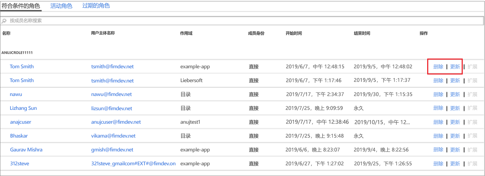

# 在 Privileged Identity Management 中更新或删除分配的 Azure AD 自定义角色

本文介绍如何使用 Privileged Identity Management (PIM) 来更新或删除对自定义角色进行的恰时分配和有时限的分配，这些自定义角色是在 Azure Active Directory (Azure AD) 管理体验中为了进行应用程序管理而创建的。 

- 若要详细了解如何在 Azure AD 中创建自定义角色来委托应用程序管理，请参阅 [Azure Active Directory 中的自定义管理员角色（预览）](../users-groups-roles/roles-custom-overview.md)。 
- 如果未使用过 Privileged Identity Management，请参阅[开始使用 Privileged Identity Management](pim-getting-started.md) 以获取详细信息。

> [!NOTE]
> 在预览版中，Azure AD 自定义角色未集成内置的目录角色。 此功能的正式版发布后，可在内置的角色体验中进行角色管理。 如果看到以下横幅，则应[在内置角色体验中](pim-how-to-add-role-to-user.md)管理这些角色，而本文不适用：
>
> 

## 更新或删除分配

按照以下步骤更新或删除现有的自定义角色分配。

1. 在 Azure 门户中使用分配给特权角色管理员角色的用户帐户登录到 [Privileged Identity Management](https://portal.azure.com/?Microsoft_AAD_IAM_enableCustomRoleManagement=true&Microsoft_AAD_IAM_enableCustomRoleAssignment=true&feature.rbacv2roles=true&feature.rbacv2=true&Microsoft_AAD_RegisteredApps=demo#blade/Microsoft_Azure_PIMCommon/CommonMenuBlade/quickStart)。
1. 选择“Azure AD 自定义角色(预览版)”。****

    

1. 选择“角色”，查看 Azure AD 应用程序的自定义角色的“分配”列表。********

    

1. 选择要更新或删除的角色。
1. 在“合格角色”**** 或“活动角色”**** 选项卡上查找角色分配。
1. 选择“更新”**** 或“删除”**** 以更新或删除角色分配。

    

## 后续步骤

- [激活 Azure AD 自定义角色](azure-ad-custom-roles-assign.md)
- [分配 Azure AD 自定义角色](azure-ad-custom-roles-assign.md)
- [配置 Azure AD 自定义角色分配](azure-ad-custom-roles-configure.md)
