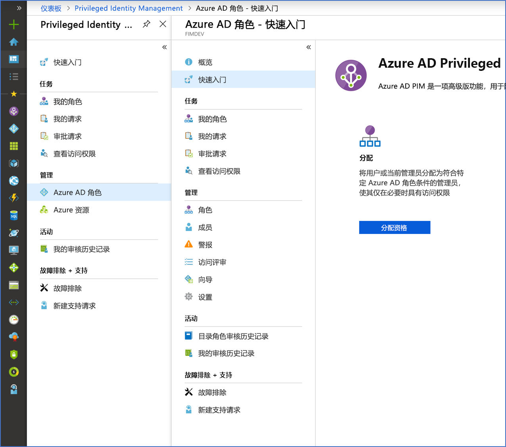

# 什么是 Azure AD Privileged Identity Management？

Azure Active Directory (Azure AD) Privileged Identity Management (PIM) 是用于管理、控制和监视对组织中重要资源的访问的服务。 这包括访问 Azure AD、Azure 资源和其他 Microsoft Online Services（例如 Office 365 或 Microsoft Intune）中的资源。

## 为何使用 PIM？

组织希望尽量减少拥有访问权限的人员以保护信息或资源安全，因为这样可以减少恶意行动者获得相应访问权限，或者已授权用户无意中影响敏感资源的可能性。 但是，用户仍需在 Azure AD、Azure、Office 365 或 SaaS 应用中执行特权操作。 组织可能会授予用户对 Azure 资源和 Azure AD 的实时 (JIT) 特许访问权限。 在这种情况下，需要监督这些用户使用其管理员特权执行了哪些操作。 PIM 有助于缓解访问权限过度、不必要或滥用的风险。

## PIM 的作用是什么？

从根本上讲，PIM 可以帮助你管理哪些对象可在何时何地出于何种原因访问你所关注的资源。 下面是 PIM 的一些重要功能：

- 提供对 Azure AD 和 Azure 资源的**实时**特权访问权限
- 使用开始和结束日期分配对资源的**限时**访问权限
- 要求获得**批准**才能激活特权角色
- 强制要求在激活任何角色时执行**多重身份验证**
- 使用**理由**来了解用户激活角色的原因
- 激活特权角色时获取**通知**
- 开展**访问评审**，以确保用户仍然需要角色
- 下载**审核历史记录**进行内部或外部审核

## 先决条件

若要使用 PIM，必须拥有以下付费或试用许可证之一。 有关详细信息，请参阅[什么是 Azure Active Directory？](../fundamentals/active-directory-whatis.md)。

- Azure AD Premium P2
- 企业移动性 + 安全性 (EMS) E5

有关用户许可证的信息，请参阅[使用 PIM 所要满足的许可证要求](subscription-requirements.md)。

## 术语

为了更好地理解 PIM 及其文档，应查看以下术语。

| 术语或概念 | 角色分配类别 | 说明 |
| --- | --- | --- |
| 符合条件 | Type | 要求用户在使用角色之前执行一项或多项操作的角色分配。 如果用户符合某个角色的条件，则意味着他们在需要执行特权任务时可以激活该角色。 用户无论具有永久角色分配还是合格角色分配，获得的访问权限并无差异。 唯一的差异在于，有些用户并不是一直需要该访问权限。 |
| 活动 | Type | 不要求用户在使用角色之前执行任何操作的角色分配。 分配为“活动”的用户拥有分配给该角色的特权。 |
| 激活 |  | 执行一项或多项操作，使用户能够使用符合条件的角色的过程。 操作可能包括执行多重身份验证 (MFA) 检查、提供业务理由或请求获得指定审批者的批准。 |
| 已分配 | 状态 | 具有活动角色分配的用户。 |
| 已激活 | 状态 | 具有符合条件的角色分配、已执行激活角色的操作且现在处于活动状态的用户。 |
| 永久符合条件 | Duration | 使用户始终有资格激活该角色的角色分配。 |
| 永久活动 | Duration | 使用户无需执行任何操作，始终可以使用该角色的角色分配。 |
| 在过期之前符合条件 | Duration | 使用户在指定的开始和结束日期范围内有资格激活该角色的角色分配。 |
| 在过期之前处于活动状态 | Duration | 使用户无需执行任何操作，可在指定的开始和结束日期范围内使用该角色的角色分配。 |

## PIM 的布局是怎样的？

设置 PIM 时，左侧导航菜单中会显示“任务”、“管理”和“活动”选项。 管理员可以选择管理 **Azure AD 角色**或 **Azure 资源**角色。 选择要管理的角色类型时，会看到该角色类型适用的一组类似选项。

## 在 PIM 中可以执行哪些操作？

如果你是第一个要使用 PIM 的人，系统会自动在目录中为你分配[安全管理员](../users-groups-roles/directory-assign-admin-roles.md#security-administrator)和[特权角色管理员](../users-groups-roles/directory-assign-admin-roles.md#privileged-role-administrator)角色。

对于 Azure AD 角色，只有充当“特权角色管理员”角色的用户可以管理 PIM 中的其他管理员分配。 可以[授予其他管理员访问权限以管理 PIM](pim-how-to-give-access-to-pim.md)。 全局管理员、安全管理员和安全读者可在 PIM 中查看 Azure AD 角色的分配。

对于 Azure 资源角色，只有订阅管理员、资源所有者或资源用户访问管理员可以在 PIM 中管理其他管理员的分配。 默认情况下，充当特权角色管理员、安全管理员或安全读者的用户无权在 PIM 中查看 Azure 资源角色的分配。

## 方案

PIM 支持以下方案：

**特权角色管理员可以：**

- 启用对特定角色的审批
- 指定要审批请求的审批者用户和/或组
- 查看所有特权角色的请求和审批历史记录

**审批者可以：**

- 查看挂起的审批（请求）
- 批准或拒绝角色提升请求（单个和/或批量）
- 提供批准/拒绝的理由 

**有资格的用户角色可以：**

- 请求激活需要审批的角色
- 查看要激活的请求的状态
- 批准激活后，在 Azure AD 中完成任务

## 后续步骤

- [开始使用 PIM](pim-getting-started.md)
- [使用 PIM 所要满足的许可证要求](subscription-requirements.md)
- [确保 Azure AD 中混合部署和云部署的特权访问安全性](../users-groups-roles/directory-admin-roles-secure.md?toc=%2fazure%2factive-directory%2fprivileged-identity-management%2ftoc.json)
