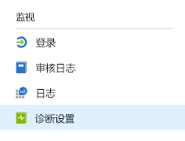

# 什么是 Azure Active Directory 监视？

现在可以使用 Azure Active Directory (Azure AD) 监视将 Azure AD 活动日志路由到不同的终结点。 然后，可以将其保存以供长期使用，或者将其与第三方安全信息和事件管理 (SIEM) 工具集成，以便获取有关环境的见解。

目前可以将日志路由到以下位置：

- 一个 Azure 存储帐户。
- Azure 事件中心，以便与 Splunk 和 Sumologic 实例集成。
- Azure Log Analytics 工作区，以便在其中分析数据、创建仪表板并针对特定事件发出警报

> [!VIDEO https://www.youtube.com/embed/syT-9KNfug8]

[!INCLUDE [azure-monitor-log-analytics-rebrand](../../../includes/azure-monitor-log-analytics-rebrand.md)]

## 诊断设置配置

若要配置 Azure AD 活动日志的监视设置，请先登录到 [Azure 门户](https://portal.azure.com)，然后选择“Azure Active Directory”。  在这里，可以通过两种方式访问诊断设置配置页：

* 在“监视”部分选择“诊断设置”   。

    
    
* 选择“审核日志”或“登录”，然后选择“导出设置”    。 

    

## 将日志路由到存储帐户

将日志路由到 Azure 存储帐户，可以将其保留比[保留策略](reference-reports-data-retention.md)中概述的默认保留期更长的时间。 了解如何[将数据路由到存储帐户](quickstart-azure-monitor-route-logs-to-storage-account.md)。

## 将日志流式传输到事件中心

将日志路由到 Azure 事件中心即可将其与第三方 SIEM 工具（例如 Sumologic 和 Splunk）集成。 可以通过此集成将 Azure AD 活动日志数据与其他由 SIEM 托管的数据组合起来，获取更丰富的有关环境的见解。 了解如何[将日志流式传输到事件中心](tutorial-azure-monitor-stream-logs-to-event-hub.md)。

## 将日志发送到 Azure Monitor 日志

[Azure Monitor 日志](https://docs.microsoft.com/azure/log-analytics/log-analytics-overview)是一项解决方案，可以将不同源的监视数据合并，并提供查询语言和分析引擎，让你深入了解应用程序和资源的操作。 通过将 Azure AD 活动日志发送到 Azure Monitor 日志，可以快速检索和监视收集的数据以及针对其发出警报。 了解如何[将数据发送到 Azure Monitor 日志](howto-integrate-activity-logs-with-log-analytics.md)。

也可安装针对 Azure AD 活动日志预生成的视图，以便监视涉及登录和审核事件的常见场景。 了解如何[安装和使用用于 Azure AD 活动日志的 Log Analytics 视图](howto-install-use-log-analytics-views.md)。

## 后续步骤

* [Azure Monitor 中的活动日志](concept-activity-logs-azure-monitor.md)
* [将日志流式传输到事件中心](tutorial-azure-monitor-stream-logs-to-event-hub.md)
* [将日志发送到 Azure Monitor 日志](howto-integrate-activity-logs-with-log-analytics.md)