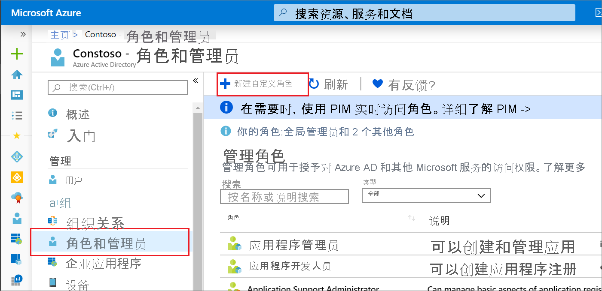
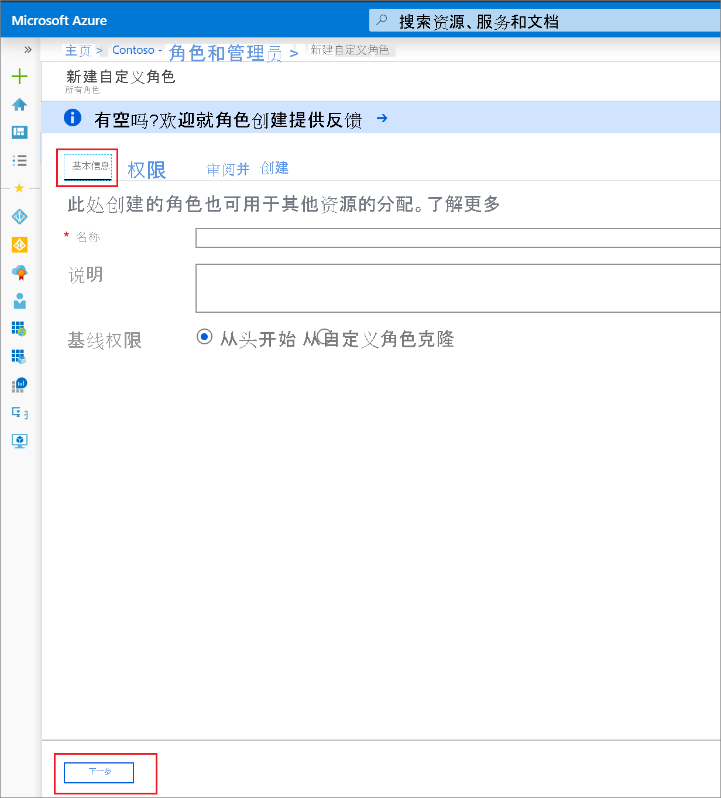
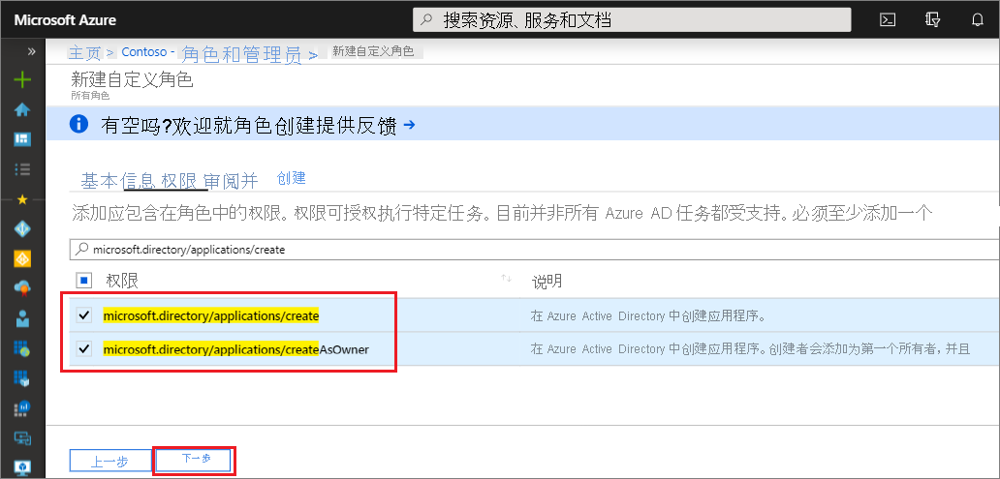

# <a name="quickstart-grant-permission-to-create-unlimited-app-registrations"></a>快速入门：授权创建无限数目的应用注册的权限

在本快速入门指南中，你将创建一个有权创建无限次应用注册的自定义角色，然后将该角色分配给某个用户。 然后，分配的用户可以使用 Azure AD 门户、Azure AD PowerShell 或 Microsoft Graph API 创建应用程序注册。 与内置的“应用程序开发人员”角色不同，使用此自定义角色可以创建无限次应用程序注册。 “应用程序开发人员”角色授予该能力，但创建的对象总数限制为 250 个，目的是防止达到[目录范围的对象配额](../enterprise-users/directory-service-limits-restrictions.md)。 创建和分配 Azure AD 自定义角色所需的最低特权角色是“特权角色管理员”。

如果还没有 Azure 订阅，可以在开始前[创建一个免费帐户](https://azure.microsoft.com/free/)。

## <a name="create-a-custom-role-using-the-azure-ad-portal"></a>使用 Azure AD 门户创建自定义角色

1. 使用 Azure AD 组织中的特权角色管理员或全局管理员权限登录到 [Azure AD 管理中心](https://aad.portal.azure.com)。
1. 依次选择“Azure Active Directory”、“角色和管理员”和“新建自定义角色”  。

    

1. 在“基本信息”选项卡上输入“应用程序注册创建者”作为角色名称，输入“可以创建无限数目的应用程序注册”作为角色说明，然后选择“下一步”。 

    

1. 在“权限”选项卡上的搜索框中输入“microsoft.directory/applications/create”，选中所需权限旁边的复选框，然后选择“下一步”。 

    

1. 在“查看 + 创建”选项卡上查看权限，然后选择“创建” 。

### <a name="assign-the-role-in-the-azure-ad-portal"></a>在 Azure AD 门户中分配角色

1. 使用 Azure AD 组织中的特权角色管理员或全局管理员权限登录到 [Azure AD 管理中心](https://aad.portal.azure.com)。
1. 依次选择“Azure Active Directory”、“角色和管理员” 。
1. 选择“应用程序注册创建者”角色，然后选择“添加分配”。
1. 选择所需的用户，然后单击“选择”将该用户添加到该角色。

完成！ 在本快速入门中，你已成功创建一个有权创建无限数目的应用注册的自定义角色，然后将该角色分配给了某个用户。

> [!TIP]
> 若要使用 Azure AD 门户将角色分配到某个应用程序，请在分配页上的搜索框中输入该应用程序的名称。 应用程序默认不会显示在列表中，但会在搜索结果中返回。

### <a name="app-registration-permissions"></a>应用注册权限

可以使用两个权限来授予创建应用程序注册的能力，这两个权限各自有不同的行为：

- microsoft.directory/applications/createAsOwner：分配此权限会导致将创建者添加为所创建应用注册的第一个所有者，创建的应用注册将计入到创建者的“创建 250 个对象”配额中。
- microsoft.directory/applications/create：分配此权限不会导致将创建者添加为所创建应用注册的第一个所有者，创建的应用注册不会计入到创建者的“250 个已创建对象”配额。 请慎用此权限，因为在达到目录级配额之前，没有任何办法可阻止被分配者创建应用注册。 如果同时分配上述两个权限，此权限优先。

## <a name="create-a-custom-role-in-azure-ad-powershell"></a>在 Azure AD PowerShell 中创建自定义角色

### <a name="prepare-powershell"></a>准备 PowerShell

首先，安装 [PowerShell 库](https://www.powershellgallery.com/packages/AzureADPreview/2.0.0.17)中的 Azure AD PowerShell 模块。 然后使用以下命令导入 Azure AD PowerShell 预览版模块：

```powershell
import-module azureadpreview
```

若要验证该模块是否可供使用，请将以下命令返回的版本与此处列出的版本之一进行匹配：

```powershell
get-module azureadpreview
  ModuleType Version      Name                         ExportedCommands
  ---------- ---------    ----                         ----------------
  Binary     2.0.0.115    azureadpreview               {Add-AzureADAdministrati...}
```

### <a name="create-the-custom-role-in-azure-ad-powershell"></a>在 Azure AD PowerShell 中创建自定义角色

使用以下 PowerShell 脚本创建新角色：

```powershell

# Basic role information
$displayName = "Application Registration Creator"
$description = "Can create an unlimited number of application registrations."
$templateId = (New-Guid).Guid

# Set of permissions to grant
$allowedResourceAction =
@(
    "microsoft.directory/applications/create"
    "microsoft.directory/applications/createAsOwner"
)
$rolePermissions = @{'allowedResourceActions'= $allowedResourceAction}

# Create new custom admin role
$customRole = New-AzureAdMSRoleDefinition -RolePermissions $rolePermissions -DisplayName $displayName -Description $description -TemplateId $templateId -IsEnabled $true
```

### <a name="assign-the-role-in-azure-ad-powershell"></a>在 Azure AD PowerShell 中分配角色

使用以下 PowerShell 脚本分配角色：

```powershell
# Get the user and role definition you want to link
$user = Get-AzureADUser -Filter "userPrincipalName eq 'Adam@contoso.com'"
$roleDefinition = Get-AzureADMSRoleDefinition -Filter "displayName eq 'Application Registration Creator'"

# Get resource scope for assignment
$resourceScope = '/'

# Create a scoped role assignment
$roleAssignment = New-AzureADMSRoleAssignment -ResourceScope $resourceScope -RoleDefinitionId $roleDefinition.Id -PrincipalId $user.objectId
```

## <a name="create-a-custom-role-in-the-microsoft-graph-api"></a>在 Microsoft Graph API 中创建自定义角色

用于创建自定义角色的 HTTP 请求。

POST

``` HTTP
https://graph.microsoft.com/beta/roleManagement/directory/roleDefinitions
```

Body

```HTTP
{
    "description":"Can create an unlimited number of application registrations.",
    "displayName":"Application Registration Creator",
    "isEnabled":true,
    "rolePermissions":
    [
        {
            "resourceActions":
            {
                "allowedResourceActions":
                [
                    "microsoft.directory/applications/create"
                    "microsoft.directory/applications/createAsOwner"
                ]
            },
            "condition":null
        }
    ],
    "templateId":"<PROVIDE NEW GUID HERE>",
    "version":"1"
}
```

### <a name="assign-the-role-in-the-microsoft-graph-api"></a>在 Microsoft Graph API 中分配角色

角色分配会将安全主体 ID（可以是用户或服务主体）、角色定义（角色）ID 和 Azure AD 资源范围合并。

用于分配自定义角色的 HTTP 请求。

POST

``` HTTP
https://graph.microsoft.com/beta/roleManagement/directory/roleAssignments
```

正文

``` HTTP
{
    "principalId":"<PROVIDE OBJECTID OF USER TO ASSIGN HERE>",
    "roleDefinitionId":"<PROVIDE OBJECTID OF ROLE DEFINITION HERE>",
    "resourceScopes":["/"]
}
```

## <a name="next-steps"></a>后续步骤

- 欢迎在 [Azure AD 管理角色论坛](https://feedback.azure.com/forums/169401-azure-active-directory?category_id=166032)上与我们分享知识。
- 有关 Azure AD 角色分配的详细信息，请参阅[分配管理员角色](permissions-reference.md)。
- 有关默认用户权限的详细信息，请参阅[默认来宾和成员用户权限的比较](../fundamentals/users-default-permissions.md)。
