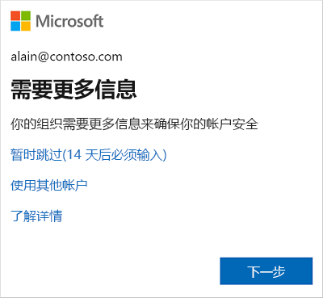
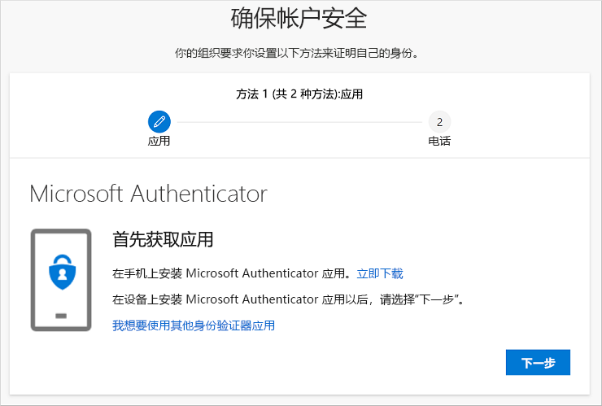
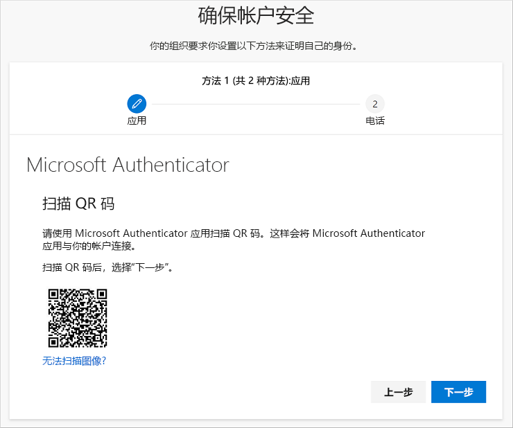
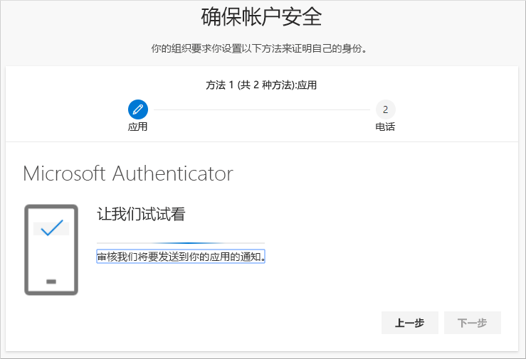
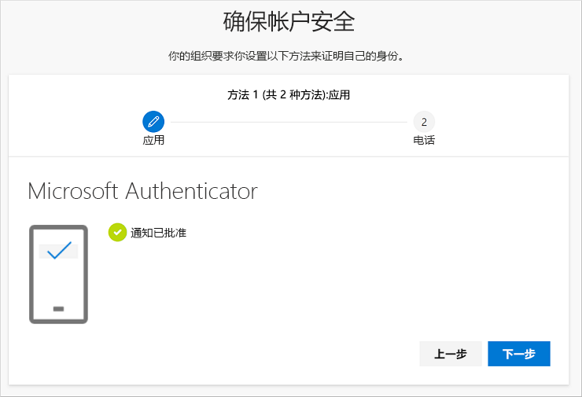
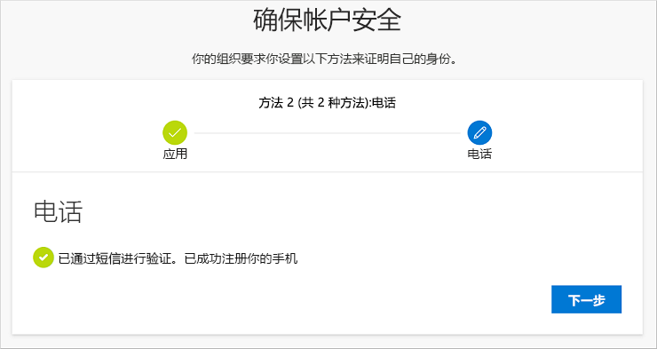
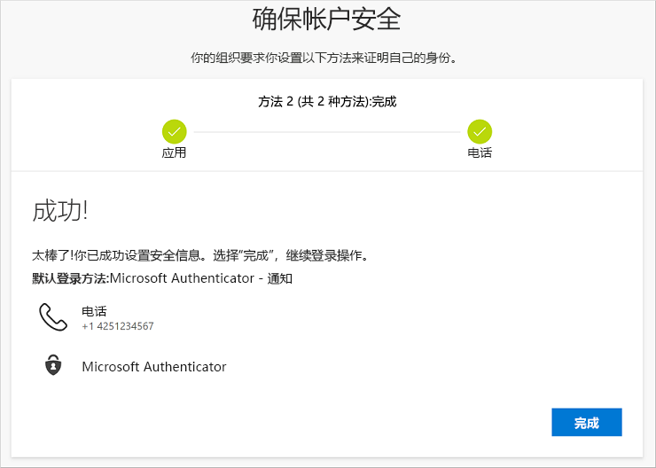
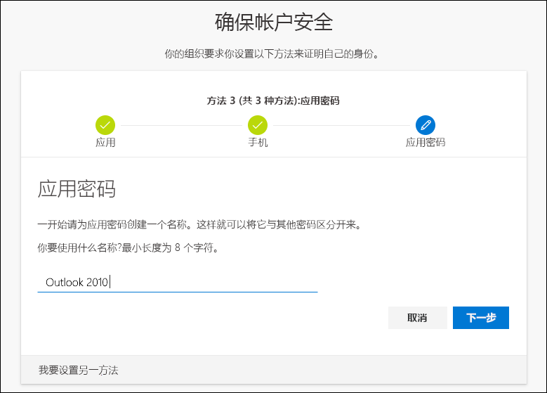
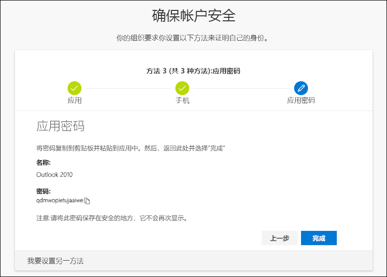
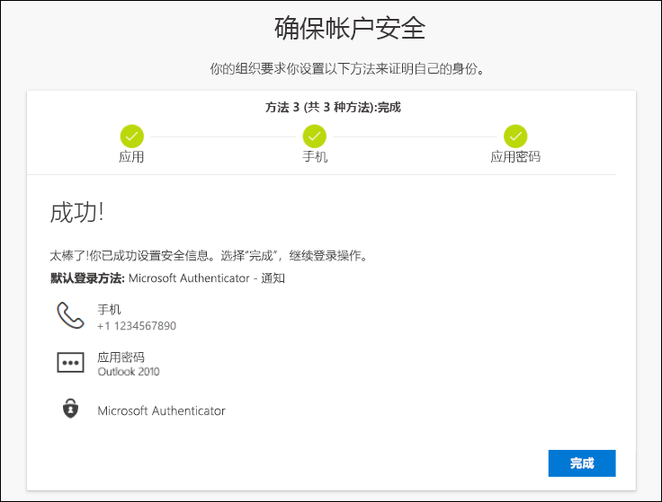

# 根据登录提示设置安全信息（预览）

如果在你登录到工作或学校帐户后，紧接着出现设置安全信息的提示，你可以遵循以下步骤进行设置。

仅当尚未设置组织所要求的安全信息时，才会显示此提示。 如果你以前设置了安全信息，但想要进行更改，可以遵循各种基于方法的操作指南文章中的步骤。 有关详细信息，请参阅[添加或更新安全信息概述](security-info-add-update-methods-overview.md)。

[!INCLUDE [preview-notice](../../../includes/active-directory-end-user-preview-notice-security-info.md)]

## 安全验证与密码重置身份验证

安全信息方法既用于双因素安全验证，又用于密码重置。 但是，并非所有方法都可以用于这二者。

| 方法 | 用于 |
| ------ | -------- |
| Authenticator 应用 | 双重验证和密码重置身份验证。 |
| 短信 | 双重验证和密码重置身份验证。 |
| 电话呼叫 | 双重验证和密码重置身份验证。 |
| 安全密钥 | 双重验证和密码重置身份验证。 |
| 电子邮件帐户 | 仅密码重置身份验证。 需选择另一种方法进行双重验证。 |
| 安全提问 | 仅密码重置身份验证。 需选择另一种方法进行双重验证。 |

## 登录到工作或学校帐户

登录到工作或学校帐户后，会看到一条提示，要求你提供更多信息，以便能够访问自己的帐户。

## 使用向导设置安全信息

遵循以下步骤，根据提示为工作或学校帐户设置安全信息。

>[!Important]
>这只是设置过程的一个示例。 根据组织的要求，管理员可能设置了不同的验证方法，在设置安全信息的过程中，你需要设置这些方法。 本示例要求设置两种方法：使用 Microsoft Authenticator 应用和手机号码拨打验证电话或发送短信。

1. 根据提示选择“下一步”后，会出现“保护帐户向导”，其中显示了管理员和组织要求设置的第一种方法。   在本示例中，第一种方法是 Microsoft Authenticator 应用。

   > [!Note]
   > 若要使用除 Microsoft Authenticator 应用以外的验证器应用，请选择“我想要使用其他验证器应用”链接。 
   >
   > 如果你的组织允许选择除验证器应用以外的其他方法，则可以选择“我想要设置其他方法”链接。 

    

2. 选择“立即下载”以在移动设备上下载并安装 Microsoft Authenticator 应用，然后选择“下一步”。   有关如何下载和安装该应用的详细信息，请参阅[下载并安装 Microsoft Authenticator 应用](user-help-auth-app-download-install.md)。

    

3. 在移动设备上安装 Microsoft Authenticator 应用时，请将“设置帐户”页保持打开。 

4. 打开 Microsoft Authenticator 应用，选择允许通知（如果出现相关提示），通过右上角的“自定义和控制”图标中选择“添加帐户”，然后选择“工作或学校帐户”。   

    >[!Note]
    >如果这是你首次设置 Microsoft Authenticator 应用，则可能会收到一个提示，询问你是允许该应用访问你的相机 (iOS)，还是允许该应用拍摄照片和录制视频 (Android)。 你必须选择“允许”  ，以便验证器应用可以访问你的相机，在下一步中拍摄 QR 码的照片。 如果你不允许使用相机，仍然可以设置验证器应用，但需要手动添加代码信息。 有关如何手动添加代码的信息，请参阅[手动将帐户添加到应用](user-help-auth-app-add-account-manual.md)。

5. 返回到计算机上的“设置帐户”页，然后选择“下一步”。  

    此时会出现“扫描 QR 码”页。 

    

6. 使用在步骤 5 中创建工作或学校帐户后显示在移动设备上的 Microsoft Authenticator 应用 QR 码读取器扫描所提供的代码。

    Authenticator 应用应该会成功添加你的工作或学校帐户，而无需提供其他任何信息。 但是，如果 QR 码读取器无法读取该代码，则你可以选择“无法扫描 QR 图像”，并将代码和 URL 手动输入到 Microsoft Authenticator 应用中。  有关手动添加代码的详细信息，请参阅[手动将帐户添加到应用](user-help-auth-app-add-account-manual.md)。

7. 在计算机上的“扫描 QR 码”页上选择“下一步”。  

    随即有一条通知发送到移动设备上的 Microsoft Authenticator 应用，以测试你的帐户。

    

8. 在 Microsoft Authenticator 应用中确认通知，然后选择“下一步”。 

    

    在使用双重验证或密码重置时，安全信息默认会更新为使用 Microsoft Authenticator 应用来验证你的身份。

9. 在“手机”设置页上，选择是要接收短信还是电话呼叫，然后选择“下一步”   。 本示例使用短信，因此，必须使用可接收短信的设备的电话号码。

    

    随即会将一条短信发送到该电话号码。 如果想要接收电话呼叫，设置过程是相同的。 但是，你会收到包含操作说明的电话呼叫，而不是短信。

10. 输入发送到移动设备的短信中提供的代码，然后选择“下一步”。 

    

11. 查看成功通知，然后选择“完成”。 

    

    在使用双重验证或密码重置时，安全信息会更新为使用短信作为备用方法来验证你的身份。

12. 查看“成功”页，以确认成功为安全信息设置了 Microsoft Authenticator 应用和手机（短信或电话呼叫）验证方法，然后选择“完成”。  

    

    >[!Note]
    >如果你的组织要求使用应用密码，此向导中可能会显示一个额外的部分，可在其中设置密码。 如果看到名为“应用密码”的第三个部分，则必须填写该部分，然后才能完成向导。  有关如何添加应用密码的步骤，请参阅本文的[管理应用密码](#manage-your-app-passwords)部分。

### 管理应用密码

某些应用（例如 Outlook 2010）不支持双重验证。 缺少这种支持意味着，如果你在组织中使用双重验证，该应用将不会正常工作。 若要解决此问题，可以创建一个与普通密码不同的自动生成的密码，并在每个非浏览器应用中使用该密码。

>[!Note]
>如果向导中未显示此选项，则表示管理员尚未设置此选项。 如果未设置此项，但你知道需要使用应用密码，可以遵循[“安全信息（预览）”页中的“设置应用密码”](security-info-app-passwords.md)中所述的步骤。

使用应用密码时，请务必记住：

- 应用密码是自动生成的，并且只能为每个应用输入一次。

- 每个用户的密码限制为 40 个。 如果在达到该限制后尝试创建密码，系统会提示删除现有的密码，然后才能创建新密码。

- 对每个设备（而不是每个应用）使用一个应用密码。 例如，为笔记本电脑上的所有应用创建一个密码，然后为台式机上的所有应用创建另一个密码。

#### 在登录向导中添加应用密码

1. 完成向导的前面部分后，选择“下一步”并完成“应用密码”部分。  

2. 键入需要密码的应用的名称（例如 `Outlook 2010`），然后选择“下一步”。 

    

3. 复制“应用密码”屏幕中的密码代码，并将其粘贴到应用（在本示例中为 Outlook 2010）的“密码”区域中。  

    

4. 复制密码并将其粘贴到应用中后，返回到此向导以确认所有登录方法信息正确，然后选择“完成”。 

    

## 后续步骤

- 若要更改、删除或更新默认的安全信息方法，请参阅：

    - [为验证器应用设置安全信息](security-info-setup-auth-app.md)。

    - [为短信设置安全信息](security-info-setup-text-msg.md)。

    - [设置安全信息以使用电话呼叫](security-info-setup-phone-number.md)。

    - [设置安全信息以使用电子邮件](security-info-setup-email.md)。

    - [设置安全信息以使用预定义的安全性问题](security-info-setup-questions.md)。

- 有关如何使用指定的方法进行登录的信息，请参阅[如何登录](user-help-sign-in.md)。

- 如果丢失或忘记密码，请通过[密码重置门户](https://passwordreset.microsoftonline.com/)或遵循[重置工作或学校帐户密码](active-directory-passwords-update-your-own-password.md)一文中的步骤重置密码。

- 在[无法登录 Microsoft 帐户](https://support.microsoft.com/help/12429/microsoft-account-sign-in-cant)一文中获取登录问题的故障排除提示和帮助。
