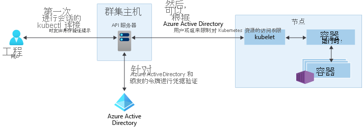

# Azure Kubernetes 服务 (AKS) 的访问和标识选项

可以通过不同的方式进行身份验证，控制访问权限/授权并保护 Kubernetes 群集。 使用 Kubernetes 基于角色的访问控制 (RBAC) ，你可以仅向用户、组和服务帐户授予对所需资源的访问权限。 使用 Azure Kubernetes Service (AKS) ，你可以使用 Azure Active Directory 和 Azure RBAC 进一步增强安全性和权限结构。 这些方法可帮助你保护群集访问，并仅向开发人员和操作员提供最低要求的权限。

本文介绍了可帮助在 AKS 中进行身份验证和分配权限的核心概念：

- [Kubernetes 基于角色的访问控制 (RBAC) ](#kubernetes-role-based-access-control-rbac)
  - [角色和 ClusterRole](#roles-and-clusterroles)
  - [RoleBinding 和 ClusterRoleBinding](#rolebindings-and-clusterrolebindings) 
  - [Kubernetes 服务帐户](#kubernetes-service-accounts)
- [Azure Active Directory 集成](#azure-active-directory-integration)
- [Azure RBAC](#azure-role-based-access-control-azure-rbac)
  - [授权访问 AKS 资源的 Azure RBAC](#azure-rbac-to-authorize-access-to-the-aks-resource)
  - [用于 Kubernetes 授权的 Azure RBAC (预览版) ](#azure-rbac-for-kubernetes-authorization-preview)

## Kubernetes 基于角色的访问控制 (RBAC) 

为了提供用户可以执行的操作的具体筛选，Kubernetes 使用基于角色的访问控制 (RBAC) 。 使用此控制机制，可以向用户或用户组分配执行各种操作的权限，例如创建或修改资源，或者查看正在运行的应用程序工作负载的日志。 可将这些权限的范围限制为单个命名空间，也可以授予面向整个 AKS 群集的权限。 使用 Kubernetes RBAC，可通过创建“角色”来定义权限，然后通过“角色绑定”将这些角色分配给用户 。

有关详细信息，请参阅[使用 RBAC 授权][kubernetes-rbac]。

### 角色和 ClusterRole

使用 Kubernetes RBAC 向用户分配权限之前，请先将这些权限定义为“角色”。 Kubernetes 角色可“授予”权限。 *拒绝*权限没有任何概念。

角色用于授予命名空间内的权限。 若需要针对整个群集或给定命名空间外的群集资源来授予权限，可以改用“ClusterRole”。

ClusterRole 的工作原理与授予对资源的权限相同，但前者可应用于整个群集而非特定命名空间中的资源。

### RoleBinding 和 ClusterRoleBinding

定义了角色来授予针对资源的权限后，可通过 RoleBinding 来分配这些 Kubernetes RBAC 权限。 如果你的 AKS 群集[与 Azure Active Directory 集成](#azure-active-directory-integration)，则绑定是 Azure AD 指向这些用户授予在群集内执行操作的权限的方式，请参阅如何[使用基于角色的访问控制和 Azure Active Directory 标识来控制对群集资源的访问权限](azure-ad-rbac.md)。

角色绑定用于针对给定命名空间分配角色。 此方法可以从逻辑上分离各 AKS 群集，使用户只能访问向其分配的命名空间中的应用程序资源。 若需要针对整个群集或给定命名空间外的群集资源来绑定角色，可以改用“ClusterRoleBinding”。

ClusterRoleBinding 的工作原理与向用户绑定角色相同，但前者可应用于整个群集而非特定命名空间中的资源。 使用此方法，可向管理员或支持工程师授予对 AKS 群集中所有资源的访问权限。

> [!NOTE]
> Microsoft/AKS 采取的任何群集操作都是以内置 Kubernetes 角色 `aks-service` 和内置角色绑定来进行的 `aks-service-rolebinding` 。 此角色允许 AKS 对群集问题进行故障排除，但是不能修改权限，也不能创建角色或角色绑定，或其他高权限操作。 仅在具有实时 (JIT) 访问权限的活动支持票证下启用角色访问。 阅读并详细了解 [AKS 支持策略](support-policies.md)。

### Kubernetes 服务帐户

Kubernetes 中的一个主要用户类型是“服务帐户”。 服务帐户存在于 Kubernetes API 中并由 Kubernetes API 进行管理。 服务帐户的凭据存储为 Kubernetes 机密，可供得到授权的 Pod 用于与 API 服务器进行通信。 大多数 API 请求都会提供服务帐户或普通用户帐户的身份验证令牌。

普通用户帐户为管理员或开发人员提供了更传统的访问权限，而不只是服务和过程。 Kubernetes 本身不提供存储常规用户帐户和密码的标识管理解决方案。 而是将外部标识解决方案集成到 Kubernetes 中。 对于 AKS 群集，此集成标识解决方案就是 Azure Active Directory。

若要详细了解 Kubernetes 中的标识选项，请参阅 [Kubernetes 身份验证][kubernetes-authentication]。

## Azure Active Directory 集成

可通过集成 Azure Active Directory (AD) 增强 AKS 群集的安全性。 Azure AD 是基于数十年的企业标识管理经验推出的基于云的多租户目录，也是一种将核心目录服务、应用程序访问管理和标识保护相结合的标识管理服务。 借助 Azure AD，可以将本地标识集成到 AKS 群集中，提供帐户管理和安全性的单一源。

借助集成了 Azure AD 的 AKS 群集，可授权用户或组访问一个命名空间或多个群集内的 Kubernetes 资源。 若要获取 `kubectl` 配置上下文，用户可以运行 [az aks get-credentials][az-aks-get-credentials] 命令。 当用户随后与 AKS 群集进行交互时 `kubectl` ，系统将提示他们使用其 Azure AD 凭据登录。 此方法提供用户帐户管理和密码凭据的单一源。 用户只能访问由群集管理员定义的资源。

使用 OpenID Connect 向 AKS 群集提供 Azure AD 身份验证。 OpenID Connect 是构建在 OAuth 2.0 协议顶层的标识层。 有关 OpenID Connect 的详细信息，请参阅 [Open ID Connect 文档][openid-connect]。 在 Kubernetes 群集内部， [Webhook 令牌身份验证][webhook-token-docs]用于验证身份验证令牌。 Webhook 令牌身份验证作为 AKS 群集的一部分进行配置和管理。

### Webhook 和 API 服务器

如上图所示，API 服务器调用 AKS webhook 服务器并执行以下步骤：

1. Kubectl 使用 Azure AD 客户端应用程序，通过[OAuth 2.0 device authorization grant flow](../active-directory/develop/v2-oauth2-device-code.md)登录用户。
2. Azure AD 提供 access_token、id_token 和 refresh_token。
3. 用户使用来自 kubeconfig 的 access_token 向 kubectl 发出请求。
4. Kubectl 将 access_token 发送到 APIServer。
5. API 服务器配置了 Auth WebHook 服务器来执行验证。
6. 身份验证 webhook 服务器通过检查 Azure AD 的公共签名密钥，确认 JSON Web 令牌签名有效。
7. 服务器应用程序使用用户提供的凭据从 MS 图形 API 查询登录用户的组成员身份。
8. 将使用用户信息（如用户主体名称 (UPN) 声明的访问令牌）和用户的组成员身份（基于对象 ID）将响应发送到 APIServer。
9. API 基于 Kubernetes Role/RoleBinding 执行授权决定。
10. 获得授权后，API 服务器会将响应返回到 kubectl。
11. Kubectl 为用户提供反馈。
 
**[在此处](managed-aad.md)了解如何将 AKS 与 AAD 集成。**

## Azure RBAC) 的 azure 基于角色的访问控制 (

Azure RBAC 是在 [Azure 资源管理器](../azure-resource-manager/management/overview.md)基础上构建的授权系统，针对 Azure 资源提供精细的访问权限管理。

 Azure RBAC 设计用于处理 Azure 订阅中的资源，而 Kubernetes RBAC 旨在处理 AKS 群集中的 Kubernetes 资源。 

使用 Azure RBAC，可创建“角色定义”，描述要应用的权限。 然后，使用特定*范围*的*角色分配*（可能是单个资源、资源组或整个订阅）为用户或组分配此角色定义。

有关详细信息，请参阅[什么是 Azure 基于角色的访问控制 (Azure RBAC)？][azure-rbac]

完全操作 AKS 群集需要两个级别的访问权限： 
1. [访问 Azure 订阅中的 AKS 资源](#azure-rbac-to-authorize-access-to-the-aks-resource)。 此过程允许你使用 AKS Api 控制扩展或升级群集，并请求 kubeconfig。
2. 访问 Kubernetes API。 此访问权限可通过[KUBERNETES RBAC](#kubernetes-role-based-access-control-rbac) (传统) 或通过将[AZURE RBAC 与 AKS 集成以进行 Kubernetes 授权](#azure-rbac-for-kubernetes-authorization-preview)控制

### 授权访问 AKS 资源的 Azure RBAC

使用 Azure RBAC，你可以为你的用户提供 (或标识) 跨一个或多个订阅对 AKS 资源进行精细访问。 例如，你可以使用[Azure Kubernetes 服务参与者角色](../role-based-access-control/built-in-roles.md#azure-kubernetes-service-contributor-role)，以允许你执行扩展和升级群集等操作。 其他用户可以拥有仅授予管理 kubeconfig 请求权限的[Azure Kubernetes Service 群集管理员角色](../role-based-access-control/built-in-roles.md#azure-kubernetes-service-cluster-admin-role)。

或者，你可以为用户提供一般的[参与者](../role-based-access-control/built-in-roles.md#contributor)角色，该角色将包含上述权限以及 AKS 资源上可能的每个操作，但管理权限本身除外。

若要深入了解如何使用 Azure RBAC 来保护对 kubeconfig 文件的访问权限，请访问[此处](control-kubeconfig-access.md)提供的 Kubernetes API 访问权限。

### 用于 Kubernetes 授权的 Azure RBAC (预览版) 

使用 Azure RBAC 集成，AKS 将使用 Kubernetes Authorization webhook 服务器来使用 Azure 角色定义和角色分配来管理 Azure AD 集成的 K8s 群集资源的权限和分配。

如上图所示，使用 Azure RBAC 集成时，对 Kubernetes API 的所有请求将遵循[Azure Active integration 部分](#azure-active-directory-integration)所述的相同身份验证流。 

但在此之后，只要在 AAD 中存在发出请求的标识，请求就会被 Azure 授权，而不是仅依赖于 Kubernetes RBAC 进行授权。 如果 AAD 中不存在该标识（例如，Kubernetes 服务帐户），则 Azure RBAC 将不会启动，并且它将是普通的 Kubernetes RBAC。

在这种情况下，你可以为用户提供四个内置角色之一，或创建自定义角色，就像使用 Kubernetes 角色时一样，但在此情况下，使用 Azure RBAC 机制和 Api。 

例如，使用此功能，你不仅可以在多个订阅之间提供对 AKS 资源的权限，还可以设置并为他们提供这些群集内的角色和权限，它们控制对 Kubernetes API 的访问。 例如，你可以 `Azure Kubernetes Service RBAC Viewer` 在订阅作用域上授予角色，其接收方将能够列出和获取所有群集中的所有 Kubernetes 对象，但不能进行修改。

#### 内置角色

AKS 提供下列四种内置角色。 它们类似于[Kubernetes 内置角色](https://kubernetes.io/docs/reference/access-authn-authz/rbac/#user-facing-roles)，但有一些不同之处，例如支持 CRDs。 有关每个内置角色允许操作的完整列表，请参阅[此处](../role-based-access-control/built-in-roles.md)。

| 角色                                | 描述  |
|-------------------------------------|--------------|
| Azure Kubernetes 服务 RBAC 查看器  | 允许只读访问权限查看命名空间中的大多数对象。 它不允许查看角色或角色绑定。 此角色不允许查看 `Secrets` ，因为通过读取机密内容可以访问 `ServiceAccount` 命名空间中的凭据，这将允许 API 访问命名空间中的任何 `ServiceAccount` (一种形式的权限提升)   |
| Azure Kubernetes 服务 RBAC 编写器 | 允许读/写访问命名空间中的大多数对象。 此角色不允许查看或修改角色或角色绑定。 但是，此角色允许将 pod `Secrets` 作为命名空间中的任何 ServiceAccount 来访问和运行，因此它可用于获取命名空间中任何 ServiceAccount 的 API 访问级别。 |
| Azure Kubernetes 服务 RBAC 管理员  | 允许在命名空间内授予管理员访问权限。 允许读/写访问命名空间中的大多数资源 (或群集范围) ，包括在命名空间中创建角色和角色绑定的能力。 此角色不允许对资源配额或命名空间本身具有写入权限。 |
| Azure Kubernetes 服务 RBAC 群集管理  | 允许超级用户访问对任何资源执行任何操作。 它可让你完全控制群集中的每个资源和所有命名空间。 |

**请参阅[此处](manage-azure-rbac.md)的如何利用 Azure RBAC 进行 Kubernetes 授权。**

## 后续步骤

- 若要开始使用 Azure AD 和 Kubernetes RBAC，请参阅[将 Azure Active Directory 与 AKS 集成][aks-aad]。
- 有关相关的最佳做法，请参阅[在 AKS 中进行身份验证和授权的最佳做法][operator-best-practices-identity]。
- 若要开始使用 Azure RBAC 进行 Kubernetes 授权，请参阅[使用 AZURE rbac 在 Azure Kubernetes Service (AKS) 群集中授予访问权限](manage-azure-rbac.md)。
- 若要开始保护 kubeconfig 文件，请参阅[限制对群集配置文件的访问权限](control-kubeconfig-access.md)

有关核心 Kubernetes 和 AKS 概念的详细信息，请参阅以下文章：

- [Kubernetes/AKS 群集和工作负荷][aks-concepts-clusters-workloads]
- [Kubernetes/AKS 安全性][aks-concepts-security]
- [Kubernetes/AKS 虚拟网络][aks-concepts-network]
- [Kubernetes/AKS 存储][aks-concepts-storage]
- [Kubernetes/AKS 规模][aks-concepts-scale]

<!-- LINKS - External -->
[kubernetes-authentication]: https://kubernetes.io/docs/reference/access-authn-authz/authentication
[webhook-token-docs]: https://kubernetes.io/docs/reference/access-authn-authz/authentication/#webhook-token-authentication
[kubernetes-rbac]: https://kubernetes.io/docs/reference/access-authn-authz/rbac/

<!-- LINKS - Internal -->
[openid-connect]: ../active-directory/develop/v2-protocols-oidc.md
[az-aks-get-credentials]: /cli/azure/aks#az-aks-get-credentials
[azure-rbac]: ../role-based-access-control/overview.md
[aks-aad]: managed-aad.md
[aks-concepts-clusters-workloads]: concepts-clusters-workloads.md
[aks-concepts-security]: concepts-security.md
[aks-concepts-scale]: concepts-scale.md
[aks-concepts-storage]: concepts-storage.md
[aks-concepts-network]: concepts-network.md
[operator-best-practices-identity]: operator-best-practices-identity.md
