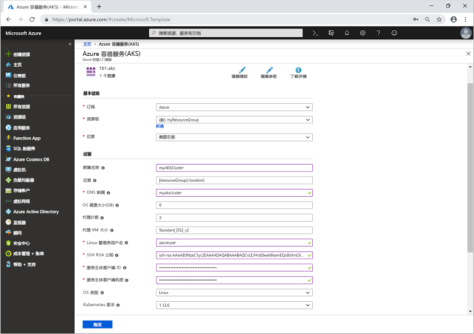

# <a name="quickstart-deploy-an-azure-kubernetes-service-aks-cluster-using-an-azure-resource-manager-template"></a>快速入门：使用 Azure 资源管理器模板部署 Azure Kubernetes 服务 (AKS) 群集

Azure Kubernetes 服务 (AKS) 是可用于快速部署和管理群集的托管式 Kubernetes 服务。 在本快速入门中，我们将使用 Azure 资源管理器模板部署一个 AKS 群集。 该群集中将运行一个包含 Web 前端和 Redis 实例的多容器应用程序。


本快速入门假设读者基本了解 Kubernetes 的概念。 有关详细信息，请参阅 [Azure Kubernetes 服务 (AKS) 的 Kubernetes 核心概念][kubernetes-concepts]。

如果没有 Azure 订阅，请在开始之前创建一个[免费帐户](https://azure.microsoft.com/free/?WT.mc_id=A261C142F)。

[!INCLUDE [cloud-shell-try-it.md](../../includes/cloud-shell-try-it.md)]

如果选择在本地安装并使用 CLI，本快速入门要求运行 Azure CLI 2.0.61 版或更高版本。 运行 `az --version` 即可查找版本。 如果需要进行安装或升级，请参阅[安装 Azure CLI][azure-cli-install]。

## <a name="prerequisites"></a>先决条件

若要使用资源管理器模板创建 AKS 群集，请提供 SSH 公钥和 Azure Active Directory 服务主体。 如果需要其中的任一资源，请参阅以下部分；否则请跳到[创建 AKS 群集](#create-an-aks-cluster)部分。

### <a name="create-an-ssh-key-pair"></a>创建 SSH 密钥对

若要访问 AKS 节点，请使用 SSH 密钥对进行连接。 使用 `ssh-keygen` 命令生成 SSH 公钥和私钥文件。 默认情况下，这些文件在 *~/.ssh* 目录中创建。 如果给定位置存在具有相同名称的 SSH 密钥对，则这些文件将被覆盖。

以下命令使用 RSA 加密和 2048 位长度创建 SSH 密钥对：

```azurecli-interactive
ssh-keygen -t rsa -b 2048
```

有关创建 SSH 密钥的详细信息，请参阅[在 Azure 中创建和管理用于身份验证的 SSH 密钥][ssh-keys]。

### <a name="create-a-service-principal"></a>创建服务主体

若要允许 AKS 群集与其他 Azure 资源交互，请使用 Azure Active Directory 服务主体。 使用 [az ad sp create-for-rbac][az-ad-sp-create-for-rbac] 命令创建服务主体。 `--skip-assignment` 参数限制分配任何其他权限。 默认情况下，此服务主体的有效期为一年。

```azurecli-interactive
az ad sp create-for-rbac --skip-assignment
```

输出类似于以下示例：

```json
{
  "appId": "8b1ede42-d407-46c2-a1bc-6b213b04295f",
  "displayName": "azure-cli-2019-04-19-21-42-11",
  "name": "http://azure-cli-2019-04-19-21-42-11",
  "password": "27e5ac58-81b0-46c1-bd87-85b4ef622682",
  "tenant": "73f978cf-87f2-41bf-92ab-2e7ce012db57"
}
```

记下 *appId* 和 *password*。 后续步骤会用到这些值。

## <a name="create-an-aks-cluster"></a>创建 AKS 群集

本快速入门中所用的模板用于[部署 Azure Kubernetes 服务群集](https://azure.microsoft.com/resources/templates/101-aks/)。 有关更多 AKS 示例，请参阅 [AKS 快速入门模板][aks-quickstart-templates]站点。

1. 选择下图登录到 Azure 并打开一个模板。

    [](https://portal.azure.com/#create/Microsoft.Template/uri/https%3A%2F%2Fraw.githubusercontent.com%2FAzure%2Fazure-quickstart-templates%2Fmaster%2F101-aks%2Fazuredeploy.json)

2. 选择或输入以下值。  

    对于本快速入门，请保留“OS 磁盘大小(GB)”、“代理计数”、“代理 VM 大小”、“OS 类型”和“Kubernetes 版本”的默认值。      为以下模板参数提供自己的值：

    * **订阅**：选择 Azure 订阅。
    * **资源组**：选择“新建”。  输入资源组的唯一名称（例如 *myResourceGroup*），然后选择“确定”。 
    * **位置**：选择一个位置，例如“美国东部”。 
    * **群集名称**：输入 AKS 群集的唯一名称，例如 *myAKSCluster*。
    * **DNS 前缀**：输入群集的唯一 DNS 前缀，例如 *myakscluster*。
    * **Linux 管理员用户名**：输入一个用户名用于通过 SSH 进行连接，例如 *azureuser*。
    * **SSH RSA 公钥**：复制并粘贴 SSH 密钥对的 *public* 部分（默认为 *~/.ssh/id_rsa.pub* 的内容）。
    * **服务主体客户端 ID**：复制并粘贴 `az ad sp create-for-rbac` 命令输出的、服务主体的 *appId*。
    * **服务主体客户端机密**：复制并粘贴 `az ad sp create-for-rbac` 命令输出的、服务主体的 *password*。
    * **我同意上述条款和条件**：选中此框表示同意。

    

3. 选择“购买”。 

创建 AKS 群集需要几分钟时间。 等待群集成功部署，然后转到下一步骤。

## <a name="connect-to-the-cluster"></a>连接至群集

若要管理 Kubernetes 群集，请使用 Kubernetes 命令行客户端 [kubectl][kubectl]。 如果使用的是 Azure Cloud Shell，则 `kubectl` 已安装。 若要在本地安装 `kubectl`，请使用 [az aks install-cli][az-aks-install-cli] 命令：

```azurecli
az aks install-cli
```

若要将 `kubectl` 配置为连接到 Kubernetes 群集，请使用 [az aks get-credentials][az-aks-get-credentials] 命令。 此命令将下载凭据，并将 Kubernetes CLI 配置为使用这些凭据。

```azurecli-interactive
az aks get-credentials --resource-group myResourceGroup --name myAKSCluster
```

若要验证到群集的连接，请使用 [kubectl get][kubectl-get] 命令返回群集节点的列表。

```azurecli-interactive
kubectl get nodes
```

以下示例输出显示在上一步骤中创建的节点。 确保所有节点的状态为“就绪”： 

```
NAME                       STATUS   ROLES   AGE     VERSION
aks-agentpool-41324942-0   Ready    agent   6m44s   v1.12.6
aks-agentpool-41324942-1   Ready    agent   6m46s   v1.12.6
aks-agentpool-41324942-2   Ready    agent   6m45s   v1.12.6
```

## <a name="run-the-application"></a>运行应用程序

Kubernetes 清单文件定义群集的所需状态，例如，要运行哪些容器映像。 在本快速入门中，清单用于创建运行 Azure Vote 应用程序所需的所有对象。 此清单包含两个 [Kubernetes 部署][kubernetes-deployment] - one for the sample Azure Vote Python applications, and the other for a Redis instance. Two [Kubernetes Services][kubernetes-service] 还会创建 - 一个内部服务用于 Redis 实例，一个外部服务用于从 Internet 访问 Azure Vote 应用程序。

> [!TIP]
> 在本快速入门中，请手动创建应用程序清单并将其部署到 AKS 群集。 在更实际的方案中，可以使用 [Azure Dev Spaces][azure-dev-spaces] 直接在 AKS 群集中快速地循环访问代码并对其进行调试。 可以跨 OS 平台和开发环境使用 Dev Spaces，并可与团队中的他人进行协作。

创建名为 `azure-vote.yaml` 的文件，并将其复制到以下 YAML 定义中。 如果使用 Azure Cloud Shell，则可以使用 `vi` 或 `nano` 来创建此文件，就像在虚拟或物理系统中操作一样：

```yaml
apiVersion: apps/v1
kind: Deployment
metadata:
  name: azure-vote-back
spec:
  replicas: 1
  selector:
    matchLabels:
      app: azure-vote-back
  template:
    metadata:
      labels:
        app: azure-vote-back
    spec:
      nodeSelector:
        "beta.kubernetes.io/os": linux
      containers:
      - name: azure-vote-back
        image: redis
        resources:
          requests:
            cpu: 100m
            memory: 128Mi
          limits:
            cpu: 250m
            memory: 256Mi
        ports:
        - containerPort: 6379
          name: redis
---
apiVersion: v1
kind: Service
metadata:
  name: azure-vote-back
spec:
  ports:
  - port: 6379
  selector:
    app: azure-vote-back
---
apiVersion: apps/v1
kind: Deployment
metadata:
  name: azure-vote-front
spec:
  replicas: 1
  selector:
    matchLabels:
      app: azure-vote-front
  template:
    metadata:
      labels:
        app: azure-vote-front
    spec:
      nodeSelector:
        "beta.kubernetes.io/os": linux
      containers:
      - name: azure-vote-front
        image: microsoft/azure-vote-front:v1
        resources:
          requests:
            cpu: 100m
            memory: 128Mi
          limits:
            cpu: 250m
            memory: 256Mi
        ports:
        - containerPort: 80
        env:
        - name: REDIS
          value: "azure-vote-back"
---
apiVersion: v1
kind: Service
metadata:
  name: azure-vote-front
spec:
  type: LoadBalancer
  ports:
  - port: 80
  selector:
    app: azure-vote-front
```

使用 [kubectl apply][kubectl-apply] 命令部署应用程序，并指定 YAML 清单的名称：

```azurecli-interactive
kubectl apply -f azure-vote.yaml
```

以下示例输出显示已成功创建了部署和服务：

```
deployment "azure-vote-back" created
service "azure-vote-back" created
deployment "azure-vote-front" created
service "azure-vote-front" created
```

## <a name="test-the-application"></a>测试应用程序

应用程序运行时，Kubernetes 服务将向 Internet 公开应用程序前端。 此过程可能需要几分钟才能完成。

若要监视进度，请将 [kubectl get service][kubectl-get] 命令与 `--watch` 参数配合使用。

```azurecli-interactive
kubectl get service azure-vote-front --watch
```

最初，*azure-vote-front* 服务的 *EXTERNAL-IP* 显示为 *pending*。

```
NAME               TYPE           CLUSTER-IP   EXTERNAL-IP   PORT(S)        AGE
azure-vote-front   LoadBalancer   10.0.37.27   <pending>     80:30572/TCP   6s
```

当 *EXTERNAL-IP* 地址从 *pending* 更改为实际公共 IP 地址时，请使用 `CTRL-C` 停止 `kubectl` 监视进程。 以下示例输出显示向服务分配了有效的公共 IP 地址：

```
azure-vote-front   LoadBalancer   10.0.37.27   52.179.23.131   80:30572/TCP   2m
```

若要查看 Azure Vote 应用的实际效果，请打开 Web 浏览器并转到服务的外部 IP 地址。


## <a name="delete-cluster"></a>删除群集

如果不再需要群集，可以使用 [az group delete][az-group-delete] 命令删除资源组、容器服务及所有相关资源。

```azurecli-interactive
az group delete --name myResourceGroup --yes --no-wait
```

> [!NOTE]
> 删除群集时，AKS 群集使用的 Azure Active Directory 服务主体不会被删除。 有关如何删除服务主体的步骤，请参阅 [AKS 服务主体的注意事项和删除][sp-delete]。

## <a name="get-the-code"></a>获取代码

本快速入门使用预先创建的容器映像创建了 Kubernetes 部署。 GitHub 上提供了相关的应用程序代码、Dockerfile 和 Kubernetes 清单文件。

[https://github.com/Azure-Samples/azure-voting-app-redis][azure-vote-app]

## <a name="next-steps"></a>后续步骤

在本快速入门中，部署了 Kubernetes 群集，并向该群集部署了多容器应用程序。 [访问所创建的群集的 Kubernetes Web 仪表板][kubernetes-dashboard]。

若要详细了解 AKS 并演练部署示例的完整代码，请继续阅读“Kubernetes 群集”教程。

> [!div class="nextstepaction"]
> [AKS 教程][aks-tutorial]

<!-- LINKS - external -->
[azure-vote-app]: https://github.com/Azure-Samples/azure-voting-app-redis.git
[kubectl]: https://kubernetes.io/docs/user-guide/kubectl/
[kubectl-apply]: https://kubernetes.io/docs/reference/generated/kubectl/kubectl-commands#apply
[kubectl-get]: https://kubernetes.io/docs/reference/generated/kubectl/kubectl-commands#get
[azure-dev-spaces]: https://docs.microsoft.com/azure/dev-spaces/
[aks-quickstart-templates]: https://azure.microsoft.com/resources/templates/?term=Azure+Kubernetes+Service

<!-- LINKS - internal -->
[kubernetes-concepts]: concepts-clusters-workloads.md
[aks-monitor]: https://aka.ms/coingfonboarding
[aks-tutorial]: ./tutorial-kubernetes-prepare-app.md
[az-aks-browse]: /cli/azure/aks?view=azure-cli-latest#az-aks-browse
[az-aks-create]: /cli/azure/aks?view=azure-cli-latest#az-aks-create
[az-aks-get-credentials]: /cli/azure/aks?view=azure-cli-latest#az-aks-get-credentials
[az-aks-install-cli]: /cli/azure/aks?view=azure-cli-latest#az-aks-install-cli
[az-group-create]: /cli/azure/group#az-group-create
[az-group-delete]: /cli/azure/group#az-group-delete
[azure-cli-install]: /cli/azure/install-azure-cli
[sp-delete]: kubernetes-service-principal.md#additional-considerations
[azure-portal]: https://portal.azure.com
[kubernetes-deployment]: concepts-clusters-workloads.md#deployments-and-yaml-manifests
[kubernetes-service]: concepts-network.md#services
[kubernetes-dashboard]: kubernetes-dashboard.md
[ssh-keys]: ../virtual-machines/linux/create-ssh-keys-detailed.md
[az-ad-sp-create-for-rbac]: /cli/azure/ad/sp#az-ad-sp-create-for-rbac
