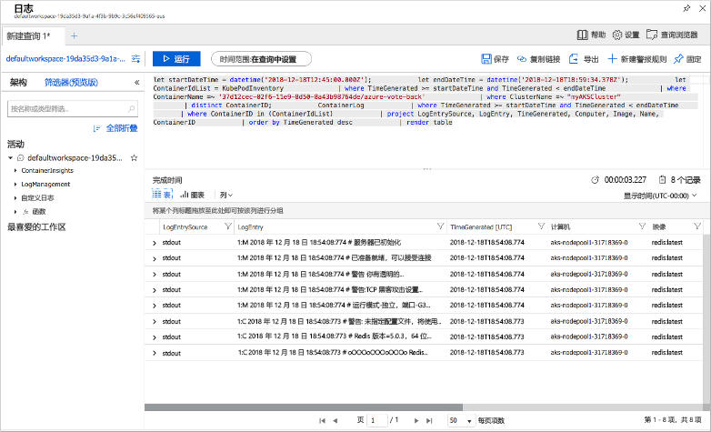

# <a name="quickstart-deploy-an-azure-kubernetes-service-aks-cluster-using-the-azure-cli"></a>快速入门：使用 Azure CLI 部署 Azure Kubernetes 服务 (AKS) 群集

Azure Kubernetes 服务 (AKS) 是可用于快速部署和管理群集的托管式 Kubernetes 服务。 本快速入门介绍如何使用 Azure CLI 部署 AKS 群集。 该群集中将运行一个包含 Web 前端和 Redis 实例的多容器应用程序。 然后，介绍如何监视群集的运行状况，以及监视运行该应用程序的 Pod。


本快速入门假设读者基本了解 Kubernetes 的概念。 有关详细信息，请参阅 [Azure Kubernetes 服务 (AKS) 的 Kubernetes 核心概念][kubernetes-concepts]。

如果没有 Azure 订阅，请在开始之前创建一个[免费帐户](https://azure.microsoft.com/free/?WT.mc_id=A261C142F)。

[!INCLUDE [cloud-shell-try-it.md](../../includes/cloud-shell-try-it.md)]

如果选择在本地安装并使用 CLI，本快速入门要求运行 Azure CLI 2.0.52 或更高版本。 运行 `az --version` 即可查找版本。 如果需要进行安装或升级，请参阅[安装 Azure CLI][azure-cli-install]。

## <a name="create-a-resource-group"></a>创建资源组

Azure 资源组是在其中部署和管理 Azure 资源的逻辑组。 创建资源组时，系统会要求你指定一个位置， 该位置是资源在 Azure 中运行的地方。 使用 [az group create][az-group-create] 命令创建资源组。

以下示例在 *eastus* 位置创建名为 *myAKSCluster* 的资源组。

```azurecli-interactive
az group create --name myResourceGroup --location eastus
```

以下示例输出显示已成功创建资源组：

```json
{
  "id": "/subscriptions/<guid>/resourceGroups/myResourceGroup",
  "location": "eastus",
  "managedBy": null,
  "name": "myResourceGroup",
  "properties": {
    "provisioningState": "Succeeded"
  },
  "tags": null
}
```

## <a name="create-aks-cluster"></a>创建 AKS 群集

使用 [az aks create][az-aks-create] 命令创建 AKS 群集。 以下示例创建一个具有一个节点的名为 myAKSCluster 的群集。 也可通过 *--enable-addons monitoring* 参数启用用于容器的 Azure Monitor。

```azurecli-interactive
az aks create \
    --resource-group myResourceGroup \
    --name myAKSCluster \
    --node-count 1 \
    --enable-addons monitoring \
    --generate-ssh-keys
```

片刻之后，该命令将会完成，并返回有关群集的 JSON 格式信息。

## <a name="connect-to-the-cluster"></a>连接至群集

若要管理 Kubernetes 群集，请使用 Kubernetes 命令行客户端 [kubectl][kubectl]。 如果使用的是 Azure Cloud Shell，则 `kubectl` 已安装。 若要在本地安装 `kubectl`，请使用 [az aks install-cli][az-aks-install-cli] 命令：

```azurecli
az aks install-cli
```

若要将 `kubectl` 配置为连接到 Kubernetes 群集，请使用 [az aks get-credentials][az-aks-get-credentials] 命令。 此命令将下载凭据，并将 Kubernetes CLI 配置为使用这些凭据。

```azurecli-interactive
az aks get-credentials --resource-group myResourceGroup --name myAKSCluster
```

若要验证到群集的连接，请使用 [kubectl get][kubectl-get] 命令返回群集节点的列表。

```azurecli-interactive
kubectl get nodes
```

以下示例输出显示在上一步创建的单个节点。 请确保节点的状态为 *Ready*：

```
NAME                       STATUS   ROLES   AGE     VERSION
aks-nodepool1-31718369-0   Ready    agent   6m44s   v1.9.11
```

## <a name="run-the-application"></a>运行应用程序

Kubernetes 清单文件定义群集的所需状态，例如，要运行哪些容器映像。 在本快速入门中，清单用于创建运行 Azure Vote 应用程序所需的所有对象。 此清单包括两个 [Kubernetes 部署][kubernetes-deployment] - 一个用于 Azure Vote Python 示例应用程序，另一个用于 Redis 实例。 此外，还会创建两个 [Kubernetes 服务][kubernetes-service] - 一个内部服务用于 Redis 实例，一个外部服务用于从 Internet 访问 Azure Vote 应用程序。

> [!TIP]
> 在本快速入门中，请手动创建应用程序清单并将其部署到 AKS 群集。 在更实际的方案中，可以使用 [Azure Dev Spaces][azure-dev-spaces] 直接在 AKS 群集中快速地循环访问代码并对其进行调试。 可以跨 OS 平台和开发环境使用 Dev Spaces，并可与团队中的他人进行协作。

创建名为 `azure-vote.yaml` 的文件，并将其复制到以下 YAML 定义中。 如果使用 Azure Cloud Shell，则可以使用 `vi` 或 `nano` 来创建此文件，就像在虚拟或物理系统中操作一样：

```yaml
apiVersion: apps/v1
kind: Deployment
metadata:
  name: azure-vote-back
spec:
  replicas: 1
  selector:
    matchLabels:
      app: azure-vote-back
  template:
    metadata:
      labels:
        app: azure-vote-back
    spec:
      containers:
      - name: azure-vote-back
        image: redis
        resources:
          requests:
            cpu: 100m
            memory: 128Mi
          limits:
            cpu: 250m
            memory: 256Mi
        ports:
        - containerPort: 6379
          name: redis
---
apiVersion: v1
kind: Service
metadata:
  name: azure-vote-back
spec:
  ports:
  - port: 6379
  selector:
    app: azure-vote-back
---
apiVersion: apps/v1
kind: Deployment
metadata:
  name: azure-vote-front
spec:
  replicas: 1
  selector:
    matchLabels:
      app: azure-vote-front
  template:
    metadata:
      labels:
        app: azure-vote-front
    spec:
      containers:
      - name: azure-vote-front
        image: microsoft/azure-vote-front:v1
        resources:
          requests:
            cpu: 100m
            memory: 128Mi
          limits:
            cpu: 250m
            memory: 256Mi
        ports:
        - containerPort: 80
        env:
        - name: REDIS
          value: "azure-vote-back"
---
apiVersion: v1
kind: Service
metadata:
  name: azure-vote-front
spec:
  type: LoadBalancer
  ports:
  - port: 80
  selector:
    app: azure-vote-front
```

使用 [kubectl apply][kubectl-apply] 命令部署应用程序，并指定 YAML 清单的名称：

```azurecli-interactive
kubectl apply -f azure-vote.yaml
```

以下示例输出显示已成功创建了部署和服务：

```
deployment "azure-vote-back" created
service "azure-vote-back" created
deployment "azure-vote-front" created
service "azure-vote-front" created
```

## <a name="test-the-application"></a>测试应用程序

应用程序运行时，Kubernetes 服务将向 Internet 公开应用程序前端。 此过程可能需要几分钟才能完成。

若要监视进度，请将 [kubectl get service][kubectl-get] 命令与 `--watch` 参数配合使用。

```azurecli-interactive
kubectl get service azure-vote-front --watch
```

最初，*azure-vote-front* 服务的 *EXTERNAL-IP* 显示为 *pending*。

```
NAME               TYPE           CLUSTER-IP   EXTERNAL-IP   PORT(S)        AGE
azure-vote-front   LoadBalancer   10.0.37.27   <pending>     80:30572/TCP   6s
```

当 *EXTERNAL-IP* 地址从 *pending* 更改为实际公共 IP 地址时，请使用 `CTRL-C` 停止 `kubectl` 监视进程。 以下示例输出显示向服务分配了有效的公共 IP 地址：

```
azure-vote-front   LoadBalancer   10.0.37.27   52.179.23.131   80:30572/TCP   2m
```

若要查看 Azure Vote 应用的实际效果，请打开 Web 浏览器并转到服务的外部 IP 地址。


## <a name="monitor-health-and-logs"></a>监视运行状况和日志

创建 AKS 群集时，即已为容器启用了 Azure Monitor 来捕获群集节点和 Pod 的运行状况指标。 Azure 门户提供这些运行状况指标。

若要查看 Azure Vote Pod 的当前状态、运行时间和资源使用情况，请完成以下步骤：

1. 将 Web 浏览器打开到 Azure 门户 [https://portal.azure.com][azure-portal]的位置。
1. 选择资源组（例如 *myResourceGroup*），然后选择 AKS 群集（例如 *myAKSCluster*）。
1. 在左侧的“监视”下，选择“见解”
1. 在顶部，选择“+ 添加筛选器”
1. 选择“命名空间”作为属性，然后选择“\<除 kube-system 之外的所有项\>”
1. 选择查看“容器”。

将显示 *azure-vote-back* 和 *azure-vote-front* 容器，如下面的示例中所示：


若要查看 `azure-vote-front` Pod 的日志，请在容器列表右侧选择“查看容器日志”链接。 这些日志包括容器中的 *stdout* 和 *stderr* 流。



## <a name="delete-cluster"></a>删除群集

如果不再需要群集，可以使用 [az group delete][az-group-delete] 命令删除资源组、容器服务及所有相关资源。

```azurecli-interactive
az group delete --name myResourceGroup --yes --no-wait
```

> [!NOTE]
> 删除群集时，AKS 群集使用的 Azure Active Directory 服务主体不会被删除。 有关如何删除服务主体的步骤，请参阅 [AKS 服务主体的注意事项和删除][sp-delete]。

## <a name="get-the-code"></a>获取代码

本快速入门使用预先创建的容器映像创建了 Kubernetes 部署。 GitHub 上提供了相关的应用程序代码、Dockerfile 和 Kubernetes 清单文件。

[https://github.com/Azure-Samples/azure-voting-app-redis][azure-vote-app]

## <a name="next-steps"></a>后续步骤

在本快速入门中，部署了 Kubernetes 群集，并向该群集部署了多容器应用程序。

若要详细了解 AKS 并演练部署示例的完整代码，请继续阅读“Kubernetes 群集”教程。

> [!div class="nextstepaction"]
> [AKS 教程][aks-tutorial]

<!-- LINKS - external -->
[azure-vote-app]: https://github.com/Azure-Samples/azure-voting-app-redis.git
[kubectl]: https://kubernetes.io/docs/user-guide/kubectl/
[kubectl-apply]: https://kubernetes.io/docs/reference/generated/kubectl/kubectl-commands#apply
[kubectl-get]: https://kubernetes.io/docs/reference/generated/kubectl/kubectl-commands#get
[azure-dev-spaces]: https://docs.microsoft.com/azure/dev-spaces/

<!-- LINKS - internal -->
[kubernetes-concepts]: concepts-clusters-workloads.md
[aks-monitor]: https://aka.ms/coingfonboarding
[aks-tutorial]: ./tutorial-kubernetes-prepare-app.md
[az-aks-browse]: /cli/azure/aks?view=azure-cli-latest#az-aks-browse
[az-aks-create]: /cli/azure/aks?view=azure-cli-latest#az-aks-create
[az-aks-get-credentials]: /cli/azure/aks?view=azure-cli-latest#az-aks-get-credentials
[az-aks-install-cli]: /cli/azure/aks?view=azure-cli-latest#az-aks-install-cli
[az-group-create]: /cli/azure/group#az-group-create
[az-group-delete]: /cli/azure/group#az-group-delete
[azure-cli-install]: /cli/azure/install-azure-cli
[sp-delete]: kubernetes-service-principal.md#additional-considerations
[azure-portal]: https://portal.azure.com
[kubernetes-deployment]: concepts-clusters-workloads.md#deployments-and-yaml-manifests
[kubernetes-service]: concepts-network.md#services
