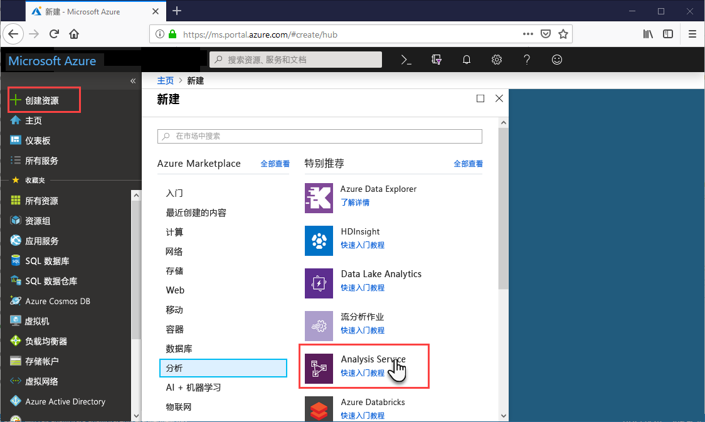

# 在 Azure 门户中创建 Analysis Services 服务器
本文指导如何在 Azure 订阅中创建 Analysis Services 服务器资源。

开始前，需要具备： 

* **Azure 订阅**：访问 [Azure 免费试用版](https://azure.microsoft.com/offers/ms-azr-0044p/)以创建帐户。
* **Azure Active Directory**：订阅必须与 Azure Active Directory 租户相关联。 并且，需要使用 Azure Active Directory 中的一个帐户登录 Azure。 若要了解详细信息，请参阅[身份验证和用户权限](analysis-services-manage-users.md)。

## 登录到 Azure 门户 

登录到 [Azure 门户](https://portal.azure.com)

## 创建服务器

1. 依次单击“+ 创建资源” > “数据 + 分析” > “Analysis Services”。

    

2. 在“Analysis Services”中，填写必填字段，然后按“创建”。
   
    
   
   * **服务器名称**：键入用于引用服务器的唯一名称。
   * **订阅**：选择此服务器要关联到的订阅。
   * **资源组**：创建一个新资源组或选择一个现有资源组。 资源组旨在帮助管理 Azure 资源的集合。 有关详细信息，请参阅[资源组](../azure-resource-manager/resource-group-overview.md)。
   * **位置**：此 Azure 数据中心位置托管该服务器。 选择最接近最大用户群的位置。
   * **定价层**：选择定价层。 如果要进行测试且想要安装示例模型数据库，请选择免费的 D1 层。 若要了解详细信息，请参阅 [Azure Analysis Services 定价](https://azure.microsoft.com/pricing/details/analysis-services/)。 
    * **管理员**：默认情况下，这是用于登录的帐户。 可从 Azure Active Directory 选择其他帐户。
    * **备份存储设置**：可选。 如果已有[存储帐户](../storage/common/storage-introduction.md)，则可将其指定为默认模型数据库备份帐户。 稍后还可指定[备份和还原](analysis-services-backup.md)设置。
    * **存储密钥有效期**：可选。 指定存储密钥的有效期。
3. 单击“创建”。

创建通常不超过一分钟。 如果选择“添加到门户”，请导航到门户查看新服务器。 或者，导航到“所有服务” > “Analysis Services”，查看服务器是否就绪。

## 清理资源
不再需要服务器时，即可将其删除。 单击服务器“概述”中的“删除”。 

 

## 后续步骤

[将示例数据模型添加](analysis-services-create-sample-model.md)到服务器。  
如果数据模型与本地数据源相连，则[安装本地数据网关](analysis-services-gateway-install.md)。  
从 Visual Studio [部署表格模型项目](analysis-services-deploy.md)。   

