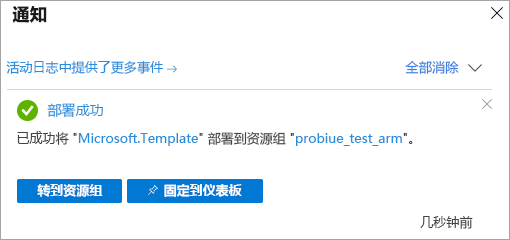

# <a name="quickstart-create-a-server---arm-template"></a>快速入门：创建服务器 - ARM 模板

本快速入门介绍如何使用 Azure 资源管理器模板（ARM 模板）在 Azure 订阅中创建 Analysis Services 服务器资源。

[!INCLUDE [About Azure Resource Manager](../../includes/resource-manager-quickstart-introduction.md)]

如果你的环境满足先决条件，并且你熟悉如何使用 ARM 模板，请选择“部署到 Azure”按钮。 Azure 门户中会打开模板。

[](https://portal.azure.com/#create/Microsoft.Template/uri/https%3A%2F%2Fraw.githubusercontent.com%2FAzure%2Fazure-quickstart-templates%2Fmaster%2F101-analysis-services-create%2Fazuredeploy.json)

## <a name="prerequisites"></a>先决条件

* **Azure 订阅**：访问 [Azure 免费试用版](https://azure.microsoft.com/offers/ms-azr-0044p/)以创建帐户。
* **Azure Active Directory**：订阅必须与 Azure Active Directory 租户相关联。 并且，需要使用 Azure Active Directory 中的一个帐户登录 Azure。 若要了解详细信息，请参阅[身份验证和用户权限](analysis-services-manage-users.md)。

## <a name="review-the-template"></a>查看模板

本快速入门中使用的模板来自 [Azure 快速启动模板](https://azure.microsoft.com/resources/templates/101-analysis-services-create/)。

:::code language="json" source="~/quickstart-templates/101-analysis-services-create/azuredeploy.json":::

该模板中定义了包含防火墙规则的单个 [Microsoft.AnalysisServices/servers](/azure/templates/microsoft.analysisservices/servers) 资源。

## <a name="deploy-the-template"></a>部署模板

1. 选择以下“部署到 Azure”链接，登录到 Azure 并打开一个模板。 此模板用来创建 Analysis Services 服务器资源，并指定必需属性和可选属性。

   [](https://portal.azure.com/#create/Microsoft.Template/uri/https%3A%2F%2Fraw.githubusercontent.com%2FAzure%2Fazure-quickstart-templates%2Fmaster%2F101-analysis-services-create%2Fazuredeploy.json)

2. 选择或输入以下值。

    除非另行指定，否则请使用默认值。

    * 订阅：选择 Azure 订阅。
    * 资源组：单击“新建”，然后为新资源组输入唯一名称。
    * 位置：为在资源组中创建的资源选择一个默认位置。
    * **服务器名称**：为服务器资源输入一个名称。 
    * 位置：对于 Analysis Services，请忽略此项。 位置在“服务器位置”中指定。
    * **服务器位置**：输入 Analysis Services 服务器的位置。 这通常是为资源组指定的默认位置所在的区域，但不是必需的。 例如“美国中北部”。 有关支持的区域，请参阅 [Analysis Services 可用性（按区域）](analysis-services-overview.md#availability-by-region)。
    * **Sku 名称**：输入要创建的 Analysis Services 服务器的 Sku 名称。 从下列项中进行选择：B1、B2、D1、S0、S1、S2、S3、S4、S8v2、S9v2。 Sku 可用性取决于区域。 对于评估和测试，建议使用 S0 或 D1。
    * **容量**：输入查询副本横向扩展实例的总数。 只有一些特选区域支持横向扩展多个实例。
    * **防火墙设置**：输入要为服务器定义的入站防火墙规则。 在未指定此项的情况下，会禁用防火墙。
    * **备份 Blob 容器 URI**：输入具有读取、写入和列出权限的专用 Azure Blob 存储容器的 SAS URI。 只有在打算使用[备份/还原](analysis-services-backup.md)的情况下，此项才是必需项。
    * **我同意上述条款和条件**：选中。

3. 选择“购买”。 成功部署服务器后，你会收到通知：

   

## <a name="validate-the-deployment"></a>验证部署

使用 Azure 门户或 Azure PowerShell 来验证资源组和服务器资源是否已创建。

### <a name="powershell"></a>PowerShell

```azurepowershell-interactive
$resourceGroupName = Read-Host -Prompt "Enter the Resource Group name"
(Get-AzResource -ResourceType "Microsoft.AnalysisServices/servers" -ResourceGroupName $resourceGroupName).Name
 Write-Host "Press [ENTER] to continue..."
```

---

## <a name="clean-up-resources"></a>清理资源

如果不再需要资源组和服务器资源，请使用 Azure 门户、Azure CLI 或 Azure PowerShell 将其删除。

# <a name="cli"></a>[CLI](#tab/CLI)

```azurecli-interactive
echo "Enter the Resource Group name:" &&
read resourceGroupName &&
az group delete --name $resourceGroupName &&
echo "Press [ENTER] to continue ..."
```

# <a name="powershell"></a>[PowerShell](#tab/PowerShell)

```azurepowershell-interactive
$resourceGroupName = Read-Host -Prompt "Enter the Resource Group name"
Remove-AzResourceGroup -Name $resourceGroupName
Write-Host "Press [ENTER] to continue..."
```

---

## <a name="next-steps"></a>后续步骤

在本快速入门中，你已使用 ARM 模板创建了新的资源组和 Azure Analysis Services 服务器资源。 在使用模板创建服务器资源后，请考虑执行以下操作：

> [!div class="nextstepaction"]
> [快速入门：配置服务器防火墙 - 门户](analysis-services-qs-firewall.md)   
