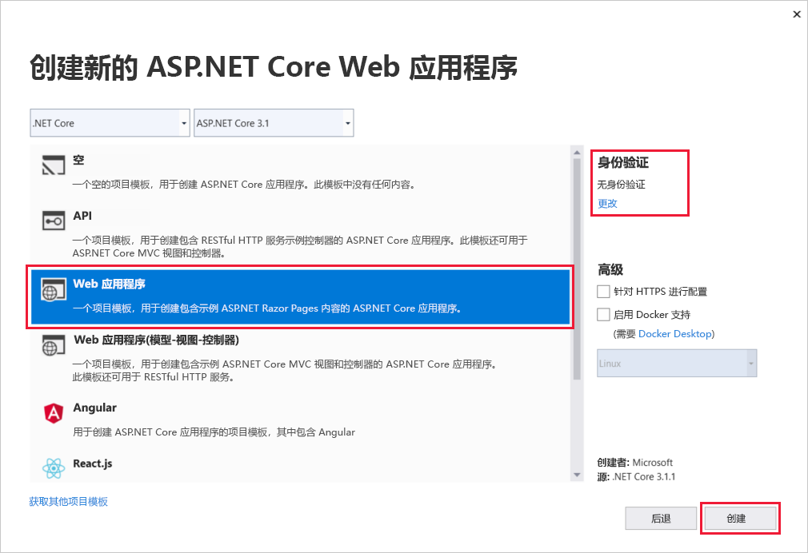
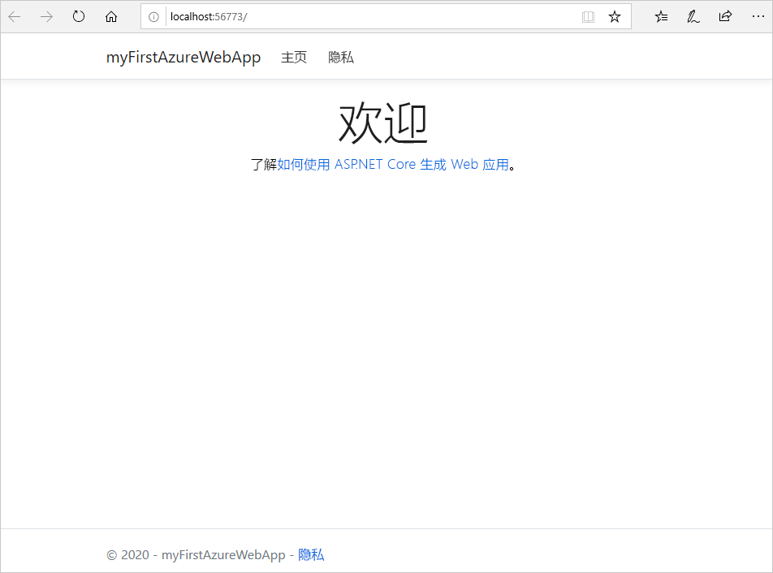
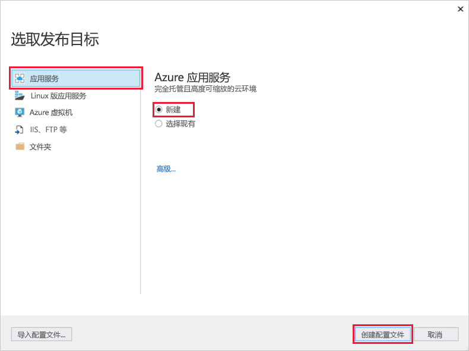
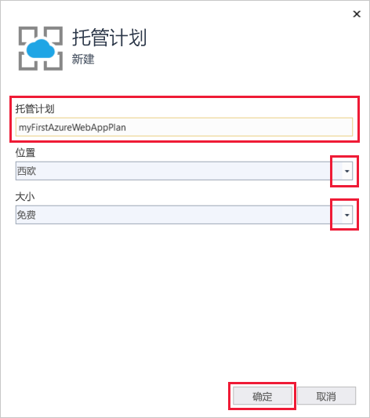
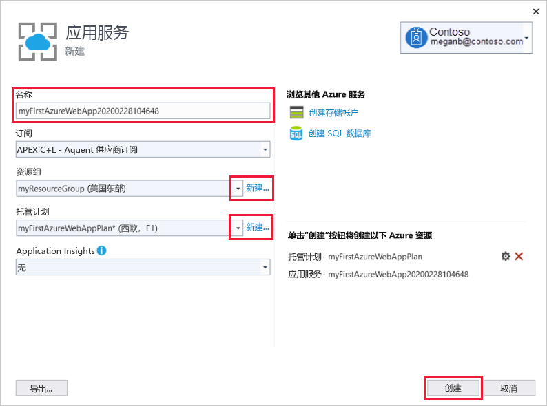
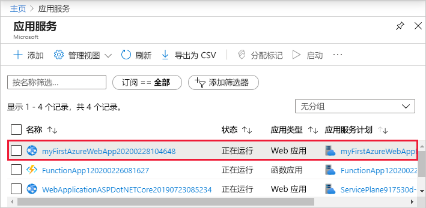
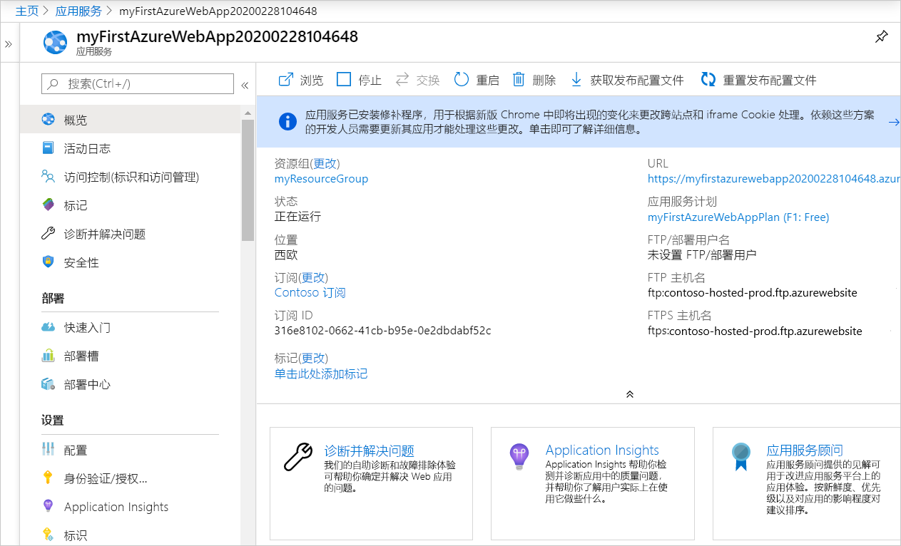

# <a name="quickstart-create-an-aspnet-core-web-app-in-azure"></a>快速入门：在 Azure 中创建 ASP.NET Core Web 应用

本快速入门介绍如何创建第一个 ASP.NET Core Web 应用并将其部署到 [Azure 应用服务](overview.md)。 

完成后，你将获得一个 Azure 资源组，其中包含一个应用服务托管计划，以及一个部署了 Web 应用程序的应用服务。

## <a name="prerequisites"></a>先决条件

- 具有活动订阅的 Azure 帐户。 [免费创建帐户](https://azure.microsoft.com/free/dotnet/)。
- 本快速入门将应用部署到 Windows 上的应用服务。 若要部署到基于 _Linux_ 的应用服务，请参阅[在基于 Linux 的应用服务中创建 .NET Core Web 应用](./containers/quickstart-dotnetcore.md)。
- 安装带有 ASP.NET 和 Web 开发  工作负荷的 <a href="https://www.visualstudio.com/downloads/" target="_blank">Visual Studio 2019</a>。

  如果已安装 Visual Studio 2019：

  - 通过选择“帮助”   >   “检查更新”，在 Visual Studio 中安装最新更新。
  - 通过选择“工具”   >   “获取工具和功能”，添加工作负荷。


## <a name="create-an-aspnet-core-web-app"></a>创建一个 ASP.NET Core Web 应用

遵循以下步骤在 Visual Studio 中创建 ASP.NET Core Web 应用：

1. 打开 Visual Studio 并选择“创建新项目”  。

1. 在“创建新项目”中选择“ASP.NET Core Web 应用程序”，确认“C#”列在所选内容的语言中，然后选择“下一步”。    

1. 在“配置新项目”中，将 Web 应用程序项目命名为 *myFirstAzureWebApp*，然后选择“创建”。  

   

1. 可将任何类型的 ASP.NET Core Web 应用部署到 Azure，但对于本快速入门，请选择“Web 应用程序”模板。  确保“身份验证”设置为“无身份验证”，并且未选择其他选项。   然后选择“创建”  。

    
   
1. 在 Visual Studio 菜单中，选择“调试” > “开始执行(不调试)”以在本地运行 Web 应用。  

   

## <a name="publish-your-web-app"></a>发布 Web 应用

若要发布 Web 应用，必须先创建并配置一个可将应用发布到的新应用服务。 

在设置应用服务的过程中，将会创建：

- 一个新的[资源组](https://docs.microsoft.com/azure/azure-resource-manager/management/overview#terminology)，用于包含该服务的所有 Azure 资源。
- 一个新的[托管计划](https://docs.microsoft.com/azure/app-service/overview-hosting-plans)，用于指定托管应用的 Web 服务器场的位置、大小和功能。

遵循以下步骤创建应用服务并发布 Web 应用：

1. 在“解决方案资源管理器”  中右键单击“myFirstAzureWebApp”  项目，然后选择“发布”  。 如果你尚未从 Visual Studio 登录到 Azure 帐户，请选择“添加帐户”或“登录”。   也可以创建免费 Azure 帐户。

1. 在“选择发布目标”对话框中，依次选择“应用服务”、“新建”、“创建配置文件”。    

   

1. 在“应用服务:  新建”对话框中为应用提供全局唯一的**名称**，可以接受默认名称，也可以输入新名称。 有效字符为：`a-z`、`A-Z`、`0-9` 和 `-`。 此**名称**用作 Web 应用的 URL 前缀，采用 `http://<app_name>.azurewebsites.net` 格式。

1. 对于“订阅”，请接受列出的订阅，或从下拉列表中选择一个新订阅。 

1. 在“资源组”中选择“新建”。   在“新资源组名称”  中，输入“myResourceGroup”  并选择“确定”  。 

1. 对于“托管计划”，请选择“新建”。   

1. 在“托管计划:  新建”对话框中，输入下表中指定的值：

   | 设置  | 建议的值 | 说明 |
   | -------- | --------------- | ----------- |
   | **托管计划**  | *myFirstAzureWebAppPlan* | 应用服务计划的名称。 |
   | **位置**      | “西欧”  | 托管 Web 应用的数据中心。 |
   | **大小**          | *免费* | [定价层](https://azure.microsoft.com/pricing/details/app-service/?ref=microsoft.com&utm_source=microsoft.com&utm_medium=docs&utm_campaign=visualstudio)确定托管功能。 |
   
   

1. 将“Application Insights”保留设置为“无”。  

1. 在“应用服务:  新建”对话框中，选择“创建”开始创建 Azure 资源。 

   

1. 完成向导中的操作后，选择“发布”。 

   

   Visual Studio 会将 ASP.NET Core Web 应用发布到 Azure，并在默认浏览器中启动该应用。 

   

祝贺你！  你的 ASP.NET Core Web 应用已在 Azure 应用服务中实时运行！

## <a name="update-the-app-and-redeploy"></a>更新应用并重新部署

遵循以下步骤更新并重新部署 Web 应用：

1. 在**解决方案资源管理器**中你的项目下，打开  “页” > “Index.cshtml”  。

1. 将两个 `<div>` 标记替换为以下代码：

   ```HTML
   <div class="jumbotron">
       <h1>ASP.NET in Azure!</h1>
       <p class="lead">This is a simple app that we've built that demonstrates how to deploy a .NET app to Azure App Service.</p>
   </div>
   ```

1. 若要重新部署到 Azure，请在“解决方案资源管理器”  中右键单击“myFirstAzureWebApp”  项目，然后选择“发布”  。

1. 在“发布”摘要页中选择“发布”   。

   

发布完成后，Visual Studio 将启动浏览器并转到 Web 应用的 URL。


## <a name="manage-the-azure-app"></a>管理 Azure 应用

若要管理 Web 应用，请转到 [Azure 门户](https://portal.azure.com)，然后搜索并选择“应用服务”。 


在“应用服务”页上，选择 Web 应用的名称  。



Web 应用的“概述”页包含用于基本管理（例如浏览、停止、启动、重启和删除）的选项。  左侧菜单提供用于配置应用的更多页面。



[!INCLUDE [Clean-up section](../../includes/clean-up-section-portal.md)]

## <a name="next-steps"></a>后续步骤

在本快速入门中，你已使用 Visual Studio 创建了一个 ASP.NET Core Web 应用，并已将其部署到 Azure 应用服务。

请继续学习下一篇文章，了解如何创建 .NET Core 应用并将其连接到 SQL 数据库：

> [!div class="nextstepaction"]
> [将 ASP.NET Core 与 SQL 数据库配合使用](app-service-web-tutorial-dotnetcore-sqldb.md)
