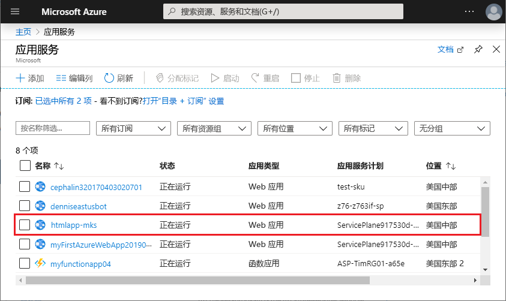
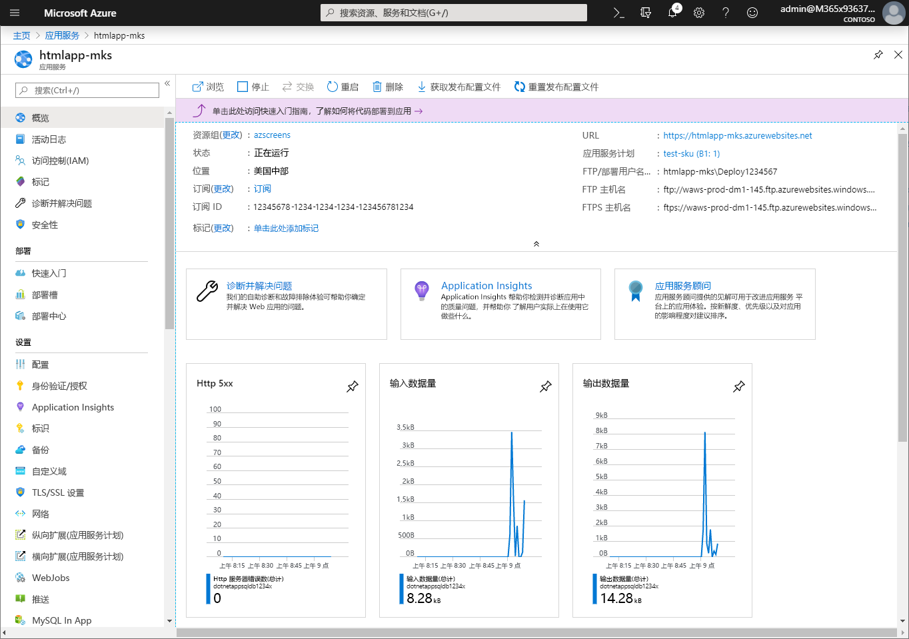

# <a name="create-a-static-html-web-app-in-azure"></a>在 Azure 中创建静态 HTML Web 应用

[Azure Web 应用](app-service-web-overview.md)提供高度可缩放、自修补的 Web 托管服务。 本快速入门教程演示如何将基本 HTML+CSS 站点部署到 Azure Web 应用。 你将在 [Cloud Shell](https://docs.microsoft.com/azure/cloud-shell/overview) 中完成本快速入门，但是也可以使用 [Azure CLI](/cli/azure/install-azure-cli) 在本地运行这些命令。


[!INCLUDE [quickstarts-free-trial-note](../../includes/quickstarts-free-trial-note.md)]

[!INCLUDE [cloud-shell-try-it.md](../../includes/cloud-shell-try-it.md)]

## <a name="install-web-app-extension-for-cloud-shell"></a>安装 Cloud Shell 的 Web 应用扩展

若要完成本快速入门，需要添加 [az Web 应用扩展](https://docs.microsoft.com/cli/azure/extension?view=azure-cli-latest#az-extension-add)。 如果该扩展已安装，则应将其更新为最新版本。 若要更新该 Web 应用扩展，请键入 `az extension update -n webapp`。

若要安装该 Web 应用扩展，请运行以下命令：

```bash
az extension add --name webapp
```

安装该扩展后，Cloud Shell 会显示类似于以下示例的信息：

```bash
The installed extension 'webapp' is in preview.
```

## <a name="download-the-sample"></a>下载示例

在 Cloud Shell 中，创建一个 quickstart 目录，然后切换到该目录。

```bash
mkdir quickstart

cd quickstart
```

接下来请运行以下命令，将示例应用存储库克隆到快速入门目录。

```bash
git clone https://github.com/Azure-Samples/html-docs-hello-world.git
```

## <a name="create-a-web-app"></a>创建 Web 应用

切换到包含示例代码的目录并运行 `az webapp up` 命令。

在以下示例中，请将 <app_name> 替换为一个唯一的应用名称。

```bash
cd html-docs-hello-world

az webapp up --location westeurope --name <app_name>
```

`az webapp up` 命令执行以下操作：

- 创建一个默认的资源组。

- 创建一个默认的应用服务计划。

- 创建一个采用指定名称的应用。

- [使用 Zip](https://docs.microsoft.com/azure/app-service/app-service-deploy-zip) 将文件从当前工作目录部署到 Web 应用。

此命令可能需要花费几分钟时间运行。 运行时，该命令会显示类似于以下示例的信息：

```json
{
  "app_url": "https://<app_name>.azurewebsites.net",
  "location": "westeurope",
  "name": "<app_name>",
  "os": "Windows",
  "resourcegroup": "appsvc_rg_Windows_westeurope",
  "serverfarm": "appsvc_asp_Windows_westeurope",
  "sku": "FREE",
  "src_path": "/home/<username>/quickstart/html-docs-hello-world ",
  < JSON data removed for brevity. >
}
```

记下 `resourceGroup` 值。 需要在[清理资源](#clean-up-resources)部分使用它。

## <a name="browse-to-the-app"></a>浏览到应用

在浏览器中转到 Azure Web 应用 URL：`http://<app_name>.azurewebsites.net`。

该页作为 Azure 应用服务 Web 应用运行。


祝贺你！ 现已将第一个 HTML 应用部署到应用服务。

## <a name="update-and-redeploy-the-app"></a>更新并重新部署应用

在 Cloud Shell 中，键入 `nano index.html` 以打开 nano 文本编辑器。 在 `<h1>` 标题标记中，将“Azure 应用服务 - 示例静态 HTML 站点”更改为“Azure 应用服务”，如下所示。


保存更改并退出 nano。 使用命令 `^O` 来保存，使用 `^X` 来退出。

现在，需使用同一 `az webapp up` 命令重新部署应用。

```bash
az webapp up --location westeurope --name <app_name>
```

完成部署后，切换回**浏览到应用**步骤中打开的浏览器窗口，然后刷新页面。


## <a name="manage-your-new-azure-web-app"></a>管理新 Azure Web 应用

转到 <a href="https://portal.azure.com" target="_blank">Azure 门户</a>管理创建的 Web 应用。

在左侧菜单中单击“应用服务”，然后单击 Azure Web 应用的名称。



这里我们可以看到 Web 应用的概述页。 并可以执行基本的管理任务，例如浏览、停止、启动、重新启动和删除。



左侧菜单提供了用于配置应用的不同页面。

## <a name="clean-up-resources"></a>清理资源

在前面的步骤中，你在资源组中创建了 Azure 资源。 如果认为将来不需要这些资源，请在 Cloud Shell 中运行以下命令，以便删除资源组。 请记住，资源组名称已在[创建 Web 应用](#create-a-web-app)步骤中自动为你生成。

```bash
az group delete --name appsvc_rg_Windows_westeurope
```

此命令可能需要花费一分钟时间运行。

## <a name="next-steps"></a>后续步骤

> [!div class="nextstepaction"]
> [映射自定义域](app-service-web-tutorial-custom-domain.md)
