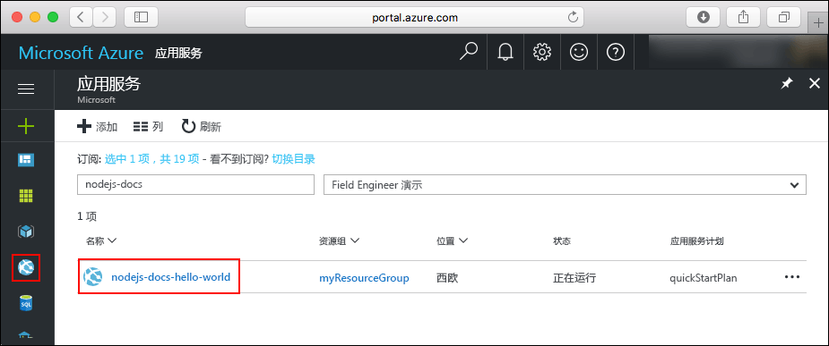

# <a name="create-a-nodejs-web-app-in-azure"></a>在 Azure 中创建 Node.js Web 应用

> [!NOTE]
> 本文将应用部署到基于 Windows 的应用服务。 若要部署到基于 _Linux_ 的应用服务，请参阅[在基于 Linux 的 Azure 应用服务中创建 Node.js Web 应用](./containers/quickstart-nodejs.md)。
>

[Azure Web 应用](app-service-web-overview.md)提供高度可缩放、自修补的 Web 托管服务。  本快速入门演示如何将 Node.js 应用部署到 Azure Web 应用中。 使用 [Azure CLI](https://docs.microsoft.com/cli/azure/get-started-with-azure-cli) 创建 Web 应用，并使用 Git 将 Node.js 代码示例部署到 Web 应用。


可以在 Mac、Windows 或 Linux 计算机上执行此处的步骤。 安装先决条件后，大约需要五分钟完成这些步骤。   

> [!VIDEO https://channel9.msdn.com/Shows/Azure-for-Node-Developers/Create-a-Nodejs-app-in-Azure-Quickstart/player]   


## <a name="prerequisites"></a>先决条件

完成本快速入门教程：

* <a href="https://nodejs.org/" target="_blank">安装 Node.js 和 NPM</a>

[!INCLUDE [quickstarts-free-trial-note](../../includes/quickstarts-free-trial-note.md)]

## <a name="download-the-sample"></a>下载示例

从 [https://github.com/Azure-Samples/nodejs-docs-hello-world/archive/master.zip](https://github.com/Azure-Samples/nodejs-docs-hello-world/archive/master.zip) 下载示例性的 Node.js 项目，然后解压缩 ZIP 存档。

在终端窗口中，导航到示例性 Node.js 项目的根目录（包含 _index.js_ 的目录）。

## <a name="run-the-app-locally"></a>在本地运行应用

打开一个终端窗口并使用 `npm start` 脚本启动内置的 Node.js HTTP 服务器，以在本地运行应用程序。

```bash
npm start
```

打开 Web 浏览器并导航到 `http://localhost:1337` 处的示例应用。

页面中会显示该示例应用发出的 Hello World 消息。


在终端窗口中，按 **Ctrl+C** 退出 Web 服务器。

[!INCLUDE [Create ZIP file](../../includes/app-service-web-create-zip.md)]

[!INCLUDE [cloud-shell-try-it.md](../../includes/cloud-shell-try-it.md)]

[!INCLUDE [Upload zip file](../../includes/app-service-web-upload-zip.md)]

[!INCLUDE [Create resource group](../../includes/app-service-web-create-resource-group.md)] 

[!INCLUDE [Create app service plan](../../includes/app-service-web-create-app-service-plan.md)] 

## <a name="create-a-web-app"></a>创建 Web 应用

在 Cloud Shell 中，使用 [az webapp create](/cli/azure/webapp?view=azure-cli-latest#az_webapp_create) 命令在 `myAppServicePlan` 应用服务计划中创建一个 Web 应用。 

在以下示例中，将 `<app_name>` 替换为全局唯一的应用名称（有效字符是 `a-z`、`0-9` 和 `-`）。 运行时设置为 `NODE|6.9`。 若要查看所有受支持的运行时，请运行 [az webapp list-runtimes](/cli/azure/webapp?view=azure-cli-latest#az_webapp_list_runtimes)。 

```azurecli-interactive
az webapp create --resource-group myResourceGroup --plan myAppServicePlan --name <app_name> --runtime "NODE|6.9"
```

创建 Web 应用后，Azure CLI 会显示类似于以下示例的输出：

```json
{
  "availabilityState": "Normal",
  "clientAffinityEnabled": true,
  "clientCertEnabled": false,
  "cloningInfo": null,
  "containerSize": 0,
  "dailyMemoryTimeQuota": 0,
  "defaultHostName": "<app_name>.azurewebsites.net",
  "enabled": true,
  < JSON data removed for brevity. >
}
```

浏览到新建的 Web 应用。 将 _&lt;应用名称>_ 替换为唯一的应用名称。

```bash
http://<app name>.azurewebsites.net
```


[!INCLUDE [Deploy uploaded ZIP file](../../includes/app-service-web-deploy-zip.md)]

## <a name="browse-to-the-app"></a>浏览到应用

使用 Web 浏览器浏览到已部署的应用程序。

```bash
http://<app_name>.azurewebsites.net
```

Node.js 示例代码在 Azure 应用服务 Web 应用中运行。


**祝贺你！** 现已将第一个 Node.js 应用部署到应用服务。

## <a name="update-and-redeploy-the-code"></a>更新并重新部署代码

使用文本编辑器在 Node.js 应用中打开 `index.js` 文件，然后对 `response.end` 调用中的文本稍微进行更改：

```nodejs
response.end("Hello Azure!");
```

在本地终端窗口中，导航到应用程序的根目录，为更新的项目创建新的 ZIP 文件。

```
# Bash
zip -r myUpdatedAppFiles.zip .

# PowerShell
Compress-Archive -Path * -DestinationPath myUpdatedAppFiles.zip
``` 

将此新的 ZIP 文件上传到 Cloud Shell，使用的步骤与[上传 ZIP 文件](#upload-the-zip-file)中的相同。

然后在 Cloud Shell 中再次部署上传的 ZIP 文件。

```azurecli-interactive
az webapp deployment source config-zip --resource-group myResouceGroup --name <app_name> --src clouddrive/myUpdatedAppFiles.zip
```

切换回在“浏览到应用”步骤中打开的浏览器窗口，然后刷新页面。


## <a name="manage-your-new-azure-web-app"></a>管理新 Azure Web 应用

转到 <a href="https://portal.azure.com" target="_blank">Azure 门户</a>管理创建的 Web 应用。

在左侧菜单中单击“应用服务”，然后单击 Azure Web 应用的名称。



将看到 Web 应用的概述页。 在此处可以执行基本的管理任务，例如浏览、停止、启动、重新启动和删除。 


左侧菜单提供用于配置应用的不同页面。 

[!INCLUDE [cli-samples-clean-up](../../includes/cli-samples-clean-up.md)]

## <a name="next-steps"></a>后续步骤

> [!div class="nextstepaction"]
> [将 Node.js 与 MongoDB 配合使用](app-service-web-tutorial-nodejs-mongodb-app.md)
