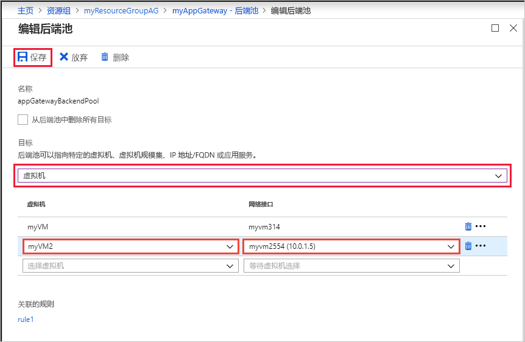

# <a name="tutorial-create-an-application-gateway-with-a-web-application-firewall-using-the-azure-portal"></a>教程：使用 Azure 门户创建具有 Web 应用程序防火墙的应用程序网关

本教程演示如何使用 Azure 门户创建具有 [Web 应用程序防火墙](application-gateway-web-application-firewall-overview.md) (WAF) 的[应用程序网关](application-gateway-introduction.md)。 WAF 使用 [OWASP](https://www.owasp.org/index.php/Category:OWASP_ModSecurity_Core_Rule_Set_Project) 规则保护应用程序。 这些规则包括针对各种攻击（例如 SQL 注入、跨站点脚本攻击和会话劫持）的保护。 创建应用程序网关后，请测试该网关以确保其正常运行。 使用 Azure 应用程序网关，可以为端口分配侦听器、创建规则以及向后端池添加资源，以便将应用程序 Web 流量定向到特定资源。 为简单起见，本教程使用了带有公共前端 IP 的简单设置、在此应用程序网关上托管单个站点的基本侦听器、用于后端池的两台虚拟机以及基本请求传递规则。

本教程介绍如何执行下列操作：

> [!div class="checklist"]
> * 创建启用 WAF 的应用程序网关
> * 创建用作后端服务器的虚拟机
> * 创建存储帐户和配置诊断
> * 测试应用程序网关


[!INCLUDE [updated-for-az](../../includes/updated-for-az.md)]

如果你愿意，可以使用 [Azure PowerShell](tutorial-restrict-web-traffic-powershell.md) 或 [Azure CLI](tutorial-restrict-web-traffic-cli.md) 完成本教程中的步骤。

如果没有 Azure 订阅，请在开始之前创建一个[免费帐户](https://azure.microsoft.com/free/?WT.mc_id=A261C142F)。

## <a name="sign-in-to-azure"></a>登录 Azure

通过 [https://portal.azure.com](https://portal.azure.com) 登录到 Azure 门户

## <a name="create-an-application-gateway"></a>创建应用程序网关

Azure 需要一个虚拟网络才能在资源之间通信。 可以创建新的虚拟网络，也可以使用现有的虚拟网络。 本示例将创建新的虚拟网络。 可以在创建应用程序网关的同时创建虚拟网络。 在不同的子网中创建应用程序网关实例。 在本示例中创建两个子网：一个用于应用程序网关，另一个用于后端服务器。

选择 Azure 门户左侧菜单上的“创建资源”  。 此时会显示“新建”窗口。 

选择“网络”  ，然后在“特色”列表中选择“应用程序网关”   。

### <a name="basics-page"></a>“基本信息”页面

1. 在“基本信息”页上，输入这些值作为以下应用程序网关设置： 
   - **名称**：输入 *myAppGateway* 作为应用程序网关的名称。
   - **资源组**：选择 **myResourceGroupAG** 作为资源组。 如果该资源组不存在，请选择“新建”，创建一个新的  。
   - 选择 WAF 作为应用程序网关的层  。

接受其他设置的默认值，然后单击“确定”  。

### <a name="settings-page"></a>“设置”页

1. 在“设置”  页的“子网配置”  下，选择“选择虚拟网络”  。 <br>
2. 在“选择虚拟网络”页上，选择“新建”，然后为以下虚拟网络设置输入相应值：  
   - **名称**：输入 *myVNet* 作为虚拟网络的名称。
   - **地址空间**：输入 *10.0.0.0/16* 作为虚拟网络地址空间。
   - **子网名称**：输入 *myAGSubnet* 作为子网名称。<br>应用程序网关子网只能包含应用程序网关。 不允许其他资源。
   - **子网地址范围**：输入 10.0.0.0/24 作为子网地址范围  。
3. 单击“确定”  创建虚拟网络和子网。
4. 选择“前端 IP 配置”  。 在“前端 IP 配置”  下，验证“IP 地址类型”  是否设置为“公共”  。 在“公共 IP 地址”下，  验证是否已选择“新建”  。 <br>可以根据用例将前端 IP 配置为公共或专用。 在此处选择公共前端 IP。
5. 输入 *myAGPublicIPAddress* 作为公共 IP 地址名称。
6. 接受其他设置的默认值，然后选择“确定”  。<br>为简单起见，在本教程中选择默认值，但可以根据用例为其他设置配置自定义值。

### <a name="summary-page"></a>“摘要”页

复查摘要页上的设置，然后选择“确定”   以创建虚拟网络、公共 IP 地址和应用程序网关。 Azure 可能需要数分钟时间来创建应用程序网关。 请等待部署成功完成，然后再前进到下一部分。

## <a name="add-backend-pool"></a>添加后端池

后端池用于将请求传递到为请求提供服务的后端服务器。 后端池可以具有 NIC、虚拟机规模集、公共 IP、内部 IP、完全限定的域名 (FQDN) 和多租户后端（例如 Azure 应用服务）。 将后端目标添加到后端池。

本示例将使用虚拟机作为目标后端。 可以使用现有的虚拟机，或创建新的虚拟机。 在此处，创建两台虚拟机，供 Azure 用作应用程序网关的后端服务器。 为此，请执行以下操作：

1. 创建新的子网 myBackendSubnet，将在其中创建新的 VM  。 
2. 创建两个新的 VM（myVM 和 myVM2），用作后端服务器   。
3. 可以在虚拟机上安装 IIS，以验证是否已成功创建了应用程序网关。
4. 将后端服务器添加到后端池。

### <a name="add-a-subnet"></a>添加子网

按以下步骤将子网添加到已创建的虚拟网络：

1. 在 Azure 门户的左侧菜单上选择“所有资源”，在搜索框中输入 *myVNet*，然后从搜索结果中选择 **myVNet**。 

2. 从左侧菜单选择“子网”  ，然后选择“+ 子网”。  

   

3. 在“添加子网”页中输入 *myBackendSubnet* 作为子网的**名称**，然后选择“确定”。  

### <a name="create-a-virtual-machine"></a>创建虚拟机

1. 在 Azure 门户中，选择“创建资源”。  此时会显示“新建”窗口。 
2. 选择“计算”，然后在“特色”列表中选择“Windows Server 2016 Datacenter”。    此时会显示“创建虚拟机”页。 <br>应用程序网关可以将流量路由到其后端池中使用的任何类型的虚拟机。 在此示例中，可以使用 Windows Server 2016 Datacenter。
3. 对于以下虚拟机设置，请在“基本信息”选项卡中输入相应值： 
   - **资源组**：选择 **myResourceGroupAG** 作为资源组名称。
   - **虚拟机名称**：输入 *myVM* 作为虚拟机的名称。
   - **用户名**：输入 *azureuser* 作为管理员用户名。
   - **密码**：输入 *Azure123456!* 作为管理员密码。
4. 接受其他默认值，然后选择“下一步:**磁盘”** 。  
5. 接受“磁盘”  选项卡的默认值，然后选择“下一步:**网络”  。
6. 在“网络”  选项卡上，验证是否已选择 **myVNet** 作为**虚拟网络**，以及是否已将“子网”  设置为 **myBackendSubnet**。 接受其他默认值，然后选择“下一步:**管理”** 。<br>应用程序网关可与其所在的虚拟网络外部的实例进行通信，但需要确保已建立 IP 连接。
7. 在“管理”  选项卡上，将“启动诊断”  设置为“关闭”。  接受其他默认值，然后选择“复查 + 创建”。 
8. 在“复查 + 创建”选项卡上复查设置，更正任何验证错误，然后选择“创建”。  
9. 等待虚拟机创建完成，然后再继续操作。

### <a name="install-iis-for-testing"></a>安装 IIS 进行测试

本示例在虚拟机上安装 IIS，只为验证 Azure 是否已成功创建应用程序网关。 

1. 打开 [Azure PowerShell](https://docs.microsoft.com/azure/cloud-shell/quickstart-powershell)。 为此，请在 Azure 门户的顶部导航栏中选择“Cloud Shell”，然后从下拉列表中选择“PowerShell”。   

   

2. 运行以下命令以在虚拟机上安装 IIS： 

   ```azurepowershell-interactive
   Set-AzVMExtension `
     -ResourceGroupName myResourceGroupAG `
     -ExtensionName IIS `
     -VMName myVM `
     -Publisher Microsoft.Compute `
     -ExtensionType CustomScriptExtension `
     -TypeHandlerVersion 1.4 `
     -SettingString '{"commandToExecute":"powershell Add-WindowsFeature Web-Server; powershell Add-Content -Path \"C:\\inetpub\\wwwroot\\Default.htm\" -Value $($env:computername)"}' `
     -Location EastUS
   ```

3. 使用以前完成的步骤创建第二个虚拟机并安装 IIS。 使用 *myVM2* 作为虚拟机名称，以及作为 **Set-AzVMExtension** cmdlet 的 **VMName** 设置。

### <a name="add-backend-servers-to-backend-pool"></a>将后端服务器添加到后端池

1. 选择“所有资源”，然后选择“myAppGateway”。  

2. 从左侧菜单中选择“后端池”。  当你创建应用程序网关时，Azure 自动创建了默认池 **appGatewayBackendPool**。 

3. 选择“appGatewayBackendPool”  。

4. 在“目标”  下，从下拉列表中选择“虚拟机”。 

5. 在“虚拟机”和“网络接口”   下，从下拉列表中选择 **myVM** 和 **myVM2** 虚拟机及其关联的网络接口。

   

6. 选择“保存”。 

## <a name="create-a-storage-account-and-configure-diagnostics"></a>创建存储帐户和配置诊断

### <a name="create-a-storage-account"></a>创建存储帐户

在本教程中，应用程序网关使用存储帐户来存储用于检测和防范目的的数据。 也可以使用 Azure Monitor 日志或事件中心来记录数据。

1. 单击 Azure 门户左上角的“新建”。 
2. 选择“存储”，然后选择“存储帐户 - blob、文件、表、队列”   。
3. 输入存储帐户的名称，对于资源组选择“使用现有资源组”  ，然后选择 **myResourceGroupAG**。 在此示例中，存储帐户名称是 *myagstore1*。 接受其他设置的默认值，然后单击“创建”  。

### <a name="configure-diagnostics"></a>配置诊断

配置诊断以将数据记录到 ApplicationGatewayAccessLog、ApplicationGatewayPerformanceLog 和 ApplicationGatewayFirewallLog 日志中。

1. 在左侧菜单中，单击“所有资源”  ，然后选择 *myAppGateway*。
2. 在“监视”下面，单击“诊断日志”。 
3. 单击“添加诊断设置”  。
4. 输入 *myDiagnosticsSettings* 作为诊断设置的名称。
5. 选择“存档到存储帐户”  ，然后单击“配置”  以选择前面创建的 *myagstore1* 存储帐户。
6. 选择要收集和保留的应用程序网关日志。
7. 单击“ **保存**”。

    

## <a name="test-the-application-gateway"></a>测试应用程序网关

虽然不需 IIS 即可创建应用程序网关，但本快速入门中安装了它，用来验证 Azure 是否已成功创建应用程序网关。 使用 IIS 测试应用程序网关：

1. 在“概述”页面上查找应用程序网关的公共 IP 地址或者，可以选择“所有资源”，在搜索框中输入“myAGPublicIPAddress”，然后在搜索结果中选择该地址    。 Azure 会在“概览”页上显示公共 IP 地址。 
2. 复制该公共 IP 地址，并将其粘贴到浏览器的地址栏。
3. 检查响应。 有效响应验证应用程序网关是否已成功创建，以及是否能够成功连接后端。

## <a name="clean-up-resources"></a>清理资源

如果不再需要通过应用程序网关创建的资源，请删除资源组。 删除资源组时，也会删除应用程序网关和及其所有的相关资源。 

若要删除资源组，请执行以下操作：

1. 在 Azure 门户的左侧菜单上选择“资源组”  。
2. 在“资源组”页的列表中搜索“myResourceGroupAG”，然后将其选中。  
3. 在“资源组”页上，选择“删除资源组”   。
4. 在“键入资源组名称”字段中输入“myResourceGroupAG”，然后选择“删除”   

## <a name="next-steps"></a>后续步骤

> [!div class="nextstepaction"]
> [详细了解 Azure 应用程序网关的作用](application-gateway-introduction.md)
