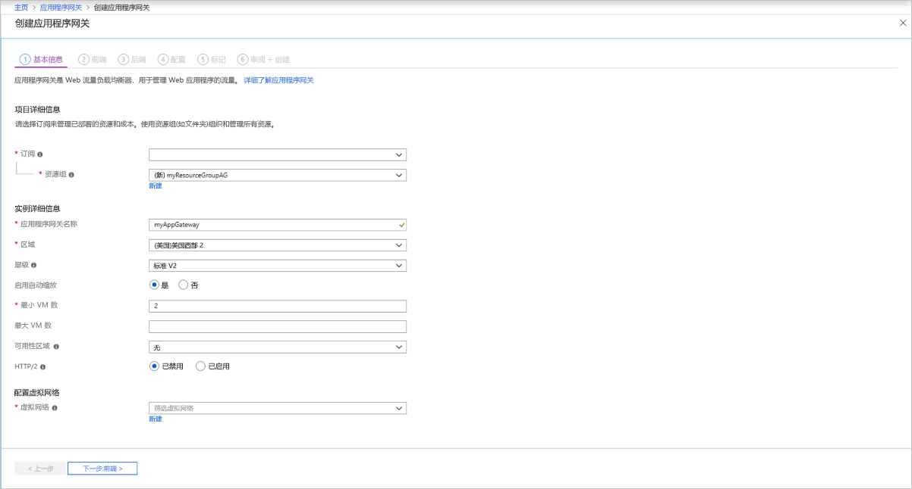

# <a name="tutorial-create-an-application-gateway-with-path-based-routing-rules-using-the-azure-portal"></a>教程：通过 Azure 门户使用基于路径的路由规则创建应用程序网关

创建[应用程序网关](overview.md)时，可以使用 Azure 门户配置[基于 URL 路径的路由规则](url-route-overview.md)。 本教程中使用虚拟机创建后端池。 然后创建路由规则，以确保 Web 流量到达池中的相应服务器。

本教程介绍如何执行下列操作：

> [!div class="checklist"]
> * 创建应用程序网关
> * 为后端服务器创建虚拟机
> * 使用后端服务器创建后端池
> * 创建后端侦听器
> * 创建基于路径的路由规则


如果你愿意，可以使用 [Azure CLI](tutorial-url-route-cli.md) 或 [Azure PowerShell](tutorial-url-route-powershell.md) 完成本教程中的步骤。

如果没有 Azure 订阅，请在开始之前创建一个[免费帐户](https://azure.microsoft.com/free/?WT.mc_id=A261C142F)。

## <a name="sign-in-to-azure"></a>登录 Azure

在 [https://portal.azure.com](https://portal.azure.com) 中登录 Azure 门户。

## <a name="create-an-application-gateway"></a>创建应用程序网关

1. 选择 Azure 门户左侧菜单上的“创建资源”  。 此时会显示“新建”窗口。 

2. 选择“网络”  ，然后在“特色”列表中选择“应用程序网关”   。

### <a name="basics-tab"></a>“基本信息”选项卡

1. 在“基本信息”选项卡上，输入这些值作为以下应用程序网关设置  ：

   - **资源组**：选择 **myResourceGroupAG** 作为资源组。 如果该资源组不存在，请选择“新建”，创建一个新的  。
   - **应用程序网关名称**：输入 *myAppGateway* 作为应用程序网关的名称。

     

2.  Azure 需要一个虚拟网络才能在创建的资源之间通信。 可以创建新的虚拟网络，也可以使用现有的虚拟网络。 在此示例中，将在创建应用程序网关的同时创建新的虚拟网络。 在不同的子网中创建应用程序网关实例。 在本示例中创建两个子网：一个用于应用程序网关，另一个用于后端服务器。

    在“配置虚拟网络”下，选择“新建”以创建一个新的虚拟网络   。 在打开的“创建虚拟网络”窗口中，输入以下值以创建虚拟网络和两个子网  ：

    - **名称**：输入 *myVNet* 作为虚拟网络的名称。

    - **子网名称**（应用程序网关子网）：子网网关将显示名为“默认值”的子网   。 将此子网的名称更改为 myAGSubnet  。

      应用程序网关子网只能包含应用程序网关。 不允许其他资源。

    - **子网名称**（后端服务器子网）：在子网网关的第二行中，在“子网名称”列输入“myBackendSubnet”    。

    - **地址范围**（后端服务器子网）：在子网网格的第二行中，输入不会与 myAGSubnet 的地址范围重叠的地址范围   。 例如，如果 myAGSubnet 的地址范围为 10.0.0.0/24，则为 myBackendSubnet 的地址范围输入 10.0.1.0/24    。

    选择“确定”以关闭“创建虚拟网络”窗口，并保存虚拟网络设置   。

     
    
3. 在“基本信息”  选项卡上，接受其他设置的默认值，然后选择“下一步:  前端”。

### <a name="frontends-tab"></a>“前端”选项卡

1. 在“前端”选项卡上，验证“IP 地址类型”是否设置为“公共”    。 <br>可以根据用例将前端 IP 配置为公共或专用。 本示例将选择公共前端 IP。
   > [!NOTE]
   > 对于应用程序网关 v2 SKU，只能选择**公共**前端 IP 配置。 目前尚未为此 v2 SKU 启用专用前端 IP 配置。

2. 为“公共 IP 地址”选择“新建”，输入“myAGPublicIPAddress”作为公共 IP 地址名称，然后选择“确定”     。 

     

3. 在完成时选择“下一步:**后端**。

### <a name="backends-tab"></a>“后端”选项卡

后端池用于将请求路由到为请求提供服务的后端服务器。 后端池可以包括 NIC、虚拟机规模集、公共 IP、内部 IP、完全限定的域名 (FQDN) 和多租户后端（例如 Azure 应用服务）。 在此示例中，将使用应用程序网关创建空的后端池，然后将后端目标添加到后端池。

1. 在“后端”选项卡上，选择“+添加后端池”   。

2. 在打开的“添加后端池”窗口中，输入以下值以创建空的后端池  ：

    - **名称**：输入 *appGatewayBackendPool* 作为后端池的名称。
    - **添加不包含目标的后端池**：选择“是”以创建不包含目标的后端池  。 你将在创建应用程序网关之后添加后端目标。

3. 在“添加后端池”窗口中，选择“添加”以保存后端池配置并返回到“后端”选项卡    。
4. 现在添加另外两个后端池，其名称分别为 imagesBackendPool 和 videoBackendPool   。

     

4. 在“后端”  选项卡上，选择“下一步:  配置”。

### <a name="configuration-tab"></a>配置选项卡

在“配置”选项卡上，将连接使用路由规则所创建的前端池和后端池  。

1. 选择“传递规则”列中的“添加规则”   。
2. 在打开的“添加路由规则”  窗口中，输入 Rule1  作为“规则名称”  。
3. 传递规则需要侦听器。 在“添加传递规则”窗口中的“侦听器”选项卡上，输入侦听器的以下值   ：

    - **侦听器名称**：输入 DefaultListener  作为侦听器的名称。
    - **前端 IP**：选择“公共”，以选择为前端创建的公共 IP  。

   接受“侦听器”选项卡上其他设置的默认值，然后选择“后端目标”选项卡以配置剩余的传递规则   。
4. 在“后端目标”  选项卡上，为“后端目标”选择“appGatewayBackendPool”   。

5. 对于“HTTP 设置”，选择“新建”以创建新的 HTTP 设置   。 HTTP 设置将决定传递规则的行为。 在打开的“添加 HTTP 设置”窗口中，为“HTTP 设置名称”输入“myHTTPSetting”    。 接受“添加 HTTP 设置”窗口中其他设置的默认值，然后选择“添加”以返回到“添加传递规则”窗口    。 

6. 在“添加传递规则”窗口上，选择“添加”以保存传递规则并返回到“配置”选项卡    。


1. 选择“传递规则”列中的“添加规则”   。

2. 在打开的“添加路由规则”  窗口中，输入 Rule2  作为“规则名称”  。

3. 传递规则需要侦听器。 在“添加传递规则”窗口中的“侦听器”选项卡上，输入侦听器的以下值   ：

    - **侦听器名称**：输入 myBackendListener  作为侦听器名称。
    - **前端 IP**：选择“公共”，以选择为前端创建的公共 IP  。
    - **端口**：8080

   在“其他设置”  下：
   - **侦听器类型**：基本

   接受“侦听器”选项卡上其他设置的默认值，然后选择“后端目标”选项卡以配置剩余的传递规则   。

4. 在“后端目标”  选项卡上，为“后端目标”选择“appGatewayBackendPool”   。

5. 对于“HTTP 设置”  ，请选择“myHTTPSetting”  。 接受“添加 HTTP 设置”窗口中其他设置的默认值，然后选择“添加”以返回到“添加传递规则”窗口    。 

1. 在“基于路径的路由”下  ，选择“添加多个目标以创建基于路径的规则”  。
2. 在“添加路径规则”窗口中  ，为路径规则输入以下值：

   - **路径**： */images/\**
   - **路径规则名称**：*映像*
   - **HTTP 设置**：选择 *myHTTPSetting*
   - **后端目标**：*imagesBackendPool*
9. 选择 **添加** 。
10. 添加另外一个名为 Video  、路径为 /video/ *\** 且后端目标为 videoBackendPool  的路径规则。
11. 选择“保存更改并返回到路由规则”  。

    

12. 选择 **添加** 。

7. 在完成时选择“下一步:  标记”，然后选择“下一步:  查看 + 创建”。

### <a name="review--create-tab"></a>“查看 + 创建”选项卡

复查“查看 + 创建”选项卡上的设置，然后选择“创建”以创建虚拟网络、公共 IP 地址和应用程序网关   。 Azure 可能需要数分钟时间来创建应用程序网关。

请等待部署成功完成，然后再前进到下一部分。


## <a name="create-virtual-machines"></a>创建虚拟机

本示例将创建三个虚拟机，用作应用程序网关的后端服务器。 还可以在虚拟机上安装 IIS，以验证是否已成功创建应用程序网关。

1. 在 Azure 门户中，选择“创建资源”。  此时会显示“新建”窗口。 
2. 选择“计算”，然后在“常用”列表中选择“Windows Server 2016 Datacenter”    。 此时会显示“创建虚拟机”页。 

   应用程序网关可以将流量路由到其后端池中使用的任何类型的虚拟机。 在此示例中，可以使用 Windows Server 2016 Datacenter。
1. 对于以下虚拟机设置，请在“基本信息”选项卡中输入相应值： 

    - **资源组**：选择 **myResourceGroupAG** 作为资源组名称。
    - **虚拟机名称**：输入 myVM1  作为虚拟机的名称。
    - **用户名**：输入 *azureuser* 作为管理员用户名。
    - **密码**：输入 *Azure123456!* 作为管理员密码。
4. 接受其他默认值，然后选择“下一步:**磁盘”** 。  
5. 接受“磁盘”**选项卡的默认值**，然后选择“下一步:**网络”** 。
6. 在“网络”  选项卡上，验证是否已选择 **myVNet** 作为**虚拟网络**，以及是否已将“子网”  设置为 **myBackendSubnet**。 接受其他默认值，然后选择“下一步:**管理”** 。

   应用程序网关可与其所在的虚拟网络外部的实例进行通信，但需要确保已建立 IP 连接。
1. 在“管理”  选项卡上，将“启动诊断”  设置为“关闭”。  接受其他默认值，然后选择“复查 + 创建”。 
2. 在“复查 + 创建”选项卡上复查设置，更正任何验证错误，然后选择“创建”。  
3. 等待虚拟机创建完成，然后再继续操作。

### <a name="install-iis"></a>安装 IIS

[!INCLUDE [updated-for-az](../../includes/updated-for-az.md)]

1. 打开交互式 shell 并确保将它设置为 **PowerShell**。

    

2. 运行以下命令以在虚拟机上安装 IIS： 

    ```azurepowershell-interactive
    $publicSettings = @{ "fileUris" = (,"https://raw.githubusercontent.com/Azure/azure-docs-powershell-samples/master/application-gateway/iis/appgatewayurl.ps1");  "commandToExecute" = "powershell -ExecutionPolicy Unrestricted -File appgatewayurl.ps1" }
    Set-AzVMExtension `
      -ResourceGroupName myResourceGroupAG `
      -Location eastus `
      -ExtensionName IIS `
      -VMName myVM1 `
      -Publisher Microsoft.Compute `
      -ExtensionType CustomScriptExtension `
      -TypeHandlerVersion 1.4 `
      -Settings $publicSettings
    ```

3. 使用刚刚完成的步骤创建另外两个虚拟机并安装 IIS。 在 Set-AzVMExtension 中，使用 myVM2  和 myVM3  作为虚拟机名称和 VMName  值。

## <a name="add-backend-servers-to-backend-pools"></a>将后端服务器添加到后端池

1. 选择“所有资源”，然后选择“myAppGateway”。  

2. 从左侧菜单中选择“后端池”。 

3. 选择“appGatewayBackendPool”  。

4. 在“目标”  下，从下拉列表中选择“虚拟机”。 

5. 在“虚拟机”  和“网络接口”  下，从下拉列表中选择“myVM1”  虚拟机及其关联的网络接口。

    

6. 选择“保存”。 
7. 重复操作，以将 myVM2  及其相关接口添加到 imagesBackendPool  ，然后将 myVM3  及其相关接口添加到 videoBackendPool  。

等待部署完成之后再继续下一步。

## <a name="test-the-application-gateway"></a>测试应用程序网关

1. 依次选择“所有资源”、“myAGPublicIPAddress”。  

    

2. 复制该公共 IP 地址，并将其粘贴到浏览器的地址栏。 例如 [http://40.121.222.19](http://40.121.222.19 )。

    

3. 将 URL 更改为 http://&lt;ip-address&gt;:8080/images/test.htm（请将 &lt;ip-address&gt; 替换为你的 IP 地址），然后，应会看到如以下示例所示的内容：

    

4. 将 URL 更改为 http://&lt;ip-address&gt;:8080/video/test.htm（请将 &lt;ip-address&gt; 替换为你的 IP 地址），然后，应会看到如以下示例所示的内容：

    

## <a name="clean-up-resources"></a>清理资源

如果不再需要通过应用程序网关创建的资源，请删除资源组。 删除资源组时，也会删除应用程序网关和及其所有的相关资源。 

若要删除资源组，请执行以下操作：

1. 在 Azure 门户的左侧菜单上选择“资源组”  。
2. 在“资源组”页的列表中搜索“myResourceGroupAG”，然后将其选中。  
3. 在“资源组”页上，选择“删除资源组”   。
4. 在“键入资源组名称”字段中输入“myResourceGroupAG”，然后选择“删除”。   

## <a name="next-steps"></a>后续步骤

> [!div class="nextstepaction"]
> [详细了解 Azure 应用程序网关的作用](application-gateway-introduction.md)
