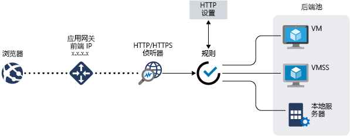

# 什么是 Azure 应用程序网关？

Azure 应用程序网关是一种 Web 流量负载均衡器，可用于管理 Web 应用程序的流量。 传统负载均衡器在传输层（OSI 层 4 - TCP 和 UDP）进行操作，并基于源 IP 地址和端口将流量路由到目标 IP 地址和端口。

使用应用程序网关时，可以根据 HTTP 请求的其他属性（例如 URI 路径或主机标头）进行路由决策。 例如，可以基于传入 URL 路由流量。 因此，如果 `/images` 在传入 URL 中，则可将流量路由到为映像配置的一组特定服务器（称为池）中。 如果 `/video` 在 URL 中，则可将该流量路由到针对视频优化的另一个池中。

这种类型的路由称为应用程序层（OSI 层 7）负载均衡。 Azure 应用程序网关可以执行基于 URL 的路由等操作。

以下功能是 Azure 应用程序网关附带的：

## 安全套接字层 (SSL/TLS) 终止

应用程序网关支持在网关上终止 SSL/TLS，之后，流量通常会以未加密状态流到后端服务器。 此功能让 Web 服务器不用再负担昂贵的加密和解密开销。 但有时，与服务器进行未加密的通信不是可以接受的选项。 这可能是因为安全要求、符合性要求，或者应用程序可能仅接受安全连接。 对于这些应用程序，应用程序网关支持端到端 SSL/TLS 加密。

## 自动缩放

Standard_v2 或 WAF_v2 SKU 下的应用程序网关或 WAF 部署支持自动缩放，可根据变化的流量负载模式进行纵向扩展或缩减。 自动缩放还无需在预配期间要求选择部署大小或实例计数。 有关应用程序网关 standard_v2 和 WAF_v2 功能的详细信息，请参阅[自动缩放 v2 SKU](application-gateway-autoscaling-zone-redundant.md)。

## 区域冗余

Standard_v2 或 WAF_v2 SKU 下的应用程序网关或 WAF 部署可以跨多个可用性区域，提供更好的故障复原能力，不需在每个区域预配单独的应用程序网关。

## 静态 VIP

Standard_v2 或 WAF_v2 SKU 上的应用程序网关 VIP 支持独占形式的静态 VIP 类型。 这样可确保与应用程序网关关联的 VIP 在应用程序网关的整个生存期内都不会更改。

## Web 应用程序防火墙

Web 应用程序防火墙 (WAF) 是应用程序网关的功能，可以对 Web 应用程序进行集中保护，避免其受到常见的攻击和漏洞伤害。 WAF 基于 [OWASP（开放 Web 应用程序安全项目）核心规则集](https://www.owasp.org/index.php/Category:OWASP_ModSecurity_Core_Rule_Set_Project) 3.0 或 2.2.9 中的规则。 

Web 应用程序已逐渐成为利用常见已知漏洞的恶意攻击的目标。 这些攻击中最常见的攻击包括 SQL 注入攻击、跨站点脚本攻击等。 防止应用程序代码中的此类攻击颇具挑战性，可能需要在应用程序拓扑的多个层进行严格的维护、修补和监视。 集中式 Web 应用程序防火墙有助于大幅简化安全管理，为抵卸威胁或入侵的应用程序管理员提供更好的保障。 相较保护每个单独的 Web 应用程序，WAF 解决方案还可通过在中央位置修补已知漏洞，更快地响应安全威胁。 可将现有应用程序网关轻松转换为支持 Web 应用程序防火墙的应用程序网关。

有关详细信息，请参阅[应用程序网关中的 Web 应用程序防火墙 (WAF)](https://docs.microsoft.com/azure/application-gateway/waf-overview)。

## 基于 URL 的路由

基于 URL 路径的路由用于根据请求的 URL 路径，将流量路由到后端服务器池。 方案之一是将不同内容类型的请求路由到不同的池。

例如，将 `http://contoso.com/video/*` 的请求路由到 VideoServerPool，将 `http://contoso.com/images/*` 的请求路由到 ImageServerPool。 如果没有任何路径模式匹配，则选择 DefaultServerPool。

有关详细信息，请参阅[使用应用程序网关进行基于 URL 的路由](https://docs.microsoft.com/azure/application-gateway/url-route-overview)。

## 多站点托管

使用多站点托管可以在同一应用程序网关实例上配置多个网站。 此功能可以将多达 100 个网站添加到一个应用程序网关中，从而为部署配置更有效的拓扑。 每个网站都可以定向到自己的池。 例如，应用程序网关可以通过两个名为 ContosoServerPool 和 FabrikamServerPool 的服务器池分别处理 `contoso.com` 和 `fabrikam.com` 的流量。

对 `http://contoso.com` 的请求路由到 ContosoServerPool，对 `http://fabrikam.com` 的请求路由到 FabrikamServerPool。

同样，可以将同一父域的两个子域托管在同一应用程序网关部署中。 例如，在单个应用程序网关部署中托管的 `http://blog.contoso.com` 和 `http://app.contoso.com` 都是使用子域。

有关详细信息，请参阅[使用应用程序网关进行多站点托管](https://docs.microsoft.com/azure/application-gateway/multiple-site-overview)。

## 重定向

为确保应用程序与其用户之间的所有通信都通过加密路径进行，适用于许多 Web 应用程序的常见方案是支持 HTTP 到 HTTPS 自动重定向。

你可能过去用过专用池创建等技术，其唯一目的是将通过 HTTP 接收的请求重定向到 HTTPS。 应用程序网关支持重定向应用程序网关流量的功能。 这样可以简化应用程序配置、优化资源使用情况，并支持全局重定向和基于路径的重定向等新的重定向方案。 应用程序网关重定向支持并不仅限于 HTTP 到 HTTPS 的重定向。 这是一种通用重定向机制，因此可以针对使用规则定义的任何端口进行双向重定向。 它还支持重定向到外部站点。

应用程序网关重定向支持具有以下功能：

- 在网关上进行的从一个端口到另一个端口的全局重定向。 这样可实现站点上的 HTTP 到 HTTPS 重定向。
- 基于路径的重定向。 这种类型的重定向只能在特定站点区域（例如 `/cart/*` 表示的购物车区域）中进行 HTTP 到 HTTPS 的重定向。
- 重定向到外部站点。

有关详细信息，请参阅使用应用程序网关[重定向流量](https://docs.microsoft.com/azure/application-gateway/redirect-overview)。

## 会话相关性

需要在同一服务器上保留用户会话时，可以使用基于 Cookie 的会话相关性功能。 借助网关托管的 Cookie，应用程序网关可以将来自用户会话的后续流量定向到同一服务器进行处理。 在用户会话的会话状态在服务器上进行本地保存的情况下，此功能十分重要。

## Websocket 和 HTTP/2 流量

应用程序网关为 WebSocket 和 HTTP/2 协议提供本机支持。 用户无法通过配置设置来选择性地启用或禁用 WebSocket 支持。

WebSocket 和 HTTP/2 协议通过长时间运行的 TCP 连接，在服务器和客户端之间实现全双工通信。 此功能让 Web 服务器和客户端之间能够进行交互性更强的通信。这种通信可以是双向的，而且不像基于 HTTP 的实现那样需要轮询。 不同于 HTTP，这些协议的开销很低，并且可以对多个请求/响应重复使用同一 TCP 连接，提高资源利用率。 这些协议设计为通过传统 HTTP 端口 80 和 443 运行。

有关详细信息，请参阅 [WebSocket 支持](https://docs.microsoft.com/azure/application-gateway/application-gateway-websocket)和 [HTTP/2 支持](https://docs.microsoft.com/azure/application-gateway/configuration-overview#http2-support)。

## Azure Kubernetes 服务 (AKS) 入口控制器预览版 

应用程序网关入口控制器作为 pod 在 AKS 群集中运行，并允许应用程序网关充当 AKS 群集的入口。 仅应用程序网关 v2 支持此功能。

有关详细信息，请参阅 [Azure 应用程序网关入口控制器](https://azure.github.io/application-gateway-kubernetes-ingress/)。

## 连接清空

连接清空可帮助你在计划内服务更新期间正常删除后端池成员。 此设置是通过后端 http 设置启用的，并且可以在创建规则期间应用于后端池的所有成员。 启用后，应用程序网关可确保后端池的所有已取消注册实例不再收到任何新请求，同时允许现有请求在所配置的时间限制内完成。 这适用于通过 API 调用显式从后端池中删除的后端实例，以及所报告的由运行状况探测确定为不正常的后端实例。

## 自定义错误页

应用程序网关允许你创建自定义错误页而非显示默认错误页。 你可以在自定义错误页上使用自己的品牌和布局。

有关详细信息，请参阅[重写 HTTP 标头](rewrite-http-headers.md)。

## 重写 HTTP 标头

HTTP 标头可让客户端和服务器连同请求或响应一起传递附加的信息。 重写这些 HTTP 标头可帮助实现多个重要方案，例如：

- 添加安全相关的标头字段（如 HSTS/ X-XSS-Protection）。
- 删除可能会透露敏感信息的响应标头字段。
- 从 X-Forwarded-For 标头中去除端口信息。

当请求和响应数据包在客户端与后端池之间移动时，可以通过应用程序网关添加、删除或更新 HTTP 请求和响应标头。 它还允许你添加条件，确保只有在满足特定条件的情况下才能重写指定标头。

有关详细信息，请参阅[重写 HTTP 标头](rewrite-http-headers.md)。

## 调整大小

可以配置应用程序网关的 Standard_v2 和 WAF_v2 SKU，以便进行自动缩放的或固定大小的部署。 这两个 SKU 不提供不同的实例大小。

应用程序网关的 Standard 和 WAF SKU 目前提供三种大小：**小型**、**中型**和**大型**。 小型实例大小适用于开发和测试方案。

有关应用程序网关限制的完整列表，请参阅[应用程序网关服务限制](../azure-subscription-service-limits.md?toc=%2fazure%2fapplication-gateway%2ftoc.json#application-gateway-limits)。

下表显示了已启用 SSL 卸载的每个应用程序网关实例的平均性能吞吐量：

| 平均后端页面响应大小 | 小型 | 中型 | 大型 |
| --- | --- | --- | --- |
| 6 KB |7.5 Mbps |13 Mbps |50 Mbps |
| 100 KB |35 Mbps |100 Mbps |200 Mbps |

> [!NOTE]
> 这些值是应用程序网关吞吐量的大约值。 实际吞吐量取决于平均页面大小、后端实例的位置、提供页面所需的处理时间等各种环境详细信息。 如需确切的性能数字，则应运行自己的测试。 提供的这些值仅适用于容量规划指南。

## 后续步骤

可以根据自己的需求和环境，使用 Azure 门户、Azure PowerShell 或 Azure CLI 创建测试性应用程序网关：

- [快速入门：使用 Azure 应用程序网关定向 Web 流量 - Azure 门户](quick-create-portal.md)
- [快速入门：使用 Azure 应用程序网关定向 Web 流量 - Azure PowerShell](quick-create-powershell.md)
- [快速入门：使用 Azure 应用程序网关定向 Web 流量 - Azure CLI](quick-create-cli.md)