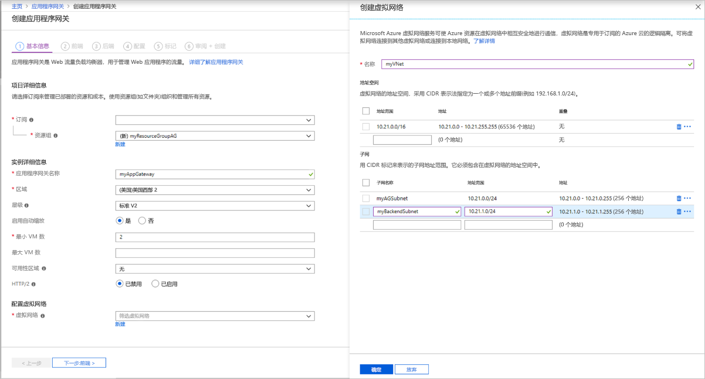
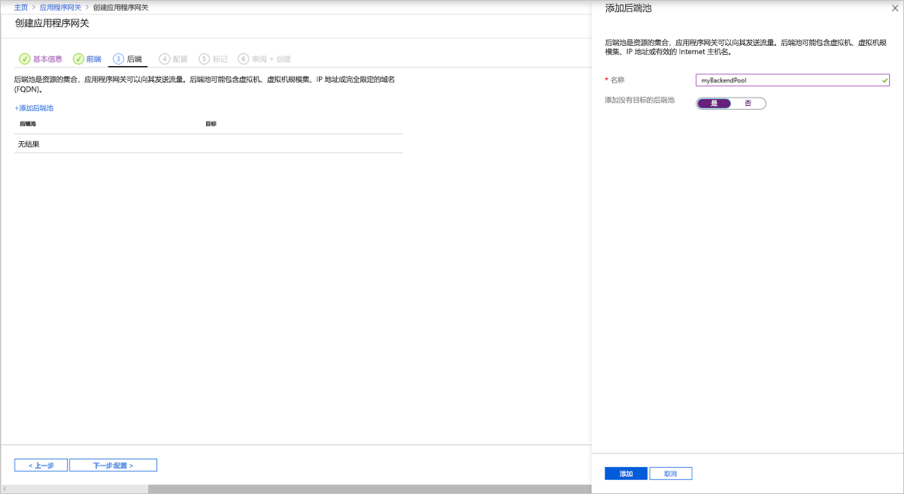
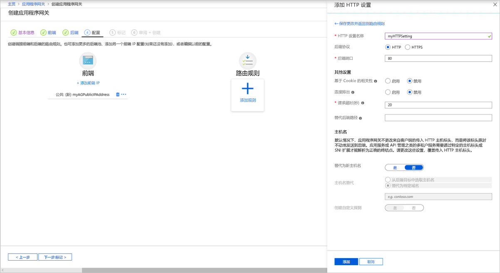
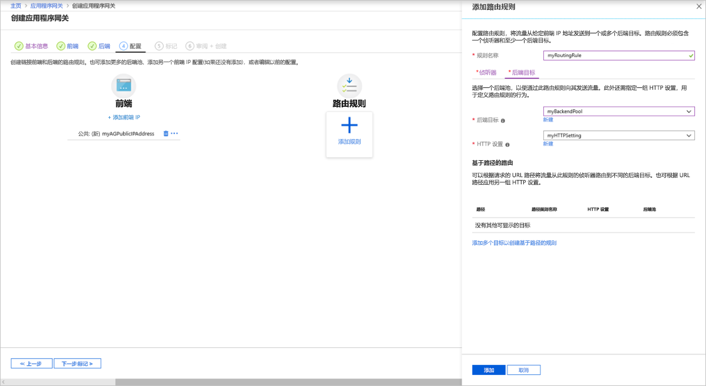

# <a name="quickstart-direct-web-traffic-with-azure-application-gateway---azure-portal"></a>快速入门：使用 Azure 应用程序网关定向 Web 流量 - Azure 门户

在本快速入门中，你将使用 Azure 门户创建一个应用程序网关。 然后对其进行测试以确保其正常运行。 

该应用程序网关将应用程序 Web 流量定向到后端池中的特定资源。 你将向端口分配侦听器，创建规则，并向后端池中添加资源。 为简单起见，本文使用了带有公共前端 IP 的简单设置、一个在应用程序网关上托管单个站点的基本侦听器、一个基本的请求路由规则，以及后端池中的两台虚拟机。

还可以使用 [Azure PowerShell](quick-create-powershell.md) 或 [Azure CLI](quick-create-cli.md) 完成本快速入门。

[!INCLUDE [updated-for-az](../../includes/updated-for-az.md)]

## <a name="prerequisites"></a>先决条件

- 具有活动订阅的 Azure 帐户。 [免费创建帐户](https://azure.microsoft.com/free/?WT.mc_id=A261C142F)。

## <a name="sign-in-to-the-azure-portal"></a>登录到 Azure 门户

使用 Azure 帐户登录到 [Azure 门户](https://portal.azure.com)。

## <a name="create-an-application-gateway"></a>创建应用程序网关

你将使用“创建应用程序网关”页上的选项卡创建应用程序网关。

1. 在 Azure 门户菜单或“主页”页上，选择“创建资源” 。 此时会显示“新建”窗口。

2. 选择“网络”  ，然后在“特色”列表中选择“应用程序网关”   。

### <a name="basics-tab"></a>“基本信息”选项卡

1. 在“基本信息”选项卡上，输入这些值作为以下应用程序网关设置  ：

   - **资源组**：选择 **myResourceGroupAG** 作为资源组。 如果该资源组不存在，请选择“新建”，创建一个新的。
   - **应用程序网关名称**：输入 *myAppGateway* 作为应用程序网关的名称。

     

2. Azure 需要一个虚拟网络才能在创建的资源之间通信。 可以创建新的虚拟网络，或者使用现有的虚拟网络。 在此示例中，将在创建应用程序网关的同时创建新的虚拟网络。 在独立的子网中创建应用程序网关实例。 在本示例中创建两个子网：一个用于应用程序网关，另一个用于后端服务器。

    > [!NOTE]
    > 应用程序网关子网中当前不支持[虚拟网络服务终结点策略](../virtual-network/virtual-network-service-endpoint-policies-overview.md)。

    在“配置虚拟网络”下，通过选择“新建”创建新的虚拟网络 。 在打开的“创建虚拟网络”窗口中，输入以下值以创建虚拟网络和两个子网：

    - **名称**：输入 *myVNet* 作为虚拟网络的名称。

    - **子网名称**（应用程序网关子网）：子网网关将显示名为“默认值”的子网。 将此子网的名称更改为 myAGSubnet。<br>应用程序网关子网只能包含应用程序网关。 不允许其他资源。

    - **子网名称**（后端服务器子网）：在子网网关的第二行中，在“子网名称”列输入“myBackendSubnet”。

    - **地址范围**（后端服务器子网）：在子网网格的第二行中，输入不会与 myAGSubnet 的地址范围重叠的地址范围。 例如，如果 myAGSubnet 的地址范围为 10.0.0.0/24，则为 myBackendSubnet 的地址范围输入 10.0.1.0/24  。

    选择“确定”以关闭“创建虚拟网络”窗口，并保存虚拟网络设置 。

     
    
3. 在“基本信息”选项卡上，接受其他设置的默认值，然后选择“下一步:前端”。

### <a name="frontends-tab"></a>“前端”选项卡

1. 在“前端”选项卡上，验证“IP 地址类型”是否设置为“公共”    。 <br>可根据用例将前端 IP 配置为公共或专用 IP。 本示例将选择公共前端 IP。
   > [!NOTE]
   > 对于应用程序网关 v2 SKU，必须有一个 **公共** 前端 IP 配置。 你仍可以同时有公共和专用前端 IP 配置，但目前没有为 v2 SKU 启用仅专用前端 IP 配置（仅限 ILB 模式）。 

2. 为“公共 IP 地址”选择“新建”，输入“myAGPublicIPAddress”作为公共 IP 地址名称，然后选择“确定” 。 

     

3. 在完成时选择“下一步:**后端**。

### <a name="backends-tab"></a>“后端”选项卡

后端池用于将请求路由到为请求提供服务的后端服务器。 后端池可以包含 NIC、虚拟机规模集、公共 IP、内部 IP、完全限定的域名 (FQDN) 和多租户后端（例如 Azure 应用服务）。 在此示例中，将使用应用程序网关创建空的后端池，然后将后端目标添加到后端池。

1. 在“后端”选项卡上，选择“+添加后端池”   。

2. 在打开的“添加后端池”窗口中，输入以下值以创建空的后端池  ：

    - **名称**：输入“myBackendPool”作为后端池的名称  。
    - **添加不包含目标的后端池**：选择“是”以创建不包含目标的后端池。 你将在创建应用程序网关之后添加后端目标。

3. 在“添加后端池”窗口中，选择“添加”以保存后端池配置并返回到“后端”选项卡  。

     

4. 在“后端”  选项卡上，选择“下一步:  配置”。

### <a name="configuration-tab"></a>配置选项卡

在“配置”选项卡上，将连接使用传递规则创建的前端和后端池  。

1. 选择“传递规则”列中的“添加规则”   。

2. 在打开的“添加传递规则”窗口中，输入“myRoutingRule”作为规则名称    。

3. 传递规则需要侦听器。 在“添加传递规则”窗口中的“侦听器”选项卡上，输入侦听器的以下值   ：

    - **侦听器名称**：输入“myListener”作为侦听器名称  。
    - **前端 IP**：选择“公共”，以选择为前端创建的公共 IP。
  
      接受“侦听器”选项卡上其他设置的默认值，然后选择“后端目标”选项卡以配置剩余的传递规则 。

   

4. 在“后端目标”选项卡上，为“后端目标”选择“myBackendPool”    。

5. 对于“HTTP 设置”，选择“新建”以创建新的 HTTP 设置   。 HTTP 设置将决定传递规则的行为。 在打开的“添加 HTTP 设置”窗口中，为“HTTP 设置名称”输入“myHTTPSetting”，为“后端端口”输入“80”。 接受“添加 HTTP 设置”窗口中其他设置的默认值，然后选择“添加”以返回到“添加传递规则”窗口  。 

     

6. 在“添加传递规则”窗口上，选择“添加”以保存传递规则并返回到“配置”选项卡  。

     

7. 在完成时选择“下一步:  标记”，然后选择“下一步:  查看 + 创建”。

### <a name="review--create-tab"></a>“查看 + 创建”选项卡

复查“查看 + 创建”选项卡上的设置，然后选择“创建”以创建虚拟网络、公共 IP 地址和应用程序网关   。 Azure 可能需要数分钟时间来创建应用程序网关。 请等待部署成功完成，然后再前进到下一部分。

## <a name="add-backend-targets"></a>添加后端目标

本示例将使用虚拟机作为目标后端。 可以使用现有的虚拟机，或创建新的虚拟机。 将创建两个虚拟机，作为应用程序网关的后端服务器。

为此，将要：

1. 创建两个新的 VM（myVM 和 myVM2），用作后端服务器 。
2. 在虚拟机上安装 IIS，以验证是否成功创建了应用程序网关。
3. 将后端服务器添加到后端池。

### <a name="create-a-virtual-machine"></a>创建虚拟机

1. 在 Azure 门户菜单或“主页”页上，选择“创建资源” 。 此时会显示“新建”窗口。
2. 在“常用”列表中选择“Windows Server 2016 Datacenter” 。 此时会显示“创建虚拟机”页。<br>应用程序网关可将流量路由到其后端池中使用的任何类型的虚拟机。 本示例使用 Windows Server 2016 Datacenter。
3. 对于以下虚拟机设置，请在“基本信息”选项卡中输入相应值：

    - **资源组**：选择 **myResourceGroupAG** 作为资源组名称。
    - **虚拟机名称**：输入 *myVM* 作为虚拟机的名称。
    - **区域**：选择在其中创建了应用程序网关的同一区域。
    - **用户名**：键入“azureuser”作为管理员用户名。
    - **密码**：键入密码。
4. 接受其他默认值，然后选择“下一步:**磁盘”** 。  
5. 接受“磁盘”**选项卡的默认值**，然后选择“下一步:**网络”** 。
6. 在“网络”选项卡上，验证是否已选择 **myVNet** 作为 **虚拟网络**，以及是否已将“子网”设置为 **myBackendSubnet**。 接受其他默认值，然后选择“下一步:**管理”** 。<br>应用程序网关可与其所在的虚拟网络外部的实例进行通信，但需要确保已建立 IP 连接。
7. 在“管理”选项卡上，将“启动诊断”设置为“禁用”  。 接受其他默认值，然后选择“复查 + 创建”。
8. 在“复查 + 创建”选项卡上复查设置，更正任何验证错误，然后选择“创建”。
9. 等待虚拟机创建完成，然后再继续操作。

### <a name="install-iis-for-testing"></a>安装 IIS 用于测试

本示例在虚拟机上安装 IIS，只为验证 Azure 是否已成功创建应用程序网关。

1. 打开 Azure PowerShell。 在 Azure 门户的顶部导航栏中选择“Cloud Shell”，然后从下拉列表中选择“PowerShell”。  

    

2. 运行以下命令以在虚拟机上安装 IIS。 如有必要，请更改 Location 参数： 

    ```azurepowershell
    Set-AzVMExtension `
      -ResourceGroupName myResourceGroupAG `
      -ExtensionName IIS `
      -VMName myVM `
      -Publisher Microsoft.Compute `
      -ExtensionType CustomScriptExtension `
      -TypeHandlerVersion 1.4 `
      -SettingString '{"commandToExecute":"powershell Add-WindowsFeature Web-Server; powershell Add-Content -Path \"C:\\inetpub\\wwwroot\\Default.htm\" -Value $($env:computername)"}' `
      -Location EastUS
    ```

3. 使用以前完成的步骤创建第二个虚拟机并安装 IIS。 使用 *myVM2* 作为虚拟机名称，以及作为 **Set-AzVMExtension** cmdlet 的 **VMName** 设置。

### <a name="add-backend-servers-to-backend-pool"></a>将后端服务器添加到后端池

1. 在 Azure 门户菜单上，选择“所有资源”，或搜索并选择“所有资源”。 然后选择“myAppGateway”。

2. 从左侧菜单中选择“后端池”。

3. 选择“myBackendPool”。

4. 在“后端目标”、“目标类型”下，从下拉列表中选择“虚拟机”。

5. 在“目标”下，从下拉列表中选择“myVM”和“myVM2”虚拟机及其关联的网络接口。

   > [!div class="mx-imgBorder"]
   > 

6. 选择“保存”。

7. 等待部署完成之后再继续下一步。

## <a name="test-the-application-gateway"></a>测试应用程序网关

虽然不需 IIS 即可创建应用程序网关，但本快速入门中安装了它，用来验证 Azure 是否已成功创建应用程序网关。 使用 IIS 测试应用程序网关：

1. 在“概述”页面上查找应用程序网关的公共 IP 地址或者，可以选择“所有资源”，在搜索框中输入“myAGPublicIPAddress”，然后在搜索结果中选择该地址 。 Azure 会在“概览”页上显示公共 IP 地址。
2. 复制公共 IP 地址，然后将其粘贴到浏览器的地址栏中，以便浏览该 IP 地址。
3. 检查响应。 有效响应验证应用程序网关是否已成功创建，以及是否能够成功连接后端。

   

   多次刷新浏览器，应看到与 myVM 和 myVM2 的连接。

## <a name="clean-up-resources"></a>清理资源

如果不再需要通过应用程序网关创建的资源，请删除资源组。 删除资源组时，也会删除应用程序网关和所有相关资源。

若要删除资源组，请执行以下操作：

1. 在 Azure 门户菜单上，选择“资源组”，或搜索并选择“资源组”。
2. 在“资源组”页的列表中搜索“myResourceGroupAG”，然后将其选中。 
3. 在“资源组”页上，选择“删除资源组”   。
4. 在“键入资源组名称”字段中输入“myResourceGroupAG”，然后选择“删除”

## <a name="next-steps"></a>后续步骤

> [!div class="nextstepaction"]
> [教程：使用 Azure 门户配置带有 TLS 终止的应用程序网关](create-ssl-portal.md)
