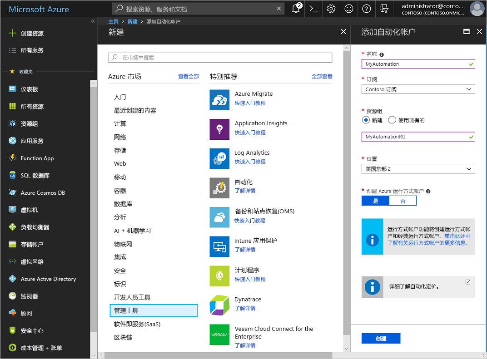
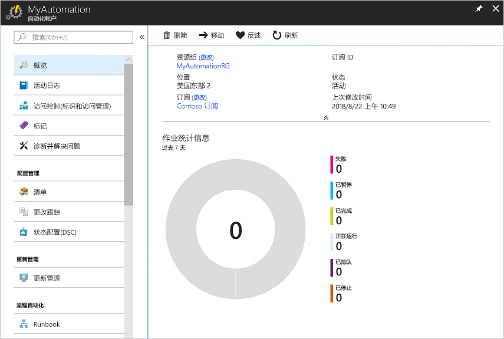
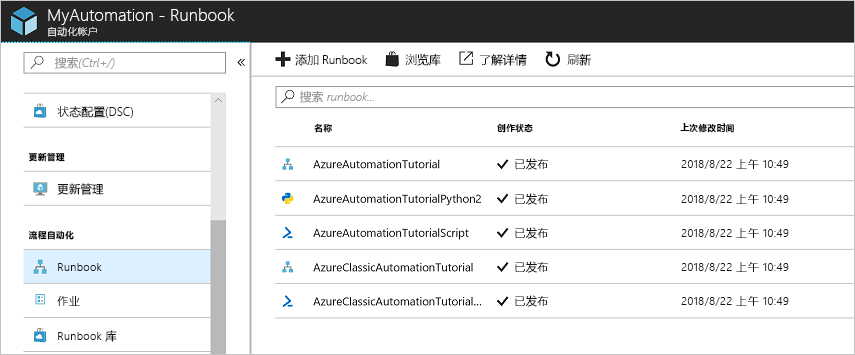
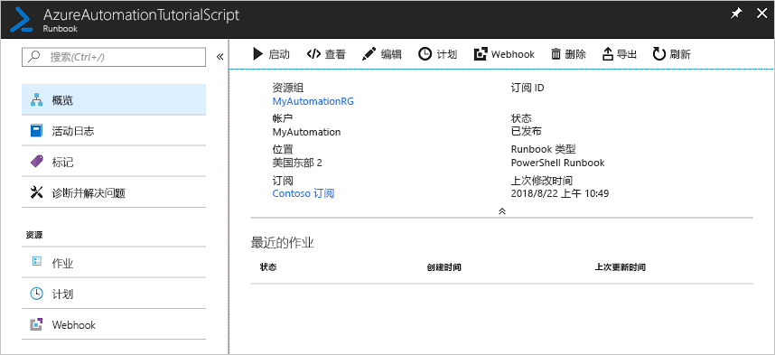
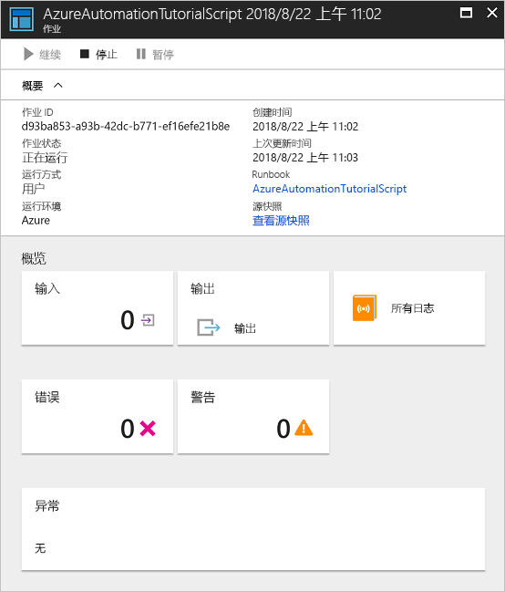

# 创建 Azure 自动化帐户

Azure 自动化帐户可以通过 Azure 创建。 此方法提供一个基于浏览器的用户界面，用于创建和配置自动化帐户和相关的资源。 本入门介绍了如何创建自动化帐户并在帐户中运行 Runbook。

如果还没有 Azure 订阅，可以在开始前创建一个[免费 Azure 帐户](https://azure.microsoft.com/free/?WT.mc_id=A261C142F)。

## 登录 Azure

登录 Azure (https://portal.azure.com )

## 创建自动化帐户

1. 单击 Azure 左上角的“创建资源”按钮。 

1. 选择“IT 和管理工具”，然后选择“自动化”。  

1. 输入帐户信息。 对于“创建 Azure 运行方式帐户”，请选择“是”，以便自动启用可简化向 Azure 进行的身份验证的项目。   需要注意的是，在创建自动化帐户时，选择它后将无法更改名称。 *每个区域和资源组的自动化帐户名称都是唯一的。已删除的自动化帐户的名称可能无法立即可用。* 一个自动化帐户可以跨所有区域和订阅管理给定租户的资源。 完成后，请单击**创建**，启动自动化帐户部署。

      

    > [!NOTE]
    > 若需可以向其部署自动化帐户的位置的已更新列表，请参阅[可用产品（按区域）](https://azure.microsoft.com/global-infrastructure/services/?products=automation&regions=all)。

1. 部署完成后，单击“所有服务”  ，选择“自动化帐户”  并选择所创建的自动化帐户。

    

## 运行 Runbook

运行一个教程 Runbook。

1. 单击“流程自动化”下的“Runbook”。   此时会显示 Runbook 列表。 默认情况下，帐户中启用多个教程 Runbook。

    

1. 选择 **AzureAutomationTutorialScript** Runbook。 此操作打开 Runbook 概览页。

    

1. 单击“启动”，然后在“启动 Runbook”页中单击“确定”以启动 Runbook。   

    

1. 在“作业状态”变为“正在运行”后，单击“输出”或“所有日志”查看 Runbook 作业输出。     对于此教程 Runbook，输出是 Azure 资源的列表。

## 后续步骤

在本快速入门中，你已部署了自动化帐户、启动 Runbook 作业并查看作业状态。 若要详细了解 Azure 自动化，请继续阅读快速入门中有关如何创建第一个 Runbook 的内容。

> [!div class="nextstepaction"]
> [自动化快速入门 - 创建 Runbook](./automation-quickstart-create-runbook.md)

