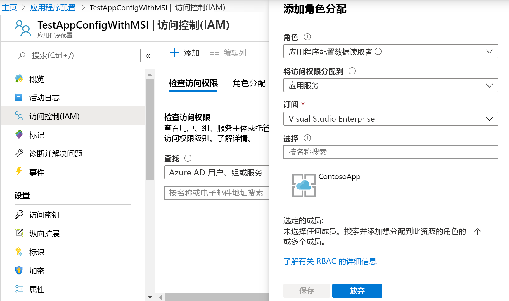

# <a name="tutorial-integrate-with-azure-managed-identities"></a>教程：与 Azure 托管标识集成

Azure Active Directory [托管标识](https://docs.microsoft.com/azure/active-directory/managed-identities-azure-resources/overview)可帮助简化云应用程序的机密管理。 使用托管标识，可设置代码以使用针对其运行的 Azure 计算服务创建的服务主体，而不是 Azure Key Vault 中存储的单独凭据或本地连接字符串。 Azure 应用配置及其 .NET Core、.NET 和 Java Spring 客户端库随附内置的 MSI 支持。 尽管并非必须使用 MSI，但借助它便无需再使用包含机密的访问令牌。 代码只需知道应用配置存储区的服务终结点即可访问它，可直接在代码中嵌入此 URL，无需担心泄露任何机密。

本教程介绍如何利用 MSI 访问应用配置。 它建立在快速入门中介绍的 Web 应用之上。 请先完成[使用应用配置创建 ASP.NET Core 应用](./quickstart-aspnet-core-app.md)部分，然后再继续。

可使用任何代码编辑器来完成本教程中的步骤。 但是，[Visual Studio Code](https://code.visualstudio.com/) 是一个很好的选项，可用于 Windows、macOS 和 Linux 平台。

本教程介绍如何执行下列操作：

> [!div class="checklist"]
> * 授予对应用配置的托管标识访问权限
> * 将应用配置为使用托管标识连接到应用配置

## <a name="prerequisites"></a>先决条件

要完成本教程，必须准备好以下各项：

* [.NET Core SDK](https://www.microsoft.com/net/download/windows)
* [已配置的 Azure Cloud Shell](https://docs.microsoft.com/azure/cloud-shell/quickstart)

[!INCLUDE [quickstarts-free-trial-note](../../includes/quickstarts-free-trial-note.md)]

## <a name="add-a-managed-identity"></a>添加托管标识

要在门户中设置托管标识，需先按常规创建应用程序，然后启用该功能。

1. 按常规在 [Azure 门户](https://aka.ms/azconfig/portal)中创建应用。 在门户中导航到该应用。

2. 在左侧导航区域向下滚动到“设置”组，然后选择“标识”。

3. 在“系统分配”选项卡中，将“状态”切换为“启用”并单击“保存”。

    

## <a name="grant-access-to-app-configuration"></a>授予对应用配置的访问权限

1. 在 [Azure 门户](https://aka.ms/azconfig/portal)中，单击“所有资源”和快速入门中创建的应用配置存储区。

2. 选择“访问控制 (IAM)”。

3. 在“检查访问权限”选项卡中，单击“添加角色分配”卡 UI 中的“添加”。

4. 将“角色”设为“参与者”，将“访问权限分配对象”设为“应用服务”（在“系统分配的托管标识”下）。

5. 将“订阅”设为 Azure 订阅，并为应用选择应用服务资源。

6. 单击“ **保存**”。

    

## <a name="use-a-managed-identity"></a>使用托管标识

1. 打开 appsettings.json，添加以下内容并将 <service_endpoint>（含括号）替换为应用配置存储区的 URL：

    ```json
    "AppConfig": {
        "Endpoint": "<service_endpoint>"
    }
    ```

2. 打开 Program.cs，并通过替换 `config.AddAzureAppConfiguration()` 方法更新 `CreateWebHostBuilder` 方法。

    ```csharp
    public static IWebHostBuilder CreateWebHostBuilder(string[] args) =>
        WebHost.CreateDefaultBuilder(args)
            .ConfigureAppConfiguration((hostingContext, config) =>
            {
                var settings = config.Build();
                config.AddAzureAppConfiguration(o => o.ConnectWithManagedIdentity(settings["AppConfig:Endpoint"]));
            })
            .UseStartup<Startup>();
    ```

[!INCLUDE [Prepare repository](../../includes/app-service-deploy-prepare-repo.md)]

[!INCLUDE [cloud-shell-try-it](../../includes/cloud-shell-try-it.md)]

## <a name="deploy-from-local-git"></a>从本地 Git 进行部署

使用 Kudu 生成服务器为应用启用本地 Git 部署的最简单方法是使用 Cloud Shell。

### <a name="configure-a-deployment-user"></a>配置部署用户

[!INCLUDE [Configure a deployment user](../../includes/configure-deployment-user-no-h.md)]

### <a name="enable-local-git-with-kudu"></a>使用 Kudu 启用本地 Git

若要使用 Kudu 生成服务器为应用启用本地 Git 部署，请在 Cloud Shell 中运行 [`az webapp deployment source config-local-git`](/cli/azure/webapp/deployment/source?view=azure-cli-latest#az-webapp-deployment-source-config-local-git)。

```azurecli-interactive
az webapp deployment source config-local-git --name <app_name> --resource-group <group_name>
```

要创建启用 Git 的应用，请使用 `--deployment-local-git` 参数在 Cloud Shell 中运行 [`az webapp create`](/cli/azure/webapp?view=azure-cli-latest#az-webapp-create)。

```azurecli-interactive
az webapp create --name <app_name> --resource-group <group_name> --plan <plan_name> --deployment-local-git
```

`az webapp create` 命令的输出应如下所示：

```json
Local git is configured with url of 'https://<username>@<app_name>.scm.azurewebsites.net/<app_name>.git'
{
  "availabilityState": "Normal",
  "clientAffinityEnabled": true,
  "clientCertEnabled": false,
  "cloningInfo": null,
  "containerSize": 0,
  "dailyMemoryTimeQuota": 0,
  "defaultHostName": "<app_name>.azurewebsites.net",
  "deploymentLocalGitUrl": "https://<username>@<app_name>.scm.azurewebsites.net/<app_name>.git",
  "enabled": true,
  < JSON data removed for brevity. >
}
```

### <a name="deploy-your-project"></a>部署项目

回到本地终端窗口，将 Azure 远程功能添加到本地 Git 存储库。 使用从[启用应用的 Git](#enable-local-git-with-kudu)中获取的 Git 远程 URL 替换 \<url>。

```bash
git remote add azure <url>
```

使用以下命令推送到 Azure 远程功能以部署应用。 提示输入密码时，请确保输入在[配置部署用户](#configure-a-deployment-user)中创建的密码，而不是用于登录到 Azure 门户的密码。

```bash
git push azure master
```

在输出中可能会看到特定于运行时的自动化，如 MSBuild for ASP.NET、`npm install` for Node.js 和 `pip install` for Python。

### <a name="browse-to-the-azure-web-app"></a>浏览到 Azure Web 应用

使用浏览器浏览到 Web 应用以验证内容已部署。

```bash
http://<app_name>.azurewebsites.net
```


## <a name="use-managed-identity-in-other-languages"></a>使用其他语言的托管标识

适用于 .NET Framework 和 Java Spring 的应用配置提供程序也有针对托管标识的内置支持。 在这些情况下，配置提供程序时只需使用应用配置存储区的 URL 终结点而不用其完整连接字符串。 例如，对于快速入门中创建的 .NET Framework 控制台应用，请在 App.config 文件中指定以下设置：

    ```xml
    <configSections>
        <section name="configBuilders" type="System.Configuration.ConfigurationBuildersSection, System.Configuration, Version=4.0.0.0, Culture=neutral, PublicKeyToken=b03f5f7f11d50a3a" restartOnExternalChanges="false" requirePermission="false" />
    </configSections>

    <configBuilders>
        <builders>
            <add name="MyConfigStore" mode="Greedy" endpoint="${Endpoint}" type="Microsoft.Configuration.ConfigurationBuilders.AzureAppConfigurationBuilder, Microsoft.Configuration.ConfigurationBuilders.AzureAppConfiguration" />
            <add name="Environment" mode="Greedy" type="Microsoft.Configuration.ConfigurationBuilders.EnvironmentConfigBuilder, Microsoft.Configuration.ConfigurationBuilders.Environment" />
        </builders>
    </configBuilders>

    <appSettings configBuilders="Environment,MyConfigStore">
        <add key="AppName" value="Console App Demo" />
        <add key="Endpoint" value ="Set via an environment variable - for example, dev, test, staging, or production endpoint." />
    </appSettings>
    ```

## <a name="clean-up-resources"></a>清理资源

[!INCLUDE [azure-app-configuration-cleanup](../../includes/azure-app-configuration-cleanup.md)]

## <a name="next-steps"></a>后续步骤

在本教程中，通过添加 Azure 托管服务标识简化了应用配置访问并改进了应用凭据管理。 若要了解有关使用应用配置的详细信息，请继续学习 Azure CLI 示例。

> [!div class="nextstepaction"]
> [CLI 示例](./cli-samples.md)
