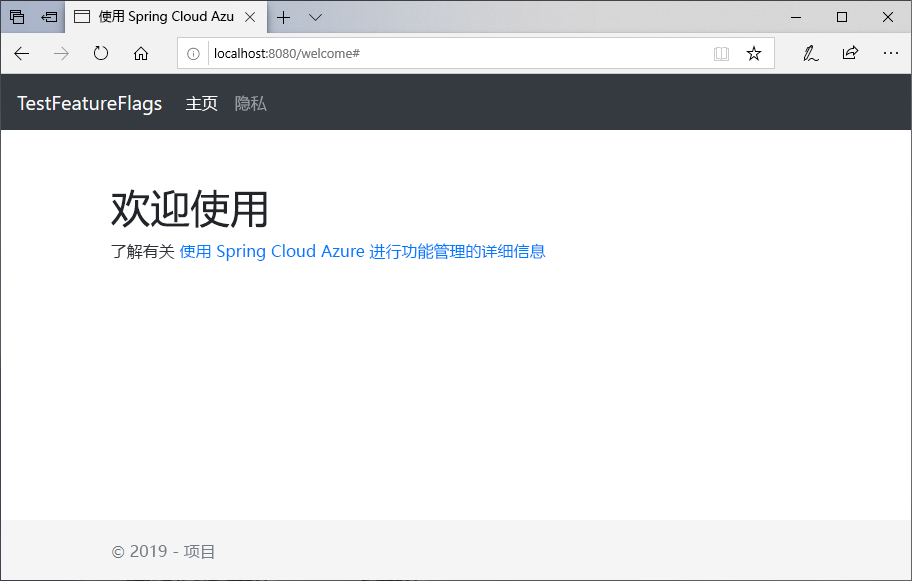
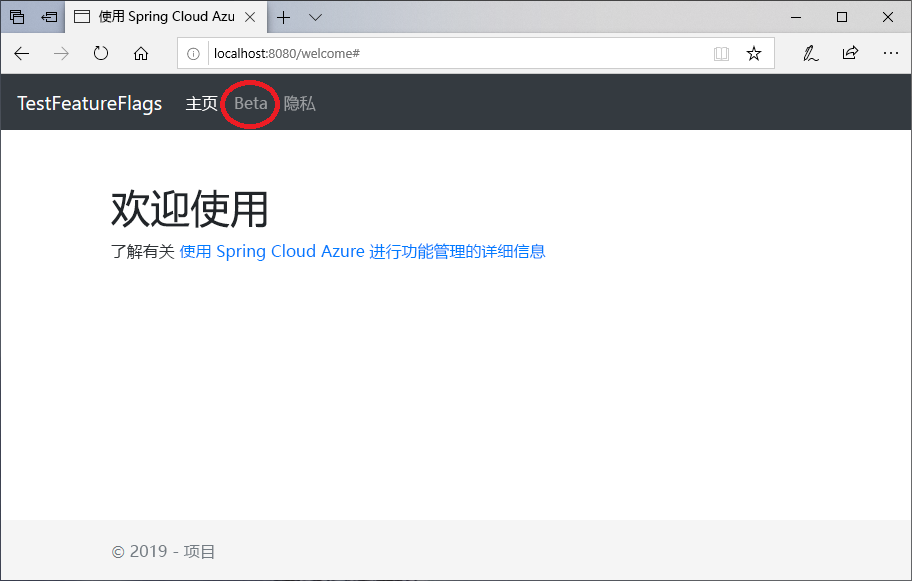

# <a name="quickstart-add-feature-flags-to-a-spring-boot-app"></a>快速入门：将功能标志添加到 Spring Boot 应用

在本快速入门中，你要将 Azure 应用程序配置合并到 Spring Boot Web 应用中，以创建功能管理的端到端实现。 可以使用应用程序配置服务集中存储所有功能标志并控制其状态。

Spring Boot 功能管理库使用全面的功能标志支持扩展了该框架。 这些库**不**依赖于任何 Azure 库。 它们可以通过其 Spring Boot 配置提供程序无缝集成到应用程序配置。

## <a name="prerequisites"></a>先决条件

* Azure 订阅 - [创建免费帐户](https://azure.microsoft.com/free/)
* 支持的 [Java 开发工具包 SDK](https://docs.microsoft.com/java/azure/jdk) 版本 8。
* [Apache Maven](https://maven.apache.org/download.cgi) 版本 3.0 或更高版本。

## <a name="create-an-app-configuration-instance"></a>创建应用程序配置实例

[!INCLUDE [azure-app-configuration-create](../../includes/azure-app-configuration-create.md)]

6. 选择“功能管理器” > “+添加”以添加名为 `Beta` 的功能标志。  

    > [!div class="mx-imgBorder"]
    > 

    暂时不定义 `label`。

## <a name="create-a-spring-boot-app"></a>创建 Spring Boot 应用

使用 [Spring Initializr](https://start.spring.io/) 创建一个新 Spring Boot 项目。

1. 浏览到 <https://start.spring.io/>。

1. 指定以下选项：

   * 使用 **Java** 生成一个 **Maven** 项目。
   * 指定一个其值大于或等于 2.0 的 Spring Boot  版本。
   * 指定应用程序的“组”和“项目”名称。    本文使用 `com.example` 和 `demo`。
   * 添加 **Spring Web** 依赖项。

1. 指定上述选项后，选择“生成项目”  。 出现提示时，将项目下载到本地计算机。

## <a name="add-feature-management"></a>添加功能管理

1. 在本地系统中提取文件后，即可对 Spring Boot 应用程序进行编辑。 在应用的根目录中找到 *pom.xml*。

1. 在文本编辑器中打开 *pom.xml* 文件，将以下内容添加到 `<dependencies>` 列表中：

### <a name="spring-cloud-11x"></a>Spring Cloud 1.1.x

    ```xml
    <dependency>
        <groupId>com.microsoft.azure</groupId>
        <artifactId>spring-cloud-azure-appconfiguration-config</artifactId>
        <version>1.1.2</version>
    </dependency>
    <dependency>
        <groupId>com.microsoft.azure</groupId>
        <artifactId>spring-cloud-azure-feature-management-web</artifactId>
        <version>1.1.2</version>
    </dependency>
    <dependency>
        <groupId>org.springframework.boot</groupId>
        <artifactId>spring-boot-starter-thymeleaf</artifactId>
    </dependency>
    ```

### <a name="spring-cloud-12x"></a>Spring Cloud 1.2.x

    ```xml
    <dependency>
        <groupId>com.microsoft.azure</groupId>
        <artifactId>spring-cloud-azure-appconfiguration-config</artifactId>
        <version>1.2.2</version>
    </dependency>
    <dependency>
        <groupId>com.microsoft.azure</groupId>
        <artifactId>spring-cloud-azure-feature-management-web</artifactId>
        <version>1.2.2</version>
    </dependency>
    <dependency>
        <groupId>org.springframework.boot</groupId>
        <artifactId>spring-boot-starter-thymeleaf</artifactId>
    </dependency>
    ```

> [!Note]
> 有一个非 Web 功能管理库不依赖于 spring-web。 请参阅 GitHub 的[文档](https://github.com/microsoft/spring-cloud-azure/tree/master/spring-cloud-azure-feature-management)来了解差异。

## <a name="connect-to-an-app-configuration-store"></a>连接到应用程序配置存储区

1. 导航到应用的 `resources` 目录并打开 `bootstrap.properties`。  如果该文件不存在，请创建它。 将以下行添加到该文件。

    ```properties
    spring.cloud.azure.appconfiguration.stores[0].name= ${APP_CONFIGURATION_CONNECTION_STRING}
    ```

1. 在配置存储的应用程序配置门户的侧栏中选择 `Access keys`。 选择“只读密钥”选项卡。复制主连接字符串的值。

1. 使用变量名称 `APP_CONFIGURATION_CONNECTION_STRING` 添加环境变量形式的主连接字符串。

1. 打开主应用程序 Java 文件，并添加 `@EnableConfigurationProperties`以启用此功能。

    ```java
    package com.example.demo;

    import org.springframework.boot.SpringApplication;
    import org.springframework.boot.context.properties.ConfigurationProperties;
    import org.springframework.boot.context.properties.EnableConfigurationProperties;
    import org.springframework.boot.autoconfigure.SpringBootApplication;

    @SpringBootApplication
    @EnableConfigurationProperties(MessageProperties.class)
    public class DemoApplication {

        public static void main(String[] args) {
            SpringApplication.run(DemoApplication.class, args);
        }
    }
    ```

1. 在应用的包目录中创建名为 MessageProperties.java 的新 Java 文件  。

    ```java
    package com.example.demo;

    import org.springframework.boot.context.properties.ConfigurationProperties;
    import org.springframework.context.annotation.Configuration;

    @Configuration
    @ConfigurationProperties(prefix = "config")
    public class MessageProperties {
        private String message;

        public String getMessage() {
            return message;
        }

        public void setMessage(String message) {
            this.message = message;
        }
    }
    ```

1. 在应用的包目录中创建新的名为 HelloController.java 的 Java 文件  。

    ```java
    package com.example.demo;

    import org.springframework.boot.context.properties.ConfigurationProperties;
    import org.springframework.stereotype.Controller;
    import org.springframework.ui.Model;

    import com.microsoft.azure.spring.cloud.feature.manager.FeatureManager;
    import org.springframework.web.bind.annotation.GetMapping;


    @Controller
    @ConfigurationProperties("controller")
    public class HelloController {

        private FeatureManager featureManager;

        public HelloController(FeatureManager featureManager) {
            this.featureManager = featureManager;
        }

        @GetMapping("/welcome")
        public String mainWithParam(Model model) {
            model.addAttribute("Beta", featureManager.isEnabledAsync("Beta").block());
            return "welcome";
        }
    }
    ```

1. 在应用的 templates 目录中，创建名为 *welcome.html* 的新 HTML 文件。

    ```html
    <!DOCTYPE html>
    <html lang="en" xmlns:th="http://www.thymeleaf.org">
    <head>
        <meta charset="utf-8">
        <meta name="viewport" content="width=device-width, initial-scale=1, shrink-to-fit=no">
        <title>Feature Management with Spring Cloud Azure</title>

        <link rel="stylesheet" href="/css/main.css">
        <link rel="stylesheet" href="https://stackpath.bootstrapcdn.com/bootstrap/4.3.1/css/bootstrap.min.css" integrity="sha384-ggOyR0iXCbMQv3Xipma34MD+dH/1fQ784/j6cY/iJTQUOhcWr7x9JvoRxT2MZw1T" crossorigin="anonymous">

        <script src="https://code.jquery.com/jquery-3.3.1.slim.min.js" integrity="sha384-q8i/X+965DzO0rT7abK41JStQIAqVgRVzpbzo5smXKp4YfRvH+8abtTE1Pi6jizo" crossorigin="anonymous"></script>
        <script src="https://cdnjs.cloudflare.com/ajax/libs/popper.js/1.14.7/umd/popper.min.js" integrity="sha384-UO2eT0CpHqdSJQ6hJty5KVphtPhzWj9WO1clHTMGa3JDZwrnQq4sF86dIHNDz0W1" crossorigin="anonymous"></script>
        <script src="https://stackpath.bootstrapcdn.com/bootstrap/4.3.1/js/bootstrap.min.js" integrity="sha384-JjSmVgyd0p3pXB1rRibZUAYoIIy6OrQ6VrjIEaFf/nJGzIxFDsf4x0xIM+B07jRM" crossorigin="anonymous"></script>

    </head>
    <body>
        <header>
        <!-- Fixed navbar -->
        <nav class="navbar navbar-expand-md navbar-dark fixed-top bg-dark">
            <a class="navbar-brand" href="#">TestFeatureFlags</a>
            <button class="navbar-toggler" aria-expanded="false" aria-controls="navbarCollapse" aria-label="Toggle navigation" type="button" data-target="#navbarCollapse" data-toggle="collapse">
            <span class="navbar-toggler-icon"></span>
            </button>
            <div class="collapse navbar-collapse" id="navbarCollapse">
            <ul class="navbar-nav mr-auto">
                <li class="nav-item active">
                <a class="nav-link" href="#">Home <span class="sr-only">(current)</span></a>
                </li>
                <li class="nav-item" th:if="${Beta}">
                <a class="nav-link" href="#">Beta</a>
                </li>
                <li class="nav-item">
                <a class="nav-link" href="#">Privacy</a>
                </li>
            </ul>
            </div>
        </nav>
        </header>
        <div class="container body-content">
            <h1 class="mt-5">Welcome</h1>
            <p>Learn more about <a href="https://github.com/microsoft/spring-cloud-azure/blob/master/spring-cloud-azure-feature-management/README.md">Feature Management with Spring Cloud Azure</a></p>

        </div>
        <footer class="footer">
            <div class="container">
            <span class="text-muted">&copy; 2019 - Projects</span>
        </div>

        </footer>
    </body>
    </html>

    ```

1. 在 `static` 下创建名为 CSS 的新文件夹，并在其中创建名为 *main.css* 的新 CSS 文件。

    ```css
    html {
     position: relative;
     min-height: 100%;
    }
    body {
     margin-bottom: 60px;
    }
    .footer {
     position: absolute;
     bottom: 0;
     width: 100%;
     height: 60px;
     line-height: 60px;
     background-color: #f5f5f5;
    }

    body > .container {
     padding: 60px 15px 0;
    }

    .footer > .container {
     padding-right: 15px;
     padding-left: 15px;
    }

    code {
     font-size: 80%;
    }
    ```

## <a name="build-and-run-the-app-locally"></a>在本地生成并运行应用

1. 使用 Maven 生成 Spring Boot 应用程序，然后运行该程序。

    ```shell
    mvn clean package
    mvn spring-boot:run
    ```

1. 打开浏览器窗口，转到本地托管的 Web 应用的默认 URL：`https://localhost:8080`。

    

1. 在应用程序配置门户中选择“功能管理器”，并将“Beta”密钥的状态更改为“打开”：   

    | 密钥 | 状态 |
    |---|---|
    | Beta | 启用 |

1. 刷新浏览器页面，查看新的配置设置。

    

## <a name="clean-up-resources"></a>清理资源

[!INCLUDE [azure-app-configuration-cleanup](../../includes/azure-app-configuration-cleanup.md)]

## <a name="next-steps"></a>后续步骤

在本快速入门中，你已创建一个新的应用程序配置存储，并已使用它来通过[功能管理库](https://go.microsoft.com/fwlink/?linkid=2074664)管理 Spring Boot Web 应用中的功能。

* 详细了解[功能管理](./concept-feature-management.md)。
* [管理功能标志](./manage-feature-flags.md)。
* [在 Spring Boot Core 应用中使用功能标志](./use-feature-flags-spring-boot.md)。
