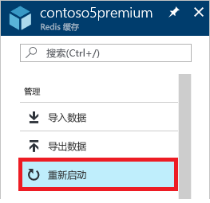
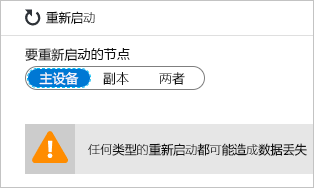

# 如何管理 Azure Redis 缓存
本主题介绍如何为 Azure Redis 缓存实例执行管理任务，如[重启](#reboot)和[计划更新](#schedule-updates)。

[!INCLUDE [updated-for-az](../../includes/updated-for-az.md)]

## 重新启动
可通过“重新启动”边栏选项卡重新启动缓存的一个或多个节点。 如果有缓存节点发生故障，此重新启动功能可用于测试应用程序的复原能力。

选择要重新启动的节点，并单击“重新启动” 。

如果高级缓存启用了群集功能，则可选择要重新启动的缓存分片。

如果要重新启动缓存的一个或多个节点，请选择所需节点，并单击“重新启动”。 如果高级缓存启用了群集功能，请选择要重新启动的所需分片，然后单击“重新启动”。 几分钟后，所选节点将重新启动，再过几分钟后，又会回到联机状态。

对客户端应用程序的影响因用户重新启动的节点而有所不同。

* **主** - 重新启动主节点时，Azure Redis 缓存将故障转移到副本节点，并将其提升为主节点。 在此故障转移期间，可能会有一个较短的时间间隔无法连接到缓存。
* **副本**-重启副本节点时，通常不会影响缓存客户端。
* **主服务器和副本**-在两个缓存节点都重新启动时，缓存中的所有数据都将丢失，并且与缓存的连接将失败，直到主节点重新联机。 如果已配置[数据持久性](cache-how-to-premium-persistence.md)，则在缓存重新联机时会还原最新备份，但在最新备份后发生的所有缓存写入都将丢失。
* **已启用群集的高级缓存的节点** - 重新启动已启用群集的高级缓存的一个或多个节点时，所选节点的行为与重新启动非群集缓存的相应节点时相同。

## 重新启动常见问题解答
* [测试我的应用程序时，应重新启动哪个节点？](#which-node-should-i-reboot-to-test-my-application)
* [能否通过重新启动缓存来清除客户端连接？](#can-i-reboot-the-cache-to-clear-client-connections)
* [如果我执行重新启动，是否会丢失缓存中的数据？](#will-i-lose-data-from-my-cache-if-i-do-a-reboot)
* [能否使用 PowerShell、CLI 或其他管理工具重新启动缓存？](#can-i-reboot-my-cache-using-powershell-cli-or-other-management-tools)

### 测试应用程序时应重新启动哪个节点？
若要针对缓存的主节点故障测试应用程序的复原能力，请重新启动 **主** 节点。 若要针对辅助节点的故障测试应用程序的复原能力，请重新启动**副本**节点。 若要针对缓存的总故障测试应用程序的复原能力，请同时重新启动这 **两个** 节点。

### 能否通过重新启动缓存来清除客户端连接？
能，如果重新启动缓存，则会清除所有客户端连接。 当所有客户端连接均已用完（由于客户端应用程序中的逻辑错误或 Bug）时，重新启动很有用。 每个定价层对于不同大小都有不同的[客户端连接数限制](cache-configure.md#default-redis-server-configuration)，达到这些限制后，将不再接受客户端连接。 通过重新启动缓存可以清除所有客户端连接。

> [!IMPORTANT]
> 如果通过重新启动缓存来清除客户端连接，则一旦 Redis 节点重回联机状态，StackExchange.Redis 就会自动重新连接。 如果未解决这一基本问题，客户端连接会继续用完。
> 
> 

### 如果执行重新启动，是否会丢失缓存中的数据？
如果同时重新启动**主**节点和**副本**节点，则缓存中的所有数据（或该分片，如果你使用的是启用群集的高级缓存）可能会丢失，但这种情况并不保证。 如果已配置[数据持久性](cache-how-to-premium-persistence.md)，则在缓存重新联机时会还原最新备份，但在进行该备份后发生的所有缓存写入都将丢失。

如果只重新启动其中一个节点，数据通常不会丢失，但仍然存在丢失的可能。 例如，如果重新启动主节点时正在进行缓存写入，则缓存写入的数据会丢失。 发生数据丢失的另一种情况是，在重新启动一个节点时，另一个节点恰巧因故障而关闭。 有关数据丢失的可能原因的详细信息，请参阅 [What happened to my data in Redis?](https://gist.github.com/JonCole/b6354d92a2d51c141490f10142884ea4#file-whathappenedtomydatainredis-md)（Redis 中的数据发生了什么情况？）

### 能否使用 PowerShell、CLI 或其他管理工具重新启动缓存？
能，有关 PowerShell 说明，请参阅[重新启动 Azure Redis 缓存](cache-how-to-manage-redis-cache-powershell.md#to-reboot-an-azure-cache-for-redis)。

## 计划更新
使用“计划更新”边栏选项卡可以为缓存实例指定维护时段。 维护时段允许您控制一周中的哪一天和时间，在该时间段内托管缓存的 VM 可以更新。 适用于 Redis 的 Azure 缓存将尽力在你定义的指定时间范围内启动并完成更新 Redis 服务器软件的工作。

> [!NOTE] 
> 维护时段仅适用于 Redis 服务器更新，不适用于任何 Azure 更新或托管缓存的 VM 的操作系统更新。
>

如果要指定维护时段，请勾选合适的日期，并指定每天的维护时段开始时间，最后再单击“确定”。 请注意，维护时段使用 UTC 时间。 

更新的默认最小维护时段为 5 小时。 此值不可以在 Azure 门户中配置，但可以在 PowerShell 中使用 [New-AzRmRedisCacheScheduleEntry](/powershell/module/az.rediscache/new-azrediscachescheduleentry) cmdlet 的 `MaintenanceWindow` 参数进行配置。 有关详细信息，请参阅是否可以使用 PowerShell、CLI 或其他管理工具管理计划的更新？

## 计划更新常见问题解答
* [如果我不使用计划更新功能，何时进行更新？](#when-do-updates-occur-if-i-dont-use-the-schedule-updates-feature)
* [在计划的维护时段进行哪种类型的更新？](#what-type-of-updates-are-made-during-the-scheduled-maintenance-window)
* [能否使用 PowerShell、CLI 或其他管理工具管理计划的更新？](#can-i-managed-scheduled-updates-using-powershell-cli-or-other-management-tools)

### 如果不使用计划更新功能，何时进行更新？
如果未指定维护时段，可以随时进行更新。

### 在计划性维护时段进行哪种类型的更新？
仅在计划的维护时段进行 Redis 服务器更新。 维护时段不适用于 Azure 更新或 VM 操作系统更新。

### 有关详细信息，请参阅能否使用 PowerShell、CLI 或其他管理工具管理计划的更新？
可以使用以下 PowerShell cmdlet 管理计划的更新：

* [Get-AzRedisCachePatchSchedule](/powershell/module/az.rediscache/get-azrediscachepatchschedule)
* [New-AzRedisCachePatchSchedule](/powershell/module/az.rediscache/new-azrediscachepatchschedule)
* [New-AzRedisCacheScheduleEntry](/powershell/module/az.rediscache/new-azrediscachescheduleentry)
* [Remove-AzRedisCachePatchSchedule](/powershell/module/az.rediscache/remove-azrediscachepatchschedule)

## 后续步骤
* 了解更多 [Azure Redis 缓存高级层](cache-premium-tier-intro.md)功能。

