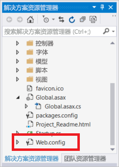
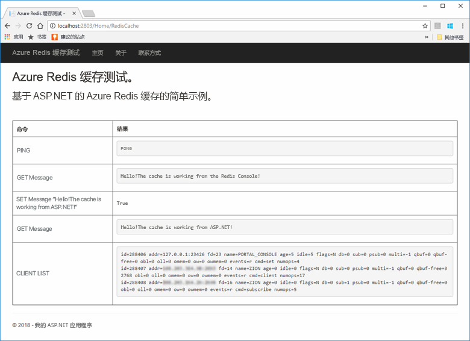
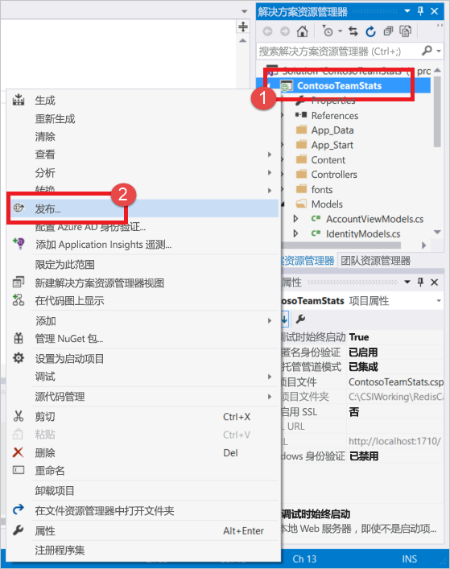
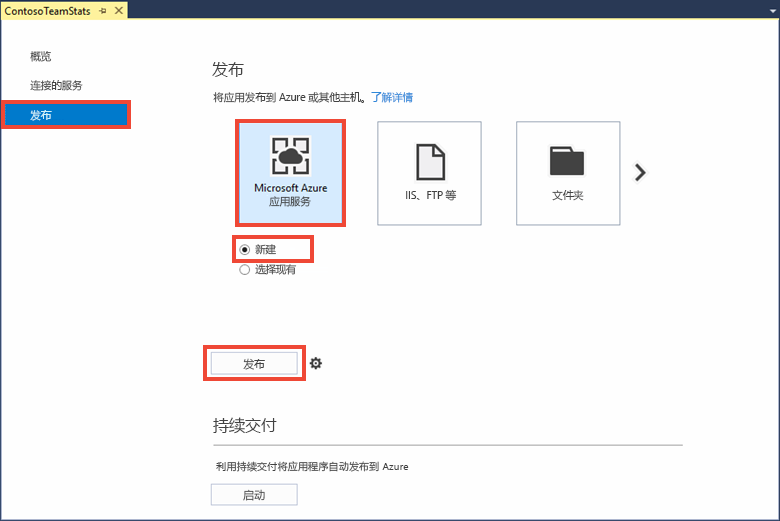
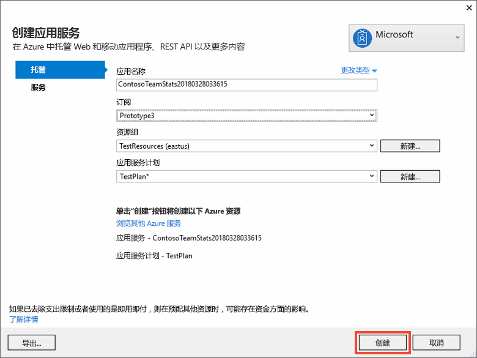
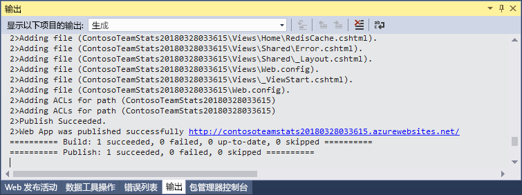
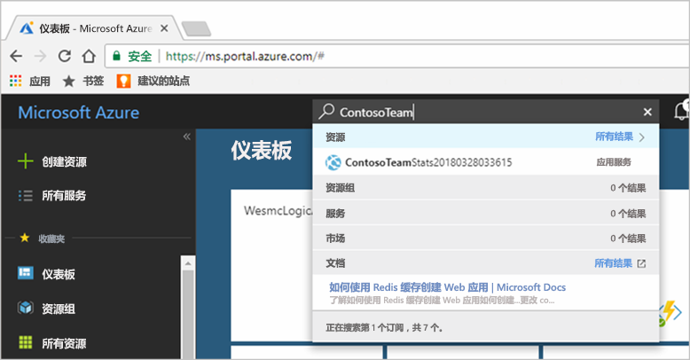
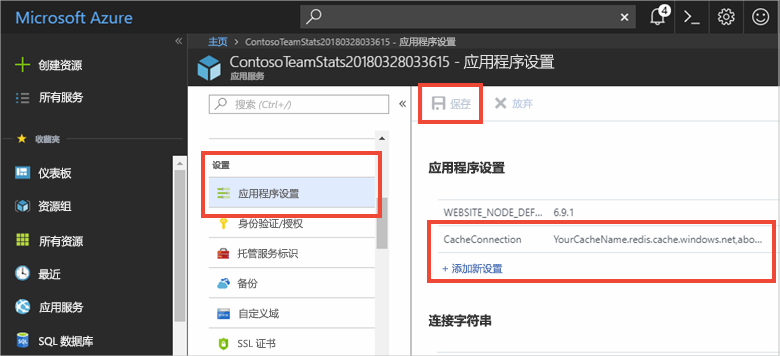
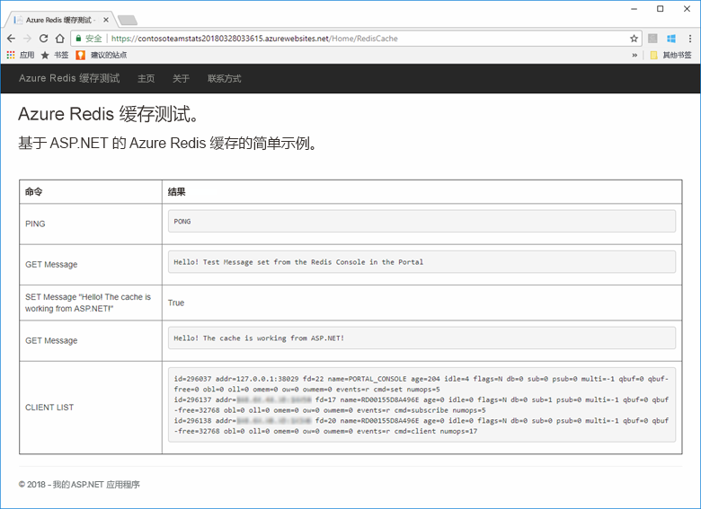
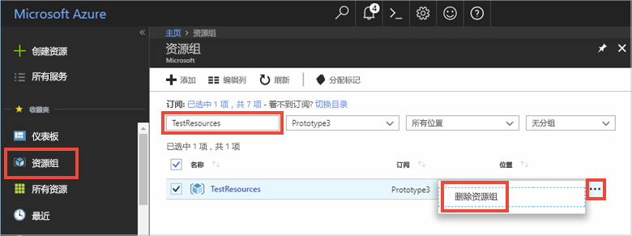

# <a name="quickstart-use-azure-cache-for-redis-with-an-aspnet-web-app"></a>快速入门：将 Azure Redis 缓存与 ASP.NET Web 应用配合使用 

在本快速入门中，将使用 Visual Studio 2019 创建一个 ASP.NET Web 应用程序，该应用程序连接到 Azure Redis 缓存以存储和检索缓存中的数据。 然后，将该应用部署到 Azure 应用服务。

## <a name="prerequisites"></a>先决条件

- Azure 订阅 - [创建免费帐户](https://azure.microsoft.com/free/)
- [Visual Studio 2019](https://www.visualstudio.com/downloads/)，其中包含 **ASP.NET 和 Web 开发**以及 **Azure 开发**工作负载。

## <a name="create-the-visual-studio-project"></a>创建 Visual Studio 项目

1. 打开 Visual Studio，然后选择“文件”**** >“新建”**** > “项目”****。

2. 在“新建项目”对话框中执行以下步骤：****

    

    a. 在“模板”列表中展开“Visual C#”节点。**** ****

    b. 选择“云”。****

    c. 选择“ASP.NET Web 应用程序”****。

    d. 验证是否已选择“.NET Framework 4.5.2”或更高版本。****

    e. 在“名称”框中，为项目提供一个名称。**** 在此示例中，我们使用了 **ContosoTeamStats**。

    f. 选择“确定”****。
   
3. 选择“MVC”作为项目类型。****

4. 对于“身份验证”设置，请确保指定“不进行身份验证”。**** **** 默认的“身份验证”设置可能因 Visual Studio 版本而异。**** 若要对其进行更改，请选择“更改身份验证”，然后选择“不进行身份验证”。**** ****

5. 选择“确定”**** 以创建项目。

## <a name="create-a-cache"></a>创建缓存

接下来，为应用创建缓存。

[!INCLUDE [redis-cache-create](../../includes/redis-cache-create.md)]

[!INCLUDE [redis-cache-access-keys](../../includes/redis-cache-access-keys.md)]

#### <a name="to-edit-the-cachesecretsconfig-file"></a>编辑 *CacheSecrets.config* 文件的步骤

1. 在计算机上创建名为 *CacheSecrets.config* 的文件。将其放到不会连同示例应用程序的源代码一起签入的位置。 在本快速入门中，*CacheSecrets.config* 文件的路径为 *C:\AppSecrets\CacheSecrets.config*。

1. 编辑 *CacheSecrets.config* 文件。 然后添加以下内容：

    ```xml
    <appSettings>
        <add key="CacheConnection" value="<cache-name>.redis.cache.windows.net,abortConnect=false,ssl=true,allowAdmin=true,password=<access-key>"/>
    </appSettings>
    ```

1. 将 `<cache-name>` 替换为缓存主机名。

1. 将 `<access-key>` 替换缓存的主密钥。

    > [!TIP]
    > 在密钥轮换期间重新生成主访问密钥时，可以将辅助访问密钥用作备用密钥。
   >
1. 保存文件。

## <a name="update-the-mvc-application"></a>更新 MVC 应用程序

在本部分，请对应用程序进行更新，使之支持一个新视图，该视图显示针对 Azure Redis 缓存执行的一项简单测试。

* [使用缓存的应用设置更新 web.config 文件](#update-the-webconfig-file-with-an-app-setting-for-the-cache)
* 将应用程序配置为使用 StackExchange.Redis 客户端
* 更新 HomeController 和布局
* 添加新的 RedisCache 视图

### <a name="update-the-webconfig-file-with-an-app-setting-for-the-cache"></a>使用缓存的应用设置更新 web.config 文件

在本地运行应用程序时，将使用 CacheSecrets.config 中的信息连接到 Azure Redis 缓存实例**。 稍后请将此应用程序部署到 Azure。 到时，请在 Azure 中配置一项应用设置，供应用程序用来检索缓存连接信息而不是此文件。 

由于 *CacheSecrets.config* 文件未连同应用程序一起部署到 Azure，因此，只是在本地测试应用程序时才使用此文件。 请尽量安全地保管此信息，防止有人恶意访问缓存数据。

#### <a name="to-update-the-webconfig-file"></a>更新 *web.config* 文件的步骤
1. 在“解决方案资源管理器”中，双击“web.config”文件将其打开。******

    

2. 在 *web.config* 文件中找到 `<appSetting>` 元素。 然后添加以下 `file` 属性。 如果使用了其他文件名或位置，请使用这些值来替换示例中显示的值。

* 之前： `<appSettings>`
* 之后：`<appSettings file="C:\AppSecrets\CacheSecrets.config">`

ASP.NET 运行时合并了外部文件的内容以及 `<appSettings>` 元素中的标记。 如果找不到指定的文件，运行时会忽略文件属性。 应用程序的源代码中将不包括机密（连接到缓存的连接字符串）。 将 Web 应用部署到 Azure 时，不会部署 CacheSecrets.config** 文件。

### <a name="to-configure-the-application-to-use-stackexchangeredis"></a>将应用程序配置为使用 StackExchange.Redis 的步骤

1. 若要将应用配置为使用 Visual Studio 的 [StackExchange.Redis](https://github.com/StackExchange/StackExchange.Redis) NuGet 包，请选择“工具”>“NuGet 包管理器”>“包管理器控制台”。****

2. 从 `Package Manager Console` 窗口运行以下命令：

    ```powershell
    Install-Package StackExchange.Redis
    ```

3. NuGet 程序包会为客户端应用程序下载并添加所需的程序集引用，以通过 StackExchange.Azure Redis 缓存客户端访问 Azure Redis 缓存。 如果更愿使用强命名版本的 `StackExchange.Redis` 客户端库，请安装 `StackExchange.Redis.StrongName` 包。

### <a name="to-update-the-homecontroller-and-layout"></a>更新 HomeController 和布局的步骤

1. 在“解决方案资源管理器”中展开“Controllers”文件夹，然后打开“HomeController.cs”文件。**** ******

2. 在文件的顶部添加以下两个 `using` 语句，以支持缓存客户端和应用设置。

    ```csharp
    using System.Configuration;
    using StackExchange.Redis;
    ```

3. 将以下方法添加到 `HomeController` 类，使之支持针对新缓存运行某些命令的新 `RedisCache` 操作。

    ```csharp
    public ActionResult RedisCache()
    {
        ViewBag.Message = "A simple example with Azure Cache for Redis on ASP.NET.";

        var lazyConnection = new Lazy<ConnectionMultiplexer>(() =>
        {
            string cacheConnection = ConfigurationManager.AppSettings["CacheConnection"].ToString();
            return ConnectionMultiplexer.Connect(cacheConnection);
        });

        // Connection refers to a property that returns a ConnectionMultiplexer
        // as shown in the previous example.
            
        using (ConnectionMultiplexer redis = lazyConnection.Value)
        {
            IDatabase cache = redis.GetDatabase();

            // Perform cache operations using the cache object...

            // Simple PING command
            ViewBag.command1 = "PING";
            ViewBag.command1Result = cache.Execute(ViewBag.command1).ToString();

            // Simple get and put of integral data types into the cache
            ViewBag.command2 = "GET Message";
            ViewBag.command2Result = cache.StringGet("Message").ToString();

            ViewBag.command3 = "SET Message \"Hello! The cache is working from ASP.NET!\"";
            ViewBag.command3Result = cache.StringSet("Message", "Hello! The cache is working from ASP.NET!").ToString();

            // Demonstrate "SET Message" executed as expected...
            ViewBag.command4 = "GET Message";
            ViewBag.command4Result = cache.StringGet("Message").ToString();

            // Get the client list, useful to see if connection list is growing...
            ViewBag.command5 = "CLIENT LIST";
            StringBuilder sb = new StringBuilder();

            var endpoint = (System.Net.DnsEndPoint)Connection.GetEndPoints()[0];
            var server = Connection.GetServer(endpoint.Host, endpoint.Port);
            var clients = server.ClientList();

            sb.AppendLine("Cache response :");
            foreach (var client in clients)
            {
                sb.AppendLine(client.Raw);
            }

            ViewBag.command5Result = sb.ToString();

        return View();
    }
                
    private static Lazy<ConnectionMultiplexer> lazyConnection = new Lazy<ConnectionMultiplexer>(() =>
    {
        string cacheConnection = ConfigurationManager.AppSettings["CacheConnection"].ToString();
        return ConnectionMultiplexer.Connect(cacheConnection);
    });

    public static ConnectionMultiplexer Connection
    {
        get
        {
            return lazyConnection.Value;
        }
    }

    ```

4. 在**解决方案资源管理器**中，展开“视图” > “共享”文件夹。**** **** 然后打开 *_Layout.cshtml* 文件。

    将：
    
    ```csharp
    @Html.ActionLink("Application name", "Index", "Home", new { area = "" }, new { @class = "navbar-brand" })
    ```

    替换为：

    ```csharp
    @Html.ActionLink("Azure Cache for Redis Test", "RedisCache", "Home", new { area = "" }, new { @class = "navbar-brand" })
    ```

### <a name="to-add-a-new-rediscache-view"></a>添加新 RedisCache 视图的步骤

1. 在“解决方案资源管理器”中，展开“Views”文件夹，并右键单击“Home”文件夹。**** **** **** 选择“添加” > “视图...”。**** ****

2. 在“添加视图”对话框中，输入 **RedisCache** 作为视图名称。**** 然后选择“添加”****。

3. 将 *RedisCache.cshtml* 文件中的代码替换为以下代码：

    ```csharp
    @{
        ViewBag.Title = "Azure Cache for Redis Test";
    }

    <h2>@ViewBag.Title.</h2>
    <h3>@ViewBag.Message</h3>
    <br /><br />
    <table border="1" cellpadding="10">
        <tr>
            <th>Command</th>
            <th>Result</th>
        </tr>
        <tr>
            <td>@ViewBag.command1</td>
            <td><pre>@ViewBag.command1Result</pre></td>
        </tr>
        <tr>
            <td>@ViewBag.command2</td>
            <td><pre>@ViewBag.command2Result</pre></td>
        </tr>
        <tr>
            <td>@ViewBag.command3</td>
            <td><pre>@ViewBag.command3Result</pre></td>
        </tr>
        <tr>
            <td>@ViewBag.command4</td>
            <td><pre>@ViewBag.command4Result</pre></td>
        </tr>
        <tr>
            <td>@ViewBag.command5</td>
            <td><pre>@ViewBag.command5Result</pre></td>
        </tr>
    </table>
    ```

## <a name="run-the-app-locally"></a>在本地运行应用

默认情况下，项目配置为在 [IIS Express](https://docs.microsoft.com/iis/extensions/introduction-to-iis-express/iis-express-overview) 本地托管应用，以进行测试和调试。

### <a name="to-run-the-app-locally"></a>在本地运行应用的步骤
1. 在 Visual Studio 中选择“调试” > “开始调试”，在本地生成并启动用于测试和调试的应用。**** ****

2. 在浏览器中，选择导航栏上的“Azure Redis 缓存测试”。****

3. 在下面的示例中，`Message` 键以前有一个缓存值，该值是在门户中使用 Azure Redis 缓存控制台设置的。 应用更新了该缓存值。 应用还执行了 `PING` 和 `CLIENT LIST` 命令。

    

## <a name="publish-and-run-in-azure"></a>在 Azure 中发布和运行

在本地成功测试应用后，即可将应用部署到 Azure 并在云中运行它。

### <a name="to-publish-the-app-to-azure"></a>将应用发布到 Azure 的步骤

1. 在 Visual Studio 中右键单击解决方案资源管理器中的项目节点， 然后选择“发布”。****

    

2. 依次选择“Microsoft Azure 应用服务”、“新建”、“发布”。**** **** ****

    

3. 在“创建应用服务”对话框中进行以下更改：****

    | 设置 | 建议的值 | 说明 |
    | ------- | :---------------: | ----------- |
    | **应用名称** | 使用默认值。 | 应用名称是应用部署到 Azure 时对应的主机名。 如果需要让该名称保持唯一，可在其后添加一个时间戳后缀。 |
    | **订阅** | 选择自己的 Azure 订阅。 | 将对此订阅收取任何相关的托管费用。 如果有多个 Azure 订阅，请验证是否选择了所需的订阅。|
    | **资源组** | 使用在其中创建了此缓存的资源组（例如，*TestResourceGroup*）。 | 该资源组用于将所有资源作为一个组管理。 以后想要删除此应用时，可以直接删除该组。 |
    | **应用服务计划** | 选择“新建”，然后创建名为 *TestingPlan* 的新应用服务计划。**** <br />使用创建缓存时所用的相同**位置**。 <br />选择“免费”作为大小。**** | 应用服务计划为要运行的 Web 应用定义一组计算资源。 |

    

4. 配置应用服务托管设置以后，请选择“创建”****。

5. 监视 Visual Studio 中的“输出”窗口，了解发布状态。**** 发布应用后，系统会记录应用的 URL：

    

### <a name="add-the-app-setting-for-the-cache"></a>为缓存添加应用设置

发布新应用以后，请添加新应用设置。 此设置用于存储缓存连接信息。 

#### <a name="to-add-the-app-setting"></a>添加应用设置的步骤 

1. 在 Azure 门户顶部的搜索栏中键入应用名称，查找刚创建的新应用。

    

2. 为应用添加名为 **CacheConnection** 的新应用设置，用于连接到缓存。 使用在 *CacheSecrets.config* 文件中为 `CacheConnection` 配置的相同值。 该值包含缓存主机名和访问密钥。

    

### <a name="run-the-app-in-azure"></a>在 Azure 中运行应用

在浏览器中，转到应用的 URL。 该 URL 显示在 Visual Studio 输出窗口的发布操作结果中。 此外，在 Azure 门户中，所创建应用的概览页上也提供了该 URL。

选择导航栏上的“Azure Redis 缓存测试”以测试缓存访问****。



## <a name="clean-up-resources"></a>清理资源

如果想要继续学习下一篇教程，可以保留本快速入门中创建的资源，以便重复使用。

如果已完成快速入门示例应用程序，可以删除本快速入门中创建的 Azure 资源，以免产生费用。 

> [!IMPORTANT]
> 删除资源组的操作不可逆。 删除资源组时，包含在其中的所有资源会被永久删除。 请确保不会意外删除错误的资源组或资源。 如果在现有资源组（其中包含要保留的资源）中为托管此示例而创建了相关资源，可从各自的边栏选项卡逐个删除这些资源，而不要删除资源组。

### <a name="to-delete-a-resource-group"></a>删除资源组的步骤

1. 登录到 [Azure 门户](https://portal.azure.com)，然后选择“资源组”。****

2. 在“按名称筛选...”框中键入资源组的名称****。 本文的说明使用了名为 *TestResources* 的资源组。 在资源组的结果列表中选择“...”，然后选择“删除资源组”**** ****。

    

系统会要求确认是否删除资源组。 键入资源组的名称进行确认，然后选择“删除”****。

片刻之后，将会删除该资源组及其所有资源。

## <a name="next-steps"></a>后续步骤

下一个教程会在一个更真实的场景中使用 Azure Redis 缓存来改善应用的性能。 请更新此应用程序，以便使用 ASP.NET 和数据库的缓存端模式来缓存排行榜结果。

> [!div class="nextstepaction"]
> [在 ASP.NET 中创建缓存端排行榜](cache-web-app-cache-aside-leaderboard.md)
