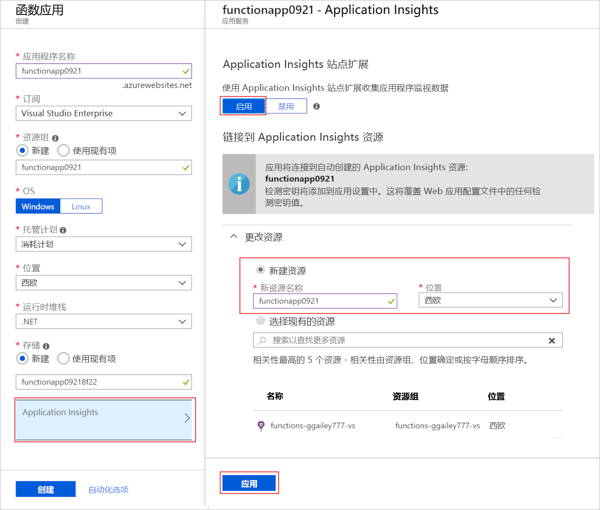

# <a name="how-to-configure-monitoring-for-azure-functions"></a>如何配置 Azure Functions 的监视

Azure Functions 与 Application Insights 集成，使你能够更好地监视函数应用。 Application Insights 是 Azure Monitor 的一项功能，它是一种可扩展的应用程序性能管理， (APM) 服务，该服务可收集函数应用生成的数据，包括应用程序写入日志的信息。 创建函数应用时，通常会启用 Application Insights 集成。 如果应用没有设置检测密钥，则必须首先 [启用 Application Insights 集成](#enable-application-insights-integration)。 

可以使用 Application Insights 而无需任何自定义配置。 默认配置可能会产生大量数据。 如果使用的是 Visual Studio Azure 订阅，可能会达到 Application Insights 的数据上限。 若要详细了解 Application Insights 成本，请参阅 [管理 Application Insights 的使用情况和成本](../azure-monitor/app/pricing.md)。

本文后面的部分将介绍如何配置和自定义函数发送到 Application Insights 的数据。 对于函数应用，在 [host.json] 文件中配置日志记录。 

> [!NOTE]
> 您可以使用专门配置的应用程序设置来表示特定环境的 host.js文件中的特定设置。 这使你可以有效地更改设置 host.js，而不必在项目中重新发布文件 host.js。 若要了解详细信息，请参阅 [覆盖值 host.js](functions-host-json.md#override-hostjson-values)。

## <a name="configure-categories"></a>配置类别

对于每个日志，Azure Functions 记录器都包含一个类别。 类别指示运行时代码或函数代码的哪个部分编写日志。 版本1.x 和更高版本之间的类别有所不同。 下表描述了运行时创建的日志的主要类别。 

# <a name="v2x"></a>[v2. x +](#tab/v2)

| 类别 | 表 | 说明 |
| ----- | ----- | ----- |
| **`Function.<YOUR_FUNCTION_NAME>`** | **项**| 系统会自动收集一些服务的依赖关系数据。 如果成功运行，则这些日志位于 `Information` 级别。 若要了解详细信息，请参阅 [依赖关系](functions-monitoring.md#dependencies)。 在级别记录异常 `Error` 。 运行时还会创建 `Warning` 级别日志，例如将队列消息发送到 [有害队列](functions-bindings-storage-queue-trigger.md#poison-messages)的时间。 | 
| **`Function.<YOUR_FUNCTION_NAME>`** | **customMetrics**<br/>**customEvents** | C # 和 JavaScript Sdk 使你可以收集自定义指标并记录自定义事件。 若要了解详细信息，请参阅 [自定义遥测数据](functions-monitoring.md#custom-telemetry-data)。|
| **`Function.<YOUR_FUNCTION_NAME>`** | **traces**| 包括特定函数运行的已启动和已完成的日志。 如果成功运行，则这些日志位于 `Information` 级别。 在级别记录异常 `Error` 。 运行时还会创建 `Warning` 级别日志，例如将队列消息发送到 [有害队列](functions-bindings-storage-queue-trigger.md#poison-messages)的时间。 | 
| **`Function.<YOUR_FUNCTION_NAME>.User`** | **traces**| 用户生成的日志，可以是任何日志级别。 若要详细了解如何从函数写入日志，请参阅 [写入日志](functions-monitoring.md#writing-to-logs)。 | 
| **`Host.Aggregator`** | **customMetrics** | 这些运行时生成的日志提供了 [可配置](#configure-the-aggregator) 时间段内函数调用的计数和平均值。 默认时段为 30 秒或 1,000 个结果，以先满足的条件为准。 示例包括运行数、成功率和持续时间。 所有这些日志均在 `Information` 级别编写。 如果在 `Warning` 或更高级别进行筛选，则不会看到任何这些数据。 |
| **`Host.Results`** | **requests** | 这些运行时生成的日志指示函数是成功还是失败。 所有这些日志均在 `Information` 级别编写。 如果在 `Warning` 或更高级别进行筛选，则不会看到任何这些数据。 |
| **`Microsoft`** | **traces** | 完全限定的日志类别，反映了主机调用的 .NET 运行时组件。  |
| **`Worker`** | **traces** | Non-.NET 语言的语言辅助进程生成的日志。 语言辅助角色日志还可以记录在 `Microsoft.*` 类别中，例如 `Microsoft.Azure.WebJobs.Script.Workers.Rpc.RpcFunctionInvocationDispatcher` 。 这些日志在级别上写入 `Information` 。|

# <a name="v1x"></a>[v1.x](#tab/v1)

| 类别 | 表 | 说明 |
| ----- | ----- | ----- |
| **`Function`** | **traces**| 用户生成的日志，可以是任何日志级别。 若要详细了解如何从函数写入日志，请参阅 [写入日志](functions-monitoring.md#writing-to-logs)。 | 
| **`Host.Aggregator`** | **customMetrics** | 这些运行时生成的日志提供了 [可配置](#configure-the-aggregator) 时间段内函数调用的计数和平均值。 默认时段为 30 秒或 1,000 个结果，以先满足的条件为准。 示例包括运行数、成功率和持续时间。 所有这些日志均在 `Information` 级别编写。 如果在 `Warning` 或更高级别进行筛选，则不会看到任何这些数据。 |
| **`Host.Executor`** | **traces** | 包括 **已启动的函数** 和用于特定函数运行的 **函数完成** 日志。 对于成功运行，这些日志属于 `Information` 级别。 异常在 `Error` 级别记录。 运行时还会创建 `Warning` 级别日志，例如将队列消息发送到 [有害队列](functions-bindings-storage-queue-trigger.md#poison-messages)的时间。  |
| **`Host.Results`** | **requests** | 这些运行时生成的日志指示函数是成功还是失败。 所有这些日志均在 `Information` 级别编写。 如果在 `Warning` 或更高级别进行筛选，则不会看到任何这些数据。 |

---

**Table**列指示 Application Insights 日志写入哪个表。 

## <a name="configure-log-levels"></a>配置日志级别

[!INCLUDE [functions-log-levels](../../includes/functions-log-levels.md)]

对于每个类别，均可以指示要发送的最小日志级别。 根据 [函数运行时版本](functions-versions.md)的不同，设置 host.js会有所不同。 

下面的示例基于以下规则定义日志记录：

+ 对于或的 `Host.Results` 日志 `Function` ，仅在 `Error` 或更高级别上记录事件。 
+ 对于日志 `Host.Aggregator` ，请记录所有生成的指标 (`Trace`) 。
+ 对于所有其他日志（包括用户日志），只记录 `Information` 级别和更高的事件。

# <a name="v2x"></a>[v2. x +](#tab/v2)

```json
{
  "logging": {
    "fileLoggingMode": "always",
    "logLevel": {
      "default": "Information",
      "Host.Results": "Error",
      "Function": "Error",
      "Host.Aggregator": "Trace"
    }
  }
}
```

# <a name="v1x"></a>[v1.x](#tab/v1) 

```json
{
  "logger": {
    "categoryFilter": {
      "defaultLevel": "Information",
      "categoryLevels": {
        "Host.Results": "Error",
        "Function": "Error",
        "Host.Aggregator": "Trace"
      }
    }
  }
}
```

---

如果 [ 上的host.js] 包含以同一字符串开头的多个日志，则首先匹配定义更多的日志。 请考虑以下示例，该示例记录运行时中的所有内容，但 `Host.Aggregator` `Error` 级别除外：

# <a name="v2x"></a>[v2. x +](#tab/v2)

```json
{
  "logging": {
    "fileLoggingMode": "always",
    "logLevel": {
      "default": "Information",
      "Host": "Error",
      "Function": "Error",
      "Host.Aggregator": "Information"
    }
  }
}
```

# <a name="v1x"></a>[v1.x](#tab/v1) 

```json
{
  "logger": {
    "categoryFilter": {
      "defaultLevel": "Information",
      "categoryLevels": {
        "Host": "Error",
        "Function": "Error",
        "Host.Aggregator": "Information"
      }
    }
  }
}
```

---

您可以使用日志级别设置来 `None` 阻止为某个类别写入任何日志。 

## <a name="configure-the-aggregator"></a>配置聚合器

如前一部分中所述，运行时聚合一段时间内有关函数执行的数据。 默认时段为 30 秒或 1,000 次运行，以先满足的条件为准。 可以在 [host.json] 文件中配置此设置。  下面是一个示例：

```json
{
    "aggregator": {
      "batchSize": 1000,
      "flushTimeout": "00:00:30"
    }
}
```

## <a name="configure-sampling"></a>配置采样

Application Insights 具有[采样](../azure-monitor/app/sampling.md)功能，可以防止在峰值负载时为已完成的执行生成过多的遥测数据。 当传入执行的速率超过指定的阈值时，Application Insights 开始随机忽略某些传入执行。 每秒执行的最大次数的默认设置为 20（版本 1.x 中为 5）。 可以在 [host.json](./functions-host-json.md#applicationinsights) 中配置采样。  下面是一个示例：

# <a name="v2x"></a>[v2. x +](#tab/v2)

```json
{
  "logging": {
    "applicationInsights": {
      "samplingSettings": {
        "isEnabled": true,
        "maxTelemetryItemsPerSecond" : 20,
        "excludedTypes": "Request;Exception"
      }
    }
  }
}
```


可以从采样中排除某些类型的遥测数据。 在此示例中，类型和的数据 `Request` `Exception` 已从采样中排除。 这可以确保在其他类型的遥测仍受采样的情况下记录 (请求) 和异常的 *所有* 函数执行。 

# <a name="v1x"></a>[v1.x](#tab/v1)  

```json
{
  "applicationInsights": {
    "sampling": {
      "isEnabled": true,
      "maxTelemetryItemsPerSecond" : 5
    }
  }
}
```
---

若要了解详细信息，请参阅 [Application Insights 中的采样](../azure-monitor/app/sampling.md)。

## <a name="configure-scale-controller-logs"></a>配置缩放控制器日志

_此功能为预览版。_ 

可以让 [Azure Functions 缩放控制器](./functions-scale.md#runtime-scaling) 向 Application Insights 或 Blob 存储发送日志，以便更好地了解规模控制器为 function app 做出的决策。

若要启用此功能，请将名为的应用程序设置添加 `SCALE_CONTROLLER_LOGGING_ENABLED` 到 function app 设置。 此设置的值必须采用基于以下规范的 `<DESTINATION>:<VERBOSITY>` 格式：

[!INCLUDE [functions-scale-controller-logging](../../includes/functions-scale-controller-logging.md)]

例如，以下 Azure CLI 命令会启用从缩放控制器到 Application Insights 的详细日志记录：

```azurecli-interactive
az functionapp config appsettings set --name <FUNCTION_APP_NAME> \
--resource-group <RESOURCE_GROUP_NAME> \
--settings SCALE_CONTROLLER_LOGGING_ENABLED=AppInsights:Verbose
```

在此示例中，请将 `<FUNCTION_APP_NAME>` 和 `<RESOURCE_GROUP_NAME>` 分别替换为函数应用名称和资源组名称。 

以下 Azure CLI 命令通过将详细程度设置为 `None` 来禁用日志记录：

```azurecli-interactive
az functionapp config appsettings set --name <FUNCTION_APP_NAME> \
--resource-group <RESOURCE_GROUP_NAME> \
--settings SCALE_CONTROLLER_LOGGING_ENABLED=AppInsights:None
```

还可以通过使用以下 Azure CLI 命令删除 `SCALE_CONTROLLER_LOGGING_ENABLED` 设置来禁用日志记录：

```azurecli-interactive
az functionapp config appsettings delete --name <FUNCTION_APP_NAME> \
--resource-group <RESOURCE_GROUP_NAME> \
--setting-names SCALE_CONTROLLER_LOGGING_ENABLED
```

## <a name="enable-application-insights-integration"></a>启用 Application Insights 集成

对于将数据发送到 Application Insights 的函数应用，它需要知道 Application Insights 资源的检测密钥。 该密钥必须位于名为 **APPINSIGHTS_INSTRUMENTATIONKEY** 的应用设置中。

[在 Azure 门户中](functions-create-first-azure-function.md)创建函数应用时，请在命令行中使用 [Azure Functions Core Tools](functions-create-first-azure-function-azure-cli.md) 或 [Visual Studio Code](functions-create-first-function-vs-code.md)，默认情况下会启用 Application Insights 集成。 Application Insights 资源的名称与函数应用的相同，并且在同一区域或最接近的区域中创建。

### <a name="new-function-app-in-the-portal"></a>门户中的新函数应用

若要查看正在创建的 Application Insights 资源，请选择该资源，展开“Application Insights”窗口。 可以更改“新建资源名称”，或者在 [Azure 地理位置](https://azure.microsoft.com/global-infrastructure/geographies/)中选择另一个需要在其中存储数据的“位置” 。



选择“创建”时，Application Insights 资源通过函数应用创建，该函数应用在应用程序设置中设置了 `APPINSIGHTS_INSTRUMENTATIONKEY`。 一切准备就绪。

<a id="manually-connect-an-app-insights-resource"></a>
### <a name="add-to-an-existing-function-app"></a>添加到现有函数应用 

如果未使用 function app 创建 Application Insights 资源，请使用以下步骤来创建资源。 然后，可以添加该资源中的检测密钥，作为函数应用中的[应用程序设置](functions-how-to-use-azure-function-app-settings.md#settings)。

1. 在 [Azure 门户](https://portal.azure.com)中，搜索并选择 " **function app**"，然后选择函数应用。 

1. 选择窗口顶部的“未配置 Application Insights”横幅。 如果看不到此横幅，则应用可能已启用 Application Insights。

    :::image type="content" source="media/configure-monitoring/enable-application-insights.png" alt-text="从门户启用 Application Insights":::

1. 展开“更改资源”，使用下表中指定的设置创建 Application Insights 资源。  

    | 设置      | 建议的值  | 描述                                        |
    | ------------ |  ------- | -------------------------------------------------- |
    | **新资源名称** | 唯一的应用名称 | 使用与函数应用相同的名称是最方便的，该名称在订阅中必须独一无二。 | 
    | **位置** | 西欧 | 尽可能使用函数应用所在的同一[区域](https://azure.microsoft.com/regions/)，或与该区域接近的区域。 |

    :::image type="content" source="media/configure-monitoring/ai-general.png" alt-text="从门户启用 Application Insights":::

1. 选择“应用”。 

   Application Insights 资源在与函数应用相同的资源组和订阅中创建。 创建资源后，关闭 Application Insights 窗口。

1. 在函数应用中，选择“设置”下的“配置”，然后选择“应用程序设置”。   如果看到名为 `APPINSIGHTS_INSTRUMENTATIONKEY` 的设置，则表明已为在 Azure 中运行的函数应用启用 Application Insights 集成。 如果由于某种原因而不存在此设置，请使用 Application Insights 检测密钥来添加它作为值。

> [!NOTE]
> 早期版本的 Functions 使用了内置监视功能，现不再建议使用该功能。 为此类函数应用启用 Application Insights 集成时，还必须[禁用内置日志记录功能](#disable-built-in-logging)。  

## <a name="disable-built-in-logging"></a>禁用内置日志记录

启用 Application Insights 时，请禁用使用 Azure 存储的内置日志记录。 内置日志记录对于使用轻工作负载测试非常有用，但不适合在高负载生产环境中使用。 对于生产监视，建议使用 Application Insights。 如果在生产环境中使用内置日志记录，日志记录可能因 Azure 存储限制而不完整。

若要禁用内置日志记录，请删除 `AzureWebJobsDashboard` 应用设置。 有关如何在 Azure 门户中删除应用设置的信息，请参阅[如何管理函数应用](functions-how-to-use-azure-function-app-settings.md#settings)的“应用程序设置”部分。 在删除应用设置之前，请确保同一函数应用中没有任何现有的函数将此设置用于 Azure 存储触发器或绑定。

## <a name="next-steps"></a>后续步骤

若要了解有关监视的详细信息，请参阅：

+ [监视 Azure Functions](functions-monitoring.md)
+ [分析 Application Insights 中 Azure Functions 遥测数据](analyze-telemetry-data.md)
+ [Application Insights](/azure/application-insights/)


[host.json]: functions-host-json.md
