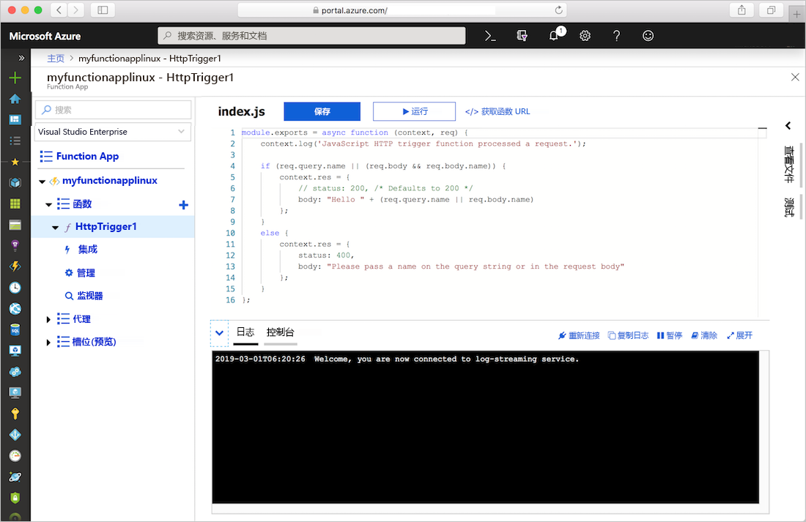
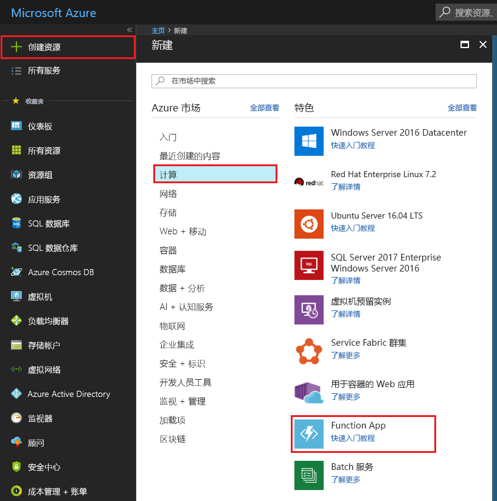
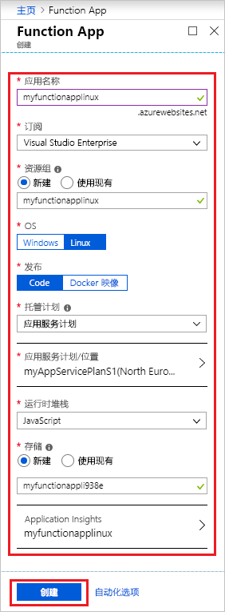
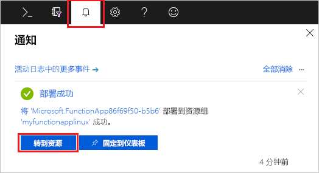
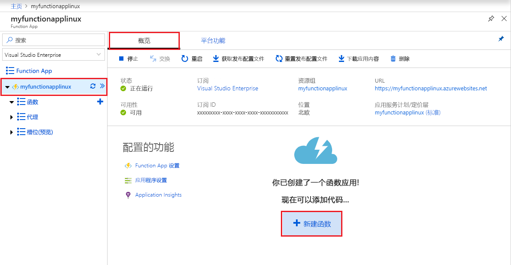
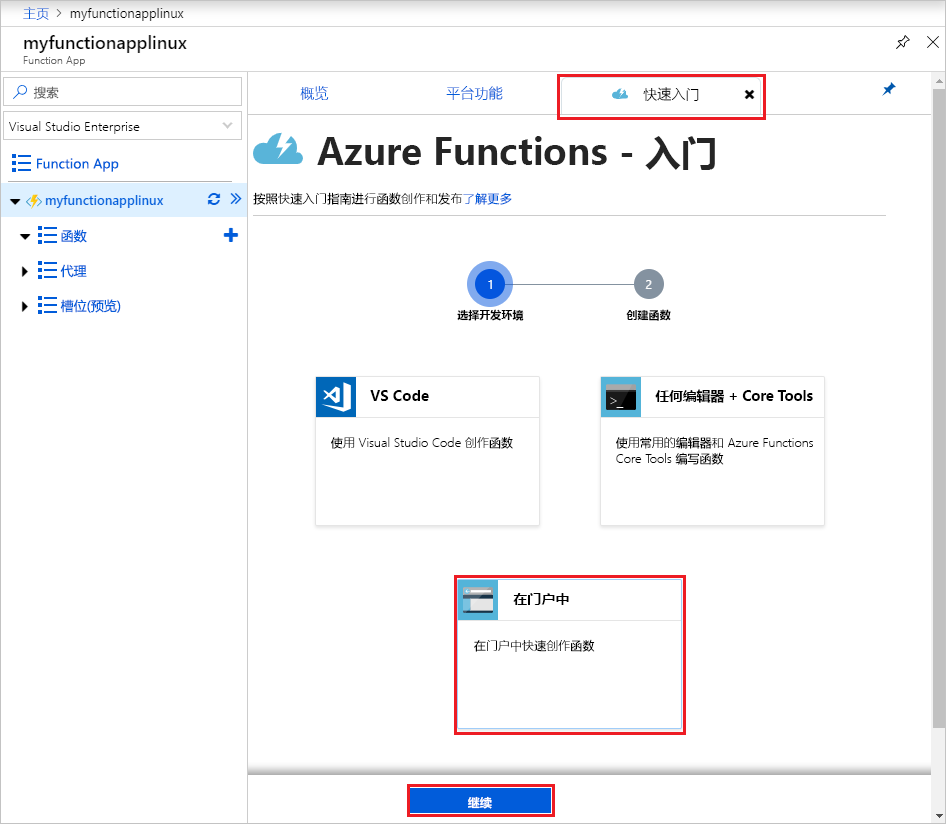
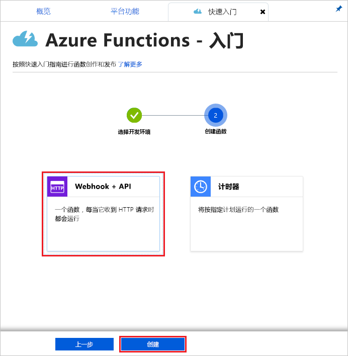
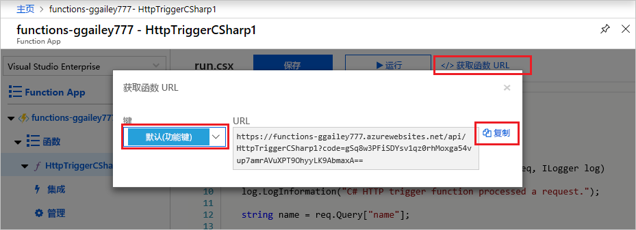

# 在 Azure 应用服务计划中创建 Linux 上的函数应用

使用 Azure Functions 可将函数托管在 Linux 上的默认 Azure 应用服务容器中。 本文逐步讲解如何使用 [Azure 门户](https://portal.azure.com)创建一个在[应用服务计划](functions-scale.md#app-service-plan)中运行的由 Linux 托管的函数应用。 还可以[自带自定义的容器](functions-create-function-linux-custom-image.md)。

[!INCLUDE [quickstarts-free-trial-note](../../includes/quickstarts-free-trial-note.md)]

## 登录 Azure

使用 Azure 帐户登录到 <https://portal.azure.com> 的 Azure 门户。

## 创建函数应用

必须使用函数应用在 Linux 上托管函数的执行。 函数应用提供一个用于执行函数代码的环境。 它可让你将函数分组为一个逻辑单元，以便更轻松地管理、部署和共享资源。 在本文中，我们将在创建函数应用时创建应用服务计划。

1. 选择 Azure 门户左上角的“创建资源”按钮，然后选择“计算” > “函数应用”。   

    

2. 使用图像下面的表格中指定的函数应用设置。

    

    | 设置      | 建议的值  | 说明                                        |
    | ------------ |  ------- | -------------------------------------------------- |
    | **应用名称** | 全局唯一名称 | 用于标识新 Function App 的名称。 有效的字符是 `a-z`、`0-9` 和 `-`。  | 
    | **订阅** | 订阅 | 要在其下创建此新函数应用的订阅。 | 
    |  [资源组](../azure-resource-manager/resource-group-overview.md) |  myResourceGroup | 要在其中创建 Function App 的新资源组的名称。 |
    | **OS** | Linux | 该函数应用在 Linux 上运行。 |
    | **发布** | 代码 | 将使用**运行时堆栈**的默认 Linux 容器。 只需提供函数应用项目代码即可。 另一个选项是发布自定义的 [Docker 映像](functions-create-function-linux-custom-image.md)。 |
    |  [托管计划](functions-scale.md) | 应用服务计划 | 定义如何将资源分配给 Function App 的托管计划。 在应用服务计划中运行时，可以控制[函数应用的缩放](functions-scale.md)。  |
    | **应用服务计划/位置** | 创建计划 | 选择“新建”并提供**应用服务计划**的名称。  在与你靠近或者与函数要访问的其他服务靠近的[区域](https://azure.microsoft.com/regions/)中选择一个**位置**。 选择所需的 **[定价层](https://azure.microsoft.com/pricing/details/app-service/linux/)** 。  不能在同一个应用服务计划中同时运行 Linux 和 Windows 函数应用。 |
    | **运行时堆栈** | 首选语言 | 选择支持你喜欢的函数编程语言的运行时。 对于 C# 和 F# 函数，选择 **.NET**。 [Python 支持](functions-reference-python.md)目前为预览版。 |
    | **[存储](../storage/common/storage-quickstart-create-account.md)** |  全局唯一名称 |  创建函数应用使用的存储帐户。 存储帐户名称必须为 3 到 24 个字符，并且只能包含数字和小写字母。 也可使用现有帐户，但该帐户必须符合[存储帐户要求](functions-scale.md#storage-account-requirements)。 |
    | **[Application Insights](functions-monitoring.md)** | 已启用 | 默认会启用 Application Insights。 我们建议立即启用 Application Insights 集成，并选择靠近应用服务计划位置的某个托管位置。 如果希望在以后执行此操作，请参阅[监视 Azure Functions](functions-monitoring.md)。  |

3. 选择“创建”  以预配和部署函数应用。

4. 选择门户右上角的“通知”图标，留意是否显示“部署成功”消息。 

    

5. 选择“转到资源”  ，查看新的函数应用。

接下来，在新的 Function App 中创建一个函数。 即使函数应用可用，它也可能需要花费几分钟时间才能完全初始化。

## 创建 HTTP 触发的函数

本部分介绍如何使用门户在新的函数应用中创建函数。

> [!NOTE]
> 可以在门户开发体验中试用 Azure Functions。 对于大多数方案，请考虑在本地开发函数，然后使用 [Visual Studio Code](functions-create-first-function-vs-code.md#create-an-azure-functions-project) 或 [Azure Functions Core Tools](functions-run-local.md#create-a-local-functions-project) 将项目发布到函数应用。  

1. 在新函数应用中选择“概述”选项卡，完全加载该应用后，选择“+ 新建函数”。  

    

1. 在“快速入门”选项卡中选择“门户中”，然后选择“继续”。   

    

1. 选择“WebHook + API”  ，然后选择“创建”  。

    

此时将使用 HTTP 触发的函数的特定于语言模板创建函数。

现在，可以通过发送 HTTP 请求来运行新函数了。

## 测试函数

1. 在新函数中，单击右上角的“</> 获取函数 URL”，选择“默认(函数密钥)”，然后单击“复制”    。 

    

2. 将函数 URL 粘贴到浏览器的地址栏中。 将查询字符串值 `&name=<yourname>` 添加到该 URL 尾部，然后按键盘上的 `Enter` 键来执行请求。 此时会看到函数返回的响应显示在浏览器中。  

    以下示例显示了浏览器中的响应：

    

    请求 URL 包含通过 HTTP 访问函数默认所需的密钥。

3. 运行函数时，会在日志中写入跟踪信息。 若要查看上次执行的跟踪输出，请返回到门户中的函数，并单击屏幕底部的箭头以展开“日志”  。

   

## 清理资源

[!INCLUDE [Clean-up resources](../../includes/functions-quickstart-cleanup.md)]

## 后续步骤

已使用简单的 HTTP 触发函数创建 Function App。  

[!INCLUDE [Next steps note](../../includes/functions-quickstart-next-steps.md)]

有关详细信息，请参阅 [Azure Functions HTTP 绑定](functions-bindings-http-webhook.md)。
