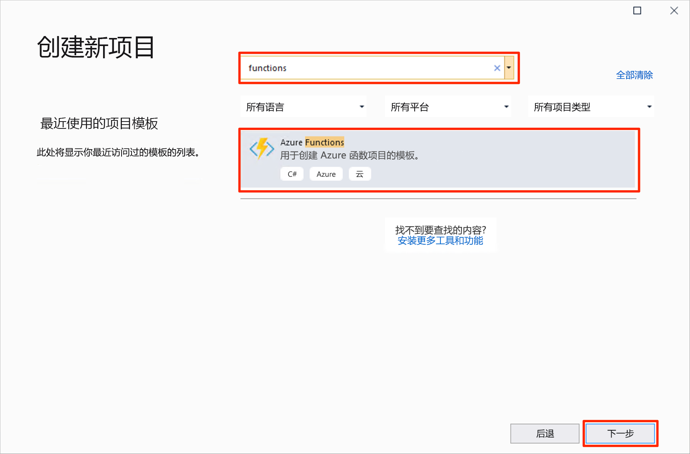

# <a name="create-your-first-durable-function-in-c"></a>使用 C\# 创建你的第一个持久函数

*Durable Functions* 是 [Azure Functions](../functions-overview.md) 的一个扩展，可用于在无服务器环境中编写有状态函数。 该扩展可用于管理状态、检查点和重启。

本文介绍了如何使用 Azure Functions 的 Visual Studio 2019 工具在本地创建并测试“hello world”持久函数。  此函数将协调对其他函数的调用并将其链接在一起。 然后将函数代码发布到 Azure。 Visual Studio 2019 中的 Azure 开发工作负荷已随附这些工具。


## <a name="prerequisites"></a>先决条件

完成本教程：

* 安装 [Visual Studio 2019](https://azure.microsoft.com/downloads/)。 确保还安装了 **Azure 开发**工作负荷。

* 请确保你有[最新的 Azure Functions 工具](../functions-develop-vs.md#check-your-tools-version)。

* 验证 [Azure 存储模拟器](../../storage/common/storage-use-emulator.md)是否已安装且正在运行。

[!INCLUDE [quickstarts-free-trial-note](../../../includes/quickstarts-free-trial-note.md)]

## <a name="create-a-function-app-project"></a>创建函数应用项目

Azure Functions 模板创建一个项目，该项目可发布到 Azure 中的函数应用。 函数应用可将函数分组为一个逻辑单元，以用于管理、部署和共享资源。

1. 在 Visual Studio 中，从“文件”  菜单中选择“新建”   > “项目”  。

2. 在“新建项目”  对话框中，选择“已安装”  ，展开“Visual C#”   > “云”  ，选择“Azure Functions”  ，键入项目的“名称”  ，然后单击“确定”  。 函数应用名称必须可以充当 C# 命名空间，因此请勿使用下划线、连字符或任何其他的非字母数字字符。

    

3. 使用图像后的表中指定的设置。

    

    | 设置      | 建议的值  | Description                      |
    | ------------ |  ------- |----------------------------------------- |
    | **版本** | Azure Functions 2.x <br />(.NET Core) | 创建一个函数项目，并让其使用 Azure Functions 的版本 2.x 运行时（支持 .NET Core）。 Azure Functions 1.x 支持 .NET Framework。 有关详细信息，请参阅[如何指向 Azure Functions 运行时版本](../functions-versions.md)。   |
    | **模板** | 空 | 创建一个空的函数应用。 |
    | **存储帐户**  | 存储模拟器 | 要进行持久函数状态管理，需要一个存储帐户。 |

4. 单击“确定”  以创建一个空的函数项目。 此项目具有运行函数所需的基本配置文件。

## <a name="add-functions-to-the-app"></a>向应用中添加函数

以下步骤使用模板在项目中创建持久函数代码。

1. 在 Visual Studio 中右键单击该项目并选择“添加” > “新建 Azure 函数”。  

    

2. 在添加菜单中确认选择“Azure 函数”  ，并为你的 C# 文件提供一个名称。  按“添加”  。

3. 选择“Durable Functions 业务流程”  模板并单击“确定” 

      

一个新的持久函数将添加到应用中。  打开新的 .cs 文件以查看内容。 此持久函数是一个简单的函数链接示例，包含以下方法：  

| 方法 | FunctionName | 说明 |
| -----  | ------------ | ----------- |
| **`RunOrchestrator`** | `<file-name>` | 管理持久业务流程。 在此示例中，业务流程启动，创建一个列表，并将三个函数调用的结果添加到列表中。  当三个函数调用完成后，它返回该列表。 |
| **`SayHello`** | `<file-name>_Hello` | 此函数返回一个 hello。 此函数包含要协调的业务逻辑。 |
| **`HttpStart`** | `<file-name>_HttpStart` | [HTTP 触发的函数](../functions-bindings-http-webhook.md)，用于启动业务流程的实例并返回检查状态响应。 |

现在，你已创建了函数项目和一个持久函数，可以在本地计算机上对其进行测试。

## <a name="test-the-function-locally"></a>在本地测试函数

使用 Azure Functions Core Tools 可以在本地开发计算机上运行 Azure Functions 项目。 首次从 Visual Studio 启动某个函数时，系统会提示你安装这些工具。

1. 若要测试函数，请按 F5。 如果系统提示，请按 Visual Studio 的请求下载和安装 Azure Functions Core (CLI) 工具。 可能还需启用一个防火墙例外，以便这些工具能够处理 HTTP 请求。

2. 从 Azure Functions 运行时输出复制函数的 URL。

    

3. 将 HTTP 请求的 URL 粘贴到浏览器的地址栏中并执行请求。 下面演示浏览器中函数返回的对本地 GET 请求的响应：

    

    响应是来自 HTTP 函数的初始结果，让我们知道持久业务流程已成功启动。  它还不是业务流程的最终结果。  响应中包括了几个有用的 URL。  现在，让我们查询业务流程的状态。

4. 复制 `statusQueryGetUri` 的 URL 值，将其粘贴到浏览器的地址栏中并执行请求。

    请求将查询业务流程实例的状态。 应当会得到如下所示的最终响应。  这向我们指明实例已完成，并且包括了持久函数的输出或结果。

    ```json
    {
        "instanceId": "d495cb0ac10d4e13b22729c37e335190",
        "runtimeStatus": "Completed",
        "input": null,
        "customStatus": null,
        "output": [
            "Hello Tokyo!",
            "Hello Seattle!",
            "Hello London!"
        ],
        "createdTime": "2018-11-08T07:07:40Z",
        "lastUpdatedTime": "2018-11-08T07:07:52Z"
    }
    ```

5. 若要停止调试，请按 **Shift + F5**。

验证该函数可以在本地计算机上正确运行以后，即可将项目发布到 Azure。

## <a name="publish-the-project-to-azure"></a>将项目发布到 Azure

必须在 Azure 订阅中有一个函数应用，然后才能发布项目。 可以直接从 Visual Studio 创建函数应用。

[!INCLUDE [Publish the project to Azure](../../../includes/functions-vstools-publish.md)]

## <a name="test-your-function-in-azure"></a>在 Azure 中测试函数

1. 从“发布”配置文件页复制函数应用的基 URL。 将 URL 的 `localhost:port` 部分（在本地测试函数时使用）替换为新的基 URL。

    调用持久函数 HTTP 触发器的 URL 应采用以下格式：

        http://<APP_NAME>.azurewebsites.net/api/<FUNCTION_NAME>_HttpStart

2. 将 HTTP 请求的这个新 URL 粘贴到浏览器的地址栏中。 你应当会得到与之前使用已发布的应用时相同的状态响应。

## <a name="next-steps"></a>后续步骤

你已使用 Visual Studio 创建并发布了一个 C# 持久函数应用。

> [!div class="nextstepaction"]
> [了解常见的持久函数模式。](durable-functions-concepts.md)
