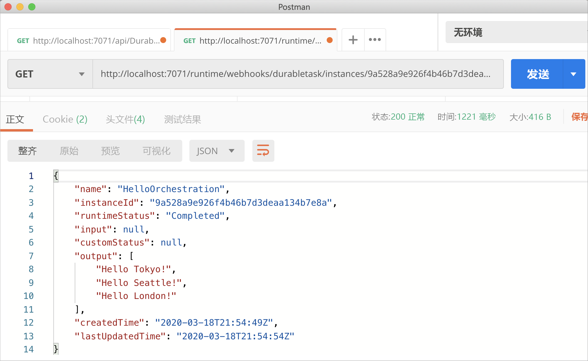
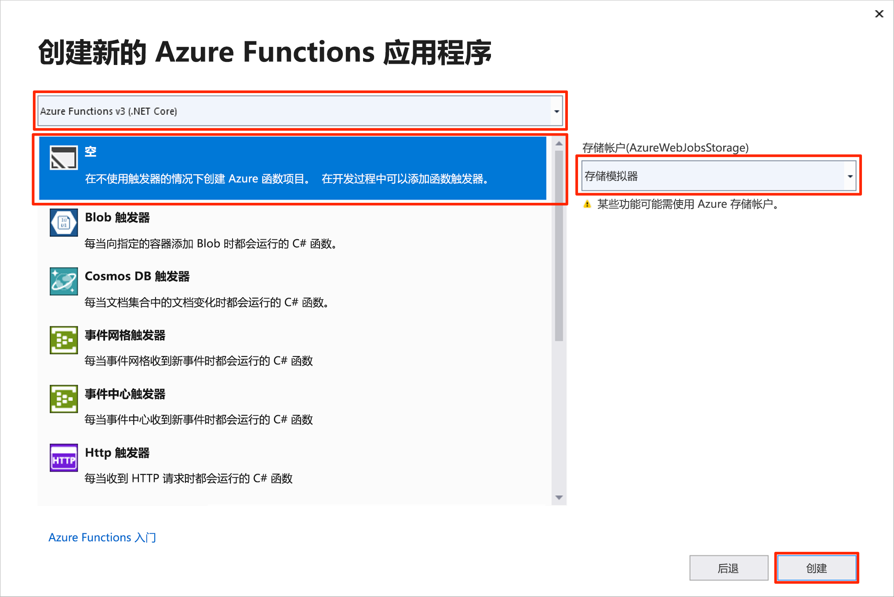

# <a name="create-your-first-durable-function-in-c"></a>使用 C\# 创建你的第一个持久函数

*Durable Functions* 是 [Azure Functions](../functions-overview.md) 的一个扩展，可用于在无服务器环境中编写有状态函数。 该扩展可用于管理状态、检查点和重启。

::: zone pivot="code-editor-vscode"

本文介绍了如何使用 Visual Studio Code 在本地创建并测试“hello world”持久函数。  此函数将协调对其他函数的调用并将其链接在一起。 然后将函数代码发布到 Azure。 这些工具作为 VS Code [Azure Functions 扩展](https://marketplace.visualstudio.com/items?itemName=ms-azuretools.vscode-azurefunctions)的一部分提供。



## <a name="prerequisites"></a>必备条件

完成本教程：

* 安装 [Visual Studio Code](https://code.visualstudio.com/download)。

* 安装以下 VS Code 扩展：
    - [Azure Functions](https://marketplace.visualstudio.com/items?itemName=ms-azuretools.vscode-azurefunctions)
    - [C#](https://marketplace.visualstudio.com/items?itemName=ms-dotnettools.csharp)

* 请确保安装了最新版本的 [Azure Functions Core Tools](../functions-run-local.md)。

* Durable Functions 需要一个 Azure 存储帐户。 需要一个 Azure 订阅。

* 请确保安装 3.1 或更高版本的 [.NET Core SDK](https://dotnet.microsoft.com/download)。

[!INCLUDE [quickstarts-free-trial-note](../../../includes/quickstarts-free-trial-note.md)]

## <a name="create-your-local-project"></a><a name="create-an-azure-functions-project"></a>创建本地项目 

在本部分，你将使用 Visual Studio Code 创建一个本地 Azure Functions 项目。 

1. 在 Visual Studio Code 中，按 F1（或 Ctrl/命令键+Shift+P）打开命令面板。 在命令面板中，搜索并选择 `Azure Functions: Create New Project...`。

    

1. 为项目选择一个空文件夹位置，然后选择“选择”。

1. 按照提示提供以下信息：

    | Prompt | 值 | 说明 |
    | ------ | ----- | ----------- |
    | 选择函数应用项目的语言 | C# | 创建本地 C# Functions 项目。 |
    | 选择版本 | Azure Functions v3 | 仅当尚未安装 Core Tools 时，才会出现此选项。 在本例中，当你首次运行应用时即已安装 Core Tools。 |
    | 为项目的第一个函数选择模板 | 暂时跳过 | |
    | 选择打开项目的方式 | 在当前窗口中打开 | 在所选的文件夹中重新打开 VS Code。 |

Visual Studio Code 会根据需要安装 Azure Functions Core Tools。 它还会在某个文件夹中创建一个函数应用项目。 此项目包含 [host.json](../functions-host-json.md) 和 [local.settings.json](../functions-run-local.md#local-settings-file) 配置文件。

## <a name="add-functions-to-the-app"></a>向应用中添加函数

以下步骤使用模板在项目中创建持久函数代码。

1. 在命令面板中，搜索并选择 `Azure Functions: Create Function...`。

1. 按照提示提供以下信息：

    | Prompt | 值 | 说明 |
    | ------ | ----- | ----------- |
    | 选择函数的模板 | DurableFunctionsOrchestration | 创建 Durable Functions 业务流程 |
    | 提供函数名称 | HelloOrchestration | 在其中创建函数的类的名称 |
    | 提供命名空间 | Company.Function | 所生成类的命名空间 |

1. 当 VS Code 提示选择存储帐户时，请选择“选择存储帐户”。 按照提示提供以下信息，以在 Azure 中创建新的存储帐户。

    | Prompt | 值 | 说明 |
    | ------ | ----- | ----------- |
    | 选择订阅 | *订阅的名称* | 选择 Azure 订阅 |
    | 选择存储帐户 | 新建存储帐户 |  |
    | 输入新存储帐户的名称 | *唯一名称* | 要创建的存储帐户的名称 |
    | 选择资源组 | *唯一名称* | 要创建的资源组名称 |
    | 选择位置 | *region* | 选择离你较近的区域 |

包含新函数的类会添加到此项目。 VS Code 还将存储帐户连接字符串添加到 *local.settings.json*，并将对 [`Microsoft.Azure.WebJobs.Extensions.DurableTask`](https://www.nuget.org/packages/Microsoft.Azure.WebJobs.Extensions.DurableTask) NuGet 包的引用添加到 *.csproj* 项目文件。

打开新的 *HelloOrchestration.cs* 文件，查看其内容。 此持久函数是一个简单的函数链接示例，包含以下方法：  

| 方法 | FunctionName | 说明 |
| -----  | ------------ | ----------- |
| **`RunOrchestrator`** | `HelloOrchestration` | 管理持久业务流程。 在此示例中，业务流程启动，创建一个列表，并将三个函数调用的结果添加到列表中。  当三个函数调用完成后，它返回该列表。 |
| **`SayHello`** | `HelloOrchestration_Hello` | 此函数返回一个 hello。 函数包含要协调的业务逻辑。 |
| **`HttpStart`** | `HelloOrchestration_HttpStart` | [HTTP 触发的函数](../functions-bindings-http-webhook.md)，用于启动业务流程的实例并返回检查状态响应。 |

现在，你已创建了函数项目和一个持久函数，可以在本地计算机上对其进行测试。

## <a name="test-the-function-locally"></a>在本地测试函数

使用 Azure Functions Core Tools 可以在本地开发计算机上运行 Azure Functions 项目。 首次从 Visual Studio Code 启动某个函数时，系统会提示你安装这些工具。

1. 若要测试函数，请在 `SayHello` 活动函数代码中设置断点，然后按 F5 启动函数应用项目。 来自 Core Tools 的输出会显示在“终端”面板中。

    > [!NOTE]
    > 有关调试的详细信息，请参阅 [Durable Functions 诊断](durable-functions-diagnostics.md#debugging)。

1. 在“终端”  面板中，复制 HTTP 触发的函数的 URL 终结点。

    

1. 使用 [Postman](https://www.getpostman.com/) 或 [cURL](https://curl.haxx.se/) 之类的工具向 URL 终结点发送一个 HTTP POST 请求。

   响应是来自 HTTP 函数的初始结果，让我们知道持久业务流程已成功启动。 它还不是业务流程的最终结果。 响应中包括了几个有用的 URL。 现在，让我们查询业务流程的状态。

1. 复制 `statusQueryGetUri` 的 URL 值，将其粘贴到浏览器的地址栏中并执行请求。 或者也可以继续使用 Postman 发出 GET 请求。

   请求将查询业务流程实例的状态。 你应该会得到一个最终响应，它显示实例已经完成，并包含持久函数的输出或结果。 输出如下所示： 

    ```json
    {
        "name": "HelloOrchestration",
        "instanceId": "9a528a9e926f4b46b7d3deaa134b7e8a",
        "runtimeStatus": "Completed",
        "input": null,
        "customStatus": null,
        "output": [
            "Hello Tokyo!",
            "Hello Seattle!",
            "Hello London!"
        ],
        "createdTime": "2020-03-18T21:54:49Z",
        "lastUpdatedTime": "2020-03-18T21:54:54Z"
    }
    ```

1. 若要停止调试，请在 VS Code 中按 **Shift + F5**。

确认该函数可以在本地计算机上正确运行以后，即可将项目发布到 Azure。

[!INCLUDE [functions-create-function-app-vs-code](../../../includes/functions-sign-in-vs-code.md)]

[!INCLUDE [functions-publish-project-vscode](../../../includes/functions-publish-project-vscode.md)]

## <a name="test-your-function-in-azure"></a>在 Azure 中测试函数

1. 从“输出”  面板复制 HTTP 触发器的 URL。 调用 HTTP 触发的函数的 URL 应采用以下格式：

    `https://<functionappname>.azurewebsites.net/api/HelloOrchestration_HttpStart`

1. 将 HTTP 请求的这个新 URL 粘贴到浏览器的地址栏中。 你应当会得到与之前使用已发布的应用时相同的状态响应。

## <a name="next-steps"></a>后续步骤

你已使用 Visual Studio Code 创建并发布了一个 C# 持久函数应用。

> [!div class="nextstepaction"]
> [了解常见的持久函数模式](durable-functions-overview.md#application-patterns)

::: zone-end

::: zone pivot="code-editor-visualstudio"

本文介绍了如何使用 Visual Studio 2019 在本地创建并测试“hello world”持久函数。  此函数将协调对其他函数的调用并将其链接在一起。 然后将函数代码发布到 Azure。 Visual Studio 2019 中的 Azure 开发工作负荷已随附这些工具。


## <a name="prerequisites"></a>必备条件

完成本教程：

* 安装 [Visual Studio 2019](https://visualstudio.microsoft.com/vs/)。 确保还安装了 **Azure 开发**工作负荷。 Visual Studio 2017 也支持 Durable Functions 开发，但 UI 和步骤不同。

* 验证 [Azure 存储模拟器](../../storage/common/storage-use-emulator.md)是否已安装且正在运行。

[!INCLUDE [quickstarts-free-trial-note](../../../includes/quickstarts-free-trial-note.md)]

## <a name="create-a-function-app-project"></a>创建函数应用项目

Azure Functions 模板创建一个项目，该项目可发布到 Azure 中的函数应用。 函数应用可将函数分组为逻辑单元，以便更轻松地管理、部署、缩放和共享资源。

1. 在 Visual Studio 中，从“文件”菜单中选择“新建” > “项目”。

1. 在“创建新项目”对话框中，搜索 `functions`，选择“Azure Functions”模板，然后选择“下一步”。 

    

1. 为项目键入**项目名称**，然后选择“确定”****。 项目名称必须可以充当 C# 命名空间，因此请勿使用下划线、连字符或任何其他的非字母数字字符。

1. 在“新建 Azure Functions 应用程序”**** 中，使用图片后面的表中指定的设置。

    

    | 设置      | 建议的值  | 说明                      |
    | ------------ |  ------- |----------------------------------------- |
    | **版本** | Azure Functions 3.0 <br />(.NET Core) | 创建一个函数项目，并让其使用 Azure Functions 的版本 3.0 运行时（支持 .NET Core 3.1）。 有关详细信息，请参阅[如何指向 Azure Functions 运行时版本](../functions-versions.md)。   |
    | **模板** | 空 | 创建一个空的函数应用。 |
    | **存储帐户**  | 存储模拟器 | 要进行持久函数状态管理，需要一个存储帐户。 |

4. 选择“创建”**** 以创建一个空的函数项目。 此项目具有运行函数所需的基本配置文件。

## <a name="add-functions-to-the-app"></a>向应用中添加函数

以下步骤使用模板在项目中创建持久函数代码。

1. 在 Visual Studio 中右键单击该项目并选择“添加” > “新建 Azure 函数”。 

    

1. 确认从“添加”菜单中选择了“Azure 函数”****，键入 C# 文件的名称，然后选择“添加”****。

1. 选择“Durable Functions 业务流程”**** 模板并选择“确定”****

    

一个新的持久函数将添加到应用中。  打开新的 .cs 文件以查看内容。 此持久函数是一个简单的函数链接示例，包含以下方法：  

| 方法 | FunctionName | 说明 |
| -----  | ------------ | ----------- |
| **`RunOrchestrator`** | `<file-name>` | 管理持久业务流程。 在此示例中，业务流程启动，创建一个列表，并将三个函数调用的结果添加到列表中。  当三个函数调用完成后，它返回该列表。 |
| **`SayHello`** | `<file-name>_Hello` | 此函数返回一个 hello。 函数包含要协调的业务逻辑。 |
| **`HttpStart`** | `<file-name>_HttpStart` | [HTTP 触发的函数](../functions-bindings-http-webhook.md)，用于启动业务流程的实例并返回检查状态响应。 |

现在，你已创建了函数项目和一个持久函数，可以在本地计算机上对其进行测试。

## <a name="test-the-function-locally"></a>在本地测试函数

使用 Azure Functions Core Tools 可以在本地开发计算机上运行 Azure Functions 项目。 首次从 Visual Studio 启动某个函数时，系统会提示你安装这些工具。

1. 若要测试函数，请按 F5。 如果系统提示，请按 Visual Studio 的请求下载和安装 Azure Functions Core (CLI) 工具。 可能还需启用一个防火墙例外，以便这些工具能够处理 HTTP 请求。

2. 从 Azure Functions 运行时输出复制函数的 URL。

    

3. 将 HTTP 请求的 URL 粘贴到浏览器的地址栏中并执行请求。 下面演示浏览器中函数返回的对本地 GET 请求的响应：

    

    响应是来自 HTTP 函数的初始结果，让我们知道持久业务流程已成功启动。  它还不是业务流程的最终结果。  响应中包括了几个有用的 URL。  现在，让我们查询业务流程的状态。

4. 复制 `statusQueryGetUri` 的 URL 值，将其粘贴到浏览器的地址栏中并执行请求。

    请求将查询业务流程实例的状态。 应当会得到如下所示的最终响应。  此输出显示实例已完成，并且包括了持久函数的输出或结果。

    ```json
    {
        "instanceId": "d495cb0ac10d4e13b22729c37e335190",
        "runtimeStatus": "Completed",
        "input": null,
        "customStatus": null,
        "output": [
            "Hello Tokyo!",
            "Hello Seattle!",
            "Hello London!"
        ],
        "createdTime": "2019-11-02T07:07:40Z",
        "lastUpdatedTime": "2019-11-02T07:07:52Z"
    }
    ```

5. 若要停止调试，请按 **Shift + F5**。

验证该函数可以在本地计算机上正确运行以后，即可将项目发布到 Azure。

## <a name="publish-the-project-to-azure"></a>将项目发布到 Azure

必须在 Azure 订阅中有一个函数应用，然后才能发布项目。 可以直接从 Visual Studio 创建函数应用。

[!INCLUDE [Publish the project to Azure](../../../includes/functions-vstools-publish.md)]

## <a name="test-your-function-in-azure"></a>在 Azure 中测试函数

1. 从“发布”配置文件页复制函数应用的基 URL。 将 URL 的 `localhost:port` 部分（在本地测试函数时使用）替换为新的基 URL。

    调用持久函数 HTTP 触发器的 URL 应采用以下格式：

    `https://<APP_NAME>.azurewebsites.net/api/<FUNCTION_NAME>_HttpStart`

2. 将 HTTP 请求的这个新 URL 粘贴到浏览器的地址栏中。 你应当会得到与之前使用已发布的应用时相同的状态响应。

## <a name="next-steps"></a>后续步骤

你已使用 Visual Studio 创建并发布了一个 C# 持久函数应用。

> [!div class="nextstepaction"]
> [了解常见的持久函数模式](durable-functions-overview.md#application-patterns)

::: zone-end
