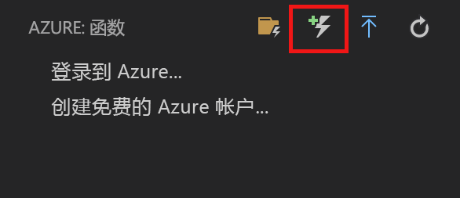
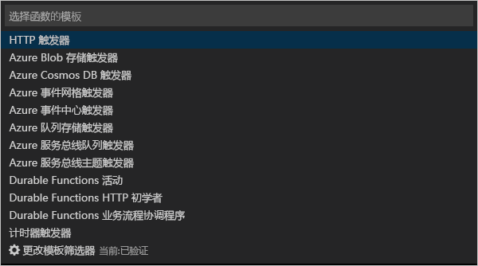

# <a name="create-your-first-durable-function-in-javascript"></a>使用 JavaScript 创建你的第一个持久函数

*Durable Functions* 是 [Azure Functions](../functions-overview.md) 的一个扩展，可用于在无服务器环境中编写有状态函数。 该扩展可用于管理状态、检查点和重启。

本文介绍了如何使用 Visual Studio Code Azure Functions 扩展在本地创建并测试“hello world”持久函数。  此函数将协调对其他函数的调用并将其链接在一起。 然后将函数代码发布到 Azure。


## <a name="prerequisites"></a>先决条件

完成本教程：

* 安装 [Visual Studio Code](https://code.visualstudio.com/download)。

* 请确保你有[最新的 Azure Functions 工具](../functions-develop-vs.md#check-your-tools-version)。

* 在 Windows 计算机上，验证 [Azure 存储模拟器](../../storage/common/storage-use-emulator.md)是否已安装且正在运行。 在 Mac 或 Linux 计算机上，必须使用实际的 Azure 存储帐户。

* 请确保安装 8.0 版或更高版本的 [Node.js](https://nodejs.org/)。

[!INCLUDE [quickstarts-free-trial-note](../../../includes/quickstarts-free-trial-note.md)]

[!INCLUDE [functions-install-vs-code-extension](../../../includes/functions-install-vs-code-extension.md)]

[!INCLUDE [functions-create-function-app-vs-code](../../../includes/functions-create-function-app-vs-code.md)]

## <a name="create-a-starter-function"></a>创建一个初学者函数

首先，创建一个 HTTP 触发的函数，用以启动持久函数业务流程。

1. 从“Azure: Functions”区域中选择“创建函数”图标。

    

1. 选择包含函数应用项目的文件夹，然后选择“HTTP 触发器”函数模板。

    

1. 键入 `HttpStart` 作为函数名称，然后按 Enter，然后选择“匿名”身份验证。

    

    此时将使用 HTTP 触发的函数的模板，以所选语言创建函数。

1. 将 index.js 替换为以下 JavaScript：

    ```javascript
    const df = require("durable-functions");
    
    module.exports = async function (context, req) {
        const client = df.getClient(context);
        const instanceId = await client.startNew(req.params.functionName, undefined, req.body);
    
        context.log(`Started orchestration with ID = '${instanceId}'.`);
    
        return client.createCheckStatusResponse(context.bindingData.req, instanceId);
    };
    ```

1. 将 function.json 替换为以下 JSON：

    ```JSON
    {
      "bindings": [
        {
          "authLevel": "anonymous",
          "name": "req",
          "type": "httpTrigger",
          "direction": "in",
          "route": "orchestrators/{functionName}",
          "methods": ["post"]
        },
        {
          "name": "$return",
          "type": "http",
          "direction": "out"
        },
        {
          "name": "starter",
          "type": "orchestrationClient",
          "direction": "in"
        }
      ],
      "disabled": false
    }
    ```

我们现在已创建了我们的持久函数的一个入口点。 让我们添加一个业务流程协调程序。

## <a name="create-an-orchestrator-function"></a>创建一个业务流程协调程序函数

接下来，创建要成为业务流程协调程序的另一个函数。 为方便起见，我们使用 HTTP 触发器函数模板。 函数代码本身将替换为业务流程协调程序代码。

1. 使用 HTTP 触发器模板重复上一部分中的步骤来创建第二个函数。 这次将函数命名为 `OrchestratorFunction`。

1. 打开新函数的 index.js 文件并将其内容替换为以下代码：

    [!code-json[Main](~/samples-durable-functions/samples/javascript/E1_HelloSequence/index.js)]

1. 打开 function.json 文件并将其替换为以下 JSON：

    [!code-json[Main](~/samples-durable-functions/samples/javascript/E1_HelloSequence/function.json)]

我们已添加了一个业务流程协调程序来协调活动函数。 现在让我们添加一个引用的活动函数。

## <a name="create-an-activity-function"></a>创建一个活动函数

1. 使用 HTTP 触发器模板重复上一部分中的步骤来创建第三个函数。 但这次将函数命名为 `SayHello`。

1. 打开新函数的 index.js 文件并将其内容替换为以下代码：

    [!code-javascript[Main](~/samples-durable-functions/samples/javascript/E1_SayHello/index.js)]

1. 将 function.json 替换为以下 JSON：

    [!code-json[Main](~/samples-durable-functions/samples/csx/E1_SayHello/function.json)]

我们已添加了启动业务流程并将活动函数链接在一起所需的所有组件。

## <a name="test-the-function-locally"></a>在本地测试函数

使用 Azure Functions Core Tools 可以在本地开发计算机上运行 Azure Functions 项目。 首次从 Visual Studio Code 启动某个函数时，系统会提示你安装这些工具。  

1. 通过运行函数应用的根目录中的 `npm install durable-functions` 来安装 durable-functions npm 包。

1. 在 Windows 计算机上，启动 Azure 存储模拟器并确保将 local.settings.json 的 **AzureWebJobsStorage** 属性设置为 `UseDevelopmentStorage=true`。 在 Mac 或 Linux 计算机上，必须将 **AzureWebJobsStorage** 属性设置为现有 Azure 存储帐户的连接字符串。 本文中稍后将创建一个存储帐户。

1. 若要测试函数，请在函数代码中设置断点并按 F5 启动函数应用项目。 来自 Core Tools 的输出会显示在“终端”面板中。 如果这是你首次使用 Durable Functions，则会安装 Durable Functions 扩展并且生成可能需要几秒钟时间。

1. 在“终端”面板中，复制 HTTP 触发的函数的 URL 终结点。

    

1. 将 HTTP 请求的 URL 粘贴到浏览器的地址栏中，查看你的业务流程的状态。

1. 若要停止调试，请按 Shift + F1。

确认该函数可以在本地计算机上正确运行以后，即可将项目发布到 Azure。

[!INCLUDE [functions-create-function-app-vs-code](../../../includes/functions-sign-in-vs-code.md)]

[!INCLUDE [functions-publish-project-vscode](../../../includes/functions-publish-project-vscode.md)]

## <a name="test-your-function-in-azure"></a>在 Azure 中测试函数

1. 从“输出”面板复制 HTTP 触发器的 URL。 调用 HTTP 触发的函数的 URL 应采用以下格式：

        http://<functionappname>.azurewebsites.net/api/<functionname>

1. 将 HTTP 请求的这个新 URL 粘贴到浏览器的地址栏中。 你应当会得到与之前使用已发布的应用时相同的状态响应。

## <a name="next-steps"></a>后续步骤

你已使用 Visual Studio Code 创建并发布了一个 JavaScript 持久函数应用。

> [!div class="nextstepaction"]
> [了解常见的持久函数模式](durable-functions-overview.md)