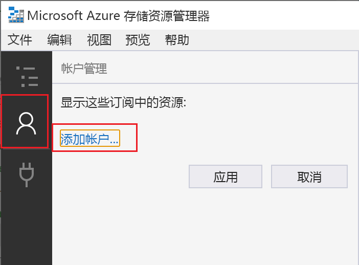
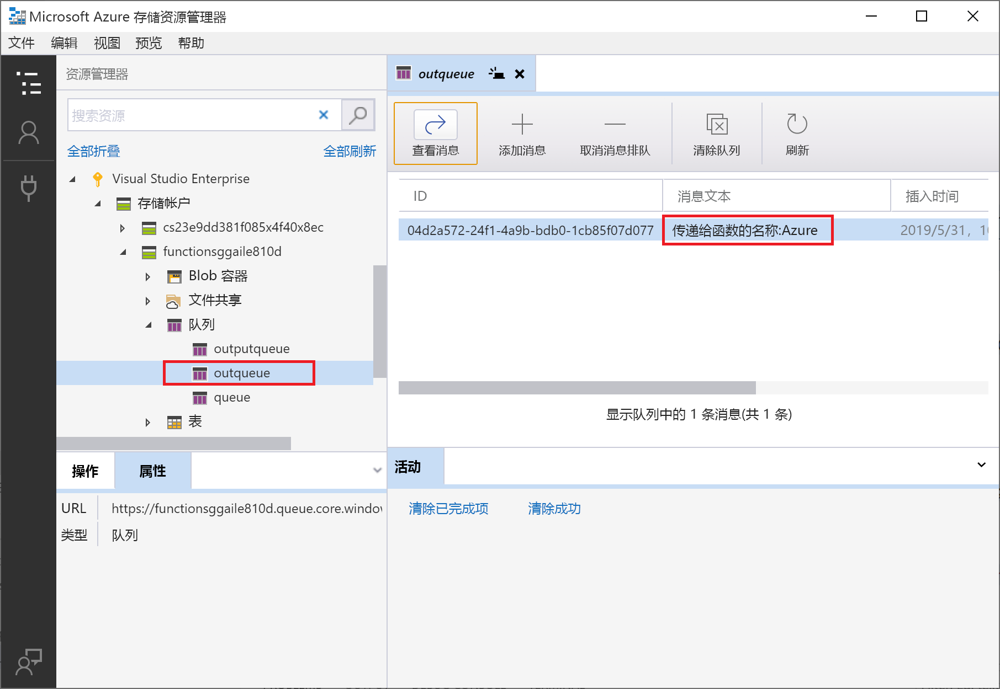

# <a name="connect-azure-functions-to-azure-storage-using-visual-studio-code"></a>使用 Visual Studio Code 将 Azure Functions 连接到 Azure 存储

[!INCLUDE [functions-add-storage-binding-intro](../../includes/functions-add-storage-binding-intro.md)]

本文介绍如何使用 Visual Studio Code 将在[前一篇快速入门文章](functions-create-first-function-vs-code.md)中创建的函数连接到 Azure 存储。 添加到此函数的输出绑定会将 HTTP 请求中的数据写入到 Azure 队列存储队列中的消息。 

大多数绑定都需要一个存储的连接字符串，函数将使用该字符串来访问绑定的服务。 为便于操作，请使用连同函数应用一起创建的存储帐户。 与此帐户建立的连接已存储在名为 `AzureWebJobsStorage` 的应用设置中。  

## <a name="configure-your-local-environment"></a>配置本地环境

在开始本文之前，必须满足以下要求：

* 安装[适用于 Visual Studio Code 的 Azure 存储扩展](https://marketplace.visualstudio.com/items?itemName=ms-azuretools.vscode-azurestorage)。

* 安装 [Azure 存储资源管理器](https://storageexplorer.com/)。 存储资源管理器是一项工具，可以用来检查输出绑定生成的队列消息。 macOS、Windows 和基于 Linux 的操作系统支持存储资源管理器。

::: zone pivot="programming-language-csharp"
* 安装 [.NET Core CLI 工具](https://docs.microsoft.com/dotnet/core/tools/?tabs=netcore2x)。
::: zone-end

* 完成 [Visual Studio Code 快速入门第 1 部分](functions-create-first-function-vs-code.md)中的步骤。 

本文假设你已从 Visual Studio Code 登录到 Azure 订阅。 你可以通过从命令面板运行 `Azure: Sign In` 进行登录。 

## <a name="download-the-function-app-settings"></a>下载函数应用设置

在[前一篇快速入门文章](functions-create-first-function-vs-code.md)中，你已在 Azure 中创建了一个函数应用，并创建了所需的存储帐户。 此帐户的连接字符串安全存储在 Azure 中的应用设置内。 在本文中，你要将消息写入到同一帐户中的存储队列。 若要在本地运行函数时连接到该存储帐户，必须将应用设置下载到 local.settings.json 文件。 

1. 按 F1 键打开命令面板，然后搜索并运行命令 `Azure Functions: Download Remote Settings....`。 

1. 选择你在前一篇文章中创建的函数应用。 选择“全是”覆盖现有本地设置  。 

    > [!IMPORTANT]  
    > 由于 local.settings.json 文件包含机密，因此请勿发布，应将其从源代码管理中排除。

1. 复制值 `AzureWebJobsStorage`，这是存储帐户连接字符串值的键。 你将使用此连接来验证输出绑定是否按预期方式工作。

## <a name="register-binding-extensions"></a>注册绑定扩展

由于你使用队列存储输出绑定，因此在运行项目之前，必须安装存储绑定扩展。 

::: zone pivot="programming-language-javascript,programming-language-typescript,programming-language-python,programming-language-powershell"

[!INCLUDE [functions-extension-bundles](../../includes/functions-extension-bundles.md)]

::: zone-end

::: zone pivot="programming-language-csharp"

除了 HTTP 和计时器触发器，绑定将实现为扩展包。 在终端窗口中运行以下 [dotnet add package](/dotnet/core/tools/dotnet-add-package) 命令，将存储扩展包添加到项目中。

```bash
dotnet add package Microsoft.Azure.WebJobs.Extensions.Storage --version 3.0.4
```

::: zone-end

现在，你可以将存储输出绑定添加到项目。

## <a name="add-an-output-binding"></a>添加输出绑定

在 Functions 中，每种类型的绑定都需要一个 `direction`、`type`，以及要在 function.json 文件中定义的唯一 `name`。 定义这些属性的方式取决于函数应用的语言。

::: zone pivot="programming-language-javascript,programming-language-typescript,programming-language-python,programming-language-powershell"

[!INCLUDE [functions-add-output-binding-json](../../includes/functions-add-output-binding-json.md)]

::: zone-end

::: zone pivot="programming-language-csharp"

[!INCLUDE [functions-add-storage-binding-csharp-library](../../includes/functions-add-storage-binding-csharp-library.md)]

::: zone-end

## <a name="add-code-that-uses-the-output-binding"></a>添加使用输出绑定的代码

定义绑定后，可以使用绑定的 `name`，将其作为函数签名中的属性进行访问。 使用输出绑定时，无需使用 Azure 存储 SDK 代码进行身份验证、获取队列引用或写入数据。 Functions 运行时和队列输出绑定将为你执行这些任务。

::: zone pivot="programming-language-javascript"  
[!INCLUDE [functions-add-output-binding-js](../../includes/functions-add-output-binding-js.md)]
::: zone-end  

::: zone pivot="programming-language-typescript"  
[!INCLUDE [functions-add-output-binding-ts](../../includes/functions-add-output-binding-ts.md)]
::: zone-end  

::: zone pivot="programming-language-powershell"

[!INCLUDE [functions-add-output-binding-powershell](../../includes/functions-add-output-binding-powershell.md)]

::: zone-end

::: zone pivot="programming-language-python"

[!INCLUDE [functions-add-output-binding-python](../../includes/functions-add-output-binding-python.md)]

::: zone-end

::: zone pivot="programming-language-csharp"  
[!INCLUDE [functions-add-storage-binding-csharp-library-code](../../includes/functions-add-storage-binding-csharp-library-code.md)]
::: zone-end  

::: zone pivot="programming-language-csharp,programming-language-javascript,programming-language-python"

[!INCLUDE [functions-run-function-test-local-vs-code](../../includes/functions-run-function-test-local-vs-code.md)]

::: zone-end

::: zone pivot="programming-language-powershell"

[!INCLUDE [functions-run-function-test-local-vs-code-ps](../../includes/functions-run-function-test-local-vs-code-ps.md)]

::: zone-end

首次使用输出绑定时，Functions 运行时会在存储帐户中创建名为 **outqueue** 的新队列。 将使用存储资源管理器来验证队列是否与新消息一起创建。

### <a name="connect-storage-explorer-to-your-account"></a>将存储资源管理器连接到帐户

如果已安装 Azure 存储资源管理器并已将其连接到 Azure 帐户，请跳过此部分。

1. 运行 [Azure存储资源管理器] 工具，选择左侧的“连接”图标，然后选择“添加帐户”  。

    

1. 在“连接”对话框中，依次选择“添加 Azure 帐户”、你的“Azure 环境”和“登录...”     。 

    

成功登录到帐户后，将看到与你的帐户关联的所有 Azure 订阅。

### <a name="examine-the-output-queue"></a>检查输出队列

1. 在 Visual Studio Code 中，按 F1 键打开命令面板，然后搜索并运行命令 `Azure Storage: Open in Storage Explorer`，选择你的存储帐户名称。 随即将在 Azure 存储资源管理器中打开你的存储帐户。  

1. 展开“队列”节点，然后选择名为 **outqueue** 的队列。  

   此队列包含在运行 HTTP 触发的函数时队列输出绑定创建的消息。 如果使用默认的 `name` 值 *Azure* 调用了此函数，则队列消息为“传递给函数的名称: Azure”。 

    

1. 再次运行函数，发送另一个请求，此时会看到新消息出现在队列中。  

现在，可将更新的函数应用重新发布到 Azure。

## <a name="redeploy-and-verify-the-updated-app"></a>重新部署并验证更新的应用

1. 在 Visual Studio Code 中，按 F1 键打开命令面板。 在命令面板中，搜索并选择 `Azure Functions: Deploy to function app...`。

1. 选择你在第一篇文章中创建的函数应用。 由于你要将项目重新部署到同一个应用，因此请选择“部署”关闭覆盖文件的警告  。

1. 部署完成后，可以再次使用 cURL 或浏览器测试重新部署的函数。 与前面一样，请将查询字符串 `&name=<yourname>` 追加到 URL，如以下示例所示：

    ```bash
    curl https://myfunctionapp.azurewebsites.net/api/httptrigger?code=cCr8sAxfBiow548FBDLS1....&name=<yourname>
    ```

1. 可以[查看存储队列中的消息](#examine-the-output-queue)，以再次确认输出绑定是否在队列中生成了新的消息。

## <a name="clean-up-resources"></a>清理资源

 Azure 中的资源是指函数应用、函数、存储帐户等。 这些资源可以组合到资源组  中，删除该组即可删除组中的所有内容。

已创建完成这些快速入门所需的资源。 这些资源可能需要付费，具体取决于[帐户状态](https://azure.microsoft.com/account/)和[服务定价](https://azure.microsoft.com/pricing/)。 如果不再需要这些资源，请参阅下面介绍的资源删除方法：

[!INCLUDE [functions-cleanup-resources-vs-code.md](../../includes/functions-cleanup-resources-vs-code.md)]

## <a name="next-steps"></a>后续步骤

现已更新 HTTP 触发的函数，使其将数据写入存储队列。 现在，可以详细了解如何使用 Visual Studio Code 开发 Functions：

+ [使用 Visual Studio Code 开发 Azure Functions](functions-develop-vs-code.md)
::: zone pivot="programming-language-csharp"  
+ [C# 中完整 Function 项目的示例](/samples/browse/?products=azure-functions&languages=csharp)。
+ [Azure Functions C# 开发人员参考](functions-dotnet-class-library.md)  
::: zone-end 
::: zone pivot="programming-language-javascript"  
+ [JavaScript 中完整函数项目的示例](/samples/browse/?products=azure-functions&languages=javascript)。
+ [Azure Functions JavaScript 开发人员指南](functions-reference-node.md)  
::: zone-end  
::: zone pivot="programming-language-typescript"  
+ [TypeScript 中完整函数项目的示例](/samples/browse/?products=azure-functions&languages=typescript)。
+ [Azure Functions TypeScript 开发人员指南](functions-reference-node.md#typescript)  
::: zone-end  
::: zone pivot="programming-language-python"  
+ [Python 中完整函数项目的示例](/samples/browse/?products=azure-functions&languages=python)。
+ [Azure Functions Python 开发人员指南](functions-reference-python.md)  
::: zone-end  
::: zone pivot="programming-language-powershell"  
+ [PowerShell 中完整函数项目的示例](/samples/browse/?products=azure-functions&languages=azurepowershell)。
+ [Azure Functions PowerShell 开发人员指南](functions-reference-powershell.md) 
::: zone-end
+ [Azure Functions 触发器和绑定](functions-triggers-bindings.md)。
+ [Functions 定价页](https://azure.microsoft.com/pricing/details/functions/)
+ [估算消耗计划成本](functions-consumption-costs.md)一文。
