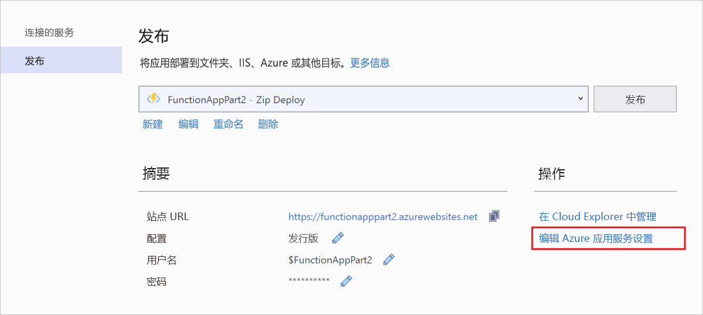

# <a name="connect-functions-to-azure-storage-using-visual-studio"></a>使用 Visual Studio 将函数连接到 Azure 存储

[!INCLUDE [functions-add-storage-binding-intro](../../includes/functions-add-storage-binding-intro.md)]

本文介绍如何使用 Visual Studio 将在[前一篇快速入门文章]中创建的函数连接到 Azure 存储。 添加到此函数的输出绑定会将 HTTP 请求中的数据写入到 Azure 队列存储队列中的消息。 

大多数绑定都需要一个存储的连接字符串，函数将使用该字符串来访问绑定的服务。 为便于操作，请使用连同函数应用一起创建的存储帐户。 与此帐户建立的连接已存储在名为 `AzureWebJobsStorage` 的应用设置中。  

## <a name="prerequisites"></a>先决条件

在开始学习本文之前，必须： 

 - 完成 [Visual Studio 快速入门的第 1 部分](./functions-create-your-first-function-visual-studio.md)。 

- 从 Visual Studio 登录到 Azure 订阅。

## <a name="download-the-function-app-settings"></a>下载函数应用设置

在[前一篇快速入门文章](functions-create-first-function-vs-code.md)中，你已在 Azure 中创建了一个函数应用，并创建了所需的存储帐户。 此帐户的连接字符串安全存储在 Azure 中的应用设置内。 在本文中，你要将消息写入到同一帐户中的存储队列。 若要在本地运行函数时连接到该存储帐户，必须将应用设置下载到 *local.settings.json* 文件。 

1. **在“解决方案资源管理器”** 中，右键单击该项目并选择“发布”。 

1. 在“操作”下，选择“编辑 Azure 应用服务设置”。  

    

1. 在“AzureWebJobsStorage”下，将“Remote”字符串值复制到“Local”，然后选择“确定”。    

现在，使用 `AzureWebJobsStorage` 设置建立连接的存储绑定可以在本地运行时连接到队列存储。

## <a name="register-binding-extensions"></a>注册绑定扩展

由于你使用的是队列存储输出绑定，因此在运行项目之前，需要安装存储绑定扩展。 绑定（HTTP 和计时器触发器除外）将实现为扩展包。 

1. 在“工具”菜单中，选择“NuGet 包管理器” > “包管理器控制台”。   

1. 在控制台中，运行以下 [Install-Package](/nuget/tools/ps-ref-install-package) 命令安装存储扩展：

    ```Command
    Install-Package Microsoft.Azure.WebJobs.Extensions.Storage -Version 3.0.6
    ````

现在，你可以将存储输出绑定添加到项目。

## <a name="add-an-output-binding"></a>添加输出绑定

[!INCLUDE [functions-add-storage-binding-csharp-library](../../includes/functions-add-storage-binding-csharp-library.md)]

## <a name="add-code-that-uses-the-output-binding"></a>添加使用输出绑定的代码

定义绑定后，可以使用绑定的 `name`，将其作为函数签名中的属性进行访问。 使用输出绑定时，无需使用 Azure 存储 SDK 代码进行身份验证、获取队列引用或写入数据。 Functions 运行时和队列输出绑定将为你执行这些任务。

[!INCLUDE [functions-add-storage-binding-csharp-library-code](../../includes/functions-add-storage-binding-csharp-library-code.md)]

## <a name="run-the-function-locally"></a>在本地运行函数

[!INCLUDE [functions-run-function-test-local-vs](../../includes/functions-run-function-test-local-vs.md)]

首次使用输出绑定时，Functions 运行时会在存储帐户中创建名为 `outqueue` 的新队列。 你将使用 Cloud Explorer 来验证队列是否与新消息一起创建。

## <a name="examine-the-output-queue"></a>检查输出队列

1. 在 Visual Studio 的“视图”菜单中，选择“Cloud Explorer”。 

1. 在“Cloud Explorer”中，展开你的 Azure 订阅和“存储帐户”，然后展开函数使用的存储帐户。  如果你忘记了存储帐户名称，请查看 *local.settings.json* 文件中的 `AzureWebJobsStorage` 连接字符串设置。  

1. 展开“队列”节点，然后双击名为 **outqueue** 的队列，在 Visual Studio 中查看队列的内容。 

   此队列包含在运行 HTTP 触发的函数时队列输出绑定创建的消息。 如果使用 Azure 的默认 `name` 值调用了此函数，则队列消息为“传递给函数的名称： Azure”。

    

1. 再次运行函数，发送另一个请求，此时会看到新消息出现在队列中。  

现在，可将更新的函数应用重新发布到 Azure。

## <a name="redeploy-and-verify-the-updated-app"></a>重新部署并验证更新的应用

1. 在“解决方案资源管理器”中，右键单击项目并选择“发布”，然后选择“发布”将项目重新发布到 Azure。  

1. 部署完成后，可以再次使用浏览器测试重新部署的函数。 如前所述，请在 URL 的后面追加查询字符串 `&name=<yourname>`。

1. 可以[查看存储队列中的消息](#examine-the-output-queue)，以再次确认输出绑定是否在队列中生成了新的消息。

## <a name="clean-up-resources"></a>清理资源

[!INCLUDE [Clean-up resources](../../includes/functions-quickstart-cleanup.md)]

## <a name="next-steps"></a>后续步骤

现已更新 HTTP 触发的函数，使其将数据写入存储队列。 若要详细了解如何开发 Functions，请参阅[使用 Visual Studio 开发 Azure Functions](functions-develop-vs.md)。

接下来，应为函数应用启用 Application Insights 监视：

> [!div class="nextstepaction"]
> [启用 Application Insights 集成](functions-monitoring.md#manually-connect-an-app-insights-resource)

[Azure Storage Explorer]: https://storageexplorer.com/
[前一篇快速入门文章]: functions-create-your-first-function-visual-studio.md
