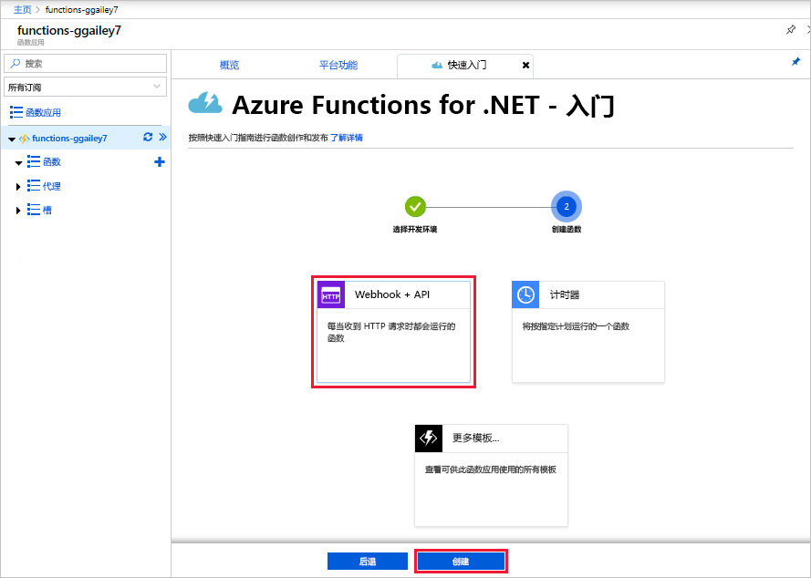
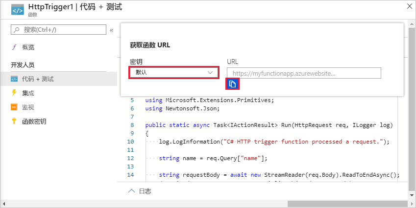

# 创建你的第一个 Azure 函数
## 概述
Azure Functions 提供事件驱动、按需计算体验，可以扩展现有的 Azure 应用程序平台，并能够实现由其他 Azure 服务、SaaS 产品以及本地系统中发生的事件触发的代码。借助 Azure Functions，应用程序可以按需缩放，且仅需对消耗的资源付费。Azure Functions 让你能够创建以各种编程语言实现的计划或触发代码单元。若要了解有关 Azure Functions 的详细信息，请参阅 [Azure Functions 概述](functions-overview.md)。

本主题演示如何在门户中使用 Azure Functions 快速入门，创建由 HTTP 触发器调用的简单“hello world”Node.js 函数。还可观看简短视频，了解如何在门户中执行这些步骤。

## 观看视频
以下视频演示如何执行本教程中的基本步骤。

[!VIDEO https://channel9.msdn.com/Series/Windows-Azure-Web-Sites-Tutorials/Create-your-first-Azure-Function-simple/player]

## 通过快速入门创建函数
Function App 在 Azure 中托管函数的执行。请按照以下步骤创建新的 Function App 以及新函数。新的 Function App 会使用默认配置进行创建。有关如何显式创建 Function App 的示例，请参阅[其他 Azure Functions 快速入门教程](functions-create-first-azure-function-azure-portal.md)。

必须先具有有效的 Azure 帐户，然后才能创建你的第一个函数。如果还没有 Azure 帐户，[可以使用免费帐户](https://azure.microsoft.com/free/)。

1. 转到 [Azure Functions 门户](https://functions.azure.com/signin)，然后使用你的 Azure 帐户登录。
2. 键入新 Function App 的唯一“名称”或接受生成的名称，选择首选“区域”，然后单击“创建 + 开始使用”。
3. 在“快速入门”选项卡中，单击“WebHook + API”和“JavaScript”，然后单击“创建函数”。将创建新的预定义 Node.js 函数。
   
    
4. （可选）此时，在快速入门中，可以选择在门户内进行 Azure Functions 功能快速浏览。完成或跳过浏览后，可以使用 HTTP 触发器测试新函数。

## 测试函数
Azure Functions 快速入门包含功能性代码，因此可以立即测试新函数。

1. 在“开发”选项卡中，查看“代码”窗口，将会发现此 Node.js 代码需要具有在消息正文或查询字符串中传递的 *name* 值的 HTTP 请求。该函数运行时，此值在响应消息中返回。
   
    
2. 向下滚动到“请求正文”文字框，将 *name* 属性的值更改为你的名称，然后单击“运行”。将看到执行由测试 HTTP 请求触发，信息写入流式处理日志且“hello”响应在“输出”中显示。
3. 若要从其他浏览器窗口或选项卡触发相同函数的执行，请从“开发”选项卡复制“函数 URL”值并粘贴到浏览器地址栏中，然后追加查询字符串值 `&name=yourname` 并按 Enter。相同的信息会写入日志，浏览器会像之前一样显示“hello”响应。

## 后续步骤
本快速入门演示非常简单的基本 HTTP 触发函数的执行。请参阅以下主题，获取有关在应用中利用 Azure Functions 功能的详细信息。

* [Azure Functions 开发人员参考](functions-reference.md)，用于编码函数和定义触发器及绑定的程序员参考。
* [测试 Azure Functions](functions-test-a-function.md)，介绍可用于测试函数的各种工具和技巧。
* [如何缩放 Azure Functions](functions-scale.md)，讨论 Azure Functions 提供的服务计划（包括动态服务计划）以及如何选择合适的计划。
* [什么是 Azure App Service？](../app-service/app-service-value-prop-what-is.md) Azure Functions 利用 Azure 应用服务平台执行核心功能，例如部署、环境变量和诊断。

[!INCLUDE [入门笔记](../../includes/functions-get-help.md)]

<!---HONumber=AcomDC_0921_2016-->