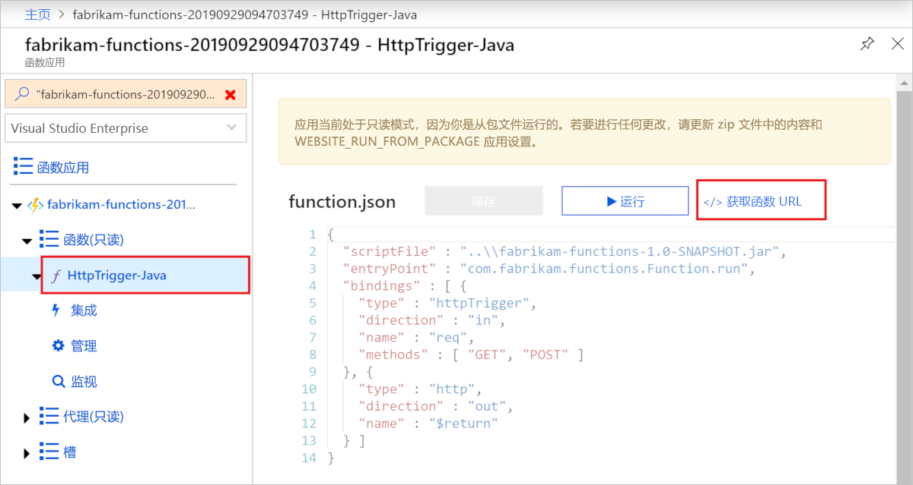

# <a name="quickstart-use-java-and-maven-to-create-and-publish-a-function-to-azure"></a>快速入门：使用 Java 和 Maven 创建函数并将其发布到 Azure

本文介绍如何使用 Maven 命令行工具生成 Java 函数并将该函数发布到 Azure Functions。 完成后，函数代码会在 Azure 的[无服务器托管计划](functions-scale.md#consumption-plan)中运行，并由 HTTP 请求触发。

<!--
> [!NOTE] 
> You can also create a Kotlin-based Azure Functions project by using the azure-functions-kotlin-archetype instead. Visit the [GitHub repository](https://github.com/microsoft/azure-maven-archetypes/tree/develop/azure-functions-kotlin-archetype) for more information.
-->

## <a name="prerequisites"></a>必备条件

若要使用 Java 开发函数，必须安装以下软件：

- [Java 开发人员工具包](https://aka.ms/azure-jdks)版本 8
- [Apache Maven](https://maven.apache.org) 版本 3.0 或更高版本
- [Azure CLI]
- [Azure Functions Core Tools](./functions-run-local.md#v2) 版本 2.6.666 或更高版本

还需要一个有效的 Azure 订阅。 [!INCLUDE [quickstarts-free-trial-note](../../includes/quickstarts-free-trial-note.md)]


> [!IMPORTANT]
> JAVA_HOME 环境变量必须设置为 JDK 的安装位置，以完成本快速入门。

## <a name="generate-a-new-functions-project"></a>生成新的 Functions 项目

在空的文件夹中，运行以下命令以从 [Maven archetype](https://maven.apache.org/guides/introduction/introduction-to-archetypes.html) 生成 Functions 项目。

### <a name="linuxmacos"></a>Linux/macOS

```bash
mvn archetype:generate \
    -DarchetypeGroupId=com.microsoft.azure \
    -DarchetypeArtifactId=azure-functions-archetype 
```

> [!NOTE]
> 如果在运行命令时遇到问题，请看看使用了什么 `maven-archetype-plugin` 版本。 由于你是在空的没有 `.pom` 文件的目录中运行该命令，因此它会尝试使用 `~/.m2/repository/org/apache/maven/plugins/maven-archetype-plugin` 中的旧版插件（如果你从旧版升级了 Maven）。 如果是这样，请尝试删除 `maven-archetype-plugin` 目录并重新运行命令。

### <a name="windows"></a>Windows

```powershell
mvn archetype:generate `
    "-DarchetypeGroupId=com.microsoft.azure" `
    "-DarchetypeArtifactId=azure-functions-archetype"
```

```cmd
mvn archetype:generate ^
    "-DarchetypeGroupId=com.microsoft.azure" ^
    "-DarchetypeArtifactId=azure-functions-archetype"
```

Maven 会请求你提供所需的值，以在部署上完成项目的生成。 系统提示时提供以下值：

| 值 | 说明 |
| ----- | ----------- |
| **groupId** | 一个值，用于按照 Java 的[包命名规则](https://docs.oracle.com/javase/specs/jls/se6/html/packages.html#7.7)在所有项目中标识你的项目。 本快速入门中的示例使用 `com.fabrikam.functions`。 |
| **artifactId** | 一个值，该值是 jar 的名称，没有版本号。 本快速入门中的示例使用 `fabrikam-functions`。 |
| **version** | 选择默认值 `1.0-SNAPSHOT`。 |
| **package** | 一个值，该值是所生成函数代码的 Java 包。 使用默认值。 本快速入门中的示例使用 `com.fabrikam.functions`。 |
| **appName** | 全局唯一名称，用于标识 Azure 中的新函数应用。 请使用默认值，即 _artifactId_ 追加一个随机数字。 请记下该值，稍后需要它。 |
| **appRegion** | 选择离你近或离函数访问的其他服务近的[区域](https://azure.microsoft.com/regions/)。 默认为 `westus`。 请运行以下 [Azure CLI] 命令，获取所有区域的列表：<br/>`az account list-locations --query '[].{Name:name}' -o tsv` |
| **resourceGroup** | 要在其中创建函数应用的新[资源组](../azure-resource-manager/management/overview.md)的名称。 请使用 `myResourceGroup`（由本快速入门中的示例使用）。 资源组必须对 Azure 订阅来说独一无二。|

键入 `Y` 或按 Enter 进行确认。

Maven 在名为 artifactId  的新文件夹（在此示例中为 `fabrikam-functions`）中创建项目文件。 

在文本编辑器中打开 *src/main/java* 路径中的新 Function.java 文件，查看生成的代码。 该代码是一个 [HTTP 触发的](functions-bindings-http-webhook.md)函数，用于回显请求的正文。 

> [!div class="nextstepaction"]
> [我遇到了问题](https://www.research.net/r/javae2e?tutorial=functions-maven-quickstart&step=generate-project)

## <a name="run-the-function-locally"></a>在本地运行函数

运行以下命令，将目录更改为新创建的项目文件夹，然后生成并运行函数项目：

```console
cd fabrikam-function
mvn clean package 
mvn azure-functions:run
```

在本地运行项目时，会看到 Azure Functions Core Tools 的如下所示的输出：

```Output
...

Now listening on: http://0.0.0.0:7071
Application started. Press Ctrl+C to shut down.

Http Functions:

    HttpTrigger-Java: [GET,POST] http://localhost:7071/api/HttpTrigger-Java
...
```

使用 cURL 在新的终端窗口中从命令行触发函数：

```CMD
curl -w "\n" http://localhost:7071/api/HttpTrigger-Java --data AzureFunctions
```

```Output
Hello AzureFunctions!
```
在本地运行时，不需要[功能键](functions-bindings-http-webhook.md#authorization-keys)。 在终端中使用 `Ctrl+C` 停止函数代码。

> [!div class="nextstepaction"]
> [我遇到了问题](https://www.research.net/r/javae2e?tutorial=functions-maven-quickstart&step=local-run)

## <a name="deploy-the-function-to-azure"></a>将函数部署到 Azure

首先部署函数应用时，会在 Azure 中创建函数应用和相关资源。 在部署之前，必须使用 [az login](/cli/azure/authenticate-azure-cli) Azure CLI 命令登录到 Azure 订阅。 

```azurecli
az login
```

> [!TIP]
> 如果帐户可以访问多个订阅，请使用 [az account set](/cli/azure/account#az-account-set) 设置此会话的默认订阅。 

使用以下 Maven 命令将项目部署到新的函数应用。 

```azurecli
mvn azure-functions:deploy
```

此 `azure-functions:deploy` Maven 目标在 Azure 中创建以下资源：

+ 资源组。 使用你提供的 _resourceGroup_ 命名。
+ 存储帐户。 Functions 所需。 此名称根据存储帐户名称要求随机生成。
+ 应用服务计划。 为指定 _appRegion_ 中的函数应用进行的无服务器托管。 此名称随机生成。
+ 函数应用。 函数应用是函数的部署和执行单元。 此名称是 _appName_ 追加一个随机生成的数字。 

此部署还会在启用“从包运行”模式的情况下，使用 [zip deployment](functions-deployment-technologies.md#zip-deploy) 将项目文件打包并部署到新函数应用。

部署完成后，会显示可用于访问函数应用终结点的 URL。 由于我们发布的 HTTP 触发器使用 `authLevel = AuthorizationLevel.FUNCTION`，因此你需要获取函数密钥，以便通过 HTTP 调用函数终结点。 若要获取函数密钥，最简单的方法是使用 [Azure 门户]。

> [!div class="nextstepaction"]
> [我遇到了问题](https://www.research.net/r/javae2e?tutorial=functions-maven-quickstart&step=deploy)

## <a name="get-the-http-trigger-url"></a>获取 HTTP 触发器 URL

<!--- We can updates this to remove portal dependency after the Maven archetype returns the full URLs with keys on publish (https://github.com/microsoft/azure-maven-plugins/issues/571). -->

可以从 Azure 门户获取通过函数密钥触发函数所需的 URL。 

1. 浏览到 [Azure 门户]，登录，在页面顶部将函数应用的 _appName_ 键入“搜索”栏，  然后按 Enter。
 
1. 在函数应用中展开“函数(只读)”，选择你的函数，然后选择右上角的“</> 获取函数 URL”。   

    

1. 选择“默认(函数密钥)”，然后选择“复制”   。 

现在可以使用复制的 URL 来访问函数。

## <a name="verify-the-function-in-azure"></a>在 Azure 中验证函数

若要使用 `cURL` 验证在 Azure 上运行的函数应用，请将以下示例中的 URL 替换为从门户复制的 URL。

```azurecli
curl -w "\n" https://fabrikam-functions-20190929094703749.azurewebsites.net/api/HttpTrigger-Java?code=zYRohsTwBlZ68YF.... --data AzureFunctions
```

这会向函数终结点发送一个 POST 请求，请求正文中包含 `AzureFunctions`。 会看到以下响应。

```Output
Hello AzureFunctions!
```

> [!div class="nextstepaction"]
> [我遇到了问题](https://www.research.net/r/javae2e?tutorial=functions-maven-quickstart&step=verify-deployment)

## <a name="next-steps"></a>后续步骤

我们已使用 HTTP 触发的函数创建 Java 函数项目，在本地计算机上运行该项目，并将其部署到 Azure。 现在，通过以下方式扩展函数

> [!div class="nextstepaction"]
> [添加 Azure 存储队列输出绑定](functions-add-output-binding-storage-queue-java.md)


[Azure CLI]: /cli/azure
[Azure 门户]: https://portal.azure.com
